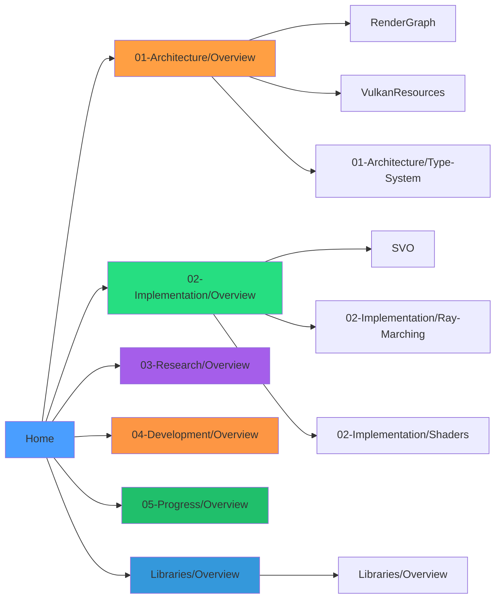

# VIXEN Documentation

**Vulkan Interactive eXample Engine** - A graph-based Vulkan rendering engine with voxel ray tracing research capabilities.

> [!info] Current Status
> **Phase K/L COMPLETE** (December 10, 2025) - All 6 shader variants working (compute/fragment/RT x compressed/uncompressed). Data pipeline ready. **Next: Multi-tester data collection**

---

## Quick Navigation

> [!tip] Clickable Diagram
> Click any node above to navigate directly to that section. See [[04-Development/Mermaid-Clickable-Links|Mermaid Clickable Links Guide]] for syntax details.

---

## Sections

### [[Libraries/Overview|Libraries]]
Complete documentation for all 14 VIXEN libraries.
- [[Libraries/Core|Core]] - Morton encoding, math utilities
- [[Libraries/RenderGraph|RenderGraph]] - Graph-based render pipeline
- [[Libraries/SVO|SVO]] - Sparse Voxel Octree (ESVO)
- [[Libraries/VulkanResources|VulkanResources]] - Vulkan resource management
- [[Libraries/Profiler|Profiler]] - Benchmark runner, metrics export

### [[01-Architecture/Overview|Architecture]]
Core system design and component relationships.
- [[01-Architecture/RenderGraph-System|RenderGraph System]] - Detailed node-based rendering pipeline
- [[01-Architecture/Vulkan-Pipeline|Vulkan Pipeline]] - GPU resource management
- [[01-Architecture/Type-System|Type System]] - Compile-time safety with variants

### [[02-Implementation/Overview|Implementation]]
Detailed implementation guides and code references.
- [[02-Implementation/SVO-System|SVO System]] - Sparse Voxel Octree with ESVO
- [[02-Implementation/Ray-Marching|Ray Marching]] - GPU ray traversal
- [[02-Implementation/Compression|DXT Compression]] - 5.3:1 memory reduction
- [[02-Implementation/Shaders|Shaders]] - GLSL shader documentation

### [[03-Research/Overview|Research]]
Academic references and algorithm documentation.
- [[03-Research/ESVO-Algorithm|ESVO Algorithm]] - Laine & Karras 2010
- [[03-Research/Voxel-Papers|Voxel Papers]] - Bibliography of 24+ papers
- [[03-Research/Pipeline-Comparison|Pipeline Comparison]] - 4-way performance analysis

### [[04-Development/Overview|Development]]
Build system, testing, and coding standards.
- [[04-Development/Build-System|Build System]] - CMake configuration
- [[04-Development/Testing|Testing]] - GoogleTest framework
- [[04-Development/Coding-Standards|Coding Standards]] - C++23 guidelines
- [[04-Development/Profiling|Profiling]] - GPU performance measurement
- [[04-Development/Mermaid-Clickable-Links|Mermaid Clickable Links]] - Making diagrams navigable

### [[05-Progress/Overview|Progress]]
Project status and roadmap tracking.
- [[05-Progress/Current-Status|Current Status]] - Active work
- [[05-Progress/Roadmap|Roadmap]] - Future phases
- [[05-Progress/Phase-History|Phase History]] - Completed milestones

---

## Key Metrics

| Metric | Value | Target |
|--------|-------|--------|
| GPU Throughput | 1,700 Mrays/sec | >200 Mrays/sec |
| DXT Compression | 5.3:1 ratio | 5:1 ratio |
| Test Coverage | 40% | 40% |
| Nodes Implemented | 19+ | 20+ |
| Shader Variants | 6 (compute/fragment/RT x compressed/uncompressed) | 6 |

---

## Technology Stack

| Component | Technology |
|-----------|------------|
| Graphics API | Vulkan 1.4 |
| Language | C++23 |
| Build System | CMake 4.0+ |
| Platform | Windows (Win32) |
| Compiler | MSVC (VS 2022+) |
| Testing | GoogleTest |

---

## Getting Started

1. **New to the project?** Start with [[01-Architecture/Overview|Architecture Overview]]
2. **Want to build?** See [[04-Development/Build-System|Build System]]
3. **Working on voxels?** Read [[02-Implementation/SVO-System|SVO System]]
4. **Library reference?** Check [[Libraries/Overview|Libraries Overview]]
5. **Research focus?** Check [[03-Research/ESVO-Algorithm|ESVO Algorithm]]

---

## File Quick Links

> [!tip] Source Files
> - `C:\cpp\VBVS--VIXEN\VIXEN\CLAUDE.md` - Project instructions
> - `C:\cpp\VBVS--VIXEN\VIXEN\memory-bank\` - Context files
> - `C:\cpp\VBVS--VIXEN\VIXEN\libraries\` - Core libraries

---

*Last updated: 2025-12-10*

