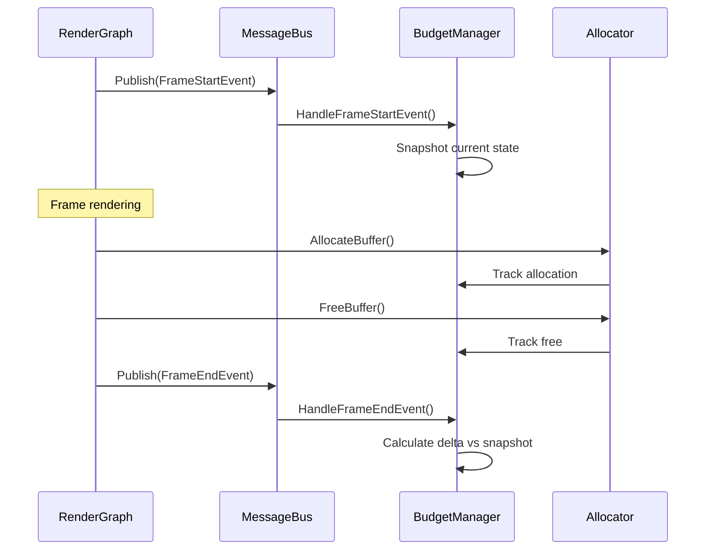

# Allocation Tracking Design

Design document for per-frame GPU allocation measurement and tracking. Part of Sprint 5 Pre-Allocation Hardening.

---

## 1. Measurement Strategy

### 1.1 Scope

| Category | In Scope | Out of Scope |
|----------|----------|--------------|
| **GPU Memory** | VkBuffer, VkDeviceMemory, VkAccelerationStructureKHR | - |
| **Staging** | StagingBufferPool chunks | - |
| **Descriptors** | Descriptor pool expansions | - |
| **CPU Memory** | - | std::vector, std::unordered_map growth |
| **Shader Compilation** | - | SPIR-V compilation allocations |

**Rationale:** GPU allocations have the highest performance impact (driver stalls, memory pressure). CPU allocations are tracked separately via standard profiling tools.

### 1.2 Granularity

Track allocations at top-level system boundaries:

```
DeviceBudgetManager
├── AccelerationStructureCacher (BLAS, TLAS, scratch)
├── VoxelAABBCacher (AABB, material, brick mapping)
├── VoxelSceneCacher (scene uploads)
├── MeshCacher (vertex, index buffers)
├── StagingBufferPool (staging chunks)
└── TextureCacher (future)
```

### 1.3 Frequency

- **Per-frame measurement:** Snapshot at frame boundaries
- **Reporting:** Log delta if non-zero allocations occurred
- **Threshold alerts:** Warn if frame delta exceeds configurable threshold

---

## 2. Frame Allocation Measurement Approach

### 2.1 Hook Points (Event-Driven)

The frame boundary hooks use MessageBus events for decoupling:

```cpp
// RenderGraph publishes frame events (no direct manager access)
messageBus.Publish(std::make_unique<FrameStartEvent>(senderId, frameNumber));

// ... render frame ...

messageBus.Publish(std::make_unique<FrameEndEvent>(senderId, frameNumber));

// DeviceBudgetManager auto-subscribes when MessageBus provided in config
DeviceBudgetManager::Config config{};
config.messageBus = &messageBus;  // Optional - enables event-driven mode
auto budgetManager = std::make_unique<DeviceBudgetManager>(allocator, physicalDevice, config);
```

**Benefits:**
- RenderGraph doesn't need direct access to budget managers
- Any system can hook frame boundaries by subscribing to events
- Loose coupling enables easy extension

### 2.2 Data Structures

```cpp
struct AllocationSnapshot {
    VkDeviceSize totalAllocated = 0;
    VkDeviceSize totalFreed = 0;
    VkDeviceSize stagingInUse = 0;
    uint32_t allocationCount = 0;
    uint32_t freeCount = 0;
};

struct FrameAllocationDelta {
    VkDeviceSize allocatedThisFrame = 0;
    VkDeviceSize freedThisFrame = 0;
    VkDeviceSize netDelta = 0;           // allocated - freed
    float utilizationPercent = 0.0f;

    // Per-system breakdown (optional, for debugging)
    std::unordered_map<std::string, VkDeviceSize> systemBreakdown;
};
```

### 2.3 Measurement Flow (Event-Driven)



### 2.4 Event Types

Defined in `libraries/EventBus/include/Message.h`:

```cpp
// EventCategory bits (40-47 range)
FrameLifecycle = 1ULL << 40,
FrameStart     = 1ULL << 41,
FrameEnd       = 1ULL << 42

// Event messages
struct FrameStartEvent : public BaseEventMessage {
    static constexpr MessageType TYPE = AUTO_MESSAGE_TYPE();
    uint64_t frameNumber;
};

struct FrameEndEvent : public BaseEventMessage {
    static constexpr MessageType TYPE = AUTO_MESSAGE_TYPE();
    uint64_t frameNumber;
};
```

---

## 3. Scope Boundaries

### 3.1 In Scope (Sprint 5)

| System | What's Tracked | Budget Category |
|--------|----------------|-----------------|
| `DeviceBudgetManager` | All GPU buffer allocations | Primary |
| `StagingBufferPool` | Staging chunk acquire/release | Staging quota |
| `AccelerationStructureCacher` | BLAS, TLAS, scratch buffers | Primary |
| `VoxelAABBCacher` | AABB, material ID, brick mapping | Primary |
| `VoxelSceneCacher` | Scene upload buffers | Primary |
| `MeshCacher` | Vertex, index buffers | Primary |

### 3.2 Out of Scope (Sprint 5)

| Category | Reason |
|----------|--------|
| **CPU containers** | Use standard profilers (VTune, Tracy) |
| **Shader compilation** | One-time cost, not per-frame |
| **ImGui allocations** | Third-party, out of control |
| **Validation layer allocations** | Debug-only overhead |

### 3.3 Boundary Enforcement

```cpp
// Only track through DeviceBudgetManager
auto result = budgetManager.AllocateBufferTracked(request);  // ✅ Tracked

// Direct allocator calls bypass tracking
auto result = allocator.AllocateBuffer(request);             // ❌ Untracked
```

**Rule:** All production code paths MUST use `*Tracked` methods.

---

## 4. Implementation Details

### 4.1 DeviceBudgetManager Extensions

```cpp
class DeviceBudgetManager {
public:
    // Frame boundary hooks
    void OnFrameStart();
    void OnFrameEnd();

    // Query last frame's delta
    const FrameAllocationDelta& GetLastFrameDelta() const;

    // Configuration
    void SetFrameDeltaWarningThreshold(VkDeviceSize threshold);

private:
    AllocationSnapshot frameStartSnapshot_;
    FrameAllocationDelta lastFrameDelta_;
    VkDeviceSize warningThreshold_ = 0;  // 0 = disabled
};
```

### 4.2 Integration Points

| Location | Hook | Purpose |
|----------|------|---------|
| `RenderGraph::Execute()` | OnFrameStart() | Begin frame tracking |
| `RenderGraph::Execute()` | OnFrameEnd() | End frame, log if delta > 0 |
| `VulkanDevice::BeginFrame()` | Alternative | If not using RenderGraph |

### 4.3 Logging Format

```
[FRAME 1234] GPU alloc delta: +2.5 MB (staging: 256 KB, AS: 2.25 MB)
[WARN] Frame allocation exceeded threshold: 5.0 MB > 1.0 MB limit
```

---

## 5. Future Extensions (Sprint 6+)

### 5.1 CPU Allocation Tracking

- Hook `operator new`/`delete` globally or per-subsystem
- Track std::vector reserve/resize patterns
- Identify unexpected container growth

### 5.2 Per-Component Budgets

```cpp
struct ComponentBudget {
    std::string name;
    VkDeviceSize hardLimit;
    VkDeviceSize softLimit;  // Warning threshold
    VkDeviceSize current;
};

// Example budgets
ComponentBudget cachers = { "Cachers", 512_MB, 400_MB, 0 };
ComponentBudget staging = { "Staging", 128_MB, 100_MB, 0 };
```

### 5.3 Predictive Allocation Forecasting

- Track allocation patterns over N frames
- Predict next-frame requirements
- Pre-allocate during idle time

### 5.4 Allocation Heatmap

- Visualize allocation hotspots
- Identify systems causing frame spikes
- Export to profiling tools

---

## 6. Success Metrics

| Metric | Target | Measurement |
|--------|--------|-------------|
| Frame delta accuracy | 100% | Manual audit vs VMA stats |
| Warning latency | < 1 frame | Time from allocation to warning |
| Overhead | < 0.1 ms/frame | Profile OnFrameStart/End |
| Coverage | 100% GPU allocs | Code review for bypass paths |

---

## 7. Related Documentation

- [[ResourceManagement]] - DeviceBudgetManager implementation
- [[Sprint5-CashSystem-Robustness]] - Sprint context
- [[StagingBufferPool]] - Staging allocation details

---

## Change Log

| Date | Change |
|------|--------|
| 2026-01-03 | Initial design document created |
