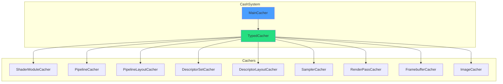
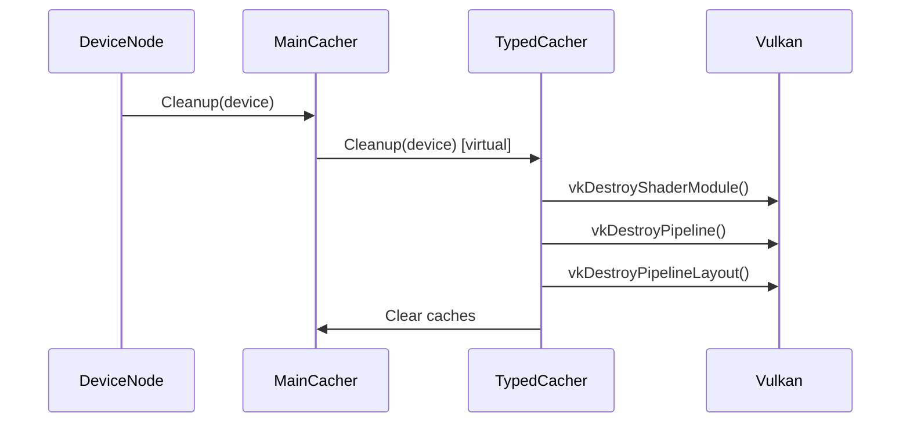
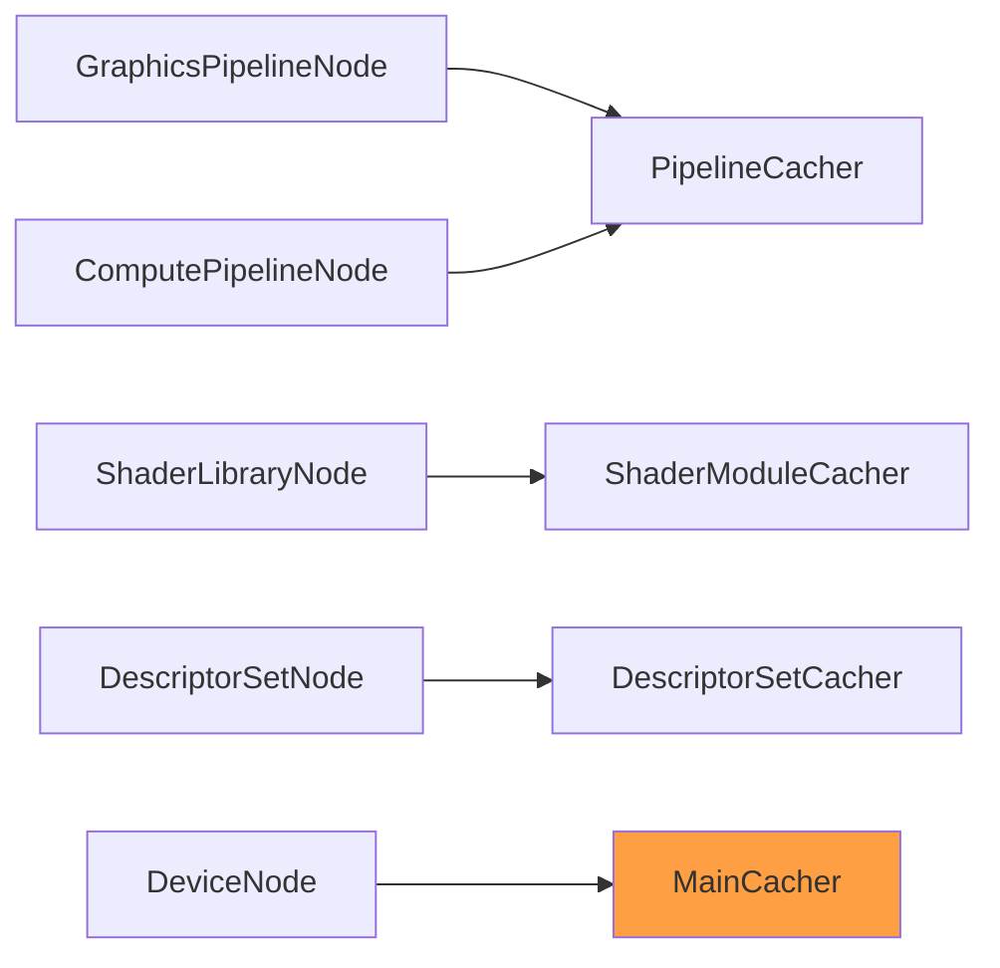

# CashSystem Library

Type-safe resource caching system with virtual cleanup architecture. Eliminates redundant Vulkan resource creation via hash-based deduplication.

---

## 1. Architecture



---

## 2. Core Components

### 2.1 MainCacher

Global registry orchestrating all cachers with virtual cleanup.

```cpp
MainCacher& cacher = MainCacher::GetInstance();

// Access typed cachers
auto& shaderCacher = cacher.GetShaderModuleCacher();
auto& pipelineCacher = cacher.GetPipelineCacher();

// Cleanup all cachers (on device destruction)
cacher.Cleanup(device);
```

### 2.2 TypedCacher<T>

Template base class with hash-based key deduplication.

```cpp
template<typename Key, typename Value>
class TypedCacher {
public:
    // Get or create resource
    Value GetOrCreate(const Key& key, std::function<Value()> createFn);

    // Check cache
    bool Contains(const Key& key) const;
    std::optional<Value> Get(const Key& key) const;

    // Cache management
    void Clear();
    size_t Size() const;

    // Virtual cleanup for polymorphic destruction
    virtual void Cleanup(VkDevice device) = 0;
};
```

---

## 3. Active Cachers

### 3.1 ShaderModuleCacher

Caches `VkShaderModule` with CACHE HIT/MISS logging.

```cpp
auto& shaderCacher = cacher.GetShaderModuleCacher();
VkShaderModule module = shaderCacher.GetOrCreate(
    ShaderModuleKey{spirvPath, stage},
    [&]() { return createShaderModule(device, spirvPath); }
);
```

**Key:** `{SPIRV path, shader stage}`
**Log:** `[CACHE HIT] ShaderModule: VoxelRayMarch.comp` or `[CACHE MISS]`

### 3.2 PipelineCacher

Caches `VkPipeline` with activity tracking.

```cpp
auto& pipelineCacher = cacher.GetPipelineCacher();
VkPipeline pipeline = pipelineCacher.GetOrCreate(
    PipelineKey{layout, renderPass, shaderStages, ...},
    [&]() { return createGraphicsPipeline(...); }
);
```

### 3.3 PipelineLayoutCacher

Transparent two-mode API for `VkPipelineLayout`.

```cpp
// Mode 1: Explicit descriptor set layouts
VkPipelineLayout layout = layoutCacher.GetOrCreate(
    PipelineLayoutKey{descriptorLayouts, pushConstantRanges}
);

// Mode 2: Inferred from shaders
VkPipelineLayout layout = layoutCacher.GetOrCreateFromShaders(shaderModules);
```

---

## 4. Cleanup Flow



---

## 5. Key Patterns

### 5.1 Hash-Based Deduplication

```cpp
// Multiple nodes requesting same shader get same VkShaderModule
auto module1 = shaderCacher.GetOrCreate(key, createFn);  // Creates
auto module2 = shaderCacher.GetOrCreate(key, createFn);  // Returns cached
assert(module1 == module2);  // Same handle
```

### 5.2 Virtual Cleanup

```cpp
class TypedCacher {
public:
    // Polymorphic destruction via MainCacher
    virtual void Cleanup(VkDevice device) = 0;
};

// Each cacher knows how to destroy its resource type
void ShaderModuleCacher::Cleanup(VkDevice device) {
    for (auto& [key, module] : cache_) {
        vkDestroyShaderModule(device, module, nullptr);
    }
    cache_.clear();
}
```

---

## 6. Integration



---

## 7. Code References

| File | Purpose |
|------|---------|
| `libraries/CashSystem/include/MainCacher.h` | Global registry |
| `libraries/CashSystem/include/TypedCacher.h` | Template base |
| `libraries/CashSystem/include/ShaderModuleCacher.h` | Shader caching |
| `libraries/CashSystem/include/PipelineCacher.h` | Pipeline caching |
| `documentation/CashSystem/01-architecture.md` | Detailed architecture |
| `documentation/CashSystem/02-usage-guide.md` | Usage patterns |

---

## 8. Related Pages

- [[Libraries-Overview]] - Library index
- [[VulkanResources-Library]] - Vulkan resource management
- [[RenderGraph-System]] - Node cacher integration
