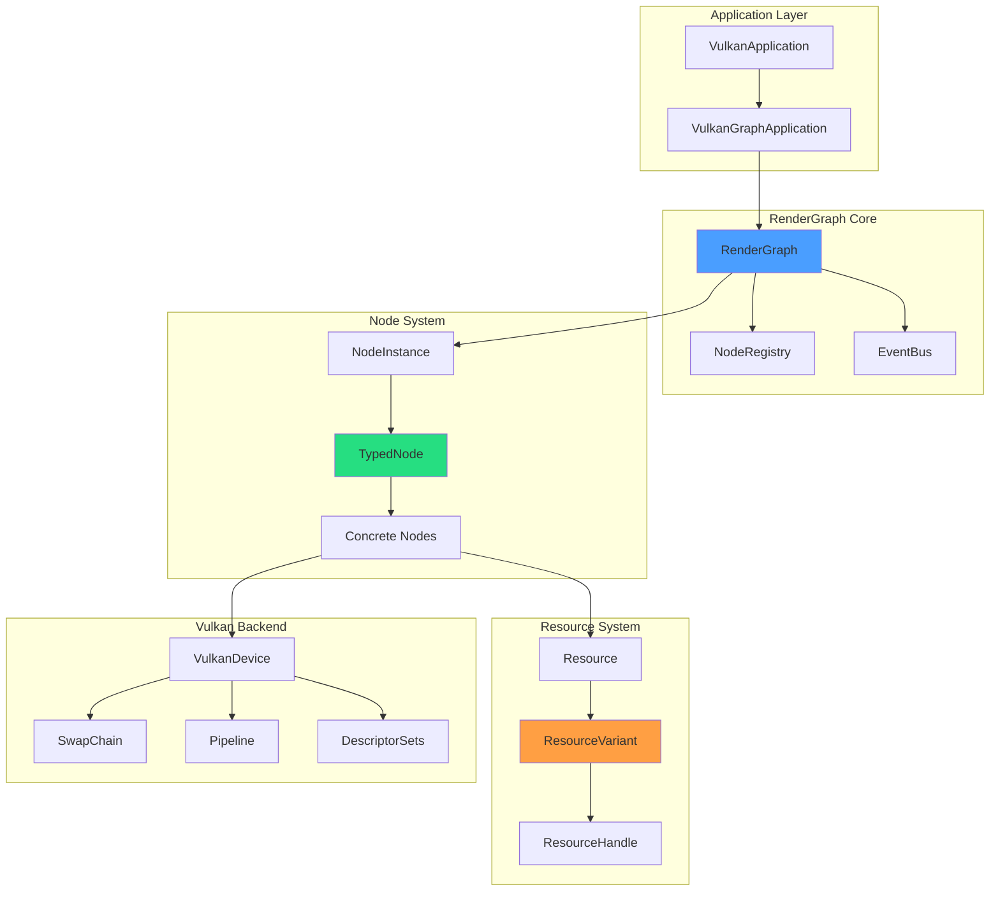
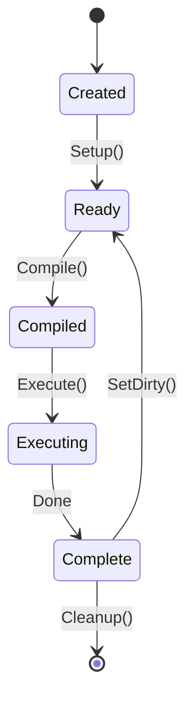
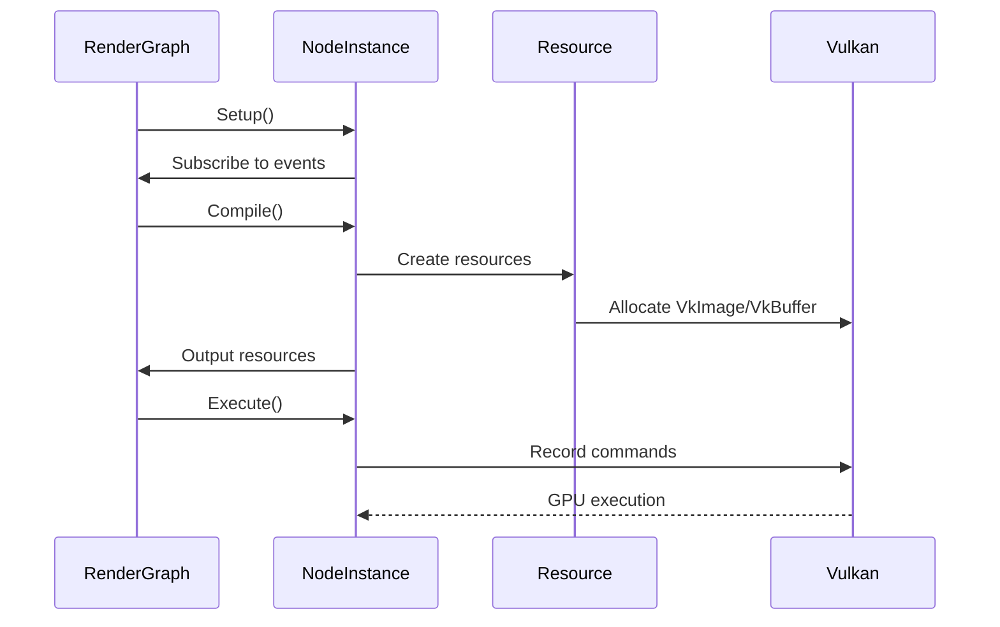

# Architecture Overview

VIXEN uses a **graph-based rendering architecture** with compile-time type safety. The system is designed for production-quality rendering while serving as a voxel ray tracing research platform.

---

## 1. System Diagram



---

## 2. Design Principles

### 2.1 Three Pillars

| Pillar | Description |
|--------|-------------|
| **Compile-Time Type Safety** | Eliminate runtime type errors via templates and variants |
| **Clear Resource Ownership** | Graph owns resources, nodes access them |
| **Event-Driven Invalidation** | Decouple nodes via EventBus |

### 2.2 Industry Alignment

Comparable to:
- Unity HDRP (Scriptable Render Pipeline)
- Unreal RDG (Render Dependency Graph)
- Frostbite FrameGraph

---

## 3. Core Components

### 3.1 RenderGraph

The orchestrator that manages the entire rendering pipeline.

**Responsibilities:**
- Graph lifecycle (AddNode, ConnectNodes, Compile, Execute)
- Resource lifetime management
- Topology analysis (dependency ordering)
- Compilation phases (Validate -> Analyze -> Allocate -> Generate -> Build)

**Key File:** `libraries/RenderGraph/src/Core/RenderGraph.cpp`

### 3.2 NodeInstance

Base class for all rendering operations.

**Lifecycle:**


**Key File:** `libraries/RenderGraph/include/Core/NodeInstance.h`

### 3.3 TypedNode<Config>

Template base providing compile-time slot validation.

```cpp
struct MyNodeConfig {
    INPUT_SLOT(ALBEDO, VkImage, SlotMode::SINGLE);
    OUTPUT_SLOT(COLOR, VkImage, SlotMode::SINGLE);
};

class MyNode : public TypedNode<MyNodeConfig> {
    void Compile() override {
        VkImage albedo = In(MyNodeConfig::ALBEDO);  // Type-safe
        Out(MyNodeConfig::COLOR, resultImage);
    }
};
```

**Key File:** `libraries/RenderGraph/include/Core/TypedNodeInstance.h`

---

## 4. Resource Flow



---

## 5. Key Patterns

### 5.1 Graph-Owns-Resources Pattern

```cpp
class RenderGraph {
    std::vector<std::unique_ptr<Resource>> resources;  // OWNS
};

class NodeInstance {
    std::vector<Resource*> inputs;   // Raw pointers (access only)
    std::vector<Resource*> outputs;
};
```

### 5.2 EventBus Invalidation


### 5.3 Handle-Based Access

O(1) node lookups via `NodeHandle` instead of string-based lookups.

---

## 6. Performance Characteristics

| Aspect | Current | Future |
|--------|---------|--------|
| Threading | Single-threaded | Wave-based parallel |
| Virtual Dispatch | ~2-5ns per call | Devirtualized for 1000+ nodes |
| Resource Aliasing | None | Transient memory optimization |
| Node Capacity | 100-200 | 500+ |

---

## 7. Related Documentation

- [[Libraries-Overview]] - All 14 library components
- [[RenderGraph-System]] - Detailed render graph architecture
- [[Vulkan-Pipeline]] - Vulkan resource management
- [[Type-System]] - Variant-based type safety
- [[EventBus]] - Event-driven communication

---

## 8. Source References

| Component | File Path |
|-----------|-----------|
| RenderGraph | `libraries/RenderGraph/src/Core/RenderGraph.cpp` |
| NodeInstance | `libraries/RenderGraph/include/Core/NodeInstance.h` |
| TypedNode | `libraries/RenderGraph/include/Core/TypedNodeInstance.h` |
| ResourceVariant | `libraries/RenderGraph/include/Core/ResourceVariant.h` |
| EventBus | `libraries/EventBus/include/EventBus.h` |
