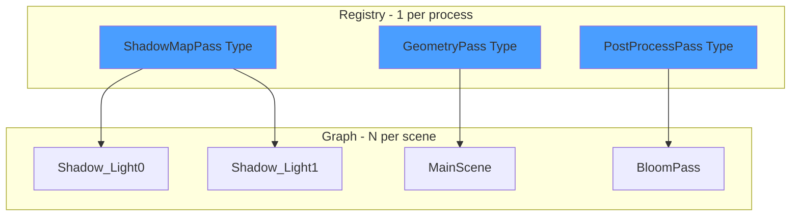
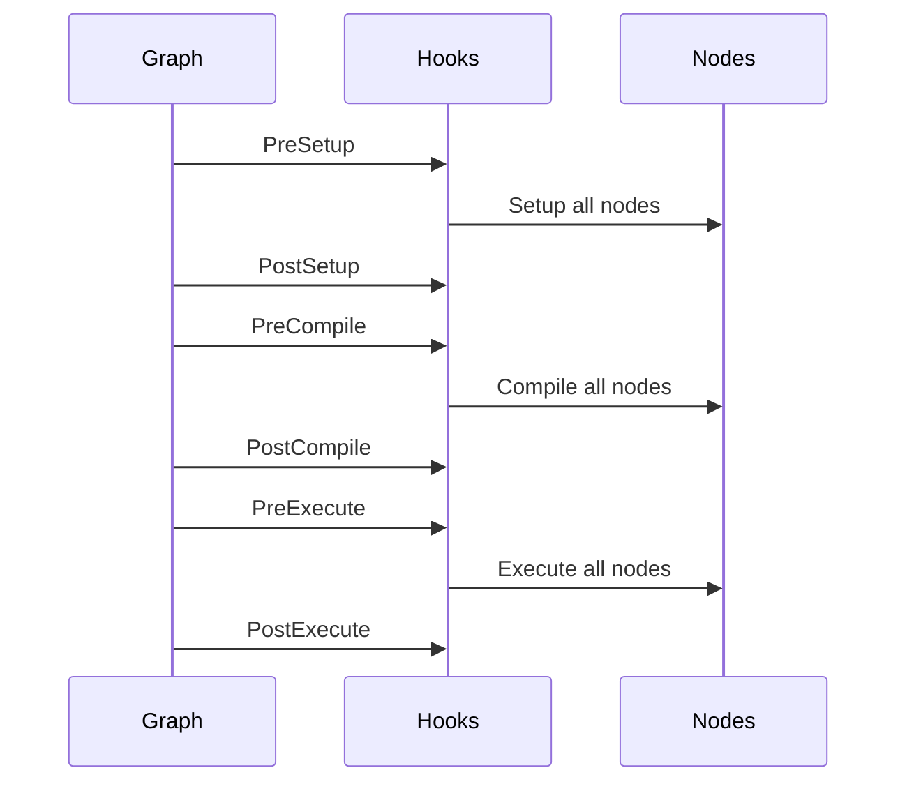

# RenderGraph System

The RenderGraph is a directed acyclic graph (DAG) of rendering operations. Each node represents a discrete operation (resource creation, command recording, presentation).

---

## 1. Node Type vs Node Instance



| Concept | Role | Count | Example |
|---------|------|-------|---------|
| **Node Type** | Template/Definition | 1 per process | `ShadowMapPass` |
| **Node Instance** | Concrete usage | N per scene | `ShadowMap_Light0` |

---

## 2. Graph Compilation Phases


### 2.1 Phase Details

| Phase                   | Description                                                 |
| ----------------------- | ----------------------------------------------------------- |
| **Validate**            | Check all inputs connected, verify no cycles (DAG property) |
| **AnalyzeDependencies** | Build directed graph, topological sort for execution order  |
| **AllocateResources**   | Analyze resource lifetimes, allocate Vulkan resources       |
| **GeneratePipelines**   | Group instances by type, create shared pipelines            |
| **BuildExecutionOrder** | Finalize execution order list                               |

---

## 3. Node Lifecycle Hooks

Every node has 14 lifecycle hooks across 6 graph phases and 8 node phases.

### 3.1 Graph Lifecycle Phases



### 3.2 Node Lifecycle Methods

```cpp
class NodeInstance {
    virtual void Setup();    // Subscribe to events
    virtual void Compile();  // Create Vulkan resources
    virtual void Execute();  // Record commands
    virtual void Cleanup();  // Destroy resources
};
```

---

## 4. Node Catalog

### 4.1 Infrastructure Nodes

| Node | Purpose |
|------|---------|
| `WindowNode` | Win32 window creation |
| `DeviceNode` | VkDevice management |
| `SwapChainNode` | Swapchain with image views |
| `FrameSyncNode` | Fences and semaphores |

### 4.2 Pipeline Nodes

| Node | Purpose |
|------|---------|
| `RenderPassNode` | VkRenderPass creation |
| `FramebufferNode` | VkFramebuffer per swapchain image |
| `GraphicsPipelineNode` | Graphics pipeline from shaders |
| `ComputePipelineNode` | Compute pipeline creation |
| `DescriptorSetNode` | Descriptor set allocation |

### 4.3 Rendering Nodes

| Node | Purpose |
|------|---------|
| `GeometryRenderNode` | Draw call recording |
| `ComputeDispatchNode` | Compute shader dispatch (single pass) |
| `MultiDispatchNode` | Multi-pass compute with group-based partitioning (Sprint 6.1) and budget-aware scheduling (Sprint 6.2) |
| `PresentNode` | vkQueuePresentKHR |

### 4.4 Resource Nodes

| Node | Purpose |
|------|---------|
| `DepthBufferNode` | Depth attachment creation |
| `TextureLoaderNode` | Image loading |
| `VertexBufferNode` | Geometry buffers |
| `ShaderLibraryNode` | SPIRV loading and reflection |

### 4.5 Specialized Nodes

| Node | Purpose |
|------|---------|
| `CameraNode` | View/projection matrices |
| `VoxelGridNode` | Voxel scene generation |
| `LoopBridgeNode` | Multi-rate update loops |
| `ConstantNode` | Static value injection |

### 4.6 Core Infrastructure (Non-Node Components)

| Component | Purpose | Sprint |
|-----------|---------|--------|
| `TaskQueue<T>` | Priority-based task scheduler with GPU time/memory budget enforcement | 6.2 |
| `TaskBudget` | Budget configuration structure (time, memory, overflow modes, presets) | 6.2 |
| `GraphLifecycleHooks` | Hook system for graph lifecycle events | Core |
| `NodeTypeRegistry` | Global registry of node types | Core |
| `ConnectionRuleRegistry` | Connection validation rules | Core |

**TaskQueue Integration:**
- Used by `MultiDispatchNode` for budget-aware dispatch scheduling
- Supports strict (reject over-budget) vs lenient (warn) overflow modes
- Priority-based execution (255=highest, 0=lowest) with stable sort
- Zero-cost tasks bypass budget checks (backward compatibility)

See [[../Libraries/RenderGraph/TaskQueue|TaskQueue Documentation]] for API reference.

---

## 5. Slot System

### 5.1 Slot Definition

```cpp
struct FramebufferNodeConfig {
    INPUT_SLOT(COLOR_ATTACHMENTS, VkImageView, SlotMode::ARRAY);
    INPUT_SLOT(DEPTH_ATTACHMENT, VkImageView, SlotMode::SINGLE);
    INPUT_SLOT(RENDER_PASS, VkRenderPass, SlotMode::SINGLE);

    OUTPUT_SLOT(FRAMEBUFFER, VkFramebuffer, SlotMode::SINGLE);

    static constexpr uint32_t INPUT_COUNT = 3;
    static constexpr uint32_t OUTPUT_COUNT = 1;
};
```

### 5.2 SlotRole Flags

```cpp
enum class SlotRole : uint8_t {
    None         = 0u,
    Dependency   = 1u << 0,  // Accessed during Compile
    Execute      = 1u << 1,  // Accessed during Execute
    CleanupOnly  = 1u << 2,  // Only during Cleanup
    Output       = 1u << 3   // Output slot
};

// Combined roles are allowed
SlotRole descriptorRole = SlotRole::Dependency | SlotRole::Execute;
```

---

## 6. Connection API

> [!info] Unified Connection System
> As of Sprint 6.0.1, all connection types use a single `Connect()` API. See [[../05-Progress/features/Sprint6.0.1-Unified-Connection-System|Sprint 6.0.1]] for detailed design.

### 6.1 Direct Connection (1:1)

```cpp
RenderGraph graph(device, &registry);
auto windowNode = graph.AddNode(WindowNodeType, "MainWindow");
auto deviceNode = graph.AddNode(DeviceNodeType, "Device");
auto swapNode = graph.AddNode(SwapChainNodeType, "SwapChain");

// Connect nodes using unified API
batch.Connect(windowNode, WindowNodeConfig::WINDOW_HANDLE,
              swapNode, SwapChainNodeConfig::WINDOW);
batch.Connect(deviceNode, DeviceNodeConfig::DEVICE,
              swapNode, SwapChainNodeConfig::DEVICE);
```

### 6.2 Variadic Connection (Discovered Slots)

```cpp
// For nodes with shader-discovered slots (e.g., descriptor bindings)
batch.Connect(sourceNode, SourceConfig::OUTPUT,
              gathererNode, ShaderBinding::esvoNodes);
```

### 6.3 Accumulation Connection (Multi-Connect)

```cpp
// Multiple sources to single array slot with explicit ordering
batch.Connect(pass1, PassConfig::OUTPUT,
              multiDispatch, MultiDispatchConfig::DISPATCH_PASSES,
              ConnectionMeta{}.With<AccumulationSortConfig>(0));

batch.Connect(pass2, PassConfig::OUTPUT,
              multiDispatch, MultiDispatchConfig::DISPATCH_PASSES,
              ConnectionMeta{}.With<AccumulationSortConfig>(1));
```

### 6.4 Connection Modifiers

```cpp
// Composable modifiers for advanced connection behavior
batch.Connect(source, SourceConfig::STRUCT_OUTPUT,
              target, TargetConfig::INPUT,
              ConnectionMeta{}
                  .With<FieldExtractionModifier>(&MyStruct::field)
                  .With<SlotRoleModifier>(SlotRole::Execute)
                  .With<DebugTagModifier>("custom-label"));
```

---

## 7. Execution Flow

```cpp
void RenderGraph::Execute(VkCommandBuffer cmd) {
    for (NodeInstance* node : executionOrder) {
        if (node->ShouldExecuteThisFrame()) {
            node->SetState(NodeState::Executing);
            node->Execute(cmd);
            node->SetState(NodeState::Complete);
        }
    }
}
```

> [!warning] Virtual Dispatch
> Virtual dispatch adds ~2-5ns per call. Acceptable for <200 nodes. For 500+ nodes, consider compiled execution.

---

## 8. Code References

| Component | Location |
|-----------|----------|
| RenderGraph | `libraries/RenderGraph/src/Core/RenderGraph.cpp` |
| NodeInstance | `libraries/RenderGraph/include/Core/NodeInstance.h` |
| TypedNode | `libraries/RenderGraph/include/Core/TypedNodeInstance.h` |
| TaskQueue | `libraries/RenderGraph/include/Core/TaskQueue.h` (Sprint 6.2) |
| TaskBudget | `libraries/RenderGraph/include/Data/TaskBudget.h` (Sprint 6.2) |
| SlotRole | `libraries/RenderGraph/include/Data/Core/ResourceConfig.h` |
| Node Configs | `libraries/RenderGraph/include/Data/Nodes/` |
| Node Implementations | `libraries/RenderGraph/src/Nodes/` |
| MultiDispatchNode | `libraries/RenderGraph/src/Nodes/MultiDispatchNode.cpp` (Sprint 6.1, 6.2) |

---

## 9. Related Pages

### Core Documentation

- [[Overview]] - High-level architecture
- [[Vulkan-Pipeline]] - Vulkan resource management
- [[Type-System]] - Compile-time type safety
- [[../02-Implementation/Shaders|Shaders]] - Shader integration

### Node Documentation

- [[../Libraries/MultiDispatchNode|MultiDispatchNode]] - Multi-pass compute dispatch (Sprint 6.1, 6.2)
- [[../Libraries/RenderGraph/TaskQueue|TaskQueue]] - Budget-aware task scheduling (Sprint 6.2)

### Sprint Features

- [[../05-Progress/features/Sprint6.0.1-Unified-Connection-System|Unified Connection System]] - Connection API design (Sprint 6.0.1)
- [[../05-Progress/features/Sprint6.2-TaskQueue-System|TaskQueue System]] - Budget enforcement implementation (Sprint 6.2)
- [[../05-Progress/feature-proposal-plans/timeline-capacity-tracker|Timeline Capacity Tracker]] - Runtime performance tracking (Sprint 6.3 proposal)
