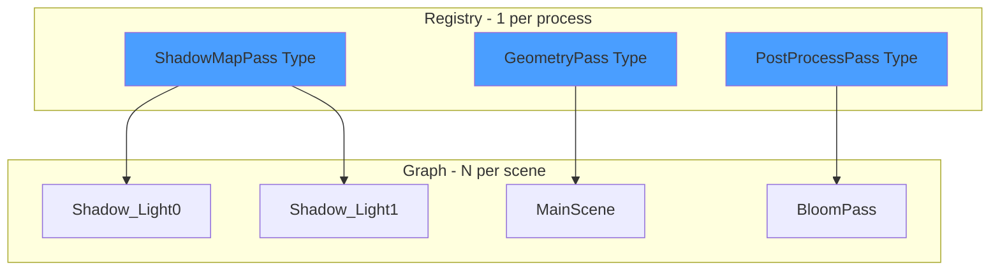
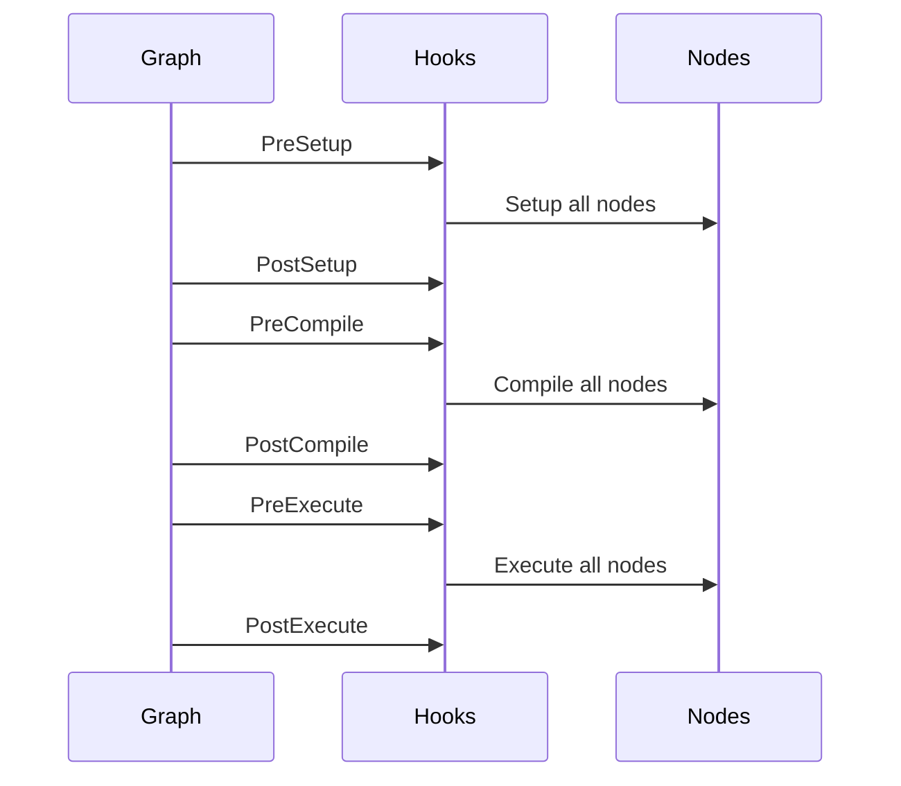

# RenderGraph System

The RenderGraph is a directed acyclic graph (DAG) of rendering operations. Each node represents a discrete operation (resource creation, command recording, presentation).

---

## 1. Node Type vs Node Instance


```mermaid
flowchart TB
    subgraph Node Types [Registry - 1 per process]
        NT1[ShadowMapPass Type]
        NT2[GeometryPass Type]
        NT3[PostProcessPass Type]
    end

    subgraph Node Instances [Graph - N per scene]
        NI1[Shadow_Light0]
        NI2[Shadow_Light1]
        NI3[MainScene]
        NI4[BloomPass]
    end

    NT1 --> NI1
    NT1 --> NI2
    NT2 --> NI3
    NT3 --> NI4

    style NT1 fill:#4a9eff
    style NT2 fill:#4a9eff
    style NT3 fill:#4a9eff
```

| Concept | Role | Count | Example |
|---------|------|-------|---------|
| **Node Type** | Template/Definition | 1 per process | `ShadowMapPass` |
| **Node Instance** | Concrete usage | N per scene | `ShadowMap_Light0` |

---

## 2. Graph Compilation Phases


```mermaid
flowchart LR
    V[Validate] --> A[AnalyzeDependencies]
    A --> R[AllocateResources]
    R --> G[GeneratePipelines]
    G --> B[BuildExecutionOrder]

    style V fill:#e74c3c
    style A fill:#f39c12
    style R fill:#27ae60
    style G fill:#3498db
    style B fill:#9b59b6
```

### 2.1 Phase Details

| Phase                   | Description                                                 |
| ----------------------- | ----------------------------------------------------------- |
| **Validate**            | Check all inputs connected, verify no cycles (DAG property) |
| **AnalyzeDependencies** | Build directed graph, topological sort for execution order  |
| **AllocateResources**   | Analyze resource lifetimes, allocate Vulkan resources       |
| **GeneratePipelines**   | Group instances by type, create shared pipelines            |
| **BuildExecutionOrder** | Finalize execution order list                               |

---

## 3. Node Lifecycle Hooks

Every node has 14 lifecycle hooks across 6 graph phases and 8 node phases.

### 3.1 Graph Lifecycle Phases


```mermaid
sequenceDiagram
    participant G as Graph
    participant H as Hooks
    participant N as Nodes

    G->>H: PreSetup
    H->>N: Setup all nodes
    G->>H: PostSetup
    G->>H: PreCompile
    H->>N: Compile all nodes
    G->>H: PostCompile
    G->>H: PreExecute
    H->>N: Execute all nodes
    G->>H: PostExecute
```

### 3.2 Node Lifecycle Methods

```cpp
class NodeInstance {
    virtual void Setup();    // Subscribe to events
    virtual void Compile();  // Create Vulkan resources
    virtual void Execute();  // Record commands
    virtual void Cleanup();  // Destroy resources
};
```

---

## 4. Node Catalog

### 4.1 Infrastructure Nodes

| Node | Purpose |
|------|---------|
| `WindowNode` | Win32 window creation |
| `DeviceNode` | VkDevice management |
| `SwapChainNode` | Swapchain with image views |
| `FrameSyncNode` | Fences and semaphores |

### 4.2 Pipeline Nodes

| Node | Purpose |
|------|---------|
| `RenderPassNode` | VkRenderPass creation |
| `FramebufferNode` | VkFramebuffer per swapchain image |
| `GraphicsPipelineNode` | Graphics pipeline from shaders |
| `ComputePipelineNode` | Compute pipeline creation |
| `DescriptorSetNode` | Descriptor set allocation |

### 4.3 Rendering Nodes

| Node | Purpose |
|------|---------|
| `GeometryRenderNode` | Draw call recording |
| `ComputeDispatchNode` | Compute shader dispatch (single pass) |
| `MultiDispatchNode` | Multi-pass compute with group-based partitioning (Sprint 6.1) and budget-aware scheduling (Sprint 6.2) |
| `PresentNode` | vkQueuePresentKHR |

### 4.4 Resource Nodes

| Node | Purpose |
|------|---------|
| `DepthBufferNode` | Depth attachment creation |
| `TextureLoaderNode` | Image loading |
| `VertexBufferNode` | Geometry buffers |
| `ShaderLibraryNode` | SPIRV loading and reflection |

### 4.5 Specialized Nodes

| Node | Purpose |
|------|---------|
| `CameraNode` | View/projection matrices |
| `VoxelGridNode` | Voxel scene generation |
| `LoopBridgeNode` | Multi-rate update loops |
| `ConstantNode` | Static value injection |
| `PhotonCellTableNode` | Fixed-size, zero-initialised photon world-cell SSBO |
| `PhotonCellParamsConfigNode` | Persistent per-frame photon generation/config ring |
| `PhotonCellDepositNode` | March-side exitant-diffuse cell deposit pass |
| `PhotonCellFoldNode` | Fixed-point-to-EWMA photon-cell fold pass |
| `PhotonCellClearNode` | Explicit photon-cell table reset pass |

### 4.6 Core Infrastructure (Non-Node Components)

| Component | Purpose | Sprint |
|-----------|---------|--------|
| `TaskQueue<T>` | Priority-based task scheduler with GPU time/memory budget enforcement | 6.2 |
| `TaskBudget` | Budget configuration structure (time, memory, overflow modes, presets) | 6.2 |
| `GraphLifecycleHooks` | Hook system for graph lifecycle events | Core |
| `NodeTypeRegistry` | Global registry of node types | Core |
| `ConnectionRuleRegistry` | Connection validation rules | Core |

**TaskQueue Integration:**
- Used by `MultiDispatchNode` for budget-aware dispatch scheduling
- Supports strict (reject over-budget) vs lenient (warn) overflow modes
- Priority-based execution (255=highest, 0=lowest) with stable sort
- Zero-cost tasks bypass budget checks (backward compatibility)

See [[../Libraries/RenderGraph/TaskQueue|TaskQueue Documentation]] for API reference.

### 4.7 Photon world-cell cache (C0/C1)

The opt-in PhotonCell cache is composed entirely from the nodes above.  The
application graph instantiates and wires the nodes; table allocation, params
defaults/generation publication, shader registration, dispatch configuration,
and diagnostics remain node-owned.  With `VIXEN_PHOTON_CELLS` unset, no photon
nodes or buffers are created.  The cache is render-only: it has no ECS or
simulation side effects and introduces no shader/codegen schema vocabulary.

`PhotonCellDepositNode` is the delivered march-side writer and consumes the
existing post-shadow-wave `HitRecord` visibility bits.  The staged-march/proxy
writer is a later composition of the same cell claim/deposit shader contract.
`PhotonCellClearNode` consumes an explicit reset request as one table-wide
dispatch at graph start, then disables its steady-state dispatch; it is not an
every-frame clear.

---

## 5. Slot System

### 5.1 Slot Definition

```cpp
struct FramebufferNodeConfig {
    INPUT_SLOT(COLOR_ATTACHMENTS, VkImageView, SlotMode::ARRAY);
    INPUT_SLOT(DEPTH_ATTACHMENT, VkImageView, SlotMode::SINGLE);
    INPUT_SLOT(RENDER_PASS, VkRenderPass, SlotMode::SINGLE);

    OUTPUT_SLOT(FRAMEBUFFER, VkFramebuffer, SlotMode::SINGLE);

    static constexpr uint32_t INPUT_COUNT = 3;
    static constexpr uint32_t OUTPUT_COUNT = 1;
};
```

### 5.2 SlotRole Flags

```cpp
enum class SlotRole : uint8_t {
    None         = 0u,
    Dependency   = 1u << 0,  // Accessed during Compile
    Execute      = 1u << 1,  // Accessed during Execute
    CleanupOnly  = 1u << 2,  // Only during Cleanup
    Output       = 1u << 3   // Output slot
};

// Combined roles are allowed
SlotRole descriptorRole = SlotRole::Dependency | SlotRole::Execute;
```

---

## 6. Connection API

> [!info] Unified Connection System
> As of Sprint 6.0.1, all connection types use a single `Connect()` API. See [[../05-Progress/features/Sprint6.0.1-Unified-Connection-System|Sprint 6.0.1]] for detailed design.

### 6.1 Direct Connection (1:1)

```cpp
RenderGraph graph(device, &registry);
auto windowNode = graph.AddNode(WindowNodeType, "MainWindow");
auto deviceNode = graph.AddNode(DeviceNodeType, "Device");
auto swapNode = graph.AddNode(SwapChainNodeType, "SwapChain");

// Connect nodes using unified API
batch.Connect(windowNode, WindowNodeConfig::WINDOW_HANDLE,
              swapNode, SwapChainNodeConfig::WINDOW);
batch.Connect(deviceNode, DeviceNodeConfig::DEVICE,
              swapNode, SwapChainNodeConfig::DEVICE);
```

### 6.2 Variadic Connection (Discovered Slots)

```cpp
// For nodes with shader-discovered slots (e.g., descriptor bindings)
batch.Connect(sourceNode, SourceConfig::OUTPUT,
              gathererNode, ShaderBinding::esvoNodes);
```

### 6.3 Accumulation Connection (Multi-Connect)

```cpp
// Multiple sources to single array slot with explicit ordering
batch.Connect(pass1, PassConfig::OUTPUT,
              multiDispatch, MultiDispatchConfig::DISPATCH_PASSES,
              ConnectionMeta{}.With<AccumulationSortConfig>(0));

batch.Connect(pass2, PassConfig::OUTPUT,
              multiDispatch, MultiDispatchConfig::DISPATCH_PASSES,
              ConnectionMeta{}.With<AccumulationSortConfig>(1));
```

### 6.4 Connection Modifiers

```cpp
// Composable modifiers for advanced connection behavior
batch.Connect(source, SourceConfig::STRUCT_OUTPUT,
              target, TargetConfig::INPUT,
              ConnectionMeta{}
                  .With<FieldExtractionModifier>(&MyStruct::field)
                  .With<SlotRoleModifier>(SlotRole::Execute)
                  .With<DebugTagModifier>("custom-label"));
```

---

## 7. Execution Flow

```cpp
void RenderGraph::Execute(VkCommandBuffer cmd) {
    for (NodeInstance* node : executionOrder) {
        if (node->ShouldExecuteThisFrame()) {
            node->SetState(NodeState::Executing);
            node->Execute(cmd);
            node->SetState(NodeState::Complete);
        }
    }
}
```

> [!warning] Virtual Dispatch
> Virtual dispatch adds ~2-5ns per call. Acceptable for <200 nodes. For 500+ nodes, consider compiled execution.

---

## 8. Code References

| Component | Location |
|-----------|----------|
| RenderGraph | `libraries/RenderGraph/src/Core/RenderGraph.cpp` |
| NodeInstance | `libraries/RenderGraph/include/Core/NodeInstance.h` |
| TypedNode | `libraries/RenderGraph/include/Core/TypedNodeInstance.h` |
| TaskQueue | `libraries/RenderGraph/include/Core/TaskQueue.h` (Sprint 6.2) |
| TaskBudget | `libraries/RenderGraph/include/Data/TaskBudget.h` (Sprint 6.2) |
| SlotRole | `libraries/RenderGraph/include/Data/Core/ResourceConfig.h` |
| Node Configs | `libraries/RenderGraph/include/Data/Nodes/` |
| Node Implementations | `libraries/RenderGraph/src/Nodes/` |
| MultiDispatchNode | `libraries/RenderGraph/src/Nodes/MultiDispatchNode.cpp` (Sprint 6.1, 6.2) |

---

## 9. Library Structure & Node Registration (Build Decoupling)

> Added 2026-06-19 (branch `claude/rendergraph-node-build-decoupling`, M2+M3).

### 9.1 Three CMake targets

`libraries/RenderGraph/CMakeLists.txt` builds the system as two static libraries plus a
back-compat facade:

| Target | Contents | Heavy deps |
|--------|----------|------------|
| `RenderGraphCore` | graph engine: Data/Core, Connection, Core, Debug, Event, Selection — **zero concrete-node dependencies** | Core::Core, VulkanResources, Logger, EventBus, ResourceManagement, CashSystem, ShaderManagement, SVO, TBB, magic_enum |
| `RenderGraphNodes` | the ~40 concrete nodes + their configs + the RmlUi UI node; depends on `RenderGraphCore` | adds glfw, rmlui_core, freetype (+ `RMLUI_STATIC_LIB`) |
| `RenderGraph` | **INTERFACE facade** — every existing consumer links this and transitively gets both libs | — |

**Invariant: editing a node can never recompile `RenderGraphCore`.** Verified structurally
(no Core/Connection/Data/Debug/Selection TU includes a node header — the connection layer's
old `TypedConnection.h → 3 node-config` leak was removed) and by measurement (below).

The facade is `INTERFACE`, so it cannot take `PUBLIC`/`PRIVATE` properties — the generated
`<VixenVersion.h>` include dir lives on `RenderGraphCore PUBLIC` (propagates through the
facade to consumers and to Nodes).

### 9.2 Node self-registration (no central list)

Each node `.cpp` self-registers via a one-liner at file scope:

```cpp
// end of src/Nodes/CameraNode.cpp
VIXEN_REGISTER_NODE(Vixen::RenderGraph::CameraNodeType);
```

`VIXEN_REGISTER_NODE` (in `include/Core/NodeRegistration.h`) links a small static
`detail::NodeRegistrarLink` object into a global intrusive linked list (Meyers-singleton
`detail::HeadLink()`) the moment its constructor runs at dynamic-init — see §9.3.1 for why this
replaced an earlier `std::vector<std::function>` design. `RegisterAllNodes(NodeTypeRegistry&)`
walks that list into any per-`EngineContext` registry; wire it via
`EngineConfig::registerNodeTypes`. The app (`VulkanGraphApplication`) and the benchmark
(`BenchmarkRunner`) both use it — there is **no hand-maintained registration list anywhere**.

### 9.3 Whole-archive requirement (the #1 footgun) + COMDAT/section GC (the #2 footgun)

The registrars are anonymous-namespace statics with internal linkage, so the facade must link
`RenderGraphNodes` **whole-archive** (`$<LINK_LIBRARY:WHOLE_ARCHIVE,RenderGraphNodes>` on CMake
≥3.24, with MSVC `/WHOLEARCHIVE` and GNU `--whole-archive` fallbacks) — otherwise a static-library
linker's normal archive-member selection never pulls a node's `.obj` into the link at all.
`tests/test_node_self_registration.cpp` is the guard: without whole-archive `GetNodeTypeCount()`
collapses to 0; with it, it matches `RENDERGRAPH_EXPECTED_NODE_TYPE_COUNT`.
**If that test goes red after a CMake change, check the link command for the whole-archive flag
first** — but if the flag is present and correct and the count is still 0, see §9.3.1: a second,
independent failure mode exists that whole-archiving cannot fix.

#### 9.3.1 COMDAT/section garbage collection (2026-07, MSVC-specific, mechanism-level fix shipped)

Whole-archiving only solves **archive-member selection** (getting a node's `.obj` onto the link
line at all). It does **not** stop a linker's separate **COMDAT/section garbage collection**
pass (MSVC `/OPT:REF`, on by default in this project's build config) from then discarding an
individually-unreferenced registrar COMDAT/section from within an `.obj` that *is* present on the
link line — this is a distinct mechanism from archive selection and whole-archiving does not
touch it. This bit MSVC specifically once [[Graph-Derived-Node-Linkage-Inc1-Plan-2026-07]]'s
OBJECT-library split (§9.7) put per-node object code where COMDAT GC could reach it independent
of archive selection, silently collapsing `test_node_self_registration`'s guard to `0` even with
the whole-archive flag present and correct.

**Fixed at the mechanism level (2026-07), not by a further linker-flag layer:** `VIXEN_REGISTER_NODE`
no longer relies on "was my symbol referenced by something else" at all. Each node's registrar is
now an intrusive-linked-list node (`detail::NodeRegistrarLink`) whose *constructor running* —
guaranteed the instant its enclosing `.obj` is linked in, independent of whether anything
references it — is what links it into the global list. There is no unreferenced symbol left for
any toolchain's GC pass (COMDAT/section GC, LTO, `/OPT:ICF`, etc.) to strip. Full root-cause
writeup and design rationale:
[[Node-Self-Registration-Portable-Fix-Direction-2026-07]].

### 9.4 Adding a node now

1. Create `include/Nodes/XNode.h` (+ `XNodeType`), `src/Nodes/XNode.cpp`, `include/Data/Nodes/XNodeConfig.h`.
2. Add `VIXEN_REGISTER_NODE(Vixen::RenderGraph::XNodeType);` at the end of `XNode.cpp`.
3. Add the sources to `RENDERGRAPH_NODE_*` in `libraries/RenderGraph/CMakeLists.txt`.

No central registry edit, no app/benchmark list edit.

### 9.5 Build-granularity results (Ninja preset)

| Scenario | Before | After (M2+M3) |
|----------|--------|---------------|
| Edit one node `.cpp` body | ~119 TUs | **1** (just that node) |
| Edit one node config header | ~119 TUs | **5** (the node + the app/benchmark/test TUs that *wire* it) |
| `RenderGraphCore` recompiles on a node change | yes (dead registry) | **never** |
| `VulkanGraphApplication.cpp` (app lifecycle) recompiles on a node-config edit | yes (1838-line monolith) | **never** (M4) |

The residual 5-TU config-header cost is inherent to compile-time wiring (whoever wires a node
must see its config). **M4 (done)** split the app's graph construction out of
`VulkanGraphApplication.cpp` (1838 → 564 lines) into `application/main/source/graph/Build*Graph.cpp`,
each including only the node headers its own subgraph wires. A node-config edit now recompiles
only the subgraph TU that wires that node (e.g. `BuildRenderGraph.cpp`), never the app's
lifecycle code and never the other subgraph TUs.

### 9.6 Resolved follow-up

- **`StructSpreaderNode` + `SwapChainStructSpreaderNode` removed (2026-06-20).** Both were dead
  code — `StructSpreaderNode.cpp` was fully commented out and `SwapChainStructSpreaderNode` had no
  `.cpp` at all, so neither could be instantiated; both were unregistered and unreferenced by any
  graph, test, or consumer. Their purpose (spreading `SwapChainPublicVariables` struct members into
  individual resource slots) was superseded by the `IRenderTarget` interface migration, which
  replaced raw struct-member access with typed accessors. Deleted the 2 node headers, 2 config
  headers, and 1 dead `.cpp`, and removed their `CMakeLists.txt` entries.

### 9.7 Inc-1: Graph-derived link-scoping (OBJECT libraries + generated manifest)

> Added 2026-07-12 (branch `feat/graph-derived-node-linkage-inc1`). Full design in
> [[Graph-Derived-Node-Linkage-Spec-2026-07]]; full milestone-by-milestone implementation record
> (including the 3 real bugs found and fixed) in
> [[Graph-Derived-Node-Linkage-Inc1-Plan-2026-07]]. This subsection is a concise "what changed
> and where" — see those docs for full design rationale.

§9.1-9.3 describe `RenderGraphNodes` as one STATIC library holding all ~53 nodes, always
whole-archived in full by anything that links it. Inc-1 adds a second, narrower linkage path for
`VixenApp` specifically, without changing that facade's own behavior:

- **Per-node OBJECT libraries (M2).** Each node `.cpp` (all ~53) now also compiles into its own
  `RenderGraphNode_<Name>` OBJECT library target, generated by a `foreach` loop over the existing
  `RENDERGRAPH_NODE_SOURCES` list in `libraries/RenderGraph/CMakeLists.txt` — no hand-authored
  per-node CMake. `RenderGraphNodes` itself still exists unchanged as a STATIC facade that
  PUBLIC-links all of them (plus the not-yet-split RmlUi UI sources) — `RenderGraphNodes` is not
  going away, it's now built *from* the per-node OBJECT libs rather than compiling their sources
  directly.
- **Generated per-app manifest (M3).** `cmake/VixenNodeManifest.cmake` scans a fixed list of
  source files (`application/main/source/graph/Build*.cpp`) at configure time for literal
  `AddNode<XNodeType>(` call-site tokens and writes the extracted type list to
  `${CMAKE_BINARY_DIR}/generated/node_manifest.cmake`. This is the single generated artifact —
  which node types `VixenApp`'s own graph builders actually instantiate, read from real usage,
  not a hand-maintained list.
- **Scoped linkage (M4).** `cmake/VixenNodeLinkage.cmake` maps each manifest entry to its
  `RenderGraphNode_<Name>` OBJECT-lib target and links only those onto `VixenApp` (PUBLIC — see
  Bug 1 below), instead of the unscoped `RenderGraphNodes` facade. `libraries/RenderGraph/tests/*`
  (`test_node_self_registration`, `test_pass_group_node_smoke`) are explicitly **not** part of
  this scoping — they keep linking the full unscoped facade, by design, because they exist to
  prove every node type registers correctly.
- **The whole-archive subtlety (M4, Bug 3).** §9.3's whole-archive requirement doesn't disappear
  for the scoped path — it actually gets *harder* to satisfy. `VixenApp` is itself a STATIC
  library (not a leaf executable), and CMake's `$<LINK_LIBRARY:WHOLE_ARCHIVE,X>` usage
  requirement does not propagate through an intermediate STATIC library to *that* library's own
  consumers. So every real consumer of `VixenApp` (`VIXEN`, `vixen_editor`, and 4 test binaries)
  now whole-archives `VixenApp` itself, not just the scoped node subset — otherwise the final
  EXE link step's ordinary archive-member-selection silently drops any node `.obj` nothing else
  references, exactly the failure mode §9.3 warns about, one level deeper. This is also why the
  measured size reduction (below) came in smaller than the spec's own ~15% estimate: whole-
  archiving all of `VixenApp` means its own non-node code is now unconditionally force-included
  too, not just the scoped node subset.

**Link-granularity results (Ninja preset, `VIXEN.exe`, M1 baseline → M4 final):**

| Scenario | Before Inc-1 | After Inc-1 |
|---|---|---|
| `VixenApp` links | all 53 node types unconditionally (whole-archived via the `RenderGraphNodes` facade) | only the 45 node types its own graph builders actually call `AddNode<T>()` for (46 including `ConstantNode.cpp`'s co-located `ShaderConstantNodeType`; still whole-archived, per Bug 3 above) |
| `VIXEN.exe` size | 37,140,480 bytes | 35,980,288 bytes (−1,160,192 bytes, ~3.12%) |
| `VIXEN.pdb` size | 170,192,896 bytes | 170,430,464 bytes (~flat — debug info doesn't track linked node-object count the way the .exe's code section does) |
| `libraries/RenderGraph/tests/*` (`test_node_self_registration`, etc.) | links all 53 node types | **unchanged** — still links all 53, by design (spec §2.3) |
| Adding a new node an existing `Build*.cpp` already calls `AddNode<T>()` for | automatically linked (whole-archive covered everything) | automatically linked — M3's manifest scan picks it up from the call site, no manual step |
| Adding a new node with no `AddNode<T>()` call site yet (e.g. dormant RT-core scaffolding) | contributes to `VIXEN.exe` size regardless | contributes **zero bytes** to `VIXEN.exe` until a real `AddNode<T>` call site exists |

**RT-core cluster is unlinked-by-default today, on purpose.** `AccelerationStructureNode`,
`RayTracingPipelineNode`, and `TraceRaysNode` have no `AddNode<T>` call site in any current
`Build*.cpp` (they're dormant scaffolding for [[RT-Core-Optional-Acceleration-Spec-2026-07]]'s
future work), so per the table above they contribute zero bytes to `VIXEN.exe` right now. They
remain fully buildable/testable (still linked by the unscoped test facade) — nothing was deleted
or gated out of existence. The moment that future epic adds a real `AddNode<T>` call site for
them in `BuildRenderGraph.cpp`, M3's manifest extraction picks them up automatically and they
re-enter `VIXEN.exe` with no manifest edit required. If `VIXEN.exe` grows unexpectedly after that
epic lands, this is the expected, correct mechanism at work — not a regression.

**Where to look if you need to touch this system:** `cmake/VixenNodeManifest.cmake` (manifest
generation — `vixen_generate_node_manifest()`), `cmake/VixenNodeLinkage.cmake` (scoped linkage +
the whole-archive-`VixenApp` helper — `vixen_link_used_nodes()` /
`vixen_whole_archive_link_vixen_app()`), and `libraries/RenderGraph/CMakeLists.txt` (the M2
per-node OBJECT library `foreach` loop). Full design rationale, the 3 real bugs found during
implementation, and validator sign-off detail live in the spec and plan docs linked at the top of
this subsection — this section intentionally stays a current-state summary, not a duplicate of
that history.

---

## 10. Related Pages

### Core Documentation

- [[Overview]] - High-level architecture
- [[Vulkan-Pipeline]] - Vulkan resource management
- [[Type-System]] - Compile-time type safety
- [[../02-Implementation/Shaders|Shaders]] - Shader integration

### Node Documentation

- [[../Libraries/MultiDispatchNode|MultiDispatchNode]] - Multi-pass compute dispatch (Sprint 6.1, 6.2)
- [[../Libraries/RenderGraph/TaskQueue|TaskQueue]] - Budget-aware task scheduling (Sprint 6.2)

### Sprint Features

- [[../05-Progress/features/Sprint6.0.1-Unified-Connection-System|Unified Connection System]] - Connection API design (Sprint 6.0.1)
- [[../05-Progress/features/Sprint6.2-TaskQueue-System|TaskQueue System]] - Budget enforcement implementation (Sprint 6.2)
- [[../05-Progress/feature-proposal-plans/timeline-capacity-tracker|Timeline Capacity Tracker]] - Runtime performance tracking (Sprint 6.3 proposal)
