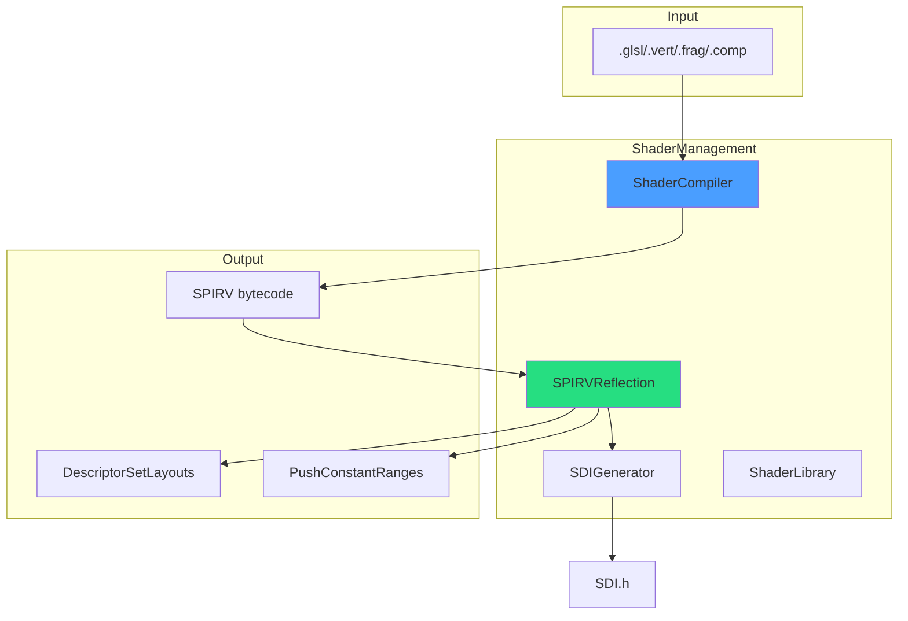
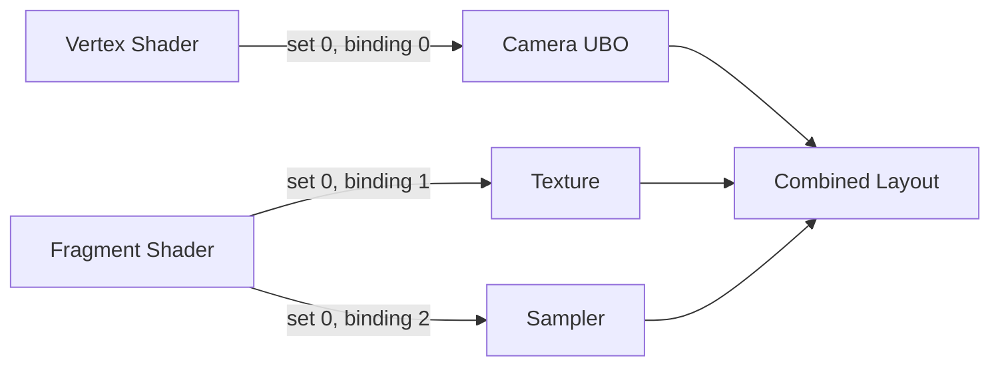
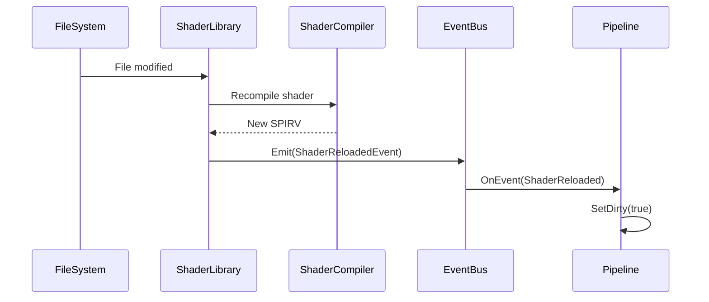

# ShaderManagement Library

Device-agnostic shader compilation, SPIRV reflection, and hot reload support. Provides automatic descriptor set layout generation from shader bindings.

---

## 1. Architecture



---

## 2. ShaderCompiler

Runtime GLSL to SPIRV compilation using shaderc.

```cpp
ShaderCompiler compiler;

// Compile shader
auto result = compiler.CompileGLSL(
    "shaders/VoxelRayMarch.comp",
    ShaderStage::Compute
);

if (result.success) {
    std::vector<uint32_t> spirv = result.spirv;
}
```

### 2.1 Compilation Options

| Option | Description |
|--------|-------------|
| `optimization` | None, Size, Performance |
| `generateDebugInfo` | Include source for debugging |
| `includeDirectories` | Search paths for #include |
| `defines` | Preprocessor definitions |

---

## 3. SPIRVReflection

Extract binding information from compiled SPIRV.

```cpp
SPIRVReflection reflection(spirvBytecode);

// Get descriptor bindings
auto bindings = reflection.GetDescriptorBindings();
for (const auto& binding : bindings) {
    // binding.set, binding.binding, binding.type, binding.count
}

// Get push constants
auto pushConstants = reflection.GetPushConstantRanges();

// Get input/output attributes
auto inputs = reflection.GetVertexInputAttributes();
auto outputs = reflection.GetFragmentOutputs();
```

### 3.1 Descriptor Types

| Type | GLSL Declaration |
|------|------------------|
| `UNIFORM_BUFFER` | `layout(binding=N) uniform {...}` |
| `STORAGE_BUFFER` | `layout(binding=N) buffer {...}` |
| `STORAGE_IMAGE` | `layout(binding=N) image2D` |
| `SAMPLED_IMAGE` | `layout(binding=N) sampler2D` |
| `SAMPLER` | `layout(binding=N) sampler` |

---

## 4. Auto-Descriptor Generation

Automatically create VkDescriptorSetLayout from shader reflection.

```cpp
// From reflection
auto layouts = reflection.CreateDescriptorSetLayouts(device);

// Multiple shaders combined
std::vector<SPIRVReflection*> shaders = {&vertReflection, &fragReflection};
auto combinedLayout = SPIRVReflection::CombineLayouts(device, shaders);
```

### 4.1 Layout Merging



---

## 5. SDI (Shader Descriptor Interface) Generator

Generates C++ headers for type-safe descriptor access.

```cpp
// From shader:
// layout(set = 0, binding = 0) uniform CameraUBO { mat4 view; mat4 proj; };
// layout(set = 0, binding = 1) uniform sampler2D diffuseTexture;

// Generated SDI.h:
struct CameraUBO {
    glm::mat4 view;
    glm::mat4 proj;
};

namespace SDI {
    constexpr uint32_t CAMERA_UBO_SET = 0;
    constexpr uint32_t CAMERA_UBO_BINDING = 0;
    constexpr uint32_t DIFFUSE_TEXTURE_SET = 0;
    constexpr uint32_t DIFFUSE_TEXTURE_BINDING = 1;
}
```

---

## 6. Hot Reload

Monitor shader files and recompile on change.

```cpp
ShaderLibrary library;
library.EnableHotReload(true);

// Register shader
library.LoadShader("VoxelRayMarch", "shaders/VoxelRayMarch.comp");

// Check for changes (call each frame or periodically)
if (library.CheckAndReload()) {
    // Shader changed, rebuild pipeline
    InvalidatePipeline();
}
```

### 6.1 Reload Flow



---

## 7. Code References

| File | Purpose |
|------|---------|
| `libraries/ShaderManagement/include/ShaderCompiler.h` | GLSL compilation |
| `libraries/ShaderManagement/include/SPIRVReflection.h` | Reflection API |
| `libraries/ShaderManagement/include/SDIGenerator.h` | Header generation |
| `libraries/ShaderManagement/include/ShaderLibrary.h` | Hot reload support |
| `documentation/ShaderManagement/` | Detailed documentation |

---

## 8. Related Pages

- [[Libraries-Overview]] - Library index
- [[../02-Implementation/Shaders|Shaders]] - Shader implementation
- [[CashSystem-Library]] - ShaderModuleCacher integration
- [[RenderGraph-System]] - ShaderLibraryNode
