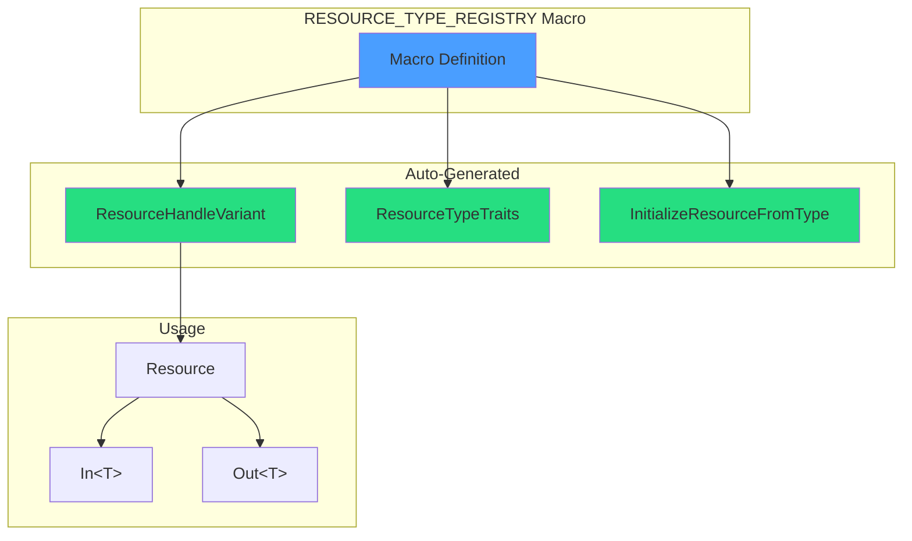
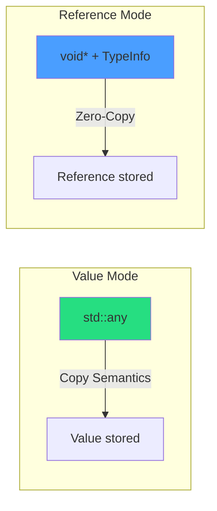

# Type System

VIXEN uses a compile-time type system based on `std::variant` with macro-generated registration. This eliminates runtime type errors and manual type-punning.

---

## 1. Resource Variant Architecture



---

## 2. Type Registration

### 2.1 Single-Source Registry

```cpp
// ResourceVariant.h - Single source of truth
#define RESOURCE_TYPE_REGISTRY(X) \
    X(VkImage, ImageDescriptor) \
    X(VkBuffer, BufferDescriptor) \
    X(VkImageView, HandleDescriptor) \
    X(VkFramebuffer, HandleDescriptor) \
    X(VkPipeline, HandleDescriptor) \
    X(VkPipelineLayout, HandleDescriptor) \
    X(VkDescriptorSet, HandleDescriptor) \
    X(VkRenderPass, HandleDescriptor) \
    X(VkCommandBuffer, HandleDescriptor) \
    X(VkSemaphore, HandleDescriptor) \
    X(VkFence, HandleDescriptor) \
    X(VkSampler, HandleDescriptor) \
    X(VkDevice, HandleDescriptor) \
    X(VkPhysicalDevice, HandleDescriptor) \
    X(VkQueue, HandleDescriptor) \
    X(VkSwapchainKHR, HandleDescriptor) \
    X(uint32_t, ScalarDescriptor) \
    X(float, ScalarDescriptor) \
    X(bool, ScalarDescriptor) \
    X(glm::mat4, MatrixDescriptor) \
    X(std::vector<VkSemaphore>, VectorDescriptor) \
    X(std::vector<VkFence>, VectorDescriptor) \
    X(std::shared_ptr<ShaderDataBundle>, SharedPtrDescriptor) \
    // ... 29+ types total
```

### 2.2 Auto-Generated Types

```cpp
// ResourceHandleVariant - Generated from registry
using ResourceHandleVariant = std::variant<
    std::monostate,
    VkImage,
    VkBuffer,
    VkImageView,
    // ... all registered types
>;

// ResourceTypeTraits - Compile-time type info
template<typename T>
struct ResourceTypeTraits {
    using DescriptorType = /* from registry */;
    static constexpr bool is_registered = true;
};
```

---

## 3. Typed Node API

### 3.1 Slot Definition

```cpp
struct MyNodeConfig {
    // Input slots with compile-time types
    INPUT_SLOT(DEVICE, VkDevice, SlotMode::SINGLE);
    INPUT_SLOT(IMAGES, VkImageView, SlotMode::ARRAY);

    // Output slots
    OUTPUT_SLOT(RESULT, VkImage, SlotMode::SINGLE);

    static constexpr uint32_t INPUT_COUNT = 2;
    static constexpr uint32_t OUTPUT_COUNT = 1;
};
```

### 3.2 Type-Safe Access

```cpp
class MyNode : public TypedNode<MyNodeConfig> {
    void Compile() override {
        // Compile-time type check
        VkDevice device = In(MyNodeConfig::DEVICE);

        // Array access with index
        for (size_t i = 0; i < imageCount; ++i) {
            VkImageView view = In(MyNodeConfig::IMAGES, i);
        }

        // Type-safe output
        Out(MyNodeConfig::RESULT, resultImage);
    }
};
```

---

## 4. PassThroughStorage

### 4.1 Storage Modes



### 4.2 Mode Selection

| Type Category | Storage Mode | Reason |
|--------------|--------------|--------|
| Vulkan handles | Reference | Zero-copy, handle semantics |
| `shared_ptr<T>` | Value | Shared ownership |
| Scalars (int, float) | Value | Small, cheap to copy |
| Vectors | Reference | Large, avoid copies |

### 4.3 Perfect Forwarding

```cpp
template<typename T>
void SetResource(size_t slotIndex, T&& value) {
    PassThroughStorage storage;

    if constexpr (std::is_lvalue_reference_v<T>) {
        storage = PassThroughStorage::CreateReference(value);
    } else {
        storage = PassThroughStorage::CreateValue(std::forward<T>(value));
    }

    outputs[slotIndex][0] = std::move(storage);
}
```

---

## 5. shared_ptr Support

### 5.1 Registration

```cpp
// Type registration for shared_ptr
REGISTER_COMPILE_TIME_TYPE(std::shared_ptr<ShaderManagement::ShaderDataBundle>)
```

### 5.2 Usage Pattern

```cpp
// Before (Phase G - no-op deleter hack)
INPUT_SLOT(SHADER_DATA, ShaderDataBundle*, ...);
bundle = std::shared_ptr<ShaderDataBundle>(rawPtr, [](auto*){});

// After (Phase H - proper shared ownership)
INPUT_SLOT(SHADER_DATA, std::shared_ptr<ShaderDataBundle>, ...);
bundle = std::make_shared<ShaderDataBundle>(...);
```

---

## 6. Slot Type Compatibility

### 6.1 Compatibility Rules

```cpp
template<typename SourceType, typename DestType>
bool AreTypesCompatible() {
    // Direct match
    if constexpr (std::is_same_v<SourceType, DestType>)
        return true;

    // Reference unwrapping: const T& matches T
    if constexpr (IsConstReference<SourceType> && !IsConstReference<DestType>) {
        using Unwrapped = std::remove_cvref_t<SourceType>;
        return std::is_same_v<Unwrapped, DestType>;
    }

    // Vector element compatibility
    if constexpr (IsVector<SourceType> && IsVector<DestType>) {
        using SourceElem = typename SourceType::value_type;
        using DestElem = typename DestType::value_type;
        return std::is_same_v<std::remove_cvref_t<SourceElem>,
                              std::remove_cvref_t<DestElem>>;
    }

    return false;
}
```

### 6.2 Connection-Time Validation

Slot type compatibility is checked when nodes are connected, not at execution time.

---

## 7. Const-Correctness

### 7.1 Slot Annotations

```cpp
struct NodeConfig {
    AUTO_INPUT(SHADER_DATA_BUNDLE,
               const std::shared_ptr<ShaderDataBundle>&,  // const ref
               SlotNullability::Required,
               SlotRole::Dependency,
               SlotMutability::ReadOnly);  // Enforced read-only

    AUTO_OUTPUT(PIPELINE,
                VkPipeline,
                SlotNullability::Required,
                SlotRole::Dependency,
                SlotMutability::WriteOnly);  // Write access
}
```

### 7.2 Benefits

- Compiler optimizations (const enables caching, reordering)
- Intent clarity (ReadOnly slots are const)
- Type safety (prevents accidental mutation)
- ABI stability

---

## 8. Adding New Types

### 8.1 Step-by-Step

1. **Add to registry:**
```cpp
#define RESOURCE_TYPE_REGISTRY(X) \
    // ... existing types ...
    X(MyNewType, MyDescriptor)
```

2. **Everything auto-generates:**
   - `ResourceHandleVariant` includes new type
   - `ResourceTypeTraits<MyNewType>` specialization created
   - `InitializeResourceFromType()` handles new type

3. **Use in node config:**
```cpp
INPUT_SLOT(MY_SLOT, MyNewType, SlotMode::SINGLE);
```

---

## 9. Code References

| Component | Location |
|-----------|----------|
| ResourceVariant | `libraries/RenderGraph/include/Core/ResourceVariant.h` |
| PassThroughStorage | `libraries/RenderGraph/include/Data/Core/CompileTimeResourceSystem.h` |
| TypedNodeInstance | `libraries/RenderGraph/include/Core/TypedNodeInstance.h` |
| TypedConnection | `libraries/RenderGraph/include/Core/TypedConnection.h` |
| ResourceConfig | `libraries/RenderGraph/include/Data/Core/ResourceConfig.h` |

---

## 10. Related Pages

- [[Overview]] - Architecture overview
- [[RenderGraph-System]] - Node system details
- [[../04-Development/Coding-Standards|Coding Standards]] - C++23 guidelines
