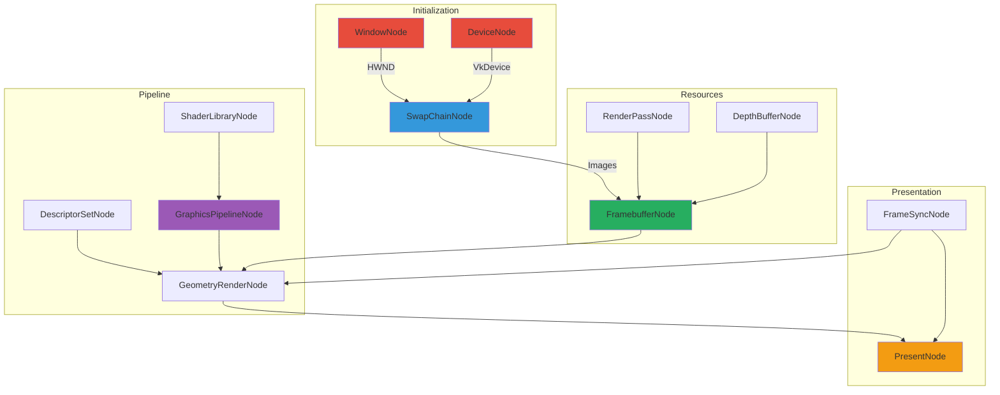
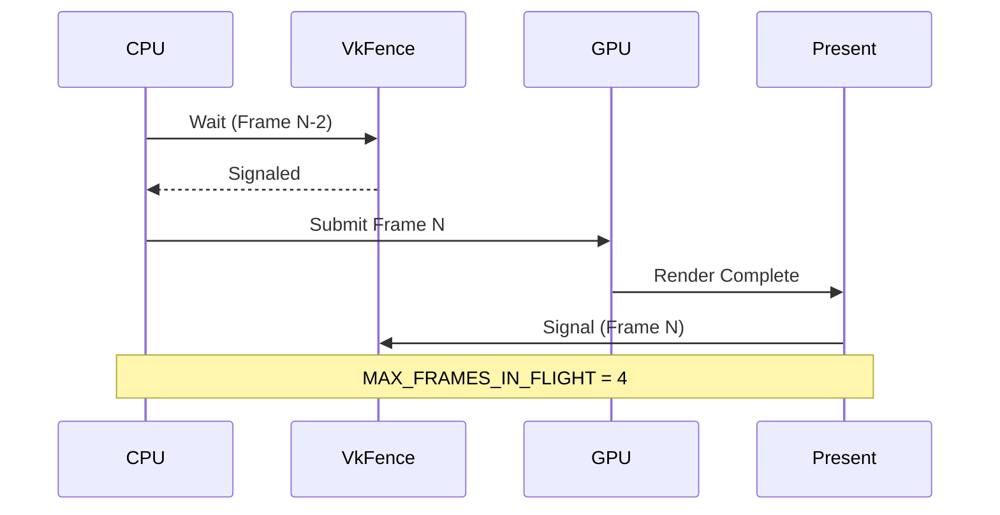
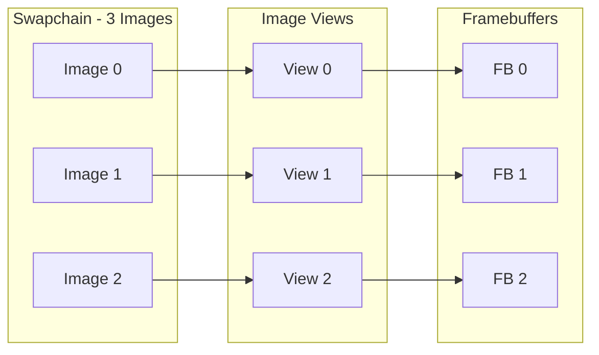
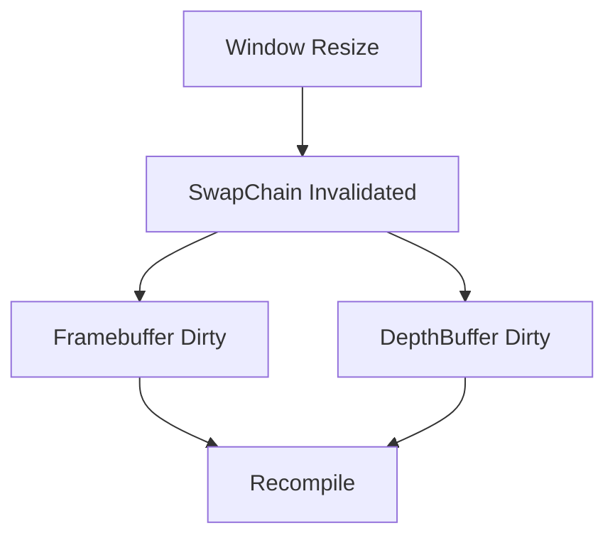
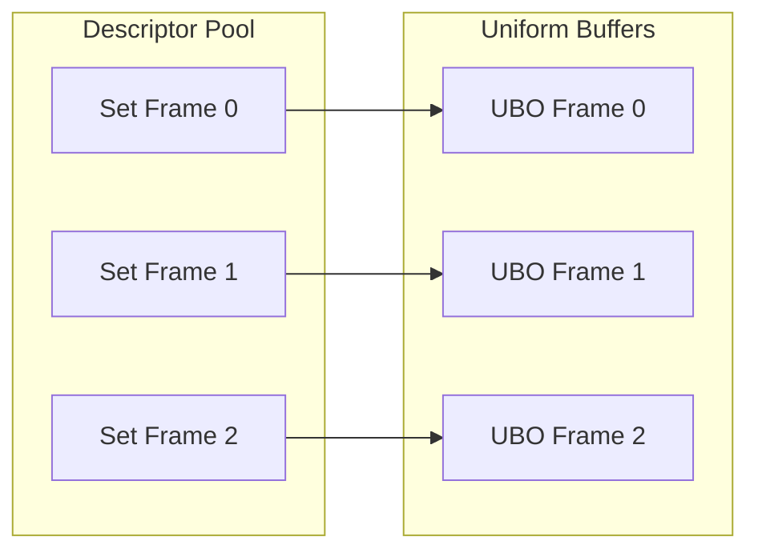

# Vulkan Pipeline Architecture

VIXEN's Vulkan integration follows a node-based approach where each Vulkan operation is encapsulated in a graph node.

---

## 1. Render Pipeline Flow



---

## 2. Frame-in-Flight Synchronization



### 2.1 Two-Tier Synchronization

| Type | Purpose | Indexing |
|------|---------|----------|
| **Fences** | CPU-GPU sync | Per-flight (4) |
| **imageAvailable Semaphores** | Acquire sync | Per-flight (4) |
| **renderComplete Semaphores** | Present sync | Per-image (3) |

---

## 3. Swapchain Management



### 3.1 Swapchain Invalidation



---

## 4. Descriptor Set Management

### 4.1 Descriptor Layout

```cpp
// Auto-generated from SPIRV reflection
VkDescriptorSetLayoutBinding bindings[] = {
    {0, VK_DESCRIPTOR_TYPE_UNIFORM_BUFFER, 1, VK_SHADER_STAGE_VERTEX_BIT},
    {1, VK_DESCRIPTOR_TYPE_COMBINED_IMAGE_SAMPLER, 1, VK_SHADER_STAGE_FRAGMENT_BIT}
};
```

### 4.2 Per-Frame Descriptor Sets



---

## 5. Pipeline Creation

### 5.1 Graphics Pipeline

```cpp
// Data-driven pipeline creation from SPIRV reflection
void GraphicsPipelineNode::CompileImpl() {
    auto shaderBundle = In(SHADER_DATA_BUNDLE);

    // Auto-extract vertex format from reflection
    auto vertexInputs = BuildVertexInputsFromReflection(shaderBundle);

    // Auto-create descriptor layout if not provided
    if (!In(DESCRIPTOR_SET_LAYOUT)) {
        descriptorSetLayout = DescriptorSetLayoutCacher::GetOrCreate(
            device, shaderBundle);
    }

    // Create pipeline via cacher
    VkPipeline pipeline = PipelineCacher::GetOrCreate(device, params);

    Out(PIPELINE, pipeline);
    Out(PIPELINE_LAYOUT, pipelineLayout);
}
```

### 5.2 Compute Pipeline

```cpp
void ComputePipelineNode::CompileImpl() {
    auto shaderBundle = In(SHADER_DATA_BUNDLE);

    // Similar pattern - auto descriptor layout, cached pipeline
    VkPipeline pipeline = ComputePipelineCacher::GetOrCreate(device, params);

    Out(PIPELINE, pipeline);
}
```

---

## 6. Push Constants

### 6.1 Camera Data (64 bytes)

```glsl
layout(push_constant) uniform PushConstants {
    vec3 cameraPos;     // 0
    float time;         // 12
    vec3 cameraDir;     // 16
    float fov;          // 28
    vec3 cameraUp;      // 32
    float aspect;       // 44
    vec3 cameraRight;   // 48
    int debugMode;      // 60
};
```

### 6.2 Push Constant Wiring

```cpp
// In GeometryRenderNode::Execute()
vkCmdPushConstants(
    commandBuffer,
    pipelineLayout,
    VK_SHADER_STAGE_FRAGMENT_BIT,
    0,
    sizeof(PushConstantData),
    &pushConstantData
);
```

---

## 7. GPU Timing

### 7.1 Timestamp Query

```cpp
class GPUTimestampQuery {
    VkQueryPool timestampPool_;
    float timestampPeriod_;  // Nanoseconds per tick

public:
    void WriteTimestamp(VkCommandBuffer cmd, VkPipelineStageFlagBits stage, uint32_t query);
    std::optional<double> GetElapsedMs(VkDevice device, uint32_t start, uint32_t end);
    double CalculateMraysPerSec(double elapsedMs, uint32_t width, uint32_t height);
};
```

### 7.2 Performance Logging

```cpp
class GPUPerformanceLogger {
    std::array<double, 60> dispatchTimes_;  // Rolling window
    std::array<double, 60> mraysPerSec_;

public:
    void RecordFrame(double dispatchMs, double mrays);
    void MaybeLog(uint32_t frameNumber);  // Every 120 frames
};
```

---

## 8. Memory Management

### 8.1 Buffer Types

| Type | Usage | Flags |
|------|-------|-------|
| Staging | CPU-visible upload | HOST_VISIBLE, HOST_COHERENT |
| Device | GPU-only access | DEVICE_LOCAL |
| Uniform | Small, frequent updates | HOST_VISIBLE |
| Storage | Large read/write | DEVICE_LOCAL |

### 8.2 Image Formats

| Usage | Format |
|-------|--------|
| Color Attachment | VK_FORMAT_B8G8R8A8_SRGB |
| Depth Attachment | VK_FORMAT_D32_SFLOAT |
| Storage Image | VK_FORMAT_R8G8B8A8_UNORM |
| DXT Compressed | VK_FORMAT_BC1_RGB_UNORM_BLOCK |

---

## 9. Code References

| Component | Location |
|-----------|----------|
| SwapChainNode | `libraries/RenderGraph/src/Nodes/SwapChainNode.cpp` |
| FramebufferNode | `libraries/RenderGraph/src/Nodes/FramebufferNode.cpp` |
| GraphicsPipelineNode | `libraries/RenderGraph/src/Nodes/GraphicsPipelineNode.cpp` |
| DescriptorSetNode | `libraries/RenderGraph/src/Nodes/DescriptorSetNode.cpp` |
| GPUTimestampQuery | `libraries/VulkanResources/include/GPUTimestampQuery.h` |
| FrameSyncNode | `libraries/RenderGraph/src/Nodes/FrameSyncNode.cpp` |

---

## 10. Related Pages

- [[Overview]] - Architecture overview
- [[RenderGraph-System]] - Graph system details
- [[../02-Implementation/Shaders|Shaders]] - Shader documentation
- [[../04-Development/Profiling|Profiling]] - Performance measurement
