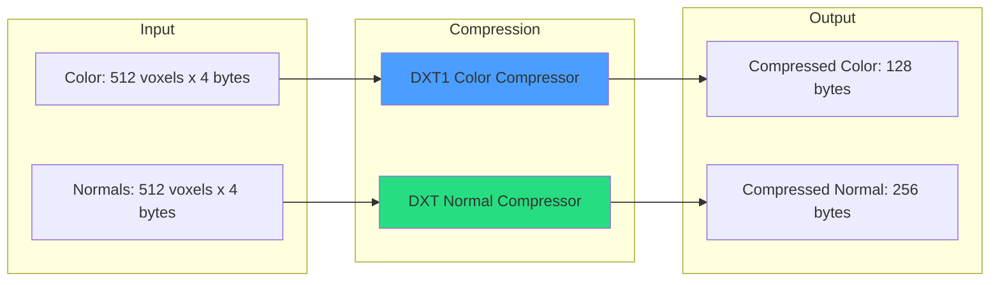

# DXT Compression

Block-based texture compression for voxel data achieving 5.3:1 memory reduction.

---

## 1. Compression Overview



---

## 2. Memory Savings

| Buffer | Uncompressed | Compressed | Ratio |
|--------|--------------|------------|-------|
| OctreeNodes | 12.51 KB | 12.51 KB | 1:1 |
| Colors | 2.51 MB | 314 KB | 8:1 |
| Normals | 2.51 MB | 628 KB | 4:1 |
| Materials | 0.66 KB | 0.66 KB | 1:1 |
| **Total** | **~5 MB** | **~955 KB** | **5.3:1** |

---

## 3. DXT1 Color Compression

### 3.1 Block Format

Each DXT1 block encodes a 4x4 pixel tile in 8 bytes:

```
+-------+-------+-------------------+
| color0| color1|  indices (4 bytes)|
| 2 bytes| 2 bytes|  2 bits x 16 pixels|
+-------+-------+-------------------+
```

### 3.2 Color Encoding (RGB565)

```cpp
uint16_t encodeRGB565(const glm::vec3& color) {
    uint8_t r = static_cast<uint8_t>(color.r * 31.0f);  // 5 bits
    uint8_t g = static_cast<uint8_t>(color.g * 63.0f);  // 6 bits
    uint8_t b = static_cast<uint8_t>(color.b * 31.0f);  // 5 bits
    return (r << 11) | (g << 5) | b;
}
```

### 3.3 Palette Generation

```cpp
// 4-color palette from 2 endpoints
vec3 palette[4];
palette[0] = color0;
palette[3] = color1;
palette[1] = (2.0 * color0 + color1) / 3.0;
palette[2] = (color0 + 2.0 * color1) / 3.0;

// Each pixel gets 2-bit index into palette
```

### 3.4 GLSL Decompression

```glsl
vec4 decompressDXT1(uvec2 block, int pixelIndex) {
    // Extract endpoints
    uint c0 = block.x & 0xFFFF;
    uint c1 = (block.x >> 16) & 0xFFFF;

    // Decode RGB565
    vec3 color0 = decodeRGB565(c0);
    vec3 color1 = decodeRGB565(c1);

    // Get 2-bit index for this pixel
    int indexOffset = pixelIndex * 2;
    uint indices = block.y;
    uint index = (indices >> indexOffset) & 0x3;

    // Interpolate
    if (index == 0) return vec4(color0, 1.0);
    if (index == 1) return vec4(color1, 1.0);
    if (index == 2) return vec4(mix(color0, color1, 1.0/3.0), 1.0);
    return vec4(mix(color0, color1, 2.0/3.0), 1.0);
}
```

---

## 4. DXT Normal Compression

### 4.1 Block Format (BC5/ATI2)

Two channels (X, Y) encoded separately, Z reconstructed:

```
+----------+----------+
| X channel| Y channel|
| 8 bytes  | 8 bytes  |
+----------+----------+
```

Each channel:
```
+-----+-----+------------------+
| val0| val1| indices (6 bytes)|
| 1 byte| 1 byte| 3 bits x 16 pixels|
+-----+-----+------------------+
```

### 4.2 Normal Reconstruction

```glsl
vec3 decompressDXTNormal(uvec4 block, int pixelIndex) {
    // Decompress X and Y channels
    float x = decompressChannel(block.xy, pixelIndex);
    float y = decompressChannel(block.zw, pixelIndex);

    // Reconstruct Z from unit normal constraint
    float z = sqrt(max(0.0, 1.0 - x*x - y*y));

    return normalize(vec3(x, y, z));
}

float decompressChannel(uvec2 data, int pixelIndex) {
    uint val0 = data.x & 0xFF;
    uint val1 = (data.x >> 8) & 0xFF;

    // Get 3-bit index
    int bitOffset = pixelIndex * 3;
    uint indices = data.y | ((data.x >> 16) << 16);
    uint index = (indices >> bitOffset) & 0x7;

    // 8-level interpolation
    float t = float(index) / 7.0;
    return mix(float(val0) / 255.0, float(val1) / 255.0, t) * 2.0 - 1.0;
}
```

---

## 5. Block Layout for Voxels

### 5.1 3D to Block Mapping

```cpp
// 8x8x8 brick = 512 voxels = 32 blocks (4x4x4 each)
int getBlockIndex(ivec3 voxelPos) {
    ivec3 blockPos = voxelPos / 4;
    return blockPos.x + blockPos.y * 2 + blockPos.z * 4;
}

int getLocalIndex(ivec3 voxelPos) {
    ivec3 localPos = voxelPos % 4;
    return localPos.x + localPos.y * 4 + localPos.z * 16;
}
```

### 5.2 Buffer Organization

```cpp
// Per brick: 32 color blocks + 32 normal blocks
struct CompressedBrick {
    DXT1Block colorBlocks[32];    // 32 * 8 = 256 bytes
    BC5Block normalBlocks[32];    // 32 * 16 = 512 bytes
};
```

---

## 6. Compressor Interface

### 6.1 Abstract Interface

```cpp
class BlockCompressor {
public:
    virtual ~BlockCompressor() = default;

    // Compression
    virtual void CompressBlock(const void* input, size_t inputSize,
                               void* output, size_t outputSize) = 0;

    // Decompression (CPU-side verification)
    virtual void DecompressBlock(const void* input, size_t inputSize,
                                  void* output, size_t outputSize) = 0;

    // Block parameters
    virtual size_t GetBlockInputSize() const = 0;
    virtual size_t GetBlockOutputSize() const = 0;
    virtual size_t GetPixelsPerBlock() const = 0;
};
```

### 6.2 DXT1 Implementation

```cpp
class DXT1ColorCompressor : public BlockCompressor {
public:
    void CompressBlock(const void* input, size_t inputSize,
                       void* output, size_t outputSize) override {
        const glm::vec3* colors = static_cast<const glm::vec3*>(input);

        // Find min/max colors (endpoints)
        glm::vec3 minColor = colors[0], maxColor = colors[0];
        for (int i = 1; i < 16; i++) {
            minColor = glm::min(minColor, colors[i]);
            maxColor = glm::max(maxColor, colors[i]);
        }

        // Encode endpoints
        uint16_t c0 = encodeRGB565(maxColor);
        uint16_t c1 = encodeRGB565(minColor);

        // Generate indices
        uint32_t indices = 0;
        for (int i = 0; i < 16; i++) {
            int best = findClosestPaletteIndex(colors[i], c0, c1);
            indices |= (best << (i * 2));
        }

        // Write output
        DXT1Block* block = static_cast<DXT1Block*>(output);
        block->color0 = c0;
        block->color1 = c1;
        block->indices = indices;
    }

    size_t GetBlockInputSize() const override { return 16 * 12; }  // 16 vec3
    size_t GetBlockOutputSize() const override { return 8; }
    size_t GetPixelsPerBlock() const override { return 16; }
};
```

---

## 7. GPU Buffer Bindings

### 7.1 Compressed Shader Bindings

| Binding | Type | Content |
|---------|------|---------|
| 0 | Storage Image | Output image |
| 1 | SSBO | esvoNodes |
| 2 | SSBO | brickOccupancy (bit masks) |
| 3 | SSBO | materials |
| 4 | SSBO | traceWriteIndex |
| 5 | UBO | octreeConfig |
| 6 | SSBO | compressedColors (DXT1) |
| 7 | SSBO | compressedNormals (BC5) |

### 7.2 GLSL Buffer Declarations

```glsl
layout(std430, binding = 6) readonly buffer CompressedColorBuffer {
    uvec2 compressedColors[];  // DXT1: 8 bytes per block
};

layout(std430, binding = 7) readonly buffer CompressedNormalBuffer {
    uvec4 compressedNormals[];  // BC5: 16 bytes per block
};
```

---

## 8. Quality Considerations

### 8.1 DXT1 Artifacts

| Issue | Mitigation |
|-------|------------|
| Banding in gradients | 4-color palette limitation |
| Block boundaries visible | Acceptable for voxels |
| No alpha support | Occupancy stored separately |

### 8.2 Normal Precision

| Bits | Precision | Angular Error |
|------|-----------|---------------|
| 8 per channel | 1/255 | ~0.4 degrees |
| Z reconstruction | sqrt | Accumulates error |

---

## 9. Test Coverage

```cpp
TEST(DXT1Compressor, RoundTrip) {
    DXT1ColorCompressor compressor;

    glm::vec3 input[16] = { /* test colors */ };
    DXT1Block compressed;
    glm::vec3 output[16];

    compressor.CompressBlock(input, sizeof(input),
                              &compressed, sizeof(compressed));
    compressor.DecompressBlock(&compressed, sizeof(compressed),
                                output, sizeof(output));

    // Verify within tolerance
    for (int i = 0; i < 16; i++) {
        EXPECT_NEAR(output[i].r, input[i].r, 0.05f);
    }
}
```

**Test Suite:** 12 tests in `libraries/VoxelData/tests/test_block_compressor.cpp`

---

## 10. Code References

| Component | Location |
|-----------|----------|
| BlockCompressor | `libraries/VoxelData/include/Compression/BlockCompressor.h` |
| DXT1Compressor | `libraries/VoxelData/src/Compression/DXT1Compressor.cpp` |
| Compression.glsl | `shaders/Compression.glsl` |
| Compressed Shader | `shaders/VoxelRayMarch_Compressed.comp` |
| Unit Tests | `libraries/VoxelData/tests/test_block_compressor.cpp` |

---

## 11. Related Pages

- [[SVO-System]] - Octree that uses compression
- [[Ray-Marching]] - GPU traversal with decompression
- [[../04-Development/Profiling|Profiling]] - Memory usage measurement
