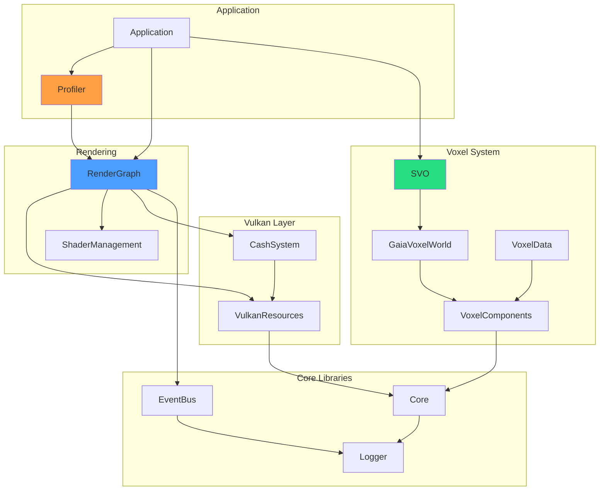

# Implementation Overview

Detailed implementation guides for VIXEN's core systems. Each section includes code references, algorithm explanations, and integration patterns.

---

## 1. Library Structure



---

## 2. Key Systems

### [[SVO-System|Sparse Voxel Octree (SVO)]]
ESVO-based octree with entity-backed storage and GPU ray marching.

**Performance:** 1,700 Mrays/sec

**Key Components:**
- LaineKarrasOctree - ESVO traversal
- EntityBrickView - Zero-storage bricks
- GaiaVoxelWorld - ECS storage backend

### [[Ray-Marching|Ray Marching]]
GPU ray traversal using compute and fragment shaders.

**Variants:**
| Pipeline | Uncompressed | Compressed |
|----------|--------------|------------|
| Compute | VoxelRayMarch.comp | VoxelRayMarch_Compressed.comp |
| Fragment | VoxelRayMarch.frag | VoxelRayMarch_Compressed.frag |

### [[Compression|DXT Compression]]
5.3:1 memory reduction using block compression.

**Components:**
- DXT1ColorCompressor - 24:1 color (8 bytes/16 voxels)
- DXTNormalCompressor - 12:1 normal (16 bytes/16 voxels)
- Compression.glsl - GPU decompression

### [[Shaders|Shader System]]
SPIRV reflection, auto-descriptor generation, hot reload support.

**Features:**
- Runtime GLSL compilation
- SDI header generation
- Push constant automation

---

## 3. File Organization

```
libraries/
├── Core/                 # Morton encoding, utilities
├── Logger/               # ILoggable, LOG_* macros
├── EventBus/             # Message queue system
├── VulkanResources/      # VkDevice wrappers, GPU timing
├── CashSystem/           # Pipeline/shader caching
├── ShaderManagement/     # SPIRV reflection, compilation
├── RenderGraph/          # Node system, graph execution
│   ├── include/
│   │   ├── Core/         # TypedNode, RenderGraph
│   │   ├── Data/         # Configs, ResourceVariant
│   │   └── Nodes/        # Node implementations
│   └── src/
│       ├── Core/         # Graph logic
│       └── Nodes/        # Node CPP files
├── VoxelComponents/      # Density, Color, Normal
├── GaiaVoxelWorld/       # ECS voxel storage
├── VoxelData/            # Compression, grid data
├── SVO/                  # Octree, ray casting
└── Profiler/             # Benchmarking system
```

---

## 4. Implementation Status

| System | Status | Tests | Notes |
|--------|--------|-------|-------|
| RenderGraph | Production | 116 | Zero validation errors |
| SVO | Production | 217 | ESVO complete |
| Compression | Production | 12 | DXT1/DXTn working |
| Shaders | Production | - | 4 variants complete |
| Profiler | Production | 131 | JSON/CSV export |
| Hardware RT | Stub | - | Phase K target |

---

## 5. Code Style Patterns

### 5.1 Node Implementation Pattern

```cpp
class MyNode : public TypedNode<MyNodeConfig> {
public:
    void SetupImpl(Context& ctx) override {
        // Subscribe to events
        eventBus->Subscribe(EventType::MyEvent, this);
    }

    void CompileImpl(Context& ctx) override {
        // Read inputs
        auto input = In(MyNodeConfig::INPUT_SLOT);

        // Create Vulkan resources
        CreateMyResources();

        // Write outputs
        Out(MyNodeConfig::OUTPUT_SLOT, result);
    }

    void ExecuteImpl(Context& ctx) override {
        // Record commands (or no-op)
        vkCmdDraw(...);
    }

    void CleanupImpl(Context& ctx) override {
        // Destroy resources (reverse of Compile)
        DestroyMyResources();
    }
};
```

### 5.2 Zero-Storage Pattern

```cpp
// Instead of storing data
class EntityBrickView {
    GaiaVoxelWorld* world;      // 8 bytes
    uint64_t baseMortonKey;     // 8 bytes
    // Total: 16 bytes

    bool hasVoxel(int x, int y, int z) const {
        return world->hasEntity(baseMortonKey + morton(x,y,z));
    }
};
```

### 5.3 Perfect Forwarding Pattern

```cpp
template<typename T>
void Out(SlotType slot, T&& value) {
    if constexpr (std::is_lvalue_reference_v<T>) {
        SetResource(slot, PassThroughStorage::CreateReference(value));
    } else {
        SetResource(slot, PassThroughStorage::CreateValue(std::forward<T>(value)));
    }
}
```

---

## 6. Quick Links

| Topic | Page |
|-------|------|
| SVO Algorithm | [[SVO-System]] |
| Voxel Storage | [[GaiaVoxelWorld-Library]] |
| Voxel Components | [[VoxelComponents-Library]] |
| Compression | [[VoxelData-Library]] |
| ECS Archetypes | [[GaiaArchetypes-Library]] |
| Ray Marching | [[Ray-Marching]] |
| DXT Compression | [[Compression]] |
| Shader Integration | [[Shaders]] |
| GPU Profiling | [[../04-Development/Profiling]] |
| Testing | [[../04-Development/Testing]] |

---

## 7. Source References

| Library | Key File | Purpose |
|---------|----------|---------|
| SVO | `libraries/SVO/src/LaineKarrasOctree.cpp` | ESVO traversal |
| RenderGraph | `libraries/RenderGraph/src/Core/RenderGraph.cpp` | Graph orchestrator |
| Shaders | `shaders/VoxelRayMarch.comp` | GPU ray marching |
| Profiler | `libraries/Profiler/src/BenchmarkRunner.cpp` | Test harness |
