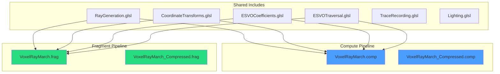

# Ray Marching Implementation

GPU-accelerated ray traversal through the sparse voxel octree. Supports both compute and fragment shader pipelines.

---

## 1. Pipeline Variants



---

## 2. Performance Results

| Variant | Dispatch Time | Throughput | Memory |
|---------|---------------|------------|--------|
| Compute (uncompressed) | 0.27-0.34 ms | 1,400-1,750 Mrays/sec | ~5 MB |
| Compute (compressed) | Variable | 85-303 Mrays/sec | ~955 KB |
| Fragment (uncompressed) | Similar | Similar | ~5 MB |
| Fragment (compressed) | Similar | Similar | ~955 KB |

**Target exceeded:** 8.5x above 200 Mrays/sec goal

---

## 3. Shader Structure

### 3.1 Shared Include Files

| File | Size | Content |
|------|------|---------|
| RayGeneration.glsl | 3.8KB | `getRayDir()`, `rayAABBIntersection()` |
| CoordinateTransforms.glsl | 5.7KB | ESVO/grid/brick space conversions |
| ESVOCoefficients.glsl | 4.2KB | `RayCoefficients` struct, init |
| ESVOTraversal.glsl | 16.3KB | PUSH/ADVANCE/POP phases |
| TraceRecording.glsl | 8.1KB | Debug capture infrastructure |
| Lighting.glsl | 1.8KB | `computeLighting()` |

### 3.2 Size Reduction

After refactoring to shared includes:
- VoxelRayMarch.comp: 80KB -> 20KB (**75% smaller**)
- VoxelRayMarch_Compressed.comp: 56KB -> 22KB (**60% smaller**)

---

## 4. Ray Generation

### 4.1 Compute Shader Entry

```glsl
layout(local_size_x = 8, local_size_y = 8) in;

void main() {
    ivec2 pixelCoords = ivec2(gl_GlobalInvocationID.xy);

    // Generate ray from camera
    vec3 rayDir = getRayDir(pixelCoords, pushConstants.cameraPos,
                            pushConstants.cameraDir, pushConstants.cameraUp,
                            pushConstants.cameraRight, pushConstants.fov,
                            pushConstants.aspect);

    // Traverse octree
    vec4 color = traverseOctree(pushConstants.cameraPos, rayDir);

    // Write output
    imageStore(outputImage, pixelCoords, color);
}
```

### 4.2 Fragment Shader Entry

```glsl
layout(location = 0) in vec2 texCoord;
layout(location = 0) out vec4 outColor;

void main() {
    ivec2 pixelCoords = ivec2(gl_FragCoord.xy);

    vec3 rayDir = getRayDir(pixelCoords, ...);
    outColor = traverseOctree(cameraPos, rayDir);
}
```

---

## 5. ESVO Traversal

### 5.1 Main Loop

```glsl
vec4 traverseOctree(vec3 rayOrigin, vec3 rayDir) {
    // Initialize coefficients
    RayCoefficients coeffs = initRayCoefficients(rayOrigin, rayDir);
    TraversalState state = initTraversalState(coeffs);

    // Stack for depth traversal
    StackEntry stack[MAX_DEPTH];
    int stackPtr = 0;

    while (state.scale < 1.0) {  // Not at root
        // Find current octant
        int childIdx = computeChildIndex(state);

        if (isValidChild(state.descriptor, childIdx)) {
            if (isLeaf(state.descriptor, childIdx)) {
                // Brick traversal
                HitResult hit = traverseBrick(state, coeffs);
                if (hit.hit) {
                    return computeLighting(hit);
                }
            } else {
                // PUSH - descend into child
                stack[stackPtr++] = saveState(state);
                state = descendToChild(state, childIdx);
                continue;
            }
        }

        // ADVANCE - try next sibling
        AdvanceResult adv = executeAdvancePhase(state, coeffs);
        if (adv.shouldPop) {
            // POP - return to parent
            if (stackPtr == 0) break;
            state = stack[--stackPtr];
        } else {
            state = adv.newState;
        }
    }

    return backgroundColor;
}
```

### 5.2 Child Index Computation

```glsl
int computeChildIndex(TraversalState state) {
    // Position within current voxel determines octant
    vec3 localPos = (state.pos - state.voxelMin) / state.scale;

    int idx = 0;
    if (localPos.x >= 0.5) idx |= 1;
    if (localPos.y >= 0.5) idx |= 2;
    if (localPos.z >= 0.5) idx |= 4;

    // Apply octant mirroring for negative ray directions
    return idx ^ state.octant_mask;
}
```

---

## 6. Brick DDA (GPU)

### 6.1 Uncompressed Traversal

```glsl
HitResult marchBrickFromPos(vec3 rayOrigin, vec3 rayDir,
                            int brickIndex, float startT) {
    // Get brick data pointer
    uint baseOffset = brickIndex * VOXELS_PER_BRICK;

    // DDA initialization
    ivec3 step = ivec3(sign(rayDir));
    vec3 tDelta = abs(1.0 / rayDir);
    ivec3 current = getVoxelFromT(rayOrigin, rayDir, startT);
    vec3 tNext = computeNextBoundary(current, step, rayDir);

    // March through brick
    for (int i = 0; i < MAX_BRICK_STEPS; i++) {
        if (outOfBounds(current)) break;

        uint voxelIdx = baseOffset + morton3D(current);
        vec4 color = brickData[voxelIdx];

        if (color.a > 0.0) {
            return HitResult(true, computeHitPoint(current), color);
        }

        // Step to next voxel
        if (tNext.x < tNext.y && tNext.x < tNext.z) {
            current.x += step.x;
            tNext.x += tDelta.x;
        } else if (tNext.y < tNext.z) {
            current.y += step.y;
            tNext.y += tDelta.y;
        } else {
            current.z += step.z;
            tNext.z += tDelta.z;
        }
    }

    return HitResult(false);
}
```

### 6.2 Compressed Traversal

```glsl
HitResult marchBrickFromPosCompressed(vec3 rayOrigin, vec3 rayDir,
                                       int brickIndex, float startT) {
    // DXT blocks: 4x4x4 voxels per block
    uint colorBlockOffset = brickIndex * BLOCKS_PER_BRICK;
    uint normalBlockOffset = brickIndex * BLOCKS_PER_BRICK;

    // ... similar DDA loop ...

    if (hasVoxel(current)) {
        // Decompress color
        uint blockIdx = getBlockIndex(current);
        uint localIdx = getLocalIndex(current);
        vec4 color = decompressDXT1(compressedColors[colorBlockOffset + blockIdx],
                                     localIdx);
        vec3 normal = decompressDXTNormal(compressedNormals[normalBlockOffset + blockIdx],
                                           localIdx);
        return HitResult(true, hitPoint, color, normal);
    }
}
```

---

## 7. Push Constants

### 7.1 Layout (64 bytes)

```glsl
layout(push_constant) uniform PushConstants {
    vec3 cameraPos;     // offset 0
    float time;         // offset 12
    vec3 cameraDir;     // offset 16
    float fov;          // offset 28
    vec3 cameraUp;      // offset 32
    float aspect;       // offset 44
    vec3 cameraRight;   // offset 48
    int debugMode;      // offset 60
};
```

### 7.2 CPU Side

```cpp
struct PushConstantData {
    glm::vec3 cameraPos;
    float time;
    glm::vec3 cameraDir;
    float fov;
    glm::vec3 cameraUp;
    float aspect;
    glm::vec3 cameraRight;
    int32_t debugMode;
};

// In GeometryRenderNode or ComputeDispatchNode
vkCmdPushConstants(cmd, pipelineLayout,
                   VK_SHADER_STAGE_COMPUTE_BIT,
                   0, sizeof(PushConstantData), &data);
```

---

## 8. Debug Modes

| Mode | Value | Visualization |
|------|-------|---------------|
| Normal | 0 | Lit color |
| Normals | 1 | Surface normals as RGB |
| Depth | 2 | Distance from camera |
| Octree Level | 3 | Depth in hierarchy |
| Brick Index | 4 | Brick identification |
| Step Count | 5 | Ray march iterations |

---

## 9. Bug Fixes Applied

### 9.1 Week 2 Fixes (8 bugs)

| Bug | Fix |
|-----|-----|
| Missing brick-level leaf | Force `isLeaf=true` at brick scale |
| Yellow everywhere | Boundary offset in handleLeafHit |
| Grid pattern | Preserve sign in DDA invDir |
| Wrong ESVO scale | `getBrickESVOScale()` = 20 |
| POV-dependent stripes | Use octant center instead of corner |
| Interior wall gaps | Absolute t from rayOrigin |
| Offset direction inverted | Use world rayDir |
| Axis-parallel filtering | `computeCorrectedTcMax()` |

### 9.2 Week 3 Fixes (6 bugs in compressed shader)

| Bug | Fix |
|-----|-----|
| `executePopPhase` missing step_mask | Added parameter |
| `executePopPhase` wrong algorithm | IEEE 754 bit manipulation |
| `executePopPhase` wrong return | Changed to int |
| `executeAdvancePhase` inverted | Correct return values |
| `executeAdvancePhase` negative tc_max | `max(tc_max, 0.0)` |
| Cornell Box topology | Combined fixes |

---

## 10. Code References

| File | Purpose |
|------|---------|
| `shaders/VoxelRayMarch.comp` | Compute shader (uncompressed) |
| `shaders/VoxelRayMarch_Compressed.comp` | Compute shader (compressed) |
| `shaders/VoxelRayMarch.frag` | Fragment shader (uncompressed) |
| `shaders/VoxelRayMarch_Compressed.frag` | Fragment shader (compressed) |
| `shaders/RayGeneration.glsl` | Ray setup includes |
| `shaders/ESVOTraversal.glsl` | Traversal algorithm |
| `shaders/Lighting.glsl` | Shading calculations |

---

## 11. Related Pages

- [[SVO-System]] - Octree data structure
- [[Compression]] - DXT compression details
- [[Shaders]] - Shader system overview
- [[../03-Research/ESVO-Algorithm|ESVO Algorithm]] - Algorithm reference
