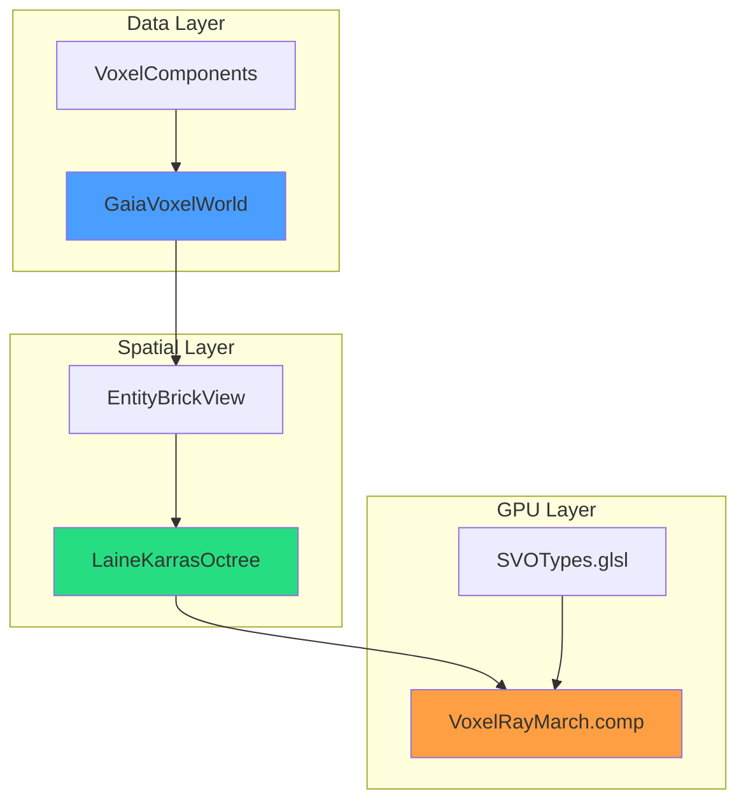
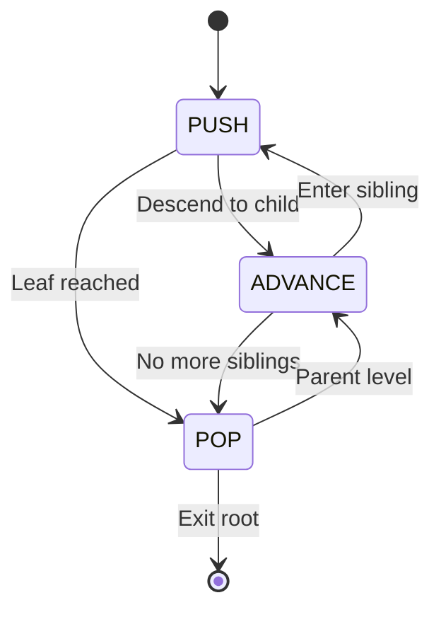
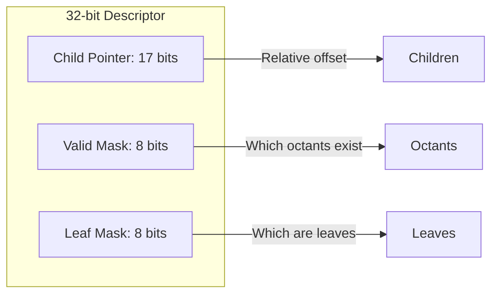

# SVO System

The Sparse Voxel Octree (SVO) system implements the ESVO algorithm (Laine & Karras 2010) with entity-backed storage via Gaia ECS.

---

## 1. Architecture



---

## 2. Component Hierarchy

### 2.1 VoxelComponents

Single source of truth for all voxel attributes.

```cpp
#define FOR_EACH_COMPONENT(MACRO) \
    MACRO(Density)                \
    MACRO(Color)                  \
    MACRO(Normal)                 \
    MACRO(Roughness)              \
    MACRO(Metallic)               \
    MACRO(Emissive)

// Auto-generates: ComponentVariant, AllComponents, ComponentTraits
```

**File:** `libraries/VoxelComponents/include/VoxelComponents.h`

### 2.2 GaiaVoxelWorld

ECS-backed sparse voxel storage with Morton code indexing.

```cpp
GaiaVoxelWorld world;

// Create voxel with components
world.createVoxel(VoxelCreationRequest{
    glm::vec3(2, 2, 2),
    {Density{1.0f}, Color{glm::vec3(1, 0, 0)}}
});

// Query by position
MortonKey key = MortonKey::fromPosition(glm::ivec3(2, 2, 2));
auto entity = world.getEntity(key);
auto color = world.getComponentValue<Color>(entity);
```

**Memory:** 11x reduction vs dense storage (sparse entities)

**File:** `libraries/GaiaVoxelWorld/src/GaiaVoxelWorld.cpp`

### 2.3 EntityBrickView

Zero-storage brick views (16 bytes vs 70 KB per brick).

```cpp
class EntityBrickView {
    GaiaVoxelWorld* world;      // 8 bytes
    uint64_t baseMortonKey;     // 8 bytes

public:
    bool hasVoxel(int x, int y, int z) const {
        uint64_t key = baseMortonKey + encodeMorton(x, y, z);
        return world->hasEntity(key);
    }

    template<typename T>
    std::optional<T> getComponent(int x, int y, int z) const {
        uint64_t key = baseMortonKey + encodeMorton(x, y, z);
        return world->getComponentValue<T>(key);
    }
};
```

**File:** `libraries/SVO/include/EntityBrickView.h`

### 2.4 LaineKarrasOctree

ESVO-based octree with brick DDA traversal.

```cpp
LaineKarrasOctree octree(world, maxLevels, brickDepth);
octree.rebuild(world, worldMin, worldMax);

auto hit = octree.castRay(origin, direction, tMin, tMax);
if (hit.hit) {
    glm::vec3 point = hit.hitPoint;
    auto color = world.getComponentValue<Color>(hit.entity);
}
```

**File:** `libraries/SVO/src/LaineKarrasOctree.cpp`

---

## 3. ESVO Traversal

### 3.1 State Machine



### 3.2 Key Data Structures

```cpp
struct ESVOTraversalState {
    float tx_coef, ty_coef, tz_coef;  // Parametric coefficients
    float tx_bias, ty_bias, tz_bias;  // Bias values
    int octant_mask;                   // Mirror mask for ray direction
    float scale;                       // Current voxel scale
    glm::vec3 pos;                     // Current position [1,2] space
};

struct CastStack {
    uint32_t node;         // Child descriptor
    float t_max;           // Exit t
    static constexpr int MAX_DEPTH = 23;
};
```

### 3.3 Algorithm Phases

| Phase | Description |
|-------|-------------|
| **PUSH** | Descend into child octant, refine voxel bounds |
| **ADVANCE** | Move to next sibling (increment octant index) |
| **POP** | Return to parent level when no more siblings |

**Reference:** [[../03-Research/ESVO-Algorithm|ESVO Algorithm Details]]

---

## 4. Brick DDA

3D Digital Differential Analyzer (Amanatides & Woo 1987) for brick traversal.

### 4.1 Algorithm

```cpp
bool traverseBrick(const EntityBrickView& brick,
                   const glm::vec3& rayOrigin,
                   const glm::vec3& rayDir,
                   float tMin, float tMax,
                   HitResult& outHit) {
    // Initialize DDA
    glm::ivec3 step = glm::sign(rayDir);
    glm::vec3 invDir = 1.0f / rayDir;
    glm::vec3 tDelta = glm::abs(invDir);

    // Current voxel
    glm::ivec3 current = getVoxelFromT(rayOrigin, rayDir, tMin);
    glm::vec3 tNext = computeNextBoundary(current, step, invDir);

    // March through brick
    while (inBounds(current)) {
        if (brick.hasVoxel(current.x, current.y, current.z)) {
            outHit = createHit(current, ...);
            return true;
        }

        // Step to next voxel
        int axis = minComponent(tNext);
        current[axis] += step[axis];
        tNext[axis] += tDelta[axis];
    }
    return false;
}
```

### 4.2 Axis-Parallel Ray Handling

```cpp
// Fix for rays parallel to axes (prevent NaN/inf)
float computeCorrectedTcMax(float tc_max, bool canStepX, bool canStepY, bool canStepZ) {
    if (!canStepX && !canStepY && !canStepZ) {
        return FLT_MAX;  // No valid step direction
    }
    return std::max(tc_max, 0.0f);
}
```

---

## 5. Child Descriptor Format



### 5.1 Bit Layout

| Field | Bits | Description |
|-------|------|-------------|
| Child Pointer | 0-16 | Relative offset to first child |
| Valid Mask | 17-24 | 8 bits, one per octant |
| Leaf Mask | 25-31 | 8 bits, leaf status per octant |

### 5.2 GLSL Accessors

```glsl
uint getChildPointer(uint descriptor) {
    return descriptor & 0x1FFFF;
}

uint getValidMask(uint descriptor) {
    return (descriptor >> 17) & 0xFF;
}

uint getLeafMask(uint descriptor) {
    return (descriptor >> 25) & 0x7F;
}

bool isValid(uint descriptor, int octant) {
    return (getValidMask(descriptor) & (1u << octant)) != 0u;
}

bool isLeaf(uint descriptor, int octant) {
    return (getLeafMask(descriptor) & (1u << octant)) != 0u;
}
```

---

## 6. Coordinate Spaces

### 6.1 Space Transformations

```mermaid
flowchart LR
    WS[World Space] --> NS[Normalized Space]
    NS --> ES[ESVO Space [1,2]]
    ES --> BS[Brick Space]
    BS --> VS[Voxel Space]
    class VC internal-link
    class GVW internal-link
```

### 6.2 Octant Mirroring

```cpp
// Ray direction mirroring for negative components
int octant_mask = 0;
if (rayDir.x < 0) { octant_mask |= 1; rayOrigin.x = 3.0f - rayOrigin.x; }
if (rayDir.y < 0) { octant_mask |= 2; rayOrigin.y = 3.0f - rayOrigin.y; }
if (rayDir.z < 0) { octant_mask |= 4; rayOrigin.z = 3.0f - rayOrigin.z; }

// Convert mirrored to local octant
int localOctant = mirroredIdx ^ ((~octant_mask) & 7);
```

---

## 7. GPU Buffer Layout

### 7.1 Descriptor Set 0

| Binding | Type | Content |
|---------|------|---------|
| 0 | Storage Image | Output image (RGBA8) |
| 1 | SSBO | esvoNodes (ChildDescriptors) |
| 2 | SSBO | brickData (colors/normals) |
| 3 | SSBO | materials |
| 4 | SSBO | traceWriteIndex (debug) |
| 5 | UBO | octreeConfig |

### 7.2 OctreeConfig UBO

```glsl
layout(binding = 5) uniform OctreeConfig {
    mat4 invViewMatrix;
    vec3 worldMin;
    float worldSize;
    ivec3 bricksPerAxis;
    int maxDepth;
    uint nodeCount;
    uint brickCount;
    float brickSize;
    int totalVoxels;
};
```

---

## 8. Build Process

### 8.1 rebuild() API

```cpp
void LaineKarrasOctree::rebuild(GaiaVoxelWorld& world,
                                 const glm::vec3& worldMin,
                                 const glm::vec3& worldMax) {
    // 1. Clear existing hierarchy
    blocks.clear();

    // 2. Calculate brick grid
    bricksPerAxis = calculateBricksPerAxis(worldMin, worldMax, brickDepth);

    // 3. Iterate Morton-ordered bricks
    for (uint64_t morton = 0; morton < totalBricks; ++morton) {
        EntityBrickView brick(world, morton, brickDepth);
        if (brick.isEmpty()) continue;

        // 4. Register in hierarchy
        registerBrickInHierarchy(morton, brick);
    }

    // 5. Build parent descriptors
    buildParentDescriptors();
}
```

### 8.2 Partial Updates

```cpp
// Thread-safe partial updates
octree.updateBlock(blockWorldMin, depth);
octree.removeBlock(blockWorldMin, depth);

// Concurrency control
octree.lockForRendering();
// ... GPU ray casting ...
octree.unlockAfterRendering();
```

---

## 9. Test Coverage

| Test Suite | Tests | Status |
|------------|-------|--------|
| test_octree_queries | 98 | Pass |
| test_entity_brick_view | 36 | Pass |
| test_ray_casting | 11 | Pass |
| test_rebuild_hierarchy | 4 | Pass |
| test_cornell_box | 7/9 | 2 precision issues |
| test_lod | 16 | Pass |
| **Total** | **217** | **98%** |

---

## 10. Code References

| Component | Location |
|-----------|----------|
| LaineKarrasOctree | `libraries/SVO/src/LaineKarrasOctree.cpp` |
| EntityBrickView | `libraries/SVO/include/EntityBrickView.h` |
| GaiaVoxelWorld | `libraries/GaiaVoxelWorld/src/GaiaVoxelWorld.cpp` |
| VoxelComponents | `libraries/VoxelComponents/include/VoxelComponents.h` |
| SVOTypes.glsl | `shaders/SVOTypes.glsl` |
| VoxelRayMarch.comp | `shaders/VoxelRayMarch.comp` |

---

## 11. Related Pages

- [[Ray-Marching]] - GPU ray traversal
- [[../03-Research/ESVO-Algorithm|ESVO Algorithm]] - Algorithm details
- [[Compression]] - DXT brick compression
