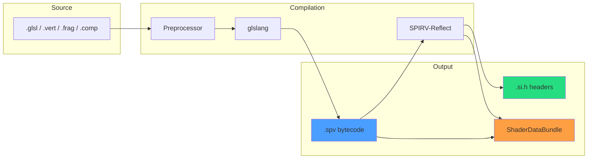
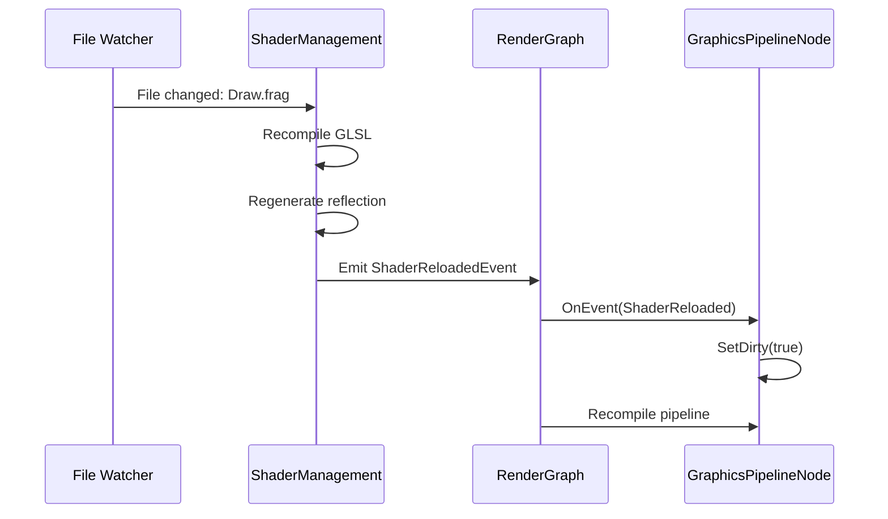

# Shader System

VIXEN's shader system provides runtime GLSL compilation, SPIRV reflection, and automatic descriptor set generation.

---

## 1. Shader Pipeline



---

## 2. Shader Organization

### 2.1 Directory Structure

```
shaders/
├── VoxelRayMarch.comp           # Compute ray marching
├── VoxelRayMarch_Compressed.comp # With DXT decompression
├── VoxelRayMarch.frag           # Fragment ray marching
├── VoxelRayMarch_Compressed.frag # Fragment + DXT
├── Draw.vert                     # Basic vertex shader
├── Draw.frag                     # Basic fragment shader
├── Fullscreen.vert              # Fullscreen triangle
│
├── RayGeneration.glsl           # Shared: ray setup
├── CoordinateTransforms.glsl    # Shared: space conversions
├── ESVOCoefficients.glsl        # Shared: ESVO init
├── ESVOTraversal.glsl           # Shared: PUSH/ADVANCE/POP
├── TraceRecording.glsl          # Shared: debug capture
├── Lighting.glsl                # Shared: shading
├── SVOTypes.glsl                # Shared: data structures
└── Compression.glsl             # Shared: DXT decompression
```

### 2.2 Shader Variants Matrix

| Pipeline | Uncompressed | Compressed |
|----------|--------------|------------|
| Compute | VoxelRayMarch.comp | VoxelRayMarch_Compressed.comp |
| Fragment | VoxelRayMarch.frag | VoxelRayMarch_Compressed.frag |
| Hardware RT | (Phase K) | (Phase K) |

---

## 3. SPIRV Reflection

### 3.1 ShaderDataBundle

```cpp
struct ShaderDataBundle {
    std::string programName;
    std::vector<SpirvDescriptorBinding> bindings;
    std::vector<SpirvStructDefinition> structDefinitions;
    std::vector<SpirvPushConstantRange> pushConstants;
    uint64_t descriptorInterfaceHash;

    // Access methods
    const SpirvDescriptorBinding* GetBinding(uint32_t set, uint32_t binding) const;
    const SpirvStructDefinition* GetStructDef(int index) const;
};
```

### 3.2 Reflection Data

```cpp
struct SpirvDescriptorBinding {
    uint32_t set;
    uint32_t binding;
    VkDescriptorType type;
    VkShaderStageFlags stages;
    uint32_t count;
    int structDefIndex;  // Index into structDefinitions
    std::string name;
};

struct SpirvStructDefinition {
    std::string name;
    std::vector<SpirvStructMember> members;
    size_t size;
};

struct SpirvStructMember {
    std::string name;
    SpirvTypeInfo type;
    size_t offset;
    size_t size;
};
```

---

## 4. SDI Generation

### 4.1 Split Architecture

Two header files per shader interface:

**Generic Interface** (`{hash}-SDI.h`):
```cpp
namespace ShaderInterface {
namespace _2071dff093caf4b3 {  // Content hash

    // UBO struct from reflection
    struct bufferVals {
        glm::mat4 mvp;  // offset 0
    };

    // Binding metadata
    namespace Set0 {
        struct myBufferVals {
            static constexpr uint32_t SET = 0;
            static constexpr uint32_t BINDING = 0;
            static constexpr VkDescriptorType TYPE = VK_DESCRIPTOR_TYPE_UNIFORM_BUFFER;
            using DataType = bufferVals;
        };
    };
}}
```

**Shader Names** (`{shader}_ShaderNames.h`):
```cpp
namespace Draw_Shader {
    namespace SDI = ShaderInterface::_2071dff093caf4b3;

    using myBufferVals_t = SDI::Set0::myBufferVals;
    constexpr uint32_t myBufferVals_SET = 0;
    constexpr uint32_t myBufferVals_BINDING = 0;
}
```

### 4.2 Benefits

| Feature | Benefit |
|---------|---------|
| Content hash | Same interface = same header (reuse) |
| Split files | Generic + shader-specific |
| Type safety | Compile-time UBO validation |
| Auto-updated | Regenerated on shader change |

---

## 5. Descriptor Automation

### 5.1 Auto Layout Creation

```cpp
// GraphicsPipelineNode::CompileImpl()
auto shaderBundle = In(SHADER_DATA_BUNDLE);

// Auto-create layout from reflection if not provided
if (!In(DESCRIPTOR_SET_LAYOUT)) {
    descriptorSetLayout = DescriptorSetLayoutCacher::GetOrCreate(
        device, shaderBundle);
}
```

### 5.2 Pool Size Calculation

```cpp
std::vector<VkDescriptorPoolSize> CalculateDescriptorPoolSizes(
    const ShaderDataBundle& bundle,
    uint32_t maxSets) {

    std::map<VkDescriptorType, uint32_t> typeCounts;

    for (const auto& binding : bundle.bindings) {
        typeCounts[binding.type] += binding.count;
    }

    std::vector<VkDescriptorPoolSize> sizes;
    for (const auto& [type, count] : typeCounts) {
        sizes.push_back({type, count * maxSets});
    }

    return sizes;
}
```

---

## 6. Push Constants

### 6.1 Extraction

```cpp
std::vector<VkPushConstantRange> ExtractPushConstantsFromReflection(
    const ShaderDataBundle& bundle) {

    std::vector<VkPushConstantRange> ranges;

    for (const auto& pc : bundle.pushConstants) {
        VkPushConstantRange range{};
        range.stageFlags = pc.stageFlags;
        range.offset = pc.offset;
        range.size = pc.size;
        ranges.push_back(range);
    }

    return ranges;
}
```

### 6.2 VoxelRayMarch Push Constants

```glsl
layout(push_constant) uniform PushConstants {
    vec3 cameraPos;     // 0
    float time;         // 12
    vec3 cameraDir;     // 16
    float fov;          // 28
    vec3 cameraUp;      // 32
    float aspect;       // 44
    vec3 cameraRight;   // 48
    int debugMode;      // 60
};
```

---

## 7. Include System

### 7.1 Shared Includes

```glsl
// VoxelRayMarch.comp
#include "RayGeneration.glsl"
#include "CoordinateTransforms.glsl"
#include "ESVOCoefficients.glsl"
#include "ESVOTraversal.glsl"
#include "Lighting.glsl"

// Main shader code uses functions from includes
void main() {
    vec3 rayDir = getRayDir(...);  // From RayGeneration.glsl
    vec4 color = traverseOctree(...);  // Uses ESVOTraversal.glsl
}
```

### 7.2 Include Contents

| File | Functions |
|------|-----------|
| RayGeneration.glsl | `getRayDir()`, `rayAABBIntersection()` |
| CoordinateTransforms.glsl | `worldToESVO()`, `esvoToBrick()`, `mirrorOctant()` |
| ESVOCoefficients.glsl | `initRayCoefficients()`, `RayCoefficients` struct |
| ESVOTraversal.glsl | `executePushPhase()`, `executeAdvancePhase()`, `executePopPhase()` |
| TraceRecording.glsl | `recordTraceStep()`, `DebugRaySample` struct |
| Lighting.glsl | `computeLighting()`, `getAmbient()` |

---

## 8. Caching System

### 8.1 Shader Module Cache

```cpp
class ShaderModuleCacher : public TypedCacher<VkShaderModule> {
    VkShaderModule GetOrCreate(VkDevice device,
                                const std::string& source,
                                VkShaderStageFlagBits stage);

    std::string ComputeCacheKey(const std::string& source,
                                 VkShaderStageFlagBits stage);
};
```

### 8.2 Pipeline Cache

```cpp
class PipelineCacher : public TypedCacher<VkPipeline> {
    VkPipeline GetOrCreate(VkDevice device,
                            const PipelineCreateParams& params);

    // Includes push constant ranges in cache key
    std::string ComputeCacheKey(const PipelineCreateParams& params);
};
```

---

## 9. Hot Reload (Future)

### 9.1 Planned Workflow



### 9.2 Requirements (Phase 6)

- File watching system
- Shader recompilation without frame drops
- Resource synchronization during hot-swap
- Preserve application state

---

## 10. Code References

| Component | Location |
|-----------|----------|
| ShaderManagement lib | `libraries/ShaderManagement/` |
| ShaderBundleBuilder | `libraries/ShaderManagement/src/ShaderBundleBuilder.cpp` |
| SpirvReflector | `libraries/ShaderManagement/src/SpirvReflector.cpp` |
| SpirvInterfaceGenerator | `libraries/ShaderManagement/src/SpirvInterfaceGenerator.cpp` |
| ShaderModuleCacher | `libraries/CashSystem/src/shader_module_cacher.cpp` |
| VoxelRayMarch.comp | `shaders/VoxelRayMarch.comp` |
| SVOTypes.glsl | `shaders/SVOTypes.glsl` |

---

## 11. Related Pages

- [[Ray-Marching]] - Shader usage in rendering
- [[../01-Architecture/Vulkan-Pipeline|Vulkan Pipeline]] - Pipeline creation
- [[Compression]] - DXT decompression shaders
- [[../04-Development/Build-System|Build System]] - Shader compilation options
