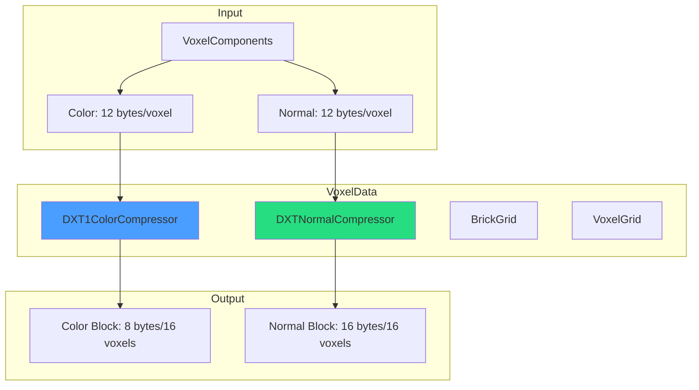
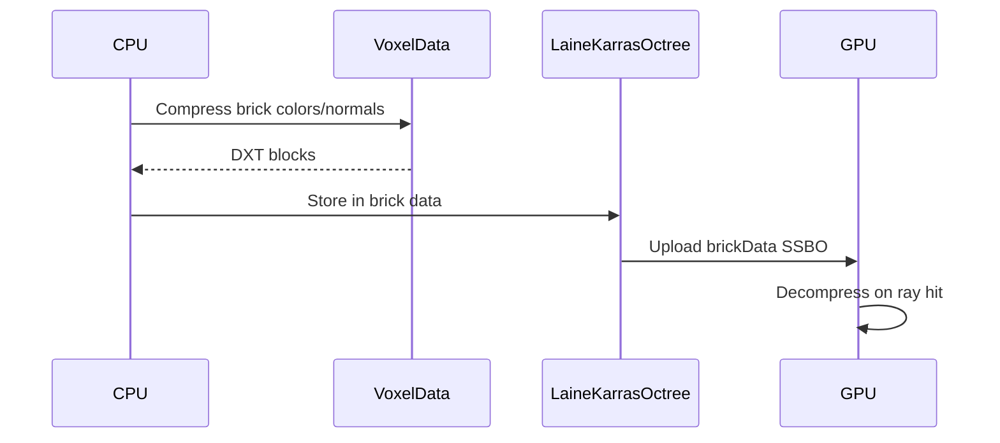

# VoxelData Library

Voxel data structures and DXT block compression for GPU-efficient storage. Achieves 5.3:1 memory reduction.

---

## 1. Architecture



---

## 2. Compression Ratios

| Data Type | Uncompressed | Compressed | Ratio |
|-----------|--------------|------------|-------|
| Color (RGB) | 12 bytes/voxel | 8 bytes/16 voxels | 24:1 |
| Normal (XYZ) | 12 bytes/voxel | 16 bytes/16 voxels | 12:1 |
| Combined | 24 bytes/voxel | 24 bytes/16 voxels | 16:1 |

**Overall compression:** ~5.3:1 (including brick metadata)

---

## 3. DXT1 Color Compression

4x4x1 voxel blocks compressed to 8 bytes.

### 3.1 Block Format

```
Bytes 0-1: Color endpoint 0 (RGB565)
Bytes 2-3: Color endpoint 1 (RGB565)
Bytes 4-7: 2-bit indices per voxel (16 voxels)
```

### 3.2 API

```cpp
DXT1ColorCompressor compressor;

// Compress 4x4 block
std::array<glm::vec3, 16> colors;
DXT1Block block = compressor.Compress(colors);

// Decompress
std::array<glm::vec3, 16> decompressed = compressor.Decompress(block);
```

### 3.3 Quality

- 4 color palette per block (2 endpoints + 2 interpolated)
- Acceptable for diffuse colors
- Artifacts on high-frequency gradients

---

## 4. DXTn Normal Compression

4x4x1 normal blocks compressed to 16 bytes.

### 4.1 Block Format

```
Bytes 0-7:  X component (DXT5 alpha-style encoding)
Bytes 8-15: Y component (DXT5 alpha-style encoding)
Z component: Reconstructed from sqrt(1 - x² - y²)
```

### 4.2 API

```cpp
DXTNormalCompressor compressor;

// Compress 4x4 block
std::array<glm::vec3, 16> normals;
DXTNormalBlock block = compressor.Compress(normals);

// Decompress
std::array<glm::vec3, 16> decompressed = compressor.Decompress(block);
```

---

## 5. GPU Decompression

GLSL shader for real-time decompression.

```glsl
// Compression.glsl
vec3 decompressDXT1Color(uvec2 block, uint index) {
    // Extract endpoints
    uint c0 = block.x & 0xFFFF;
    uint c1 = block.x >> 16;

    // Decode RGB565
    vec3 color0 = decodeRGB565(c0);
    vec3 color1 = decodeRGB565(c1);

    // Get 2-bit index
    uint selector = (block.y >> (index * 2)) & 0x3;

    // Interpolate
    return mix(color0, color1, float(selector) / 3.0);
}
```

---

## 6. BrickGrid

2D grid of compressed brick data for GPU upload.

```cpp
BrickGrid grid(bricksX, bricksY, bricksZ);

// Add brick data
grid.SetBrickColor(brickIndex, colorBlock);
grid.SetBrickNormal(brickIndex, normalBlock);

// Upload to GPU
VkBuffer colorBuffer = grid.CreateColorBuffer(device);
VkBuffer normalBuffer = grid.CreateNormalBuffer(device);
```

### 6.1 Memory Layout

```
Brick 0: [Color Block 0..N] [Normal Block 0..N]
Brick 1: [Color Block 0..N] [Normal Block 0..N]
...
```

---

## 7. Integration with SVO



---

## 8. Performance

### 8.1 Compression Time

| Operation | Time per brick (512 voxels) |
|-----------|----------------------------|
| DXT1 Color | ~50 microseconds |
| DXTn Normal | ~80 microseconds |
| Combined | ~130 microseconds |

### 8.2 GPU Decompression

| Operation | Cycles |
|-----------|--------|
| Color lookup | ~5 cycles |
| Normal lookup | ~8 cycles |
| Total per hit | ~13 cycles |

Negligible impact on ray marching performance.

---

## 9. Code References

| File | Purpose |
|------|---------|
| `libraries/VoxelData/include/DXT1Compressor.h` | Color compression |
| `libraries/VoxelData/include/DXTNormalCompressor.h` | Normal compression |
| `libraries/VoxelData/include/BrickGrid.h` | GPU data layout |
| `libraries/VoxelData/src/DXT1Compressor.cpp` | Implementation |
| `shaders/Compression.glsl` | GPU decompression |

---

## 10. Related Pages

- [[Compression]] - Detailed compression documentation
- [[SVO-System]] - Octree brick integration
- [[VoxelComponents-Library]] - Source data components
- [[../01-Architecture/Libraries-Overview|Libraries Overview]] - Library index
