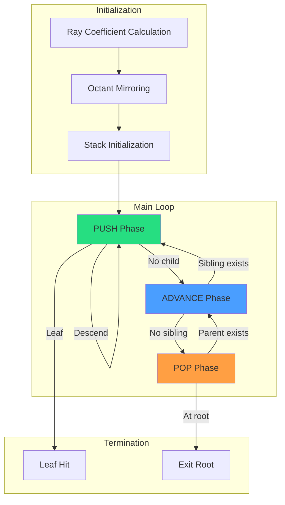

# ESVO Algorithm

Efficient Sparse Voxel Octrees (Laine & Karras, NVIDIA 2010) provides a parametric ray-octree traversal algorithm optimized for GPU execution.

---

## 1. Algorithm Overview



---

## 2. Coordinate Space

### 2.1 ESVO Normalized Space

Ray traversal occurs in the [1,2]^3 cube:

```
     z=2
      │
      │    ┌─────────┐
      │   /│        /│
      │  / │       / │
      │ ┌─────────┐  │
      │ │  │      │  │
      │ │  └──────│──┘
      │ │ /       │ /
      │ │/        │/
      └─┴─────────┴────── y=2
     /1,1,1       2,1,1
    /
   x=2
```

### 2.2 World to ESVO Transformation

```cpp
vec3 worldToESVO(vec3 worldPos, vec3 worldMin, float worldSize) {
    vec3 normalized = (worldPos - worldMin) / worldSize;  // [0,1]
    return normalized + 1.0;  // [1,2]
}
```

---

## 3. Ray Coefficient Calculation

### 3.1 Parametric Plane Intersection

For each axis, compute coefficients:

```cpp
struct RayCoefficients {
    float tx_coef, ty_coef, tz_coef;  // 1/rayDir
    float tx_bias, ty_bias, tz_bias;  // Offset from origin
};

RayCoefficients initRayCoefficients(vec3 rayOrigin, vec3 rayDir) {
    RayCoefficients c;

    c.tx_coef = 1.0f / -abs(rayDir.x);
    c.ty_coef = 1.0f / -abs(rayDir.y);
    c.tz_coef = 1.0f / -abs(rayDir.z);

    c.tx_bias = c.tx_coef * rayOrigin.x;
    c.ty_bias = c.ty_coef * rayOrigin.y;
    c.tz_bias = c.tz_coef * rayOrigin.z;

    return c;
}
```

### 3.2 t-Value Computation

For a voxel corner at position `p`:

```cpp
float tx(vec3 pos, RayCoefficients c) {
    return pos.x * c.tx_coef - c.tx_bias;
}

// Entry t: max of entering planes
float t_min = max(tx(corner), max(ty(corner), tz(corner)));

// Exit t: min of exiting planes
float t_max = min(tx(corner + size), min(ty(...), tz(...)));
```

---

## 4. Octant Mirroring

### 4.1 Problem

Negative ray directions complicate octant selection.

### 4.2 Solution: XOR Mirroring

Mirror both ray and space so ray always points positive:

```cpp
int octant_mask = 0;
if (rayDir.x < 0) {
    octant_mask |= 1;
    rayOrigin.x = 3.0f - rayOrigin.x;
    rayDir.x = -rayDir.x;
}
if (rayDir.y < 0) {
    octant_mask |= 2;
    rayOrigin.y = 3.0f - rayOrigin.y;
    rayDir.y = -rayDir.y;
}
if (rayDir.z < 0) {
    octant_mask |= 4;
    rayOrigin.z = 3.0f - rayOrigin.z;
    rayDir.z = -rayDir.z;
}
```

### 4.3 Octant Index Conversion

```cpp
// Mirrored index to local octant
int localOctant = mirroredIdx ^ ((~octant_mask) & 7);

// Example: octant_mask = 0b101, mirroredIdx = 0b011
// localOctant = 0b011 ^ 0b010 = 0b001
```

---

## 5. Traversal Phases

### 5.1 PUSH Phase

Descend into child octant:

```cpp
void executePushPhase(TraversalState& state, int childIdx, CastStack* stack, int& stackPtr) {
    // Save current state to stack
    stack[stackPtr].node = state.descriptor;
    stack[stackPtr].t_max = state.tc_max;
    stackPtr++;

    // Calculate child voxel bounds
    float halfScale = state.scale * 0.5f;
    vec3 childOffset = getOctantOffset(childIdx) * halfScale;
    state.pos += childOffset;
    state.scale = halfScale;

    // Fetch child descriptor
    uint childPointer = getChildPointer(state.descriptor);
    uint childOffset = countChildrenBefore(state.descriptor, childIdx);
    state.descriptor = octreeNodes[childPointer + childOffset];

    // Update t_max
    vec3 exit = state.pos + halfScale;
    state.tc_max = min(tx(exit), min(ty(exit), tz(exit)));
}
```

### 5.2 ADVANCE Phase

Move to next sibling:

```cpp
AdvanceResult executeAdvancePhase(TraversalState& state, RayCoefficients& coeffs, int step_mask) {
    // Determine which axis to step along
    float tc_max_x = tx(state.pos + state.scale);
    float tc_max_y = ty(state.pos + state.scale);
    float tc_max_z = tz(state.pos + state.scale);

    // Find minimum (exit axis)
    float tc_max = min(tc_max_x, min(tc_max_y, tc_max_z));

    // Step to next octant
    if (tc_max == tc_max_x) {
        state.pos.x += state.scale;
        step_mask |= 1;
    }
    if (tc_max == tc_max_y) {
        state.pos.y += state.scale;
        step_mask |= 2;
    }
    if (tc_max == tc_max_z) {
        state.pos.z += state.scale;
        step_mask |= 4;
    }

    // Check if exited parent
    if ((step_mask & getValidMask(state.descriptor)) == 0) {
        return {true, state};  // Need to pop
    }

    return {false, state};  // Continue in this level
}
```

### 5.3 POP Phase

Return to parent level:

```cpp
int executePopPhase(TraversalState& state, CastStack* stack, int& stackPtr, int step_mask) {
    if (stackPtr == 0) {
        return -1;  // Exited root
    }

    stackPtr--;
    state.descriptor = stack[stackPtr].node;
    state.tc_max = stack[stackPtr].t_max;

    // IEEE 754 bit manipulation to find scale
    // (Original ESVO uses floating-point exponent manipulation)
    state.scale *= 2.0f;

    // Restore position
    state.pos = roundToScale(state.pos, state.scale);

    return step_mask;
}
```

---

## 6. Child Descriptor Format

```
Bit Layout (32 bits):
┌─────────────────┬──────────┬──────────┐
│ Child Pointer   │ Valid    │ Leaf     │
│ (17 bits)       │ (8 bits) │ (7 bits) │
└─────────────────┴──────────┴──────────┘
    bits 0-16       bits 17-24  bits 25-31
```

### 6.1 Accessors

```cpp
uint getChildPointer(uint desc) { return desc & 0x1FFFF; }
uint getValidMask(uint desc) { return (desc >> 17) & 0xFF; }
uint getLeafMask(uint desc) { return (desc >> 25) & 0x7F; }

bool isValid(uint desc, int octant) {
    return (getValidMask(desc) & (1 << octant)) != 0;
}

bool isLeaf(uint desc, int octant) {
    return (getLeafMask(desc) & (1 << octant)) != 0;
}
```

### 6.2 Child Counting

```cpp
uint countChildrenBefore(uint desc, int childIdx) {
    uint validMask = getValidMask(desc);
    uint mask = (1 << childIdx) - 1;  // Bits before childIdx
    return popcount(validMask & mask);
}
```

---

## 7. Implementation Details

### 7.1 Stack Structure

```cpp
struct CastStack {
    uint32_t node;      // Child descriptor at this level
    float t_max;        // Exit t for this voxel
};

constexpr int MAX_DEPTH = 23;  // 2^23 = 8M voxel resolution
```

### 7.2 Precision Considerations

```cpp
// Bias to prevent floating-point precision issues
const float EPSILON = 1e-4f;

// Clamp t values
float tc_max = max(tc_max, 0.0f);

// Axis-parallel ray handling
if (abs(rayDir.x) < EPSILON) {
    canStepX = false;
    tx_coef = 1e10f;  // Large value, never selected
}
```

---

## 8. Performance Characteristics

| Aspect | Complexity | Notes |
|--------|------------|-------|
| Time | O(log N + K) | N = voxels, K = ray length |
| Space | O(log N) | Stack depth |
| Memory Access | Coherent | Cache-friendly child grouping |
| Branch Divergence | Low | Uniform ray behavior per warp |

---

## 9. VIXEN Modifications

| Original ESVO | VIXEN Adaptation |
|---------------|------------------|
| CUDA implementation | Vulkan compute/fragment |
| Contour data | Entity-based components |
| Static octree | Dynamic rebuild() API |
| Single brick type | EntityBrickView pattern |

---

## 10. References

1. **Laine, S., & Karras, T.** (2010). "Efficient Sparse Voxel Octrees." *IEEE Transactions on Visualization and Computer Graphics*, 17(8), 1048-1059.

2. **Reference Implementation:** `C:\Users\liory\Downloads\source-archive\efficient-sparse-voxel-octrees\trunk\src\octree\`

3. **Key Files:**
   - `Octree.cpp` - `castRay()` implementation
   - `build/Builder.cpp` - Octree construction

---

## 11. Related Pages

- [[../02-Implementation/SVO-System|SVO System]] - VIXEN implementation
- [[../02-Implementation/Ray-Marching|Ray Marching]] - GPU shader code
- [[Voxel-Papers]] - Related research
