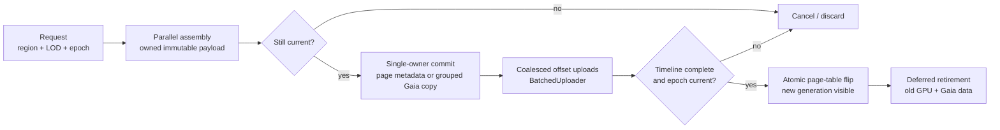

# Gaia Bulk Voxel Mutation and GPU Publish Research

> **Verdict:** the proposed background-assembly then batched-upload design is technically credible,
> but the parallel boundary must sit **before** mutation of the shared `GaiaVoxelWorld`.
>
> VIXEN should assemble immutable region/brick pages on multiple workers, commit only compact
> metadata or a grouped legacy voxel representation through one world owner, queue offset uploads
> through the existing `BatchedUploader`, and make the new page visible only after its upload
> timeline completes. Large removals should publish an empty/replacement page and reclaim the old
> data later, rather than delete thousands of visible voxel entities in place.
>
> The existing `VoxelInjectionQueue` is not this architecture and must not be reused as its
> foundation. It concurrently mutates one Gaia world through an SPSC-style ring advertised as
> multi-producer, and its queued requests retain caller-owned `std::span` payloads. The known heap
> corruption is consistent with the implementation, not an unexplained test anomaly.

**Research date:** 2026-07-27

**Scope:** Gaia-ECS bulk creation and structural-mutation APIs, job scheduling, VIXEN's current voxel
creation/build/upload path, multicore assembly, large add/remove behavior, GPU upload bandwidth,
publication ordering, backpressure, determinism, and implementation probability.

**Gaia version checked:** exact VIXEN pin
`0f4d5d367eb9cfe930ca9323dcd685fbd3bcb2f4`, reported as `0.9.3-dev` in
`VIXEN/dependencies/CMakeLists.txt:130-141`.

**Related direction:** [[../01-Architecture/Lazy-Procedural-Delta-Baseline-Design-2026-07]]

**Known issue:** [[../04-Development/Known-Issues#KI-027 — `VoxelInjectionQueue`/`VoxelInjector` concurrent voxel creation is unsound (heap corruption, ECS assertion mismatch)]]

---

## 1. Status legend

- ✅ **Implemented** — present and usable in the current source.
- 🚧 **Partial** — a useful mechanism exists, but the end-to-end region path does not.
- ❌ **Unsafe / reject** — present, but not a valid production foundation.
- 📐 **Proposed contract** — researched direction, not implemented.
- 🧪 **Prototype gate** — source-supported candidate that still needs a focused benchmark/correctness
  test before acceptance.

---

## 2. Current repository reality

| Area | Status | What the source actually does |
|---|---:|---|
| Single-voxel Gaia storage | ✅ | `GaiaVoxelWorld` owns one `gaia::ecs::World`, an unsynchronized Morton→entity `unordered_map`, and an unsynchronized block cache. |
| `createVoxelsBatch` | 🚧 | Loops serially. Each request calls `world.add()` and then a separate `world.add<T>` for every component, updating the Morton index one voxel at a time. “Batch” currently means one outer call and one final cache clear, not Gaia batched archetype creation. |
| `destroyVoxelsBatch` | 🚧 | Loops over entity ids, erases one Morton entry, and calls `world.del(id)` for each. There is no region-level logical removal or deferred reclamation. |
| `VoxelInjectionQueue` | ❌ | No production call site was found, but its tests expose the defect: several `std::thread` workers call the same `GaiaVoxelWorld::createVoxelsBatch`. Its single read/write-index ring is not a correct MPSC/MPMC queue, `flush()` observes dequeue rather than completed commit, and `stop()` may abandon queued work. |
| Queued payload ownership | ❌ | `VoxelCreationRequest` contains a `std::span<const ComponentQueryRequest>`; copying it into the async ring does not retain the component storage. |
| Initial scene build | 🚧 | `VoxelSceneCacher::Create` synchronously generates a dense grid, creates Gaia voxel entities, rebuilds/compresses the complete ESVO, creates full GPU buffers, queues uploads at offset zero, and calls `WaitAllUploads()`. |
| Offset buffer upload | ✅ | `BatchedUploader::Upload` accepts `dstOffset`, batches copies, pools mapped staging buffers, and exposes timeline/fence completion handles. |
| Region/page allocation | 📐 | The lazy-procedural design specifies a fixed-capacity paged pool, but no allocator/page-table publication path exists yet. |
| Whole-pool async residency | 🚧 | `UploadBrickPool` has a request/poll completion state machine. It proves non-blocking completion tracking, but still operates on a monolithic pool rather than independently replaceable regions. |
| CPU multicore dispatcher | 🚧 | `KernelDispatch` has a working deterministic `CpuTbb` per-element/task-wave backend. Other declared CPU/GPU/transfer backends remain future work. |

### 2.1 Why the current “batch” path is expensive

Gaia stores fragmenting component combinations in archetypes. Adding components separately can move
an entity through several intermediate archetypes before it reaches its final shape. The present loop
does exactly that for every voxel:

1. create empty entity;
2. add `MortonKey`;
3. visit every component variant and call another `add<T>`;
4. update a general-purpose hash map;
5. repeat.

It reduces cache invalidation frequency, but not structural-change count. It also builds a per-voxel
ECS representation only to read it back into brick-oriented ESVO data. The measured lazy-procedural
baseline already found this fused evaluation + ECS creation phase responsible for roughly 68% of the
1.5–1.9 s, 6.26 MB standard bake.

### 2.2 Corrected diagnosis of `VoxelInjectionQueue`

The queue has multiple independent correctness failures:

- **Shared-world writers:** all workers call one `GaiaVoxelWorld`, including its Gaia world,
  `mortonIndex`, and block cache.
- **Incorrect queue algorithm:** producers load the same write index and consumers load the same
  read index without reservation/CAS or per-slot sequence numbers. Atomics around a single index do
  not make this ring multi-producer or multi-consumer.
- **Borrowed async data:** a queued `VoxelCreationRequest` preserves a span into memory owned by the
  caller. The queue may dereference it after the caller has moved or destroyed that storage.
- **Incomplete completion meaning:** advancing `m_readIndex` happens before `createVoxelsBatch`; thus
  `flush()` can return while a worker is still mutating the world.
- **Stop is not drain:** `m_running` is cleared before workers finish queued requests, and workers
  break when it becomes false.

Adding a mutex only around `createVoxelsBatch` would prevent simultaneous world writes but would not
repair the ring, payload lifetime, completion, cancellation, or scaling model. Retire or replace the
queue rather than harden it incrementally.

---

## 3. Gaia 0.9.3-dev APIs that fit

The following are available at the exact VIXEN pin, not assumptions based on a newer release:

| Gaia facility | Appropriate use here | Boundary |
|---|---|---|
| `World::build(entity)` / `EntityBuilder` | Apply several component additions/removals as one structural transition for irregular single entities. | Still entity-oriented; not the preferred large-page path. |
| `World::add_n(prototype, count)` | Create many entities directly in one known archetype shape. | Values are not promised to copy from the prototype. |
| `World::copy_n(prototype, count, CopyIter callback)` | 🧪 Create a homogeneous group in the prototype archetype and populate component views per produced chunk. | Needs a focused VIXEN prototype for hooks/observers, component layout, and exact initialization semantics. |
| `World::copy_ext_n` | Same as `copy_n`, with observer notification. | Extra observer cost; use only where notifications are part of the contract. |
| `QueryExecType::Parallel*` | Parallel iteration and writes over existing, non-structurally-changing component chunks. | It does not make arbitrary shared-world structural writes safe. |
| Query `.reads<T>()` / `.writes<T>()`, `Query::job` | Declare dependencies between deferred ECS jobs. | Useful after data is resident in Gaia; external page assembly needs an owned scheduler job. |
| `CommandBufferST` / `CommandBufferMT` | Record sparse structural edits while a query locks the world; commit when safe. | Multi-thread recording still becomes a later commit. It is not a high-bandwidth page builder. Register component types before threaded recording. |
| `ThreadPool::sched_background` | Multi-frame region generation, cache building, compression, or streaming work. | Background workers share the pool's total worker cap and need explicit lifetime/cancellation ownership. |
| Custom `ecs::Sched` adapter | Route Gaia work into the engine's scheduler instead of maintaining two worker pools. | Must preserve `SchedFlags::Background` and dependency/wait/delete semantics. |

### 3.1 Scheduler choice

Use **one scheduler owner**:

- Near-term option: use Gaia's job pool for Gaia systems and low-priority background page assembly.
- Integration option: adapt Gaia's `ecs::Sched` interface onto VIXEN's TBB/`KernelDispatch` owner,
  preserving a distinct background lane.

Do not run Gaia's full worker pool, `KernelDispatch`/TBB, and a replacement
`VoxelInjectionQueue` pool simultaneously at hardware concurrency. That oversubscribes the same
cores and makes backpressure invisible across queues.

---

## 4. Recommended end-to-end architecture



This is a **build-new → validate → upload → swap → retire-old** pipeline. Rendering always sees the
complete old generation or the complete new generation, never a partially mutated page.

### 4.1 State machine

Every region generation moves through:

```
Requested
  -> Assembling
  -> ReadyToCommit
  -> UploadQueued
  -> UploadComplete
  -> Resident
  -> Retiring
  -> Reclaimed
```

`Canceled` and `Failed` are legal from every pre-resident state. Each transition compares the
request's `(regionAddress, sourceRevision, editEpoch, allocationGeneration)` with the newest desired
record. A result from an older epoch may finish, but it may never publish.

### 4.2 Owned contracts

Names are illustrative; the fields are the contract.

```cpp
struct VoxelPageBuildKey {
    RegionAddress region;
    uint8_t lod;
    uint64_t sourceRevision;
    uint64_t editEpoch;
    uint32_t channelMask;
};

struct VoxelPageBuildRequest {
    VoxelPageBuildKey key;
    RecipeRef recipe;
    OwnedDeltaChain deltas;
    OwnedBoundaryInputs neighborApron;
    RequestPriority priority;
    CancellationToken cancellation;
};

struct VoxelPagePayload {
    VoxelPageBuildKey key;
    Hash256 canonicalPayloadHash;
    OwnedBytes topology;
    std::vector<OwnedChannelPage> channels;
    OwnedBytes mipData;
    OwnedBytes brickLookup;
    BuildMetrics metrics;
};

struct VoxelPagePublishTicket {
    VoxelPageBuildKey key;
    PageAllocation allocation;
    uint64_t allocationGeneration;
    std::vector<UploadHandle> uploads;
};
```

No async contract contains a borrowed span into a caller's temporary component array. Ownership is
moved into the request or retained through an immutable reference-counted artifact.

---

## 5. Stage A — multicore immutable assembly

Parallelize the expensive work that does not require a live Gaia world:

1. resolve recipe artifact, parameters, source revision, and ordered materialized deltas;
2. partition the region into deterministic tiles/brick address ranges;
3. evaluate base density/material channels;
4. merge absolute delta overrides and boundary apron input;
5. generate occupancy/topology, brick payloads, compression, lookup data, and dirty-path mips;
6. canonicalize output order and compute the produced-payload hash.

### 5.1 Work partition

Use one job per region for small pages. For larger pages, fan out fixed address ranges and perform a
stable merge:

- partition by `(region, Morton interval, channel)`, never by whichever worker becomes free;
- give each output address one owner wherever possible;
- resolve duplicate edits by authored operation sequence / edit epoch, not task completion order;
- sort the final page by canonical Morton/channel order;
- reserve output ranges from a prefix-count pass or merge worker-local vectors in partition order.

This makes one-worker and N-worker builds comparable and prevents scheduler timing from affecting the
payload hash.

### 5.2 When Gaia parallel queries help

Gaia parallel queries are useful when transforming **existing stable ECS component columns**, for
example collecting authored sparse edits into worker-local page fragments. They are not required for
recipe evaluation and must not perform direct structural adds/removes during the parallel loop.

If query iteration discovers sparse structural changes, record them with the iterator command buffer
and let Gaia commit after the query unlocks. For a whole-region replacement, emit a page payload
instead.

---

## 6. Stage B — short single-owner Gaia commit

There are two representation paths; they should not be confused.

### 6.1 Preferred scalable path: one entity per page/brick/region

Use Gaia to index lifecycle and semantic metadata:

- region address and LOD;
- source/edit revision and payload hash;
- page allocation/generation;
- residency and upload state;
- bounds, dirty flags, and ownership/lease data.

Keep dense voxel/channel bytes in immutable page payloads and GPU pools. This matches the ESVO's
brick-shaped consumption, avoids per-voxel structural churn, and makes region replacement O(page
metadata) on the visible path.

The exact granularity should be benchmarked:

- **one entity per region** minimizes ECS overhead;
- **one entity per brick** improves query/filter granularity and sparse edit accounting;
- a hybrid region entity + compact brick records is the likely default.

### 6.2 Legacy compatibility path: grouped batched voxel entities

For authoring workflows that genuinely require mutable per-voxel components:

1. group requests by exact component/archetype mask;
2. maintain a prototype entity for each admitted mask;
3. call `copy_n(prototype, count, CopyIter)` for that group;
4. populate continuous component views and collect returned entities;
5. update the Morton index once in canonical order;
6. invalidate affected block-cache generations once per region.

This should replace repeated `world.add<T>` transitions only after the 🧪 prototype confirms component
view writes, observer behavior, and parity with the existing path. `copy_ext_n` is the observer-aware
variant when notifications are required.

### 6.3 World ownership rule

All `GaiaVoxelWorld` structural mutation plus its Morton/cache bookkeeping belongs to one logical
owner. That owner may be the frame thread or a dedicated world-commit lane, but workers submit
completed payloads to it; workers do not enter the world directly.

The commit queue must be:

- MPSC-correct or mutex-backed;
- bounded by bytes as well as item count;
- ownership-safe;
- generation-aware;
- explicit about “dequeued”, “committed”, “uploaded”, and “visible” completion.

---

## 7. Stage C — batched GPU range upload and publication

`BatchedUploader` already supplies the essential buffer-copy mechanism:

- persistent mapped staging allocation;
- multiple queued uploads;
- destination offsets;
- automatic count/byte/deadline flushing;
- timeline semaphore completion with fence fallback.

The region path should:

1. allocate node/brick/channel/mip ranges from a fixed-capacity page pool;
2. coalesce adjacent destination ranges where doing so reduces command count without copying
   unrelated bytes;
3. call `Upload(..., dstOffset)` for only the new/dirty ranges;
4. retain the returned handles in `VoxelPagePublishTicket`;
5. poll completion during the normal render/update loop;
6. atomically publish the new page-table entry after every required upload completes;
7. retire prior ranges after their last render-use fence/timeline.

Do **not** call `WaitAllUploads()` for each page. A blocking wait is valid for initial boot/tool export
or a capacity-resize fallback, not steady-state streaming.

### 7.1 Present infrastructure limitations

- The production uploader is buffer-only.
- VIXEN currently creates one graphics-family queue; there is no proven dedicated transfer-queue
  path.
- Upload reservation is fail-fast rather than priority-aware backpressure.
- Pool resize still requires a Rematerialize-shaped graph/buffer replacement.

None blocks the first region-buffer implementation. A dedicated transfer queue is a later measured
optimization; bounded scheduling and page allocation are required first.

---

## 8. Large removal semantics

Gaia exposes safe deferred per-entity deletion through command buffers, but there is no reason to put
thousands of deletes on the visible-frame path.

Use three paths:

| Change size | Visible operation | Physical cleanup |
|---|---|---|
| Small sparse edit | Rebuild affected brick(s), update dirty path/mips, upload changed ranges. | Optional command-buffer cleanup of obsolete authoring entities. |
| Region replace/remove | Publish a replacement or empty page-table entry. | Retire old GPU pages after last use; compact/delete old Gaia metadata later. |
| Whole snapshot reset | Build a new page table/world snapshot and switch the root generation. | Reclaim the old snapshot after readers quiesce. |

Logical removal therefore completes at the page-table/root flip. Entity and allocation destruction
is deferred maintenance and can be time-sliced.

---

## 9. Backpressure, priority, and cancellation

A fast producer without admission control only moves the hitch into memory pressure. Bound the
pipeline with:

- maximum queued assembly bytes;
- maximum active region jobs;
- CPU assembly milliseconds or worker-share budget;
- maximum ready-to-commit bytes;
- staging high-water and transfer bytes per frame;
- maximum in-flight page generations per region;
- fixed node/brick/channel pool capacity.

Priority should combine:

- correctness urgency (missing currently required page before speculative detail);
- projected screen footprint and distance;
- player/tool edit recency;
- dependency readiness, including apron neighbors;
- starvation age.

When a newer epoch for a region arrives:

1. coalesce queued work into the newest desired request;
2. cancel older assembly at tile-safe checkpoints;
3. discard an already-completed stale payload before commit;
4. if upload already began, let the copy finish but never publish it; reclaim its allocation.

---

## 10. Determinism and observability contract

Required correctness gates:

- identical canonical payload hash for 1, 2, and N worker assembly;
- an old epoch can never overwrite a newer resident generation;
- readers see the old complete page or new complete page, never a mixed generation;
- neighboring regions built in either order produce seam-equivalent apron samples;
- remove/replace never exposes freed GPU addresses;
- cancellation cannot leak an allocation or retain borrowed source memory.

Required metrics:

| Stage | Metrics |
|---|---|
| Request/admission | queued regions/bytes, coalesced requests, rejects, priority age |
| Assembly | wall time, worker CPU time, tile count, cancellation waste, output bytes |
| Commit | wait-to-commit, Gaia structural time, index/cache time, entities/pages created |
| Upload | requested/coalesced bytes, copy count, staging high-water, queue latency, completion time |
| Publish | time-to-visible, stale completion rejects, resident generation |
| Retirement | bytes/pages awaiting fence, reclaim latency, fragmentation/high-water |

Use structured VIXEN logging/profiling; do not add per-voxel `std::cout` progress output to hot paths.

---

## 11. Benchmark and proof matrix

### 11.1 CPU and Gaia variants

Compare:

1. current serial `createVoxelsBatch`;
2. grouped `EntityBuilder` where shapes vary;
3. grouped prototype + `copy_n`/`CopyIter`;
4. direct page build with region-level Gaia metadata;
5. assembly with 1, 2, 4, and available-worker counts.

Fixtures:

- homogeneous component shape;
- several realistic component masks;
- sparse 1% edit;
- 10% dirty bricks;
- complete region replacement;
- complete region removal;
- neighbor-apron edit spanning two regions.

Report assembly, Gaia commit, compression/mip, bytes produced, upload bytes, time-to-visible, peak
host memory, and payload hash parity separately. Do not combine them into one opaque “bake time”.

### 11.2 Runtime hitch gates

- P50/P95/P99 render-thread time with streaming idle and saturated.
- Maximum single-frame world-commit time under the configured budget.
- No steady-state `WaitAllUploads`, `vkQueueWaitIdle`, or full-buffer replacement.
- Transfer byte count proportional to dirty page ranges, not total pool capacity.
- Old/new atomic visibility asserted in a frame-by-frame integration test.
- Pool exhaustion follows the documented evict-first/fallback policy.

### 11.3 Failure injection

- cancel during each state;
- supersede a page while assembling and while uploading;
- uploader reservation failure;
- invalid recipe/delta input;
- pool exhaustion and fragmentation;
- device/upload failure;
- shutdown with queued, committing, and uploading pages.

---

## 12. Staged implementation direction

### Slice A — repair the contract boundary

- Mark `VoxelInjectionQueue` unsupported and remove production/test assumptions that it is MPMC-safe.
- Introduce owned region-build request/payload types and a bounded completion queue.
- Add deterministic 1-vs-N worker payload tests without Gaia or Vulkan.

**Exit:** background assembly cannot access `GaiaVoxelWorld`; owned payload/hash parity is proven.

### Slice B — benchmark Gaia publication

- Build the grouped-mask prototype + `copy_n` experiment.
- Compare it with current per-voxel insertion and region-level metadata.
- Decide authoring-only per-voxel scope and the production page entity granularity.

**Exit:** measured representation decision; no architecture commitment based only on microbenchmarks
from a homogeneous artificial archetype.

### Slice C — fixed-capacity page pool

- Implement node/brick/channel/mip range allocation and generation-stamped page-table entries.
- Upload one new region through existing offset `BatchedUploader` calls.
- Poll handles and publish only after completion.

**Exit:** renderer sees old-or-new generation without a full wait or recompile.

### Slice D — edit/removal integration

- Connect materialized edits to dirty brick/page rebuilding.
- Add bottom-up dirty-path mip refresh and neighbor apron invalidation.
- Publish empty/replacement pages and defer old-page reclamation.

**Exit:** 1%, 10%, and 100% dirty fixtures transfer proportional bytes and remain seam-correct.

### Slice E — scheduler integration and budgets

- Choose Gaia-native background workers or implement the Gaia→engine scheduler adapter.
- Add byte/time/worker admission budgets, coalescing, cancellation, and priority.
- Capture P50/P95/P99 frame and time-to-visible metrics under load.

**Exit:** more assembly workers improve throughput until measured saturation without increasing
visible-frame stalls beyond budget.

---

## 13. Feasibility assessment

These are engineering-confidence estimates, not schedule probabilities:

| Element | Probability of successful implementation | Reason |
|---|---:|---|
| Immutable background region assembly | **90–95%** | CPU work is naturally partitionable and the lazy-procedural contract already defines placement-agnostic page bytes. |
| Deterministic multicore merge | **85–95%** | Straightforward with fixed address partitions and canonical output; needs explicit tests. |
| Grouped Gaia `copy_n` publication | **80–90%** | Exact pinned API exists; VIXEN-specific component/hook behavior still needs a prototype. |
| Offset/timeline range upload | **90–95%** | Core uploader functionality is implemented and already used asynchronously by whole-pool residency. |
| Atomic paged-pool publication | **65–80%** | Technically conventional, but page allocation, shader indirection, retirement, and graph-capacity rules are substantial new work. |
| Scalable large removal by swap/retire | **75–90%** | Follows from paged publication; GPU last-use tracking and compaction are the main risks. |
| High-churn production at one Gaia entity per voxel | **35–55%** | Structural/index overhead fights the brick/page consumption shape; retain primarily for sparse authoring unless measurements overturn this. |
| Concurrent direct mutation of one `GaiaVoxelWorld` | **Reject** | Conflicts with current unsynchronized wrapper state and already produces memory corruption. |

The highest-risk work is not threading the evaluator. It is the renderer-visible page allocator,
generation-stamped indirection, and safe retirement protocol.

---

## 14. Decisions required before an implementation plan

1. Is production runtime data represented by one Gaia entity per region, per brick, or a hybrid?
2. Which first fixture proves the need: editor brush stroke, runtime destruction, or streamed
   procedural body detail?
3. What fixed GPU pool budget and page sizes are acceptable for that fixture?
4. Does the first implementation use Gaia's background workers or adapt Gaia scheduling to the
   existing TBB owner?
5. Which observers/hooks must fire for legacy per-voxel `copy_n` creation?
6. What main/render-thread commit budget is acceptable at P99?
7. Is a dedicated transfer queue worth pursuing only after the graphics-queue baseline is measured?

Recommended default: prove one materialized-damage region on the existing graphics queue, with
region-level Gaia metadata, fixed page capacity, CPU/TBB immutable assembly, asynchronous offset
upload, and old/new generation swap. It exercises the whole contract without first solving general
world streaming.

---

## 15. Source index

### Exact Gaia pin

- [Gaia-ECS repository at VIXEN pin `0f4d5d3`](https://github.com/richardbiely/gaia-ecs/tree/0f4d5d367eb9cfe930ca9323dcd685fbd3bcb2f4)
- [Pinned README: bulk editing, batched creation, queries, command buffers, jobs, and scheduler adapters](https://github.com/richardbiely/gaia-ecs/blob/0f4d5d367eb9cfe930ca9323dcd685fbd3bcb2f4/README.md)
- [Pinned `World` API implementation](https://github.com/richardbiely/gaia-ecs/blob/0f4d5d367eb9cfe930ca9323dcd685fbd3bcb2f4/include/gaia/ecs/world.h)

### VIXEN code and design

- `VIXEN/dependencies/CMakeLists.txt:130-141`
- `VIXEN/libraries/GaiaVoxelWorld/src/GaiaVoxelWorld.cpp:538-607`
- `VIXEN/libraries/GaiaVoxelWorld/include/VoxelInjectionQueue.h`
- `VIXEN/libraries/GaiaVoxelWorld/src/VoxelInjectionQueue.cpp:27-180`
- `VIXEN/libraries/VoxelComponents/include/ComponentData.h:67-73`
- `VIXEN/libraries/CashSystem/src/VoxelSceneCacher.cpp:118-145,511-675,767-938`
- `VIXEN/libraries/ResourceManagement/include/Memory/BatchedUploader.h`
- `VIXEN/libraries/ResourceManagement/src/Memory/BatchedUploader.cpp`
- `VIXEN/libraries/KernelDispatch/include/KernelDispatch/Abi.h`
- `VIXEN/libraries/KernelDispatch/include/KernelDispatch/Dispatcher.h`
- [[../01-Architecture/Lazy-Procedural-Delta-Baseline-Design-2026-07]]
- [[../01-Architecture/Instance-SSBO-Dirty-Upload-Direction-2026-07]]
- [[../04-Development/Known-Issues]]
