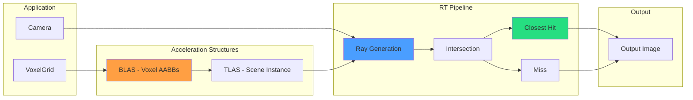

# Hardware Ray Tracing Pipeline

Third pipeline variant using VK_KHR_ray_tracing_pipeline for voxel octrees. Uses dedicated RT cores on RTX GPUs.

**Implementation Status:** ✅ COMPLETE (December 8, 2025)

---

## 1. Pipeline Overview



---

## 2. Implementation Status

### Shader Files

| Shader | File | Status |
|--------|------|--------|
| Ray Generation | `shaders/VoxelRT.rgen` | ✅ Complete |
| Miss | `shaders/VoxelRT.rmiss` | ✅ Complete |
| Closest Hit | `shaders/VoxelRT.rchit` | ✅ Complete |
| Intersection | `shaders/VoxelRT.rint` | ✅ Complete |
| Closest Hit (Compressed) | `shaders/VoxelRT_Compressed.rchit` | ✅ Complete |

### RenderGraph Nodes

| Node | Purpose | Status |
|------|---------|--------|
| BLASNode | Build bottom-level acceleration structure | ✅ Complete |
| TLASNode | Build top-level acceleration structure | ✅ Complete |
| VoxelAABBConverterNode | Convert voxels to AABBs | ✅ Complete |
| TraceRaysNode | Execute ray tracing pipeline | ✅ Complete |
| ShaderBindingTableNode | Create shader binding table | ✅ Complete |

---

## 3. Descriptor Bindings

### VoxelRT (Uncompressed)

| Binding | Resource | Type |
|---------|----------|------|
| 0 | outputImage | STORAGE_IMAGE |
| 1 | topLevelAS | ACCELERATION_STRUCTURE_KHR |
| 2 | aabbBuffer | STORAGE_BUFFER |
| 3 | materialIdBuffer | STORAGE_BUFFER |
| 5 | octreeConfig | UNIFORM_BUFFER |

### VoxelRT_Compressed

| Binding | Resource | Type |
|---------|----------|------|
| 0 | outputImage | STORAGE_IMAGE |
| 1 | topLevelAS | ACCELERATION_STRUCTURE_KHR |
| 2 | aabbBuffer | STORAGE_BUFFER |
| 3 | materialIdBuffer | STORAGE_BUFFER |
| 5 | octreeConfig | UNIFORM_BUFFER |
| 6 | compressedColors | STORAGE_BUFFER |
| 7 | compressedNormals | STORAGE_BUFFER |
| 8 | brickMapping | STORAGE_BUFFER |

---

## 4. Bugs Fixed (December 8, 2025)

### Session 1: Black Screen / Flickering

**Root Cause:** `VariadicSlotInfo::binding` defaulted to `0`, causing uninitialized slots to overwrite binding 0.

**Fix:**
- Changed default `binding = 0` → `binding = UINT32_MAX` (sentinel)
- Added 4 checks in `DescriptorResourceGathererNode.cpp` to skip UINT32_MAX slots

### Session 2: Grey/Missing Colors

| Issue | Root Cause | Fix |
|-------|------------|-----|
| Grey colors | Dangling pointer in VoxelGridNode | Two-pass with pre-allocated componentStorage |
| Dark grey scenes | MaterialIdToColor() missing IDs 30-61 | Added all material ID ranges |
| Color bleeding | DXT compression artifact | Documented as expected |

---

## 5. Material Color System

### Materials.glsl (Single Source of Truth)

```glsl
vec3 getMaterialColor(uint materialId) {
    // Cornell Box (1-20)
    if (materialId == 1) return vec3(0.9, 0.1, 0.1);   // Red
    if (materialId == 2) return vec3(0.1, 0.9, 0.1);   // Green
    // ...

    // Noise/Tunnel (30-40)
    if (materialId >= 30 && materialId <= 40) {
        // Stone variants, stalactites, ore
    }

    // Cityscape (50-61)
    if (materialId >= 50 && materialId <= 61) {
        // Asphalt, concrete, glass
    }

    // HSV fallback for unknown IDs
    return hsvToRgb(vec3(float(materialId % 360) / 360.0, 0.8, 0.9));
}
```

### Shared By

- `VoxelRT.rchit`
- `VoxelRT_Compressed.rchit`
- `VoxelRayMarch.comp`
- `VoxelRayMarch.frag`

---

## 6. DXT Compression Artifacts

Color bleeding at wall boundaries is **expected DXT behavior**:

- DXT compresses 16 voxels per block with only 2 reference colors
- When block spans material boundary, colors interpolate
- Present in all compressed pipelines (compute, fragment, RT)
- Uncompressed pipelines don't have this artifact

**Not a bug** - inherent to DXT compression.

---

## 7. Required Extensions

```cpp
const std::vector<const char*> RTX_EXTENSIONS = {
    VK_KHR_ACCELERATION_STRUCTURE_EXTENSION_NAME,
    VK_KHR_RAY_TRACING_PIPELINE_EXTENSION_NAME,
    VK_KHR_DEFERRED_HOST_OPERATIONS_EXTENSION_NAME,
    VK_KHR_PIPELINE_LIBRARY_EXTENSION_NAME,
    VK_KHR_BUFFER_DEVICE_ADDRESS_EXTENSION_NAME,
    VK_KHR_SPIRV_1_4_EXTENSION_NAME
};
```

---

## 8. Performance Considerations

### Advantages

| Advantage | Description |
|-----------|-------------|
| Dedicated RT cores | Hardware BVH traversal |
| Automatic LOD | Empty space skipping |
| Scalability | Handles 1M+ primitives |
| Coherent access | Cache-friendly |

### Disadvantages

| Disadvantage | Description |
|--------------|-------------|
| BLAS rebuild | Required when voxels change |
| Memory overhead | 2-3x voxel data size |
| AABB intersection | Custom shader overhead |
| API complexity | More code than compute |

---

## 9. Test Results

- **24/24 RT benchmark tests passing**
- No black screens or flickering
- Colors render correctly for all scene types (cornell, noise, tunnel, cityscape)

---

## 10. Related Pages

- [[Pipeline-Comparison]] - 4-way performance analysis
- [[../02-Implementation/Ray-Marching|Ray Marching]] - Compute/Fragment pipelines
- [[../05-Progress/Current-Status|Current Status]] - Phase K progress
- [[ESVO-Algorithm]] - Software octree traversal
