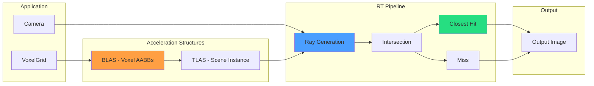

# Hardware Ray Tracing Pipeline

Third pipeline variant using VK_KHR_ray_tracing_pipeline for voxel octrees. Uses dedicated RT cores on RTX GPUs.

---

## 1. Pipeline Overview



---

## 2. Required Extensions

```cpp
const std::vector<const char*> RTX_EXTENSIONS = {
    VK_KHR_ACCELERATION_STRUCTURE_EXTENSION_NAME,
    VK_KHR_RAY_TRACING_PIPELINE_EXTENSION_NAME,
    VK_KHR_DEFERRED_HOST_OPERATIONS_EXTENSION_NAME,
    VK_KHR_PIPELINE_LIBRARY_EXTENSION_NAME,
    VK_KHR_BUFFER_DEVICE_ADDRESS_EXTENSION_NAME,
    VK_KHR_SPIRV_1_4_EXTENSION_NAME
};
```

---

## 3. Acceleration Structures

### 3.1 BLAS (Bottom-Level)

Each voxel represented as an AABB primitive:

```cpp
struct VoxelAABB {
    glm::vec3 min;  // Voxel corner
    glm::vec3 max;  // Opposite corner
};

// For 128^3 grid with 50% density = 1,048,576 AABBs
VkAccelerationStructureGeometryKHR geometry = {
    .geometryType = VK_GEOMETRY_TYPE_AABBS_KHR,
    .flags = VK_GEOMETRY_OPAQUE_BIT_KHR
};
```

### 3.2 TLAS (Top-Level)

Transforms and instances BLAS for dynamic scenes:

```cpp
VkAccelerationStructureInstanceKHR instance = {
    .transform = identityMatrix,
    .instanceCustomIndex = 0,
    .mask = 0xFF,
    .accelerationStructureReference = GetBLASAddress()
};
```

---

## 4. Shader Stages

### 4.1 Ray Generation (rgen)

```glsl
#version 460
#extension GL_EXT_ray_tracing : require

layout(location = 0) rayPayloadEXT vec3 hitColor;

void main() {
    ivec2 pixelCoords = ivec2(gl_LaunchIDEXT.xy);
    vec3 rayOrigin = camera.cameraPos;
    vec3 rayDir = generateRayDirection(pixelCoords);

    traceRayEXT(topLevelAS, gl_RayFlagsOpaqueEXT, 0xFF,
                0, 0, 0, rayOrigin, 0.001, rayDir, 1000.0, 0);

    imageStore(outputImage, pixelCoords, vec4(hitColor, 1.0));
}
```

### 4.2 Intersection (rint)

Custom AABB intersection for voxels:

```glsl
#version 460
#extension GL_EXT_ray_tracing : require

void main() {
    vec3 rayOrigin = gl_ObjectRayOriginEXT;
    vec3 rayDir = gl_ObjectRayDirectionEXT;

    // Ray-AABB intersection (slab method)
    vec3 t0 = (vec3(0.0) - rayOrigin) / rayDir;
    vec3 t1 = (vec3(1.0) - rayOrigin) / rayDir;
    vec3 tMin = min(t0, t1);
    vec3 tMax = max(t0, t1);

    float tNear = max(max(tMin.x, tMin.y), tMin.z);
    float tFar = min(min(tMax.x, tMax.y), tMax.z);

    if (tNear <= tFar && tFar >= gl_RayTminEXT) {
        reportIntersectionEXT(tNear, 0);
    }
}
```

### 4.3 Closest Hit (rchit)

```glsl
#version 460
#extension GL_EXT_ray_tracing : require

layout(location = 0) rayPayloadInEXT vec3 hitColor;

void main() {
    uint primitiveID = gl_PrimitiveID;
    vec4 color = voxelColors.colors[primitiveID];
    vec3 hitPos = gl_WorldRayOriginEXT + gl_WorldRayDirectionEXT * gl_HitTEXT;
    vec3 normal = calculateVoxelNormal(hitPos);

    hitColor = computeLighting(color.rgb, normal);
}
```

### 4.4 Miss (rmiss)

```glsl
#version 460
#extension GL_EXT_ray_tracing : require

layout(location = 0) rayPayloadInEXT vec3 hitColor;

void main() {
    hitColor = vec3(0.1, 0.1, 0.15);  // Background
}
```

---

## 5. Shader Binding Table

Maps shader groups to GPU memory:

```cpp
struct ShaderBindingTable {
    VkStridedDeviceAddressRegionKHR raygenRegion;
    VkStridedDeviceAddressRegionKHR missRegion;
    VkStridedDeviceAddressRegionKHR hitRegion;
    VkStridedDeviceAddressRegionKHR callableRegion;
};
```

---

## 6. Performance Considerations

### 6.1 Advantages

| Advantage | Description |
|-----------|-------------|
| Dedicated RT cores | Hardware BVH traversal |
| Automatic LOD | Empty space skipping |
| Scalability | Handles 1M+ primitives |
| Coherent access | Cache-friendly |

### 6.2 Disadvantages

| Disadvantage | Description |
|--------------|-------------|
| BLAS rebuild | Required when voxels change |
| Memory overhead | 2-3x voxel data size |
| AABB intersection | Custom shader overhead |
| API complexity | More code than compute |

---

## 7. Expected Results

**Hypothesis:**
- **Sparse scenes (10-50% density):** Hardware RT faster (empty space skipping)
- **Dense scenes (90% density):** Compute shader comparable or faster

**Validation:** Phase M will test 180 configurations across all pipelines.

---

## 8. Integration with RenderGraph

### 8.1 HardwareRTNode

```cpp
struct HardwareRTNodeConfig {
    INPUT_SLOT(CAMERA_BUFFER, VkBuffer*, SlotMode::SINGLE);
    INPUT_SLOT(VOXEL_GRID, VoxelGrid*, SlotMode::SINGLE);
    INPUT_SLOT(COMMAND_BUFFER, VkCommandBuffer*, SlotMode::SINGLE);

    OUTPUT_SLOT(OUTPUT_IMAGE, VkImage*, SlotMode::SINGLE);
    OUTPUT_SLOT(TLAS, VkAccelerationStructureKHR*, SlotMode::SINGLE);
};
```

### 8.2 Lifecycle

| Phase | Actions |
|-------|---------|
| Compile | Build BLAS/TLAS, create RT pipeline, generate SBT |
| Execute | Bind pipeline, trace rays |
| Cleanup | Destroy BLAS/TLAS, pipeline, SBT |

---

## 9. Implementation Status

| Task | Status |
|------|--------|
| Extension availability check | Done |
| BLAS/TLAS design | Done |
| Shader design (4 stages) | Done |
| SBT creation | Documented |
| RenderGraph integration | Phase K |
| Performance profiling | Phase M |

---

## 10. Related Pages

- [[Pipeline-Comparison]] - 4-way performance analysis
- [[../02-Implementation/Ray-Marching|Ray Marching]] - Compute/Fragment pipelines
- [[../05-Progress/Roadmap|Roadmap]] - Phase K timeline
- [[ESVO-Algorithm]] - Software octree traversal
