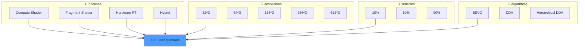

# Research Overview

VIXEN serves as a voxel ray tracing research platform for comparative pipeline analysis, targeting academic publication (May 2026).

---

## 1. Research Question

> **How do different Vulkan pipeline architectures affect rendering performance, GPU bandwidth utilization, and scalability for data-driven voxel rendering?**

---

## 2. Test Matrix

**Total Configurations:** 4 × 5 × 3 × 3 = 180

---

## 3. Key Research Topics

### [[ESVO-Algorithm|ESVO Algorithm]]
Efficient Sparse Voxel Octrees (Laine & Karras, 2010)
- Parametric plane traversal
- Octant mirroring
- Stack-based hierarchy descent

### [[Voxel-Papers|Voxel Papers]]
Bibliography of 24+ research papers covering:
- Voxel rendering techniques
- Ray tracing algorithms
- GPU optimization
- Compression methods

### [[Pipeline-Comparison|Pipeline Comparison]]
4-way performance analysis:
- Compute shader ray marching
- Fragment shader ray marching
- Hardware ray tracing (VK_KHR_ray_tracing_pipeline)
- Hybrid approaches

---

## 4. Metrics Collected

| Metric | Source | Purpose |
|--------|--------|---------|
| Frame Time (ms) | CPU timer | Overall performance |
| GPU Time (ms) | VkQueryPool | GPU execution time |
| Ray Throughput (Mrays/sec) | Calculated | Primary benchmark |
| VRAM Usage (MB) | VK_EXT_memory_budget | Memory efficiency |
| Bandwidth (GB/s) | Estimated/NSight | Memory bottleneck |
| Cache Hit Rate | Shader counters | Algorithm efficiency |

---

## 5. Publication Target

| Milestone | Date | Deliverable |
|-----------|------|-------------|
| Phase I Complete | Dec 2025 | Profiling system |
| Phase K Complete | Feb 2026 | Hardware RT pipeline |
| Data Collection | Mar 2026 | 180-config results |
| Paper Draft | Apr 2026 | Initial submission |
| Publication | May 2026 | Conference/journal |

---

## 6. Expected Contributions

1. **Comparative Analysis** - First systematic comparison of 4 Vulkan pipelines for voxel rendering
2. **Performance Model** - Predictive model for pipeline selection based on scene characteristics
3. **Optimization Guidelines** - Best practices for each pipeline type
4. **Open Source** - Complete codebase and data publicly available

---

## 7. Related Pages

- [[ESVO-Algorithm]] - Core traversal algorithm
- [[Voxel-Papers]] - Research bibliography
- [[Pipeline-Comparison]] - 4-way comparison design
- [[../02-Implementation/SVO-System|SVO System]] - Implementation details
- [[../05-Progress/Roadmap|Roadmap]] - Development timeline
