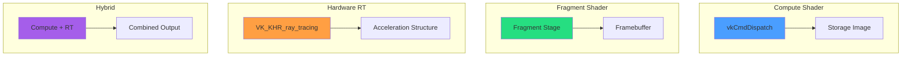
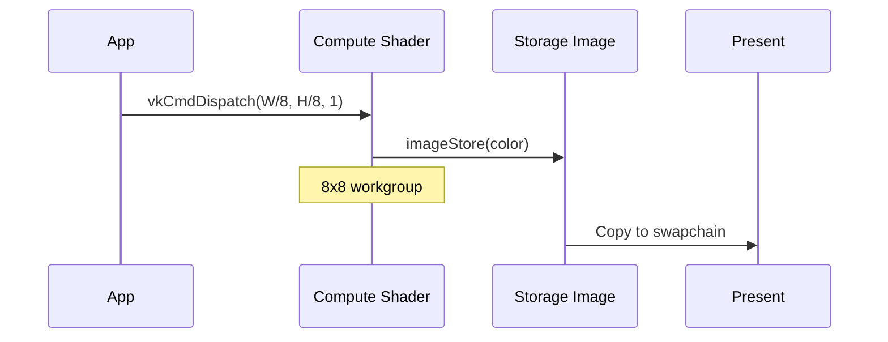
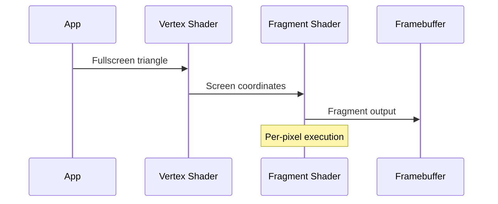
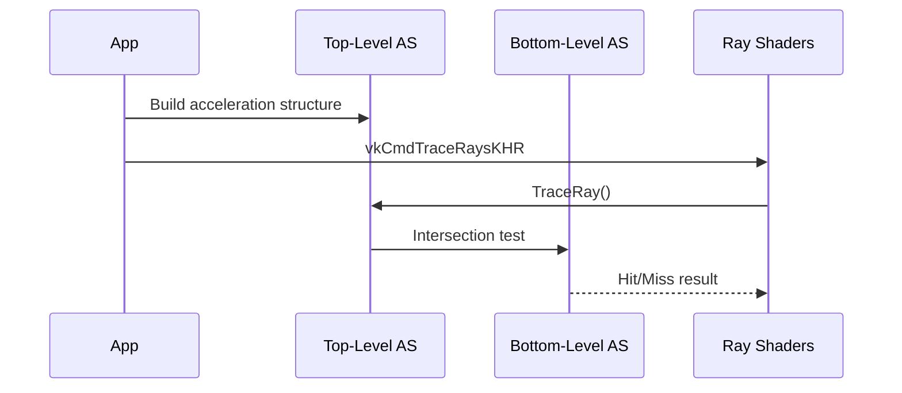
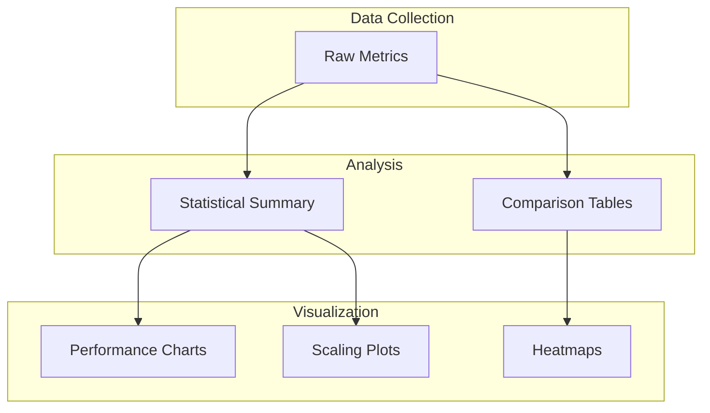

# Pipeline Comparison

Systematic comparison of 4 Vulkan pipeline architectures for voxel ray tracing.

---

## 1. Pipeline Architectures



---

## 2. Implementation Status

| Pipeline | Status | Shader Files |
|----------|--------|--------------|
| **Compute (Uncompressed)** | Complete | VoxelRayMarch.comp |
| **Compute (Compressed)** | Complete | VoxelRayMarch_Compressed.comp |
| **Fragment (Uncompressed)** | Complete | VoxelRayMarch.frag |
| **Fragment (Compressed)** | Complete | VoxelRayMarch_Compressed.frag |
| **Hardware RT** | Phase K | (Planned) |
| **Hybrid** | Phase L | (Planned) |

---

## 3. Architectural Differences

### 3.1 Compute Shader Pipeline



**Characteristics:**
- Direct image write via `imageStore()`
- Workgroup-based parallelism
- No rasterization overhead
- Full control over ray generation

### 3.2 Fragment Shader Pipeline



**Characteristics:**
- Automatic pixel coverage
- Built-in depth testing
- ROP blending available
- Traditional pipeline overhead

### 3.3 Hardware RT Pipeline



**Characteristics:**
- Hardware-accelerated BVH traversal
- Fixed-function intersection testing
- Requires acceleration structure build
- VK_KHR_ray_tracing_pipeline extension

### 3.4 Hybrid Pipeline

**Concept:** Use hardware RT for coarse structure, compute for fine detail.


---

## 4. Test Matrix

### 4.1 Configuration Space

| Dimension | Values | Count |
|-----------|--------|-------|
| Pipeline | Compute, Fragment, HW RT, Hybrid | 4 |
| Resolution | 32^3, 64^3, 128^3, 256^3, 512^3 | 5 |
| Density | 10%, 50%, 90% | 3 |
| Algorithm | ESVO, DDA, Hierarchical DDA | 3 |
| **Total** | | **180** |

### 4.2 Scene Types

| Scene | Density | Characteristics |
|-------|---------|-----------------|
| Cornell Box | ~23% | Axis-aligned walls |
| Noise | ~53% | Random distribution |
| Tunnels | ~94% | Highly occupied |
| Cityscape | ~28% | Structured geometry |

---

## 5. Metrics

### 5.1 Primary Metrics

| Metric | Unit | Source |
|--------|------|--------|
| Frame Time | ms | CPU timer |
| GPU Time | ms | VkQueryPool |
| Ray Throughput | Mrays/sec | Calculated |
| VRAM Usage | MB | VK_EXT_memory_budget |

### 5.2 Secondary Metrics

| Metric | Unit | Source |
|--------|------|--------|
| Bandwidth | GB/sec | Estimated/NSight |
| Cache Hit Rate | % | Shader counters |
| Divergence | % | GPU profiler |
| Occupancy | % | GPU profiler |

### 5.3 JSON Export Schema

```json
{
  "test_run": {
    "id": "compute_128_cornell_esvo",
    "pipeline": "compute",
    "resolution": 128,
    "scene": "cornell",
    "algorithm": "esvo"
  },
  "device": {
    "name": "NVIDIA GeForce RTX 3080",
    "driver": "537.42",
    "vram_gb": 10.0
  },
  "metrics": {
    "frame_time_ms": 0.32,
    "gpu_time_ms": 0.27,
    "ray_throughput_mrays": 1720.0,
    "vram_usage_mb": 256.0
  },
  "statistics": {
    "min": 0.25,
    "max": 0.45,
    "mean": 0.32,
    "stddev": 0.03,
    "p99": 0.42
  }
}
```

---

## 6. Expected Results

### 6.1 Hypothesis

| Pipeline | Expected Strength | Expected Weakness |
|----------|-------------------|-------------------|
| Compute | Memory bandwidth | Rasterization features |
| Fragment | Blending, depth | Overhead |
| Hardware RT | Large structures | Small voxels |
| Hybrid | Balance | Complexity |

### 6.2 Preliminary Data

From current implementation:

| Metric | Compute (Uncompressed) | Compute (Compressed) |
|--------|------------------------|---------------------|
| Throughput | 1,400-1,750 Mrays/sec | 85-303 Mrays/sec |
| Memory | ~5 MB | ~955 KB |
| GPU Time | 0.27-0.34 ms | Variable |

---

## 7. Analysis Plan

### 7.1 Statistical Analysis

1. **Per-Configuration:**
   - 300 frames per test
   - Rolling window statistics
   - Percentile analysis (P50, P95, P99)

2. **Cross-Configuration:**
   - Resolution scaling analysis
   - Density impact assessment
   - Algorithm comparison

3. **Pipeline Comparison:**
   - Paired t-tests
   - Effect size (Cohen's d)
   - Regression analysis

### 7.2 Visualization



---

## 8. Benchmark Runner

### 8.1 Configuration

```json
{
  "test_matrix": {
    "pipelines": ["compute", "fragment"],
    "resolutions": [64, 128, 256],
    "scenes": ["cornell", "noise"],
    "shaders": ["VoxelRayMarch.comp", "VoxelRayMarch_Compressed.comp"]
  },
  "execution": {
    "warmup_frames": 10,
    "measurement_frames": 100,
    "iterations": 3
  }
}
```

### 8.2 Execution

```bash
./binaries/vixen_benchmark.exe \
  --config benchmark_config.json \
  --render \
  --output results/
```

---

## 9. Code References

| Component | Location |
|-----------|----------|
| BenchmarkRunner | `libraries/Profiler/src/BenchmarkRunner.cpp` |
| BenchmarkConfig | `libraries/Profiler/src/BenchmarkConfig.cpp` |
| MetricsExporter | `libraries/Profiler/src/MetricsExporter.cpp` |
| BenchmarkGraphFactory | `libraries/Profiler/src/BenchmarkGraphFactory.cpp` |

---

## 10. Related Pages

- [[Overview]] - Research goals
- [[ESVO-Algorithm]] - Core algorithm
- [[../02-Implementation/Ray-Marching|Ray Marching]] - Shader implementation
- [[../04-Development/Profiling|Profiling]] - Measurement details
- [[../05-Progress/Roadmap|Roadmap]] - Timeline
