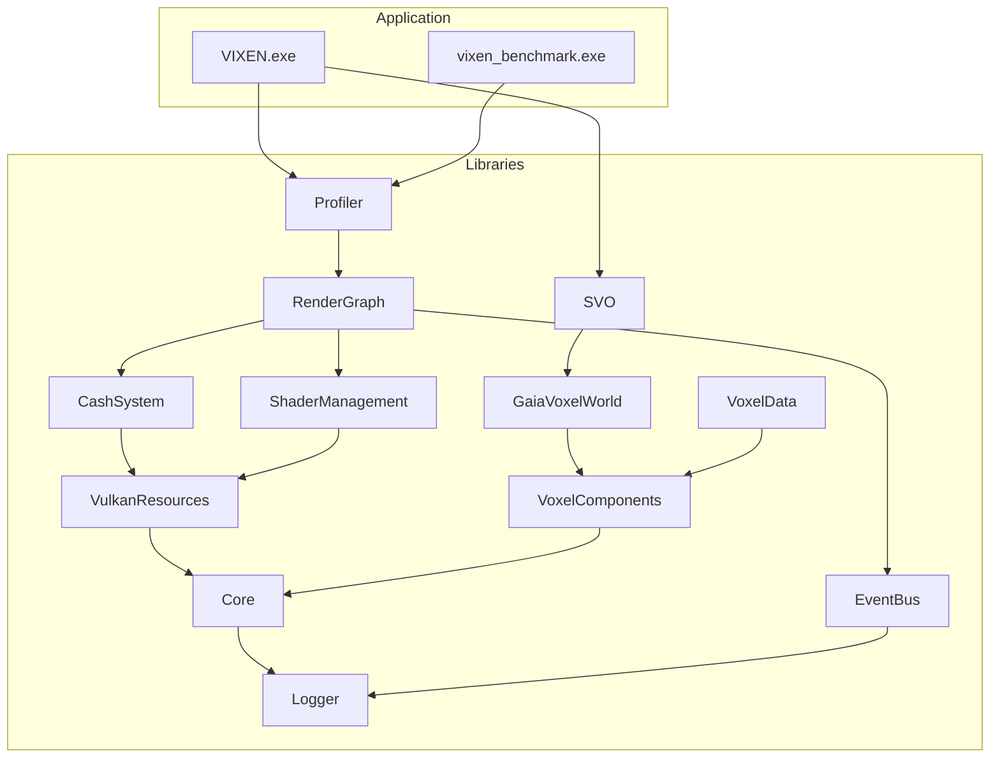

# Build System

CMake-based build system for C++23 Vulkan development on Windows.

---

## 1. CMake Configuration

### 1.1 Initial Configuration

```bash
# Standard configuration (Unity builds disabled)
cmake -B build -DCMAKE_BUILD_TYPE=Debug

# With Unity builds (faster clean builds)
cmake -B build -DCMAKE_BUILD_TYPE=Debug -DUSE_UNITY_BUILD=ON
```

> [!warning] Unity Build Limitation
> Unity builds disabled due to syntax conflicts in DXT1Compressor.cpp. Standard incremental builds are still fast (~10-30 seconds for typical changes).

### 1.2 CMake Options

| Option | Default | Description |
|--------|---------|-------------|
| AUTO_LOCATE_VULKAN | ON | Auto-detect Vulkan SDK |
| BUILD_SPV_ON_COMPILE_TIME | ON | Runtime GLSL compilation |
| USE_UNITY_BUILD | OFF | Unity builds for speed |
| ENABLE_COVERAGE | OFF | LCOV coverage generation |

---

## 2. Build Commands

### 2.1 Full Build

```bash
# Build with all 16 cores, filter PDB warnings
cmake --build build --config Debug --parallel 16 2>&1 | grep -v "warning LNK4099"
```

**Build Time:** ~3-5 minutes (full project)

### 2.2 Incremental Build

```bash
# Only rebuild changed files
cmake --build build --config Debug --parallel 16
```

**Build Time:** ~10-30 seconds

### 2.3 Target-Specific Build

```bash
# Single library
cmake --build build --config Debug --target SVO --parallel 16

# Multiple libraries
cmake --build build --config Debug --target Core GaiaVoxelWorld SVO --parallel 16

# Specific tests
cmake --build build --config Debug --target test_rebuild_hierarchy test_cornell_box --parallel 16
```

**Build Time:** ~30 seconds - 1 minute

---

## 3. Project Structure



---

## 4. Compiler Settings

### 4.1 Standards

| Setting | Value |
|---------|-------|
| C++ Standard | C++23 |
| C Standard | C23 |
| Compiler | MSVC (Visual Studio 2022+) |
| Architecture | x64 |

### 4.2 Enabled Optimizations

| Optimization | Flag | Description |
|--------------|------|-------------|
| Multi-processor | `/MP` | All 16 cores |
| Precompiled headers | PCH | Per-library pch.h |
| sccache | Automatic | Compilation caching |
| PDB warning suppress | `/ignore:4099` | Hide external lib warnings |

---

## 5. Vulkan SDK Integration

### 5.1 Auto-Detection

CMake automatically finds Vulkan SDK when installed in standard location.

### 5.2 Manual Path (Fallback)

```cmake
VULKAN_SDK = "C:/VulkanSDK"
VULKAN_VERSION = "1.4.321.1"
VULKAN_PATH = "${VULKAN_SDK}/${VULKAN_VERSION}"
```

### 5.3 Required Libraries

| Library | Debug | Release |
|---------|-------|---------|
| vulkan-1 | vulkan-1 | vulkan-1 |
| SPIRV | SPIRVd | SPIRV |
| glslang | glslangd | glslang |
| OSDependent | OSDependentd | OSDependent |
| SPIRV-Tools | SPIRV-Toolsd | SPIRV-Tools |
| SPIRV-Tools-opt | SPIRV-Tools-optd | SPIRV-Tools-opt |

---

## 6. Library Configuration

### 6.1 RenderGraph (Main Library)

```cmake
add_library(RenderGraph
    src/Core/RenderGraph.cpp
    src/Core/NodeInstance.cpp
    src/Nodes/SwapChainNode.cpp
    # ... 40+ files
)

target_precompile_headers(RenderGraph PRIVATE include/pch.h)
target_link_libraries(RenderGraph PUBLIC
    EventBus
    CashSystem
    ShaderManagement
    VulkanResources
)
```

### 6.2 SVO (Voxel Library)

```cmake
add_library(SVO
    src/LaineKarrasOctree.cpp
    src/EntityBrickView.cpp
    # ...
)

target_link_libraries(SVO PUBLIC
    GaiaVoxelWorld
    VoxelComponents
    Core
)

# Tests
add_executable(test_rebuild_hierarchy tests/test_rebuild_hierarchy.cpp)
target_link_libraries(test_rebuild_hierarchy PRIVATE SVO GTest::gtest_main)
```

---

## 7. Output Directories

| Type | Path |
|------|------|
| Executables | `binaries/` |
| Libraries | `build/libraries/{lib}/Debug/` |
| Tests | `build/libraries/{lib}/tests/Debug/` |
| Generated SDI | `generated/sdi/` |
| Runtime SDI | `binaries/generated/sdi/` |

---

## 8. Troubleshooting

### 8.1 Common Issues

| Problem | Solution |
|---------|----------|
| "Cannot open include file" | Run `cmake -B build` to regenerate |
| LNK4099 PDB warnings | Filter with `grep -v "warning LNK4099"` |
| Build takes 10+ minutes | Use `--parallel 16`, target-specific builds |
| Zombie processes | `taskkill /F /IM MSBuild.exe /T` |

### 8.2 Clean Rebuild

```bash
# Full clean
rm -rf build

# Reconfigure
cmake -B build -DCMAKE_BUILD_TYPE=Debug

# Build
cmake --build build --config Debug --parallel 16
```

---

## 9. Shader Compilation

### 9.1 Runtime Compilation

With `BUILD_SPV_ON_COMPILE_TIME=ON`:
- GLSL compiled at startup via glslang
- No pre-compilation step needed
- Slower startup, faster development

### 9.2 Offline Compilation

```bash
# Manual shader compilation
glslangValidator.exe shader.comp -V -o shader.comp.spv
```

---

## 10. Code References

| File | Purpose |
|------|---------|
| `CMakeLists.txt` | Root configuration |
| `libraries/CMakeLists.txt` | Library definitions |
| `cmake/` | CMake modules |
| `.vscode/settings.json` | VS Code integration |

---

## 11. Related Pages

- [[Overview]] - Development overview
- [[Testing]] - Test configuration
- [[../02-Implementation/Shaders|Shaders]] - Shader compilation
