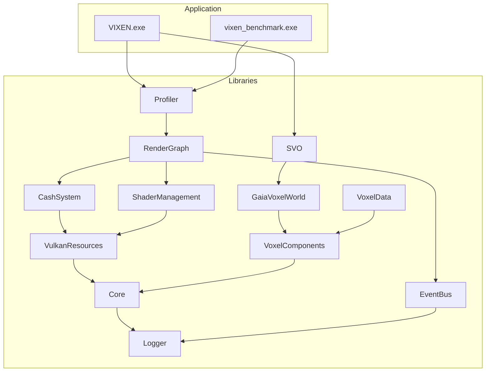

# Build System

CMake-based build system for C++23 Vulkan development on Windows.

---

## 0. Quick Start (Windows launcher)

`build.bat` at the repo root is the tracked, path-agnostic entry point. It
discovers the toolchain instead of hardcoding paths, so it works on any
machine, VS edition, or clone location:

- **vcvars64.bat** — located via `vswhere` (ships with every VS 2017+); no
  VS-year/edition assumptions.
- **cmake** — taken from `PATH`, with a well-known install-dir fallback.
- **repo root** — derived from the script's own location (`%~dp0`).
- **sccache** — `SCCACHE_DIR` / `SCCACHE_CACHE_SIZE` default here (a shared
  compiler cache), but any value you set in your environment wins.

```bat
build.bat            :: configure + build the vixen-ninja preset (default)
build.bat configure  :: configure only
build.bat build      :: build only
build.bat all vixen-ninja   :: explicit action + preset
```

The `vixen-ninja` preset sets `/Z7` embedded debug info so MSVC debug builds
are sccache-cacheable; a plain `-G Ninja` build uses separate-PDB `/Zi`, which
sccache treats as non-cacheable. The gitignored `_ninja_*.bat` scripts are
personal overrides — `build.bat` is the shared, committed launcher.

`build.bat build`/`build.bat all` run through `run_build_with_summary.ps1`, which:
- passes `-k 0` to ninja so ONE broken target never masks whether everything
  else built — the end-of-build summary lists every `FAILED:` target instead
  of stopping at the first one;
- writes a live-updating status file (`%TEMP%\vixen_build_status.txt` by
  default) every 5s — `targets_done`/`targets_total`/`targets_failed`/
  `last_target` — so an agent or human can check build progress without
  tailing raw ninja scrollback. `cat`/`Get-Content` it anytime mid-build.

See `Worktree-Build-Artifact-Accumulation-Audit-2026-07.md` Fix 7/Fix 8 for
the design rationale and gotchas (cmd.exe CRLF fragility, PowerShell
background-job working-directory/encoding pitfalls).

---

## 1. CMake Configuration

### 1.1 Initial Configuration

```bash
# Standard configuration (Unity builds disabled)
cmake -B build -DCMAKE_BUILD_TYPE=Debug

# With Unity builds (faster clean builds)
cmake -B build -DCMAKE_BUILD_TYPE=Debug -DUSE_UNITY_BUILD=ON
```

> [!warning] Unity Build Limitation
> Unity builds disabled due to syntax conflicts in DXT1Compressor.cpp. Standard incremental builds are still fast (~10-30 seconds for typical changes).

### 1.2 CMake Options

| Option | Default | Description |
|--------|---------|-------------|
| AUTO_LOCATE_VULKAN | ON | Auto-detect Vulkan SDK |
| BUILD_SPV_ON_COMPILE_TIME | ON | Runtime GLSL compilation |
| USE_UNITY_BUILD | OFF | Unity builds for speed |
| ENABLE_COVERAGE | OFF | LCOV coverage generation |
| VIXEN_SCHEMA_CATALOG | Auto-detected | Optional `schemas.json` input for AppFlow/ViewNounId codegen checks |

Standalone configures discover the catalogue from `UNDERTOW_ROOT`, repository
layout paths, or common Undertow checkouts under the current home directory.
Set `UNDERTOW_ROOT` or pass `-DVIXEN_SCHEMA_CATALOG=<path>/schemas.json` when
the Undertow checkout is elsewhere. Discovery is configure-time and does not
store the detected path in the CMake cache.

---

## 2. Build Commands

### 2.1 Full Build

```bash
# Build with all 16 cores, filter PDB warnings
cmake --build build --config Debug --parallel 16 2>&1 | grep -v "warning LNK4099"
```

**Build Time:** ~3-5 minutes (full project)

### 2.2 Incremental Build

```bash
# Only rebuild changed files
cmake --build build --config Debug --parallel 16
```

**Build Time:** ~10-30 seconds

### 2.3 Target-Specific Build

```bash
# Single library
cmake --build build --config Debug --target SVO --parallel 16

# Multiple libraries
cmake --build build --config Debug --target Core GaiaVoxelWorld SVO --parallel 16

# Specific tests
cmake --build build --config Debug --target test_rebuild_hierarchy test_cornell_box --parallel 16
```

**Build Time:** ~30 seconds - 1 minute

---

## 3. Project Structure


```mermaid
flowchart TD
    subgraph Libraries
        CORE[Core]
        LOG[Logger]
        EB[EventBus]
        VR[VulkanResources]
        CS[CashSystem]
        SM[ShaderManagement]
        RG[RenderGraph]
        VC[VoxelComponents]
        GVW[GaiaVoxelWorld]
        SVO[SVO]
        VD[VoxelData]
        PR[Profiler]
    end

    subgraph Application
        VIXEN[VIXEN.exe]
        BENCH[vixen_benchmark.exe]
    end

    CORE --> LOG
    EB --> LOG
    VR --> CORE
    CS --> VR
    SM --> VR
    RG --> CS
    RG --> SM
    RG --> EB
    VC --> CORE
    GVW --> VC
    SVO --> GVW
    VD --> VC
    PR --> RG
    VIXEN --> PR
    VIXEN --> SVO
    BENCH --> PR
    class CORE internal-link
    class LOG internal-link
    class EB internal-link
    class VR internal-link
    class CS internal-link
    class SM internal-link
    class RG internal-link
    class VC internal-link
    class GVW internal-link
    class SVO internal-link
    class VD internal-link
    class PR internal-link
```

---

## 4. Compiler Settings

### 4.1 Standards

| Setting | Value |
|---------|-------|
| C++ Standard | C++23 |
| C Standard | C23 |
| Compiler | MSVC (Visual Studio 2022+) |
| Architecture | x64 |

### 4.2 Enabled Optimizations

| Optimization | Flag | Description |
|--------------|------|-------------|
| Multi-processor | `/MP` | All 16 cores |
| Precompiled headers | PCH | Per-library pch.h |
| sccache | Automatic | Compilation caching |
| PDB warning suppress | `/ignore:4099` | Hide external lib warnings |

---

## 5. Vulkan SDK Integration

### 5.1 Auto-Detection

CMake automatically finds Vulkan SDK when installed in standard location.

### 5.2 Manual Path (Fallback)

```cmake
VULKAN_SDK = "C:/VulkanSDK"
VULKAN_VERSION = "1.4.321.1"
VULKAN_PATH = "${VULKAN_SDK}/${VULKAN_VERSION}"
```

### 5.3 Required Libraries

| Library | Debug | Release |
|---------|-------|---------|
| vulkan-1 | vulkan-1 | vulkan-1 |
| SPIRV | SPIRVd | SPIRV |
| glslang | glslangd | glslang |
| OSDependent | OSDependentd | OSDependent |
| SPIRV-Tools | SPIRV-Toolsd | SPIRV-Tools |
| SPIRV-Tools-opt | SPIRV-Tools-optd | SPIRV-Tools-opt |

---

## 6. Library Configuration

### 6.1 RenderGraph (Main Library)

```cmake
add_library(RenderGraph
    src/Core/RenderGraph.cpp
    src/Core/NodeInstance.cpp
    src/Nodes/SwapChainNode.cpp
    # ... 40+ files
)

target_precompile_headers(RenderGraph PRIVATE include/pch.h)
target_link_libraries(RenderGraph PUBLIC
    EventBus
    CashSystem
    ShaderManagement
    VulkanResources
)
```

### 6.2 SVO (Voxel Library)

```cmake
add_library(SVO
    src/LaineKarrasOctree.cpp
    src/EntityBrickView.cpp
    # ...
)

target_link_libraries(SVO PUBLIC
    GaiaVoxelWorld
    VoxelComponents
    Core
)

# Tests
add_executable(test_rebuild_hierarchy tests/test_rebuild_hierarchy.cpp)
target_link_libraries(test_rebuild_hierarchy PRIVATE SVO GTest::gtest_main)
```

---

## 7. Output Directories

| Type | Path |
|------|------|
| Executables | `build/<preset>/binaries/` |
| Libraries | `build/libraries/{lib}/Debug/` |
| Tests | `build/libraries/{lib}/tests/Debug/` |
| Generated SDI | `generated/sdi/` |
| Runtime SDI | `build/<preset>/binaries/generated/sdi/` |

`binaries/` lives under the build dir (not the source tree) as of 2026-07 — see
Worktree-Build-Artifact-Accumulation-Audit-2026-07.md Fix 2. `rm -rf build` now reclaims
everything, including the multi-GB PDB/ILK files MSVC debug builds produce.

---

## 8. Troubleshooting

### 8.1 Common Issues

| Problem | Solution |
|---------|----------|
| "Cannot open include file" | Run `cmake -B build` to regenerate |
| LNK4099 PDB warnings | Filter with `grep -v "warning LNK4099"` |
| Build takes 10+ minutes | Use `--parallel 16`, target-specific builds |
| Zombie processes | `taskkill /F /IM MSBuild.exe /T` |

### 8.2 Clean Rebuild

```bash
# Full clean
rm -rf build

# Reconfigure
cmake -B build -DCMAKE_BUILD_TYPE=Debug

# Build
cmake --build build --config Debug --parallel 16
```

---

## 9. Shader Compilation

### 9.1 Runtime Compilation

With `BUILD_SPV_ON_COMPILE_TIME=ON`:
- GLSL compiled at startup via glslang
- No pre-compilation step needed
- Slower startup, faster development

### 9.2 Offline Compilation

```bash
# Manual shader compilation
glslangValidator.exe shader.comp -V -o shader.comp.spv
```

---

## 10. Code References

| File | Purpose |
|------|---------|
| `CMakeLists.txt` | Root configuration |
| `libraries/CMakeLists.txt` | Library definitions |
| `cmake/` | CMake modules |
| `.vscode/settings.json` | VS Code integration |

---

## 11. CodeGraph from an isolated worktree

The lane worktrees under `.claude-worktrees/` do not carry CodeGraph indexes.
Run the repository helper from any VIXEN worktree; it checks the current
worktree and the canonical checkout, then queries the available index with
`codegraph explore --path`:

```bash
tools/codegraph-vixen.sh "capture runtime output paths"
```

If the index lives in another VIXEN checkout, point the helper at that checkout:

```bash
VIXEN_CODEGRAPH_ROOT=/absolute/path/to/indexed/VIXEN \
  tools/codegraph-vixen.sh "capture runtime output paths"
```

The helper does not initialize, update, or commit an index. When it selects a
shared checkout, its results may not include uncommitted lane changes.

## 12. WSL windowed capture witness

On WSL2 with an active WSLg `X0` socket, CMake registers
`vixen_wsl_capture_witness`. CTest declares `DISPLAY=:0` and the configured
Vulkan loader environment for the test, so invoke it with the caller's display
environment unset:

```bash
bash tools/with-test-lock.sh --agent AGENT_ID --resource test \
  --label native-capture-witness -- \
  env -u DISPLAY -u WAYLAND_DISPLAY ctest --test-dir build \
  --output-on-failure -R '^vixen_wsl_capture_witness$'
```

The test writes three HUD PNGs and four editor PNGs under
`build/runtime-captures/native/` and keeps each process log beside them. The
runner receives each executable's runtime directory and filename from CMake's
target generator expressions, so it follows the active build configuration.
The existing CTest producer fixtures continue to use offscreen capture and use
their targets' runtime directories as their working directories.

## 13. Compare native captures

Save one native run, repeat the witness, and compare the paired PNGs:

```bash
cp -a build/runtime-captures/native build/runtime-captures/before
bash tools/with-test-lock.sh --agent AGENT_ID --resource test \
  --label native-capture-after -- \
  env -u DISPLAY -u WAYLAND_DISPLAY ctest --test-dir build \
  --output-on-failure -R '^vixen_wsl_capture_witness$'
python3 tools/compare-capture-pixels.py \
  build/runtime-captures/before build/runtime-captures/native
```

The comparator reports per-file byte differences and decoded pixel differences.
Its default exit code is `0` when paired pixels match, `1` for missing or
different captures, and `2` for unreadable or unsupported PNG data. Use
`--max-differing-pixels N` and `--channel-tolerance N` for a pixel tolerance;
`--require-byte-identical` also makes a PNG byte difference fail the command.

## 14. Related Pages

- [[Overview]] - Development overview
- [[Testing]] - Test configuration
- [[../02-Implementation/Shaders|Shaders]] - Shader compilation
