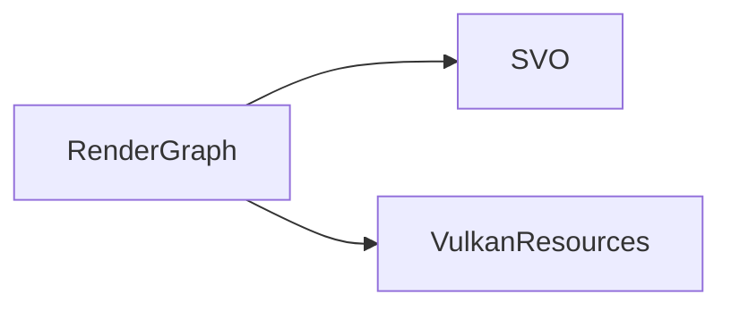
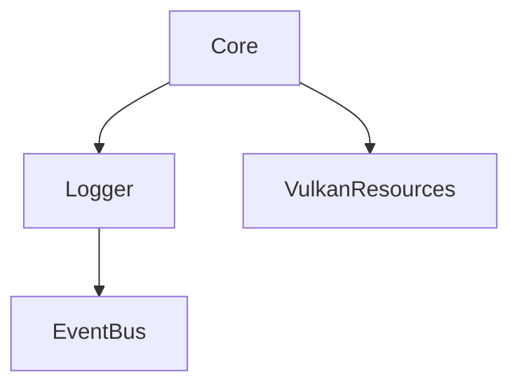
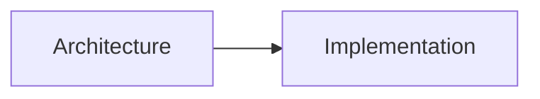
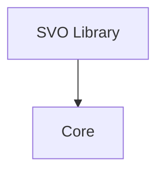
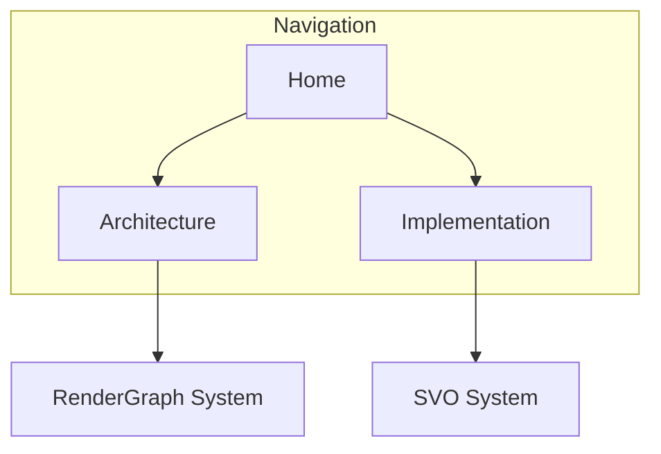
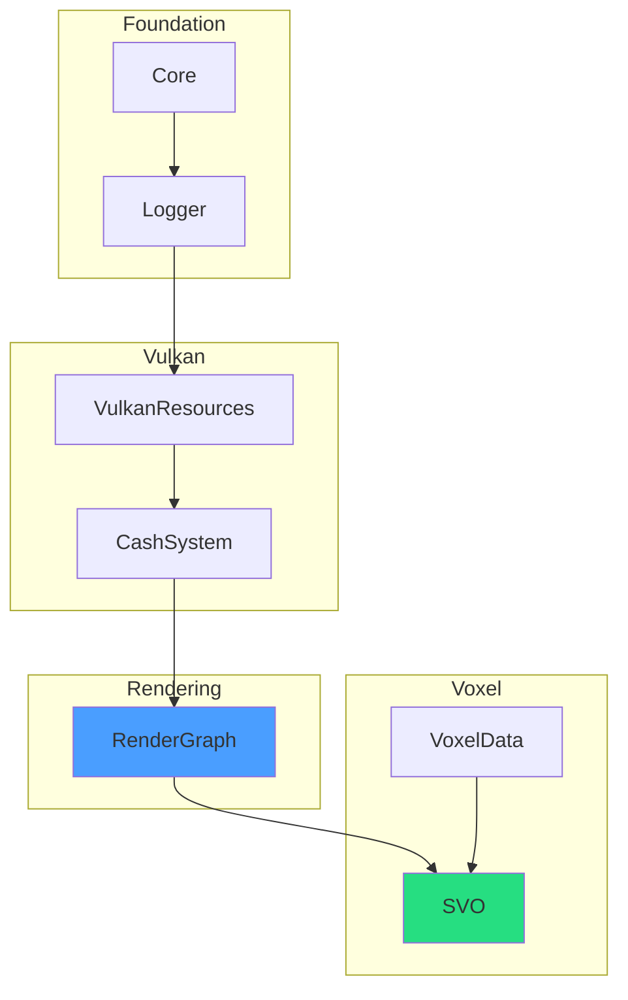
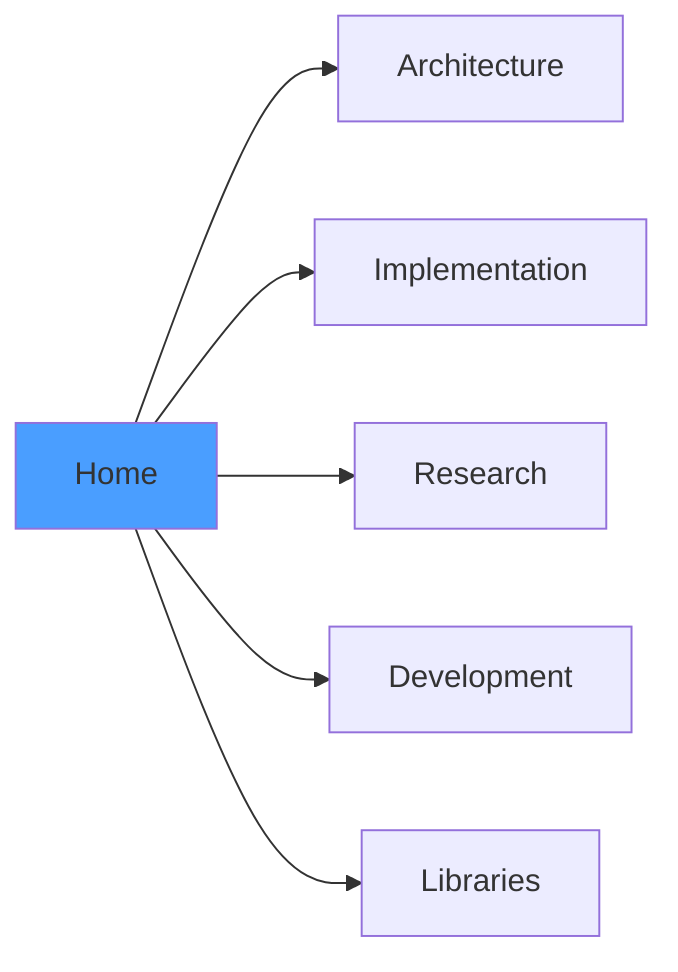

# Mermaid Clickable Links in Obsidian

This guide covers how to make Mermaid diagram nodes clickable for navigation within an Obsidian vault.

---

## 1. Quick Reference

| Method | Syntax | Use Case |
|--------|--------|----------|
| `internal-link` class | `class NodeId internal-link;` | Link to note matching node label |
| `obsidian://` URI | `click NodeId "obsidian://open?vault=X&file=Y"` | Link to specific file |
| `flowchart` + URL | `click NodeId "URL"` | External links |

---

## 2. Method 1: internal-link Class (Recommended)

The simplest approach for internal vault navigation. Available since Obsidian v0.9.21.

### 2.1 Basic Syntax



**How it works:**
- The node label becomes the link target
- `A[RenderGraph]` links to a note named "RenderGraph"
- Supports hover preview (Ctrl+hover)
- Works with notes in folders (not vault root)

### 2.2 Multiple Nodes



### 2.3 Limitations

- Node label MUST match the target note name exactly
- Notes in vault root may not work - use folders
- Cannot display different text than the link target

---

## 3. Method 2: Obsidian URI (Full Control)

Use `obsidian://` URLs for precise control over link targets.

### 3.1 Basic Syntax



### 3.2 URI Format

```
obsidian://open?vault=VaultName&file=FolderPath/FileName
```

| Parameter | Description | Example |
|-----------|-------------|---------|
| `vault` | Vault name (spaces: use `%20`) | `Vixen-Docs` |
| `file` | Path relative to vault root | `Libraries/SVO` |

### 3.3 With Tooltips



---

## 4. Critical: Use flowchart, Not graph

**IMPORTANT**: Click events only work reliably with `flowchart`, not `graph`.

### 4.1 Working Example


### 4.2 Non-Working Example


The `graph` syntax renders different HTML that does not support click callbacks in Obsidian.

---

## 5. Combining Methods

You can mix `internal-link` class with explicit `click` directives:



---

## 6. VIXEN Vault Examples

### 6.1 Library Dependency Graph (Clickable)



### 6.2 Section Navigation (Clickable)



---

## 7. Troubleshooting

| Issue | Cause | Solution |
|-------|-------|----------|
| Click does nothing | Using `graph` instead of `flowchart` | Change to `flowchart` |
| Link opens wrong file | Node label doesn't match file name | Use explicit `click` with URI |
| Links don't work in root | Obsidian limitation | Move notes to folders |
| Hover preview missing | Not using `internal-link` class | Add `class NodeId internal-link` |
| Spaces in file name | URI encoding | Use `%20` for spaces |

---

## 8. Best Practices

1. **Always use `flowchart`** for clickable diagrams
2. **Prefer `internal-link` class** for simple same-name links
3. **Use `obsidian://` URIs** when display text differs from file name
4. **Add tooltips** for complex diagrams: `click A "URL" "Description"`
5. **Test links** after creating - Obsidian version differences may affect behavior

---

## 9. References

- [Obsidian Forum: Obsidian Links in Mermaid](https://forum.obsidian.md/t/obsidian-links-in-mermaid/2965)
- [Obsidian Forum: Internal Links in Mermaid](https://forum.obsidian.md/t/internal-links-in-mermaid/9562)
- [Obsidian Forum: Flowchart vs Graph URL Behavior](https://forum.obsidian.md/t/mermaid-url-opens-in-flowchart-but-not-in-graph/22088)
- [Mermaid Official Documentation](https://mermaid.js.org/syntax/flowchart.html#interaction)

---

## 10. Related Pages

- [[Overview|Development Overview]] - Development documentation
- [[../00-Index/Home|Home]] - Vault home page
- [[../Libraries/Overview|Libraries]] - Library documentation

