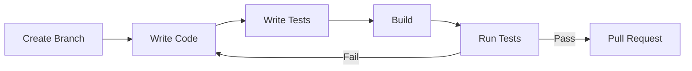

# Development Overview

Setup, build system, testing, and coding standards for VIXEN development.

---

## 1. Quick Start

### 1.1 Prerequisites

| Requirement | Version | Notes |
|-------------|---------|-------|
| Windows | 10/11 | Win32 platform only |
| Visual Studio | 2022+ | C++23 support required |
| Vulkan SDK | 1.4.321.1 | `C:\VulkanSDK\1.4.321.1` |
| CMake | 4.0.3+ | Build system |
| Git | 2.x | Version control |

### 1.2 Initial Setup

```bash
# Clone repository
git clone <repo-url>
cd VIXEN

# Configure build
cmake -B build -DCMAKE_BUILD_TYPE=Debug

# Build (all 16 cores)
cmake --build build --config Debug --parallel 16
```

### 1.3 Run Application

```bash
# Main application
./binaries/VIXEN.exe

# Run tests
./build/libraries/SVO/tests/Debug/test_rebuild_hierarchy.exe
```

---

## 2. Development Sections

### [[Build-System|Build System]]
CMake configuration, compilation options, and build optimization.

**Key Topics:**
- CMake options (AUTO_LOCATE_VULKAN, BUILD_SPV_ON_COMPILE_TIME)
- Unity builds for faster compilation
- Target-specific builds

### [[Testing|Testing]]
GoogleTest framework, coverage analysis, and test organization.

**Key Topics:**
- Test suites by library
- VS Code Test Explorer integration
- LCOV coverage visualization

### [[Coding-Standards|Coding Standards]]
C++23 guidelines, naming conventions, and architectural principles.

**Key Topics:**
- Nomenclature (PascalCase, camelCase)
- SOLID principles
- Memory management with smart pointers

### [[Profiling|Profiling]]
GPU performance measurement and benchmark runner.

**Key Topics:**
- GPUTimestampQuery usage
- Mrays/sec calculation
- JSON/CSV export

---

## 3. IDE Setup

### 3.1 VS Code Extensions

| Extension | Purpose |
|-----------|---------|
| C/C++ | IntelliSense, debugging |
| CMake Tools | Build integration |
| Test Explorer UI | Test visualization |
| C++ TestMate | GoogleTest runner |
| Coverage Gutters | LCOV visualization |

### 3.2 Recommended Settings

```json
{
  "testMate.cpp.test.executables": "{build}/**/*{test,Test,TEST}*",
  "cmake.testExplorer.enabled": true,
  "cmake.configureOnOpen": true,
  "C_Cpp.default.cppStandard": "c++23"
}
```

---

## 4. Workflow

### 4.1 Feature Development



### 4.2 Recommended Commit Flow

1. **Incremental builds** during development
2. **Target-specific builds** for fast iteration
3. **Full build** before commit
4. **Run affected tests** before push
5. **Update activeContext.md** after significant work

---

## 5. Key Commands

### 5.1 Build Commands

```bash
# Full project (with PDB filter)
cmake --build build --config Debug --parallel 16 2>&1 | grep -v "warning LNK4099"

# Specific library
cmake --build build --config Debug --target SVO --parallel 16

# Specific tests
cmake --build build --config Debug --target test_rebuild_hierarchy --parallel 16
```

### 5.2 Test Commands

```bash
# Single test
./build/libraries/SVO/tests/Debug/test_rebuild_hierarchy.exe --gtest_brief=1

# All SVO tests
cd build/libraries/SVO/tests/Debug && for t in test_*.exe; do ./$t --gtest_brief=1; done

# With filter
./test_ray_casting.exe --gtest_filter="*CornellBox*"
```

### 5.3 Clean Commands

```bash
# Kill zombie processes
taskkill /F /IM MSBuild.exe /T 2>nul; taskkill /F /IM cl.exe /T 2>nul

# Clean rebuild
rm -rf build && cmake -B build
```

---

## 6. Debugging

### 6.1 Visual Studio

1. Open `build/VIXEN.sln`
2. Set startup project
3. Set breakpoints
4. F5 to debug

### 6.2 VS Code

1. Configure `launch.json`:
```json
{
  "type": "cppvsdbg",
  "request": "launch",
  "program": "${workspaceFolder}/binaries/VIXEN.exe",
  "args": [],
  "cwd": "${workspaceFolder}"
}
```

### 6.3 Vulkan Validation

Validation layers enabled by default in debug builds:
```cpp
VK_LAYER_KHRONOS_validation
```

Check console for validation errors.

---

## 7. Related Pages

- [[Build-System]] - Detailed build configuration
- [[Testing]] - Test framework and coverage
- [[Coding-Standards]] - Code style guidelines
- [[Profiling]] - Performance measurement
- [[../05-Progress/Current-Status|Current Status]] - Active development
