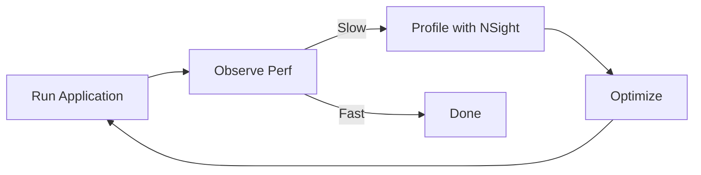
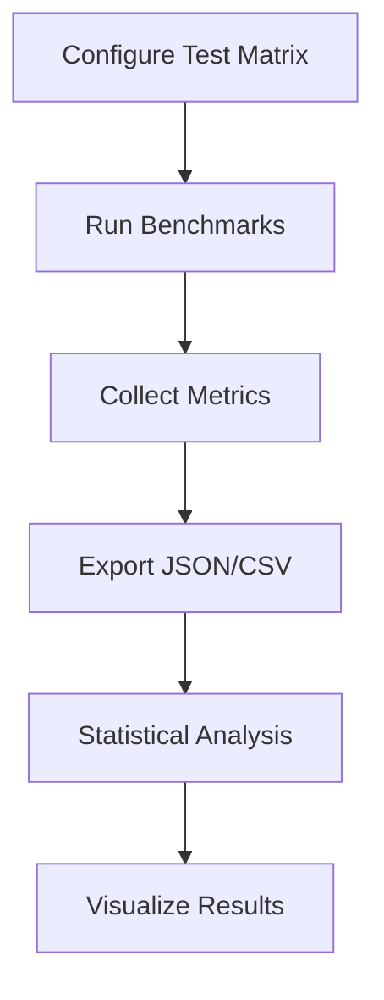

# Profiling

GPU performance measurement, benchmark runner, and metrics export for VIXEN.

---

## 1. GPU Timestamp Queries

### 1.1 GPUTimestampQuery Class

```cpp
class GPUTimestampQuery {
    VkQueryPool timestampPool_;
    VkQueryPool pipelineStatsPool_;
    float timestampPeriod_;  // Nanoseconds per tick
    uint32_t maxTimestamps_ = 4;

public:
    void Create(VkDevice device, VkPhysicalDevice physicalDevice);
    void ResetQueries(VkCommandBuffer cmd);
    void WriteTimestamp(VkCommandBuffer cmd, VkPipelineStageFlagBits stage, uint32_t query);
    std::optional<double> GetElapsedMs(VkDevice device, uint32_t startQuery, uint32_t endQuery);
    double CalculateMraysPerSec(double elapsedMs, uint32_t width, uint32_t height);
};
```

### 1.2 Usage Pattern

```cpp
void ComputeDispatchNode::ExecuteImpl(Context& ctx) {
    // Reset queries at frame start
    gpuQuery_.ResetQueries(cmd);

    // Record start timestamp
    gpuQuery_.WriteTimestamp(cmd, VK_PIPELINE_STAGE_TOP_OF_PIPE_BIT, 0);

    // Dispatch compute shader
    vkCmdDispatch(cmd, dispatchX, dispatchY, dispatchZ);

    // Record end timestamp
    gpuQuery_.WriteTimestamp(cmd, VK_PIPELINE_STAGE_BOTTOM_OF_PIPE_BIT, 1);
}

void ComputeDispatchNode::CollectTimingResults() {
    auto elapsedMs = gpuQuery_.GetElapsedMs(device, 0, 1);
    if (elapsedMs) {
        double mrays = gpuQuery_.CalculateMraysPerSec(*elapsedMs, width, height);
        gpuPerfLogger_.RecordFrame(*elapsedMs, mrays);
    }
}
```

---

## 2. Performance Logger

### 2.1 GPUPerformanceLogger Class

```cpp
class GPUPerformanceLogger : public Logger {
    std::array<double, 60> dispatchTimes_;  // Rolling window
    std::array<double, 60> mraysPerSec_;
    size_t sampleIndex_ = 0;
    size_t sampleCount_ = 0;

public:
    void RecordFrame(double dispatchMs, double mrays);
    void MaybeLog(uint32_t frameNumber, uint32_t width, uint32_t height);
    void LogStats(uint32_t width, uint32_t height);
};
```

### 2.2 Output Format

```
[GPU Perf] Dispatch: 0.32 ms avg (0.27-0.45) | Mrays/s: 1720 avg | Resolution: 720x720
```

---

## 3. Metrics

### 3.1 Primary Metrics

| Metric | Unit | Calculation |
|--------|------|-------------|
| Frame Time | ms | CPU timer |
| GPU Time | ms | VkQueryPool timestamps |
| Ray Throughput | Mrays/sec | (width * height) / (gpu_time_s * 1e6) |
| VRAM Usage | MB | VK_EXT_memory_budget |

### 3.2 Secondary Metrics

| Metric | Source | Notes |
|--------|--------|-------|
| Bandwidth | Estimated | ~memory_reads / gpu_time |
| Cache Hit | Shader counters | VK_EXT_pipeline_properties |
| Occupancy | NSight | External tool |

### 3.3 Statistics

| Statistic | Description |
|-----------|-------------|
| Min | Minimum over window |
| Max | Maximum over window |
| Mean | Average over window |
| StdDev | Standard deviation |
| P50, P95, P99 | Percentiles |

---

## 4. Benchmark Runner

### 4.1 Configuration

```json
{
  "tests": [
    {
      "name": "compute_cornell_128",
      "pipeline": "compute",
      "shader": "VoxelRayMarch.comp",
      "scene": "cornell",
      "resolution": 128,
      "frames": 300
    }
  ],
  "output": {
    "format": ["json", "csv"],
    "directory": "results/"
  }
}
```

### 4.2 BenchmarkRunner Class

```cpp
class BenchmarkRunner {
public:
    void LoadConfig(const std::string& configPath);
    void Run();
    void ExportResults(const std::string& outputPath);

private:
    std::vector<BenchmarkConfig> tests_;
    std::vector<BenchmarkResult> results_;
};
```

### 4.3 Execution

```bash
./binaries/vixen_benchmark.exe \
  --config benchmark_config.json \
  --render \
  --output results/
```

---

## 5. Export Formats

### 5.1 JSON Export

```json
{
  "test_run": {
    "id": "compute_128_cornell_esvo",
    "timestamp": "2025-12-06T10:30:00Z",
    "device": "NVIDIA GeForce RTX 3080"
  },
  "configuration": {
    "pipeline": "compute",
    "shader": "VoxelRayMarch.comp",
    "resolution": 128,
    "scene": "cornell",
    "compression": false
  },
  "metrics": {
    "frame_count": 300,
    "warmup_frames": 10,
    "frame_times_ms": [0.32, 0.31, 0.33, ...],
    "gpu_times_ms": [0.27, 0.28, 0.27, ...],
    "mrays_per_sec": [1720, 1680, 1750, ...]
  },
  "statistics": {
    "frame_time": {
      "min": 0.28,
      "max": 0.45,
      "mean": 0.32,
      "stddev": 0.03,
      "p50": 0.31,
      "p95": 0.38,
      "p99": 0.42
    },
    "throughput": {
      "mean_mrays": 1720.5,
      "peak_mrays": 1850.2
    }
  }
}
```

### 5.2 CSV Export

```csv
frame,frame_time_ms,gpu_time_ms,mrays_per_sec
0,0.32,0.27,1720.5
1,0.31,0.28,1680.2
2,0.33,0.27,1750.8
...
```

---

## 6. Profiling Workflow

### 6.1 Development Profiling



### 6.2 Research Profiling



---

## 7. Current Results

### 7.1 Compute Shader (Uncompressed)

| Resolution | GPU Time | Throughput |
|------------|----------|------------|
| 720x720 | 0.27-0.34 ms | 1,400-1,750 Mrays/sec |
| 1080x1080 | 0.45-0.55 ms | ~2,100 Mrays/sec |

### 7.2 Compute Shader (Compressed)

| Resolution | GPU Time | Throughput | Memory |
|------------|----------|------------|--------|
| 720x720 | Variable | 85-303 Mrays/sec | ~955 KB |

---

## 8. External Tools

### 8.1 NVIDIA NSight Graphics

- GPU capture and analysis
- Shader profiling
- Memory bandwidth measurement
- Occupancy analysis

### 8.2 RenderDoc

- Frame capture
- API call inspection
- Texture/buffer viewing
- Shader debugging

---

## 9. Code References

| Component | Location |
|-----------|----------|
| GPUTimestampQuery | `libraries/VulkanResources/include/GPUTimestampQuery.h` |
| GPUPerformanceLogger | `libraries/RenderGraph/include/Core/GPUPerformanceLogger.h` |
| BenchmarkRunner | `libraries/Profiler/src/BenchmarkRunner.cpp` |
| BenchmarkConfig | `libraries/Profiler/src/BenchmarkConfig.cpp` |
| MetricsExporter | `libraries/Profiler/src/MetricsExporter.cpp` |

---

## 10. Related Pages

- [[Overview]] - Development overview
- [[../03-Research/Pipeline-Comparison|Pipeline Comparison]] - Research methodology
- [[Build-System]] - Build configuration
- [[Testing]] - Performance tests
