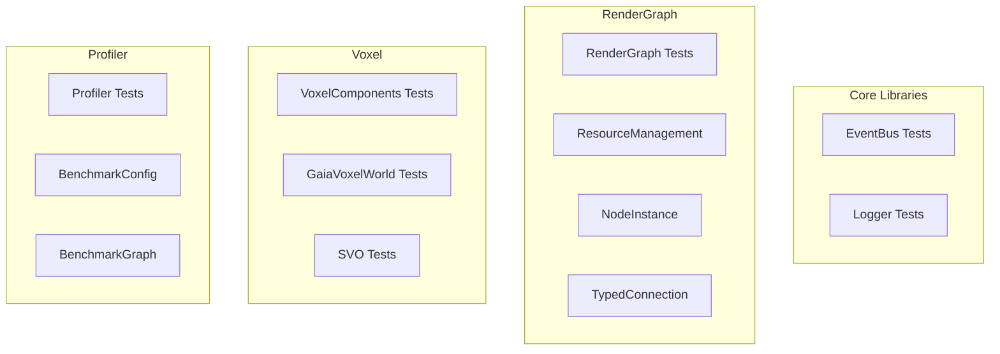

# Testing

GoogleTest framework with VS Code integration and LCOV coverage visualization.

---

## 1. Test Organization



---

## 2. Test Counts

### 2.1 By Library

| Library | Test File | Tests | Status |
|---------|-----------|-------|--------|
| EventBus | test_event_bus.cpp | 12 | Pass |
| Logger | test_logger.cpp | 8 | Pass |
| RenderGraph | test_resource_management.cpp | 24 | Pass |
| RenderGraph | test_node_instance.cpp | 18 | Pass |
| RenderGraph | test_typed_connection.cpp | 15 | Pass |
| VoxelComponents | test_voxel_components.cpp | 8 | Pass |
| GaiaVoxelWorld | test_gaia_voxel_world.cpp | 96 | Pass |
| SVO | test_octree_queries.cpp | 98 | Pass |
| SVO | test_entity_brick_view.cpp | 36 | Pass |
| SVO | test_ray_casting.cpp | 11 | Pass |
| SVO | test_rebuild_hierarchy.cpp | 4 | Pass |
| SVO | test_cornell_box.cpp | 9 | 7 Pass, 2 Skip |
| Profiler | test_benchmark_config.cpp | 44 | Pass |
| Profiler | test_benchmark_graph.cpp | 87 | Pass |
| **Total** | | **~470** | **~98%** |

### 2.2 Coverage Summary

| Library | Coverage | Target |
|---------|----------|--------|
| RenderGraph | 45% | 50% |
| SVO | 60% | 50% |
| Profiler | 55% | 50% |
| **Overall** | **~40%** | **40%** |

---

## 3. Running Tests

### 3.1 Single Test Suite

```bash
# Direct execution
./build/libraries/SVO/tests/Debug/test_rebuild_hierarchy.exe

# With brief output
./build/libraries/SVO/tests/Debug/test_rebuild_hierarchy.exe --gtest_brief=1

# With filter
./build/libraries/SVO/tests/Debug/test_ray_casting.exe --gtest_filter="*CornellBox*"
```

### 3.2 All Tests in Library

```bash
# All SVO tests
cd build/libraries/SVO/tests/Debug
for t in test_*.exe; do ./$t --gtest_brief=1; done
```

### 3.3 Via CTest

```bash
# All tests
ctest --test-dir build -C Debug

# Filtered
ctest --test-dir build -C Debug -R "SVO"
ctest --test-dir build -C Debug -R "ray_casting"
```

---

## 4. VS Code Integration

### 4.1 Test Explorer Setup

```json
// .vscode/settings.json
{
  "testMate.cpp.test.executables": "{build}/**/*{test,Test,TEST}*",
  "cmake.testExplorer.enabled": true,
  "testMate.cpp.test.parallelExecutionOfExecutableLimit": 4
}
```

### 4.2 Features

| Feature | Description |
|---------|-------------|
| Hierarchical view | Tests grouped by file |
| One-click run | Run single test or suite |
| Debug integration | F5 on test to debug |
| Re-run failed | Quick retry of failures |

---

## 5. Coverage Analysis

### 5.1 Enable Coverage

```bash
# Configure with coverage
cmake -B build -DENABLE_COVERAGE=ON

# Build
cmake --build build --config Debug

# Run tests
ctest --test-dir build -C Debug

# Generate report
cmake --build build --target coverage
```

### 5.2 View Coverage

1. Install "Coverage Gutters" VS Code extension
2. Open source file
3. Gutters show:
   - Green: Covered lines
   - Red: Uncovered lines
   - Orange: Partial coverage

### 5.3 LCOV Output

```
Generated: build/coverage/index.html
```

---

## 6. Test Patterns

### 6.1 Basic Test

```cpp
#include <gtest/gtest.h>
#include "SVO/LaineKarrasOctree.h"

TEST(OctreeTest, CreateEmpty) {
    LaineKarrasOctree octree(nullptr, 10, 3);
    EXPECT_EQ(octree.getNodeCount(), 0);
}
```

### 6.2 Fixture Test

```cpp
class OctreeFixture : public ::testing::Test {
protected:
    void SetUp() override {
        world = std::make_unique<GaiaVoxelWorld>();
        octree = std::make_unique<LaineKarrasOctree>(*world, 10, 3);
    }

    std::unique_ptr<GaiaVoxelWorld> world;
    std::unique_ptr<LaineKarrasOctree> octree;
};

TEST_F(OctreeFixture, RebuildCreatesNodes) {
    // Add voxels
    world->createVoxel({glm::vec3(0), {Density{1.0f}}});

    // Rebuild
    octree->rebuild(*world, glm::vec3(0), glm::vec3(256));

    EXPECT_GT(octree->getNodeCount(), 0);
}
```

### 6.3 Parameterized Test

```cpp
class ResolutionTest : public ::testing::TestWithParam<int> {};

TEST_P(ResolutionTest, RayHitsAtResolution) {
    int resolution = GetParam();
    // Test at this resolution
    EXPECT_TRUE(castRayHitsVoxel(resolution));
}

INSTANTIATE_TEST_SUITE_P(
    Resolutions,
    ResolutionTest,
    ::testing::Values(32, 64, 128, 256)
);
```

---

## 7. Test Categories

### 7.1 Unit Tests

Fast, isolated tests of single components.

```cpp
TEST(MortonTest, EncodesDecode) {
    auto encoded = morton3D(1, 2, 3);
    auto [x, y, z] = decodeMorton3D(encoded);
    EXPECT_EQ(x, 1);
    EXPECT_EQ(y, 2);
    EXPECT_EQ(z, 3);
}
```

### 7.2 Integration Tests

Tests of component interactions.

```cpp
TEST(OctreeRayTest, HitsVoxelInWorld) {
    GaiaVoxelWorld world;
    world.createVoxel({glm::vec3(128), {Density{1.0f}}});

    LaineKarrasOctree octree(world, 10, 3);
    octree.rebuild(world, glm::vec3(0), glm::vec3(256));

    auto hit = octree.castRay(glm::vec3(0, 128, 128), glm::vec3(1, 0, 0));
    EXPECT_TRUE(hit.hit);
}
```

### 7.3 Benchmark Tests

Performance measurement tests.

```cpp
TEST(PerformanceTest, DISABLED_RayThroughput) {
    auto start = std::chrono::high_resolution_clock::now();

    for (int i = 0; i < 1000000; i++) {
        octree.castRay(origins[i], directions[i]);
    }

    auto elapsed = std::chrono::high_resolution_clock::now() - start;
    auto mrays = 1.0 / std::chrono::duration<double>(elapsed).count();
    EXPECT_GT(mrays, 100.0);  // At least 100 Mrays/sec
}
```

---

## 8. Debugging Tests

### 8.1 VS Code Debug

1. Right-click test in Test Explorer
2. Select "Debug"
3. Breakpoints work normally

### 8.2 Command Line Debug

```bash
# Run with verbose output
./test_ray_casting.exe --gtest_filter="*CornellBox*" --gtest_break_on_failure

# List all tests
./test_ray_casting.exe --gtest_list_tests
```

---

## 9. Known Test Issues

### 9.1 Floating Point Precision

```cpp
// test_cornell_box.cpp - 2 skipped tests
// Axis-parallel ray edge cases have precision issues
// Workaround: Skip for now, track in activeContext.md
```

### 9.2 Memory Sanitizer

Memory sanitizer not configured on Windows/MSVC.

---

## 10. Code References

| Component | Location |
|-----------|----------|
| SVO Tests | `libraries/SVO/tests/` |
| RenderGraph Tests | `libraries/RenderGraph/tests/` |
| Profiler Tests | `libraries/Profiler/tests/` |
| Test Utilities | `libraries/Testing/include/` |

---

## 11. Related Pages

- [[Overview]] - Development overview
- [[Build-System]] - Build configuration
- [[../05-Progress/Current-Status|Current Status]] - Test status tracking
