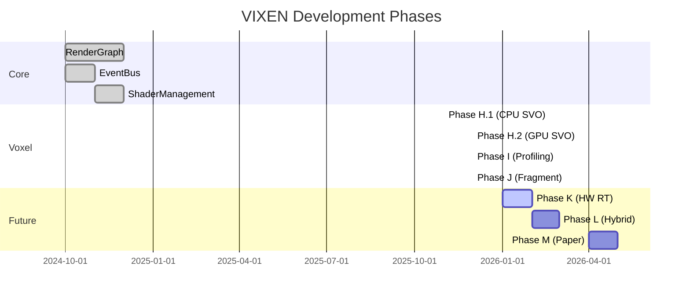

# Progress Overview

Project status tracking, roadmap, and completed milestones for VIXEN development.

---

## 1. Current Phase

> [!info] Phase J Complete
> Fragment shader pipeline with push constant support. 1,700 Mrays/sec achieved.

**Branch:** `claude/phase-i-performance-profiling`

---

## 2. Quick Status

---

## 3. Sections

### [[Current-Status|Current Status]]
Active work, recent changes, and immediate priorities.

### [[Roadmap|Roadmap]]
Future phases and development timeline.

### [[Phase-History|Phase History]]
Completed milestones and achievements.

---

## 4. Key Metrics

| Metric | Current | Target | Status |
|--------|---------|--------|--------|
| GPU Throughput | 1,700 Mrays/sec | 200 Mrays/sec | Exceeded |
| DXT Compression | 5.3:1 | 5:1 | Exceeded |
| Test Coverage | 40% | 40% | Met |
| Nodes Implemented | 19+ | 20+ | In Progress |
| Shader Variants | 4 | 6 | In Progress |

---

## 5. Related Pages

- [[Current-Status]] - What's happening now
- [[Roadmap]] - What's planned
- [[Phase-History]] - What's done
- [[../04-Development/Overview|Development]] - How to contribute
