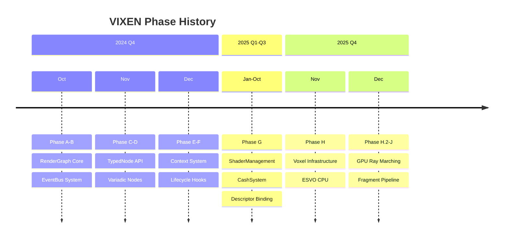

# Phase History

Completed development phases and milestones.

---

## 1. Timeline

---

## 2. Phase Details

### Phase A-B: RenderGraph Core (October 2024)

**Duration:** 2 weeks

**Deliverables:**
- RenderGraph class with AddNode/ConnectNodes/Compile/Execute
- NodeInstance base class with lifecycle hooks
- ResourceVariant with 29+ type registrations
- Graph topology analysis (DAG sort)

**Key Code:**
- `libraries/RenderGraph/src/Core/RenderGraph.cpp`
- `libraries/RenderGraph/include/Core/NodeInstance.h`
- `libraries/RenderGraph/include/Core/ResourceVariant.h`

---

### Phase C-D: TypedNode API (October-November 2024)

**Duration:** 3 weeks

**Deliverables:**
- TypedNode<ConfigType> template base
- INPUT_SLOT/OUTPUT_SLOT macros
- In()/Out() typed accessors
- SlotMode::SINGLE/ARRAY support

**Key Code:**
- `libraries/RenderGraph/include/Core/TypedNodeInstance.h`
- `libraries/RenderGraph/include/Data/Core/ResourceConfig.h`

---

### Phase E-F: Context System (November-December 2024)

**Duration:** 4 weeks

**Deliverables:**
- SetupContext, CompileContext, ExecuteContext, CleanupContext
- GraphLifecycleHooks (14 hooks)
- SlotTask pattern for batch processing
- VariadicTypedNode for dynamic slots

**Key Code:**
- `libraries/RenderGraph/include/Core/Context.h`
- `libraries/RenderGraph/include/Core/GraphLifecycleHooks.h`

---

### Phase G: ShaderManagement & Descriptors (January-October 2025)

**Duration:** 9 months

**Deliverables:**
- SPIRV reflection system
- SDI header generation (split architecture)
- 9 cachers with persistent storage
- SlotRole bitwise flags (Dependency | Execute)
- Deferred descriptor binding
- Zero validation errors

**Key Code:**
- `libraries/ShaderManagement/`
- `libraries/CashSystem/`
- `libraries/RenderGraph/src/Nodes/DescriptorSetNode.cpp`

---

### Phase H: Voxel Infrastructure (November 2025)

**Duration:** 4 weeks

**Week 1 Deliverables:**
- VoxelComponents library (FOR_EACH_COMPONENT macro)
- GaiaVoxelWorld (ECS-backed storage)
- EntityBrickView (zero-storage pattern)
- LaineKarrasOctree (ESVO CPU)
- rebuild() API

**Week 1.5 Deliverables:**
- Child descriptor format
- Morton code optimization
- 150+ tests passing

**Key Code:**
- `libraries/VoxelComponents/`
- `libraries/GaiaVoxelWorld/`
- `libraries/SVO/`

---

### Phase H.2: GPU Ray Marching (December 2025, Week 1-2)

**Duration:** 2 weeks

**Deliverables:**
- VoxelRayMarch.comp (compute shader)
- VoxelRayMarch_Compressed.comp (with DXT)
- GPUTimestampQuery class
- GPUPerformanceLogger
- 8 shader bugs fixed
- 1,700 Mrays/sec achieved

**Bug Fixes:**
| Bug | Fix |
|-----|-----|
| Missing brick-level leaf | Force isLeaf at brick scale |
| Yellow everywhere | Boundary offset |
| Grid pattern | DDA sign preservation |
| Wrong ESVO scale | getBrickESVOScale() = 20 |
| POV-dependent stripes | Octant center |
| Interior wall gaps | Absolute t |
| Offset direction inverted | World rayDir |
| Axis-parallel filtering | computeCorrectedTcMax() |

**Key Code:**
- `shaders/VoxelRayMarch.comp`
- `shaders/VoxelRayMarch_Compressed.comp`
- `libraries/VulkanResources/include/GPUTimestampQuery.h`

---

### Phase I-J: Profiling & Fragment Pipeline (December 2025, Week 2)

**Duration:** 1 week

**Deliverables:**
- BenchmarkRunner system
- BenchmarkConfig (JSON schema)
- VoxelRayMarch.frag (fragment shader)
- VoxelRayMarch_Compressed.frag
- Push constant support (64 bytes)
- 4 shader variants complete

**Key Code:**
- `libraries/Profiler/`
- `shaders/VoxelRayMarch.frag`
- `shaders/VoxelRayMarch_Compressed.frag`

---

## 3. Cumulative Statistics

### Code Volume

| Library | Files | Lines |
|---------|-------|-------|
| RenderGraph | 80+ | ~15,000 |
| SVO | 12 | ~5,000 |
| ShaderManagement | 15 | ~4,000 |
| Profiler | 10 | ~3,000 |
| Other | 30+ | ~8,000 |
| **Total** | **~150** | **~35,000** |

### Test Coverage

| Phase | Tests Added | Cumulative |
|-------|-------------|------------|
| Phase A-B | 50 | 50 |
| Phase C-D | 30 | 80 |
| Phase E-F | 40 | 120 |
| Phase G | 96 | 216 |
| Phase H | 150 | 366 |
| Phase H.2-J | 100 | ~470 |

---

## 4. Lessons Learned

### Architecture

| Lesson | Phase | Application |
|--------|-------|-------------|
| Type safety first | A-B | ResourceVariant design |
| Graph owns resources | A-B | Clear lifetime model |
| Composition > inheritance | C-D | TypedNode pattern |
| Bitwise flags for roles | G | SlotRole flexibility |

### Performance

| Lesson | Phase | Application |
|--------|-------|-------------|
| Zero-storage patterns | H | EntityBrickView |
| GPU timing critical | H.2 | GPUTimestampQuery |
| Shader modularization | H.2 | Shared include files |

### Process

| Lesson | Phase | Application |
|--------|-------|-------------|
| Test-driven development | All | 40% coverage target |
| Memory bank updates | All | Session context preservation |
| Incremental documentation | All | Obsidian vault |

---

## 5. Related Pages

- [[Overview]] - Progress overview
- [[Current-Status]] - Active work
- [[Roadmap]] - Future plans
- [[../01-Architecture/Overview|Architecture]] - System design
