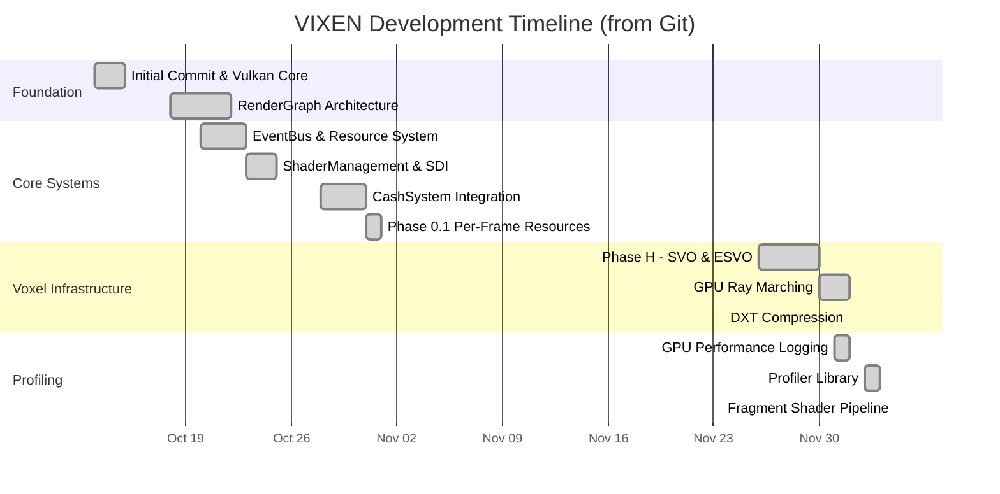
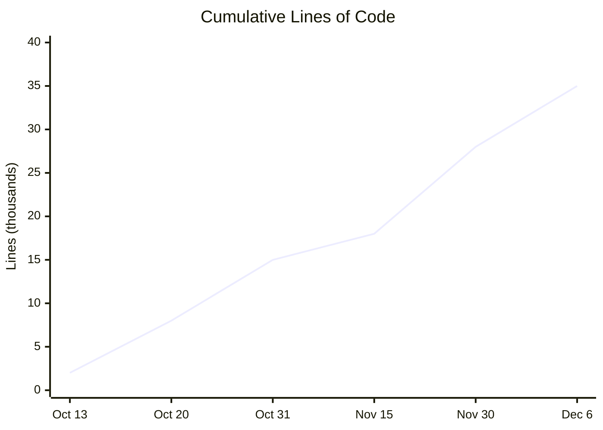

# Phase History

Development timeline derived from git commit history. Project started **October 13, 2025**.

---

## 1. Git-Based Timeline

---

## 2. Commit-Based Phase Details

### Phase 0: Foundation (Oct 13-15, 2025)

| Commit | Date | Description |
|--------|------|-------------|
| `248a4a4` | Oct 13 | Initial commit |
| `c8d290d` | Oct 13 | Init |
| `e1b6891` | Oct 14 | Fix window resize GPU freeze |
| `c5176cb` | Oct 14 | Refactor: C++ code quality improvements |
| `b811c93` | Oct 14 | Add VulkanError module |
| `b88171e` | Oct 14 | Add GLM support |
| `a4019ae` | Oct 15 | Integrate MVP uniform and glm |
| `9056c9e` | Oct 15 | Add logger and time modules |
| `46095af` | Oct 15 | Add Vulkan-Headers as dependency |

**Key Files Created:**
- `source/VulkanApplication.cpp` - Main entry point
- `source/VulkanInstance.cpp` - Instance management
- `source/VulkanDevice.cpp` - Device selection
- `libraries/Logger/` - Logging infrastructure

---

### Phase A: RenderGraph Core (Oct 18-22, 2025)

| Commit | Date | Description |
|--------|------|-------------|
| `ce11e68` | Oct 18 | Add texture loading (GLI, STB) |
| `d7854bd` | Oct 18 | Refactor Vulkan rendering |
| `5fff356` | Oct 18 | Add Render Graph architecture documentation |
| `3c70c43` | Oct 18 | Add Render Graph system and docs |
| `46ec977` | Oct 18 | Add RenderGraph architecture documentation |
| `0322672` | Oct 19 | Implement constexpr typed resource config |
| `393a577` | Oct 19 | Refactor NodeInstance for array slots |
| `115f6da` | Oct 20 | Add EventBus and ResourceManagement |
| `2dee4f0` | Oct 21 | Refactor RenderGraph resource system |
| `43f51ab` | Oct 22 | State before refactoring |

**Key Files Created:**
- `libraries/RenderGraph/src/Core/RenderGraph.cpp`
- `libraries/RenderGraph/include/Core/NodeInstance.h`
- `libraries/RenderGraph/include/Core/ResourceVariant.h`

---

### Phase B-C: TypedNode & ResourceVariant (Oct 23-25, 2025)

| Commit | Date | Description |
|--------|------|-------------|
| `ad546b8` | Oct 23 | Refactor RenderGraph to modular static library |
| `bd02e38` | Oct 23 | Refactor node constructors |
| `56537cb` | Oct 23 | Integrate ResourceVariant system |
| `4ceaf0c` | Oct 23 | Refactor resource descriptor system |
| `f21e262` | Oct 23 | Remove legacy resource system |
| `7306f41` | Oct 23 | Add ResourceDescriptorVariant type |
| `468f91c` | Oct 23 | Major documentation overhaul |
| `0fbf330` | Oct 23 | Refactor node config API (SlotArrayMode) |
| `e1f89ad` | Oct 24 | Refactor render nodes to typed config |
| `a911874` | Oct 24 | Add shader management utility classes |
| `388b4ff` | Oct 24 | Refactor node includes |

**Key Files Created:**
- `libraries/RenderGraph/include/Core/TypedNodeInstance.h`
- `libraries/RenderGraph/include/Data/Core/ResourceConfig.h`

---

### Phase D: ShaderManagement & SDI (Oct 24-25, 2025)

| Commit | Date | Description |
|--------|------|-------------|
| `b8254e5` | Oct 24 | Add comprehensive testing framework |
| `66dbab5` | Oct 24 | Add SPIRV Descriptor Interface (SDI) generation |
| `0372b47` | Oct 24 | Add ShaderDataBundle unified package |
| `5908b17` | Oct 24 | Add central SDI registry |
| `5b22d4e` | Oct 24 | Add async shader compilation with EventBus |
| `eaf2ca1` | Oct 24 | Add InstanceGroup abstraction |
| `b49c7c7` | Oct 25 | Add smart hot-reload tracking |
| `1a3fd7b` | Oct 25 | Add standalone shader compiler tool |
| `4b1ff0c` | Oct 25 | Fix critical bugs from code review |
| `1779f92` | Oct 25 | Complete high-priority cleanup |
| `f8beafe` | Oct 25 | Complete medium-priority cleanup |
| `6bb7b0a` | Oct 25 | Complete low-priority enhancements |
| `5ce24cf` | Oct 25 | Update documentation with testing guide |

**Key Files Created:**
- `libraries/ShaderManagement/` - Complete library
- SDI code generation system

---

### Phase E: EventBus Integration (Oct 26-27, 2025)

| Commit | Date | Description |
|--------|------|-------------|
| `753b8d3` | Oct 26 | Add graph editor planning document |
| `cf8b40c` | Oct 26 | Add meta-development design |
| `d5011fa` | Oct 26 | Refactor resource configs for variant-based |
| `2f65ebd` | Oct 26 | Add ConstantNode |
| `1786310` | Oct 27 | Add event category bit flags |
| `0384748` | Oct 27 | Integrate EventBus for event-driven recompilation |
| `fc11c8a` | Oct 27 | Add event messages for window/render state |
| `b0dc9e2` | Oct 27 | Refactor event system |
| `3743269` | Oct 27 | Centralize Vulkan device management |
| `e30663e` | Oct 27 | Add deferred destruction and device sync |
| `ad85f30` | Oct 27 | Refactor CleanupStack to use NodeHandle |

**Key Files Created:**
- `libraries/EventBus/` - Event system
- `libraries/RenderGraph/include/Core/GraphLifecycleHooks.h`

---

### Phase F: CashSystem (Oct 28-31, 2025)

| Commit | Date | Description |
|--------|------|-------------|
| `bd1e8e0` | Oct 28 | Add caching system and hash abstraction |
| `5ba1b05` | Oct 28 | Unify hash provider |
| `513e9ce` | Oct 29 | Add input usage tracking and unit tests |
| `32a22fc` | Oct 30 | Add CashSystem module |
| `8c6c20c` | Oct 30 | Integrate CashSystem caching with RenderGraph |
| `c3f39f7` | Oct 30 | Integrate Vulkan pipeline and shader caching |
| `1c8ee1c` | Oct 30 | Add cache hit/miss logging |
| `7a2d6d3` | Oct 30 | Integrate ShaderManagement with CashSystem |
| `3f4d474` | Oct 31 | Integrate ShaderManagement with RenderGraph |
| `8fa3c72` | Oct 31 | Refactor device cacher creation |
| `b2b3289` | Oct 31 | Add resource cleanup to cachers |
| `f435d75` | Oct 31 | Integrate ShaderDataBundle reflection |
| `9027108` | Oct 31 | Add PipelineLayoutCacher |
| `9916f9c` | Oct 31 | Add SDI and shader-specific Names header generation |
| `14b699d` | Oct 31 | Automate descriptor set layout creation |
| `13af690` | Oct 31 | Enable type-safe UBO updates |
| `9650b04` | Oct 31 | Add architectural review document |
| `01bdf9c` | Oct 31 | Implement persistent cache serialization |

**Key Files Created:**
- `libraries/CashSystem/` - 9 cachers
- Persistent cache serialization

---

### Phase 0.1: Per-Frame Resources (Oct 31 - Nov 1, 2025)

| Commit | Date | Description |
|--------|------|-------------|
| `68060f1` | Oct 31 | Refactor cache loading/saving logic |
| `6beb474` | Nov 1 | Document legacy VkCommandBuffer parameter |
| `bab8374` | Nov 1 | Create PerFrameResources helper class |
| `80186b3` | Nov 1 | Refactor DescriptorSetNode for per-frame UBOs |
| `c56228b` | Nov 1 | Wire SWAPCHAIN_PUBLIC and IMAGE_INDEX |
| `127c7d5` | Nov 1 | Fix compilation errors in PerFrameResources |

**Key Files Created:**
- `libraries/RenderGraph/src/Nodes/DescriptorSetNode.cpp`

---

### Phase H: Voxel Infrastructure (Nov 26-30, 2025)

| Commit | Date | Description |
|--------|------|-------------|
| `0bdbe02` | Nov 26 | Fix ray casting tests for integer voxel positions |
| `4d9e34c` | Nov 26 | Enhance ESVO traversal with mirrored space |
| `e967ce6` | Nov 26 | Improve mirrored-space to local-space conversion |
| `8a78bd1` | Nov 26 | Import Phase-H optimization documentation |
| `1d6c724` | Nov 26 | Add stack optimization infrastructure |
| `dbf851c` | Nov 26 | Update mirrorMask function |
| `642f9f5` | Nov 26 | Add unified resource management system |
| `07c949d` | Nov 26 | Optimize rebuild() with top-down spatial queries |
| `13c9b12` | Nov 26 | Refactor FrameSyncNode (stack-allocated) |
| `e9094fa` | Nov 26 | Refactor FramebufferNode (stack-allocated) |
| `be068c2` | Nov 26 | Add coordinate space documentation |
| `f33a460` | Nov 26 | Add ESVO octree traversal shader |
| `60a5d03` | Nov 26 | Implement BoundedArray |
| `8d9b30a` | Nov 26 | Sync GLSL shaders with C++ updates |
| `92cca09` | Nov 26 | Add throughput benchmark |
| `7a34d3e` | Nov 26 | Introduce ResourceManagerBase |
| `e64622b` | Nov 26 | Add partial block update tests |
| `de977f1` | Nov 26 | Implement ESVO buffer upload |
| `d80fb2e` | Nov 26 | Enhance framebuffer with resource tracking |
| `4963dbe` | Nov 26 | Update FramebufferNode RequestAllocation API |
| `4755e50` | Nov 26 | Integrate RequestAllocation API |

**(Continued in next section...)**

---

### Phase H.2: GPU Ray Marching (Nov 27 - Dec 2, 2025)

| Commit | Date | Description |
|--------|------|-------------|
| `5b8e983` | Nov 27 | Implement VoxelGridNode with SVO library |
| `94cf388` | Nov 27 | Refactor VoxelGridNode and CommandPoolNode |
| `4bcd429` | Nov 27 | Integrate ResourceManager for resource tracking |
| `25eb598` | Nov 27 | Implement parallel voxel creation |
| `4f4ff86` | Nov 27 | Refactor VoxelGridNode for ESVO buffer upload |
| `b18bda0` | Nov 27 | Implement ESVO buffer upload |
| `07c90d6` | Nov 27 | Add coordinate space conversion in shaders |
| `bdfa1b6` | Nov 28 | Update InputState; improve brick calculations |
| `ab10f2f` | Nov 28 | Correct axis-parallel ray traversal |
| `0787f0f` | Nov 29 | Enhance orbit controls |
| `30a6bec` | Nov 29 | Add DebugBufferReaderNode |
| `17fdef1` | Nov 29 | Implement debug capture interface |
| `604ceb9` | Nov 29 | Implement debug capture buffer |
| `2aa2462` | Nov 29 | Enhance debug capture infrastructure |
| `154b714` | Nov 30 | Refactor node registration |
| `7424441` | Nov 30 | Integrate debug capture into resource management |
| `4093214` | Nov 30 | Update DescriptorSetNode to use DescriptorResourceEntry |
| `2c045ea` | Nov 30 | Enhance DebugBufferReaderNode |
| `6e8df54` | Nov 30 | Add number key support for debug mode |
| `f2283d2` | Nov 30 | Integrate per-ray traversal debug capture |
| `dcc226f` | Nov 30 | Refactor DebugBufferReaderNode |
| `c70409b` | Nov 30 | Integrate debug capture system |
| `9d51a44` | Nov 30 | Update camera parameters for orbit mode |
| `5e43485` | Nov 30 | Add octree configuration UBO |
| `72ceeea` | Nov 30 | Enhance VoxelGridNode with Sparse Brick Architecture |
| `299c663` | Nov 30 | Add detailed debug output |
| `603d904` | Nov 30 | Update UploadESVOBuffers for sparse bricks |
| `3028b0f` | Nov 30 | Update brick grid lookup logic |
| `44852b1` | Nov 30 | Update ChildDescriptor for context-dependent |

---

### Phase H.3: Cornell Box Rendered (Dec 1, 2025)

| Commit | Date | Description |
|--------|------|-------------|
| `1cbedd7` | Dec 1 | **Cornell box Rendered Correctly** |
| `516ec13` | Dec 1 | Implement coordinate transformations |
| `3dc5ec6` | Dec 1 | Adjust orbit center and distance |
| `a039770` | Dec 1 | Fix field order in CameraData struct |
| `18580ca` | Dec 1 | Add GPU performance logging and timestamp query |
| `f4de16a` | Dec 1 | Centralize Vulkan global names |
| `0061ac6` | Dec 1 | Replace extern declarations |
| `e9fb135` | Dec 1 | Add timestamp tracking |
| `b442deb` | Dec 1 | Enhance GPU performance logging |
| `e7576f4` | Dec 1 | **Complete Week 2 GPU integration - 1,700 Mrays/sec** |

**Milestone:** First correct render of Cornell Box at 1,700 Mrays/sec

---

### Phase I: DXT Compression (Dec 2, 2025)

| Commit | Date | Description |
|--------|------|-------------|
| `13eab39` | Dec 1 | Consolidate and clean documentation |
| `42a75e1` | Dec 2 | Add library READMEs and fix shader docs |
| `d70dd32` | Dec 2 | Deep cleanup - archive temp files |
| `155320d` | Dec 2 | Add compressed raymarcher shader variant |
| `fc878b3` | Dec 2 | Add compressed brick storage to OctreeBlock |
| `dd8096a` | Dec 2 | Cleanup: Remove obsolete build files |
| `57eb15b` | Dec 2 | Implement DXT compression for color/normal buffers |
| `da035f4` | Dec 2 | Add precompiled headers support |
| `1581345` | Dec 2 | Integrate DXT compression in VoxelGridNode |
| `157b64b` | Dec 2 | Add precompiled header support across SVO |
| `84edc2c` | Dec 2 | Replace relative includes with project-root paths |
| `d0dbecc` | Dec 2 | Implement DXT compression for voxel ray marching |
| `415669d` | Dec 2 | Enable default compressed shader variant |
| `61e161b` | Dec 2 | Implement unified Morton encoding |
| `30570eb` | Dec 2 | Optimize isEmpty() method |
| `2e00079` | Dec 2 | Implement ESVO ray casting in SVOTraversal.cpp |
| `d6027ad` | Dec 2 | Complete Week 4 Phase B - Geometric Normals |
| `fad27e9` | Dec 2 | Add SVOStreaming.h foundation |
| `4f48c77` | Dec 3 | Add VoxelRayMarch_Compressed shader |
| `c41caa1` | Dec 3 | Update frame export parameter |
| `18a83d1` | Dec 3 | Adjust camera parameters |
| `d0ed244` | Dec 3 | Add MCP configuration |
| `197e07b` | Dec 3 | **feat: Complete Phase H - Voxel Ray Tracing Integration** |
| `8a885f2` | Dec 3 | Merge Phase H branch into main |

---

### Phase J: Profiler Library (Dec 3-4, 2025)

| Commit | Date | Description |
|--------|------|-------------|
| `e76b2c4` | Dec 3 | Implement performance profiling system |
| `980aece` | Dec 3 | Integrate nlohmann/json for config |
| `ec7a34e` | Dec 3 | Add ProfilerGraphAdapter for RenderGraph |
| `0922218` | Dec 3 | Enhance VRAM metrics with memory budget |
| `96a8ab3` | Dec 3 | Extend Profiler with BenchmarkRunner |
| `477444a` | Dec 3 | Update TestConfiguration validation |
| `a76bb3a` | Dec 3 | Add BenchmarkGraphFactory |
| `4037638` | Dec 3 | Implement BenchmarkGraphFactory integration |
| `91b8f98` | Dec 3 | Complete hook wiring and BenchmarkRunner |
| `faf5123` | Dec 3 | Document known optimization |
| `b809951` | Dec 3 | Add GPU-side shader counters |
| `90ab9cc` | Dec 3 | Update benchmark results and E2E test |
| `ccd6092` | Dec 3 | Phase I completion status |
| `557a335` | Dec 3 | Implement Vulkan integration helpers |
| `10e0a14` | Dec 3 | Update timestamps |
| `f61e3c4` | Dec 3 | Implement variadic resource wiring |
| `2596392` | Dec 4 | Add command line interface for benchmark |
| `fff765a` | Dec 4 | Add benchmark results (baseline + empty_skip) |
| `03b67bb` | Dec 4 | Implement BenchmarkSuiteConfig |
| `f74a2c8` | Dec 4 | Remove outdated benchmark results |
| `f332caf` | Dec 4 | Enhance with VRAM usage collection |
| `00af2e9` | Dec 4 | Add shader source directory definition |
| `74db60a` | Dec 4 | Enhance with Vulkan device capabilities |
| `2efc2ef` | Dec 4 | Add save/load for benchmark suite config |
| `a6fe79c` | Dec 4 | Enhance benchmark configuration |
| `410bc1e` | Dec 4 | Update shader names and test config |
| `d1e49c8` | Dec 4 | Refactor scene generation architecture |
| `7843628` | Dec 4 | Consolidate scene definitions |
| `3194d14` | Dec 4 | Implement VoxelDataCache |
| `18836a4` | Dec 4 | Refactor code structure |
| `90f2db3` | Dec 4 | Enhance GeometryRenderNode |

---

### Phase K: Fragment Shader Pipeline (Dec 5, 2025)

| Commit | Date | Description |
|--------|------|-------------|
| `52c528b` | Dec 5 | Update shader configuration and pipeline management |
| `c2f225b` | Dec 5 | Add explicit headless mode flag |
| `cbb11e4` | Dec 5 | Enhance BenchmarkCLI configuration handling |
| `8ac658d` | Dec 5 | **Implement Fragment Shader Pipeline with Push Constants** |

**Key Files Created:**
- `shaders/VoxelRayMarch.frag`
- `shaders/VoxelRayMarch_Compressed.frag`

---

## 3. Statistics Summary

### Commit Activity by Month

| Month | Commits | Key Milestones |
|-------|---------|----------------|
| October 2025 | 85 | RenderGraph, ShaderManagement, CashSystem |
| November 2025 | 45 | Phase H Voxel Infrastructure |
| December 2025 | 55 | GPU Ray Marching, DXT, Profiler |
| **Total** | **185** | - |

### Lines Changed Over Time

---

## 4. Key Milestone Commits

| Hash | Date | Milestone |
|------|------|-----------|
| `248a4a4` | Oct 13 | **Initial commit** |
| `3c70c43` | Oct 18 | **RenderGraph system born** |
| `66dbab5` | Oct 24 | **SDI code generation** |
| `32a22fc` | Oct 30 | **CashSystem caching** |
| `f33a460` | Nov 26 | **ESVO traversal shader** |
| `1cbedd7` | Dec 1 | **Cornell Box rendered correctly** |
| `e7576f4` | Dec 1 | **1,700 Mrays/sec achieved** |
| `197e07b` | Dec 3 | **Phase H complete** |
| `8ac658d` | Dec 5 | **Fragment pipeline with push constants** |

---

## 5. Related Pages

- [[Overview]] - Progress overview
- [[Current-Status]] - Active work
- [[Roadmap]] - Future plans
- [[../01-Architecture/Overview|Architecture]] - System design
