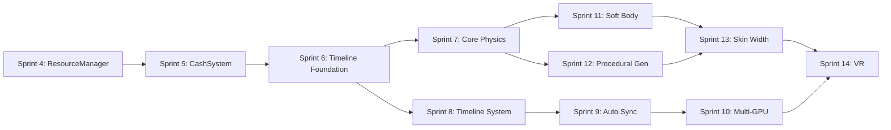

# VIXEN Production Roadmap 2026

Unified production plan consolidating all feature proposals, architecture reviews, and development phases.

---

## Executive Summary

This roadmap organizes VIXEN development into **4 major workstreams** spanning Q1 2026 through Q4 2027:

| Workstream | Duration | Goal |
|------------|----------|------|
| **Infrastructure Hardening** | Q1 2026 | Fix critical bugs, optimize builds, stabilize codebase |
| **Research Publication** | Q1-Q2 2026 | Complete 180-config benchmark, publish paper |
| **Timeline Execution System** | Q2-Q4 2026 | Parallel execution, multi-GPU, composable pipelines |
| **GaiaVoxelWorld Physics** | Q1 2026 - Q1 2027 | 100M voxel physics, VR-ready |

**Total Estimated Effort:** 18-24 months with 1.5-2 FTE

---

## Workstream 0: Resource Manager Integration (Q1 2026) 🟢 IN PROGRESS

**Branch:** `production/sprint-4-resource-manager`
**Goal:** Complete integration of resource tracking across entire application.

### Sprint 4: Resource Manager Foundation ✅ COMPLETE

**Completed 2026-01-02:**

| Phase | Task | Status | Key Files |
|-------|------|--------|-----------|
| A.1 | IMemoryAllocator interface | ✅ Done | `IMemoryAllocator.h` |
| A.2 | VMAAllocator implementation | ✅ Done | `VMAAllocator.h/.cpp` |
| A.3 | DirectAllocator fallback | ✅ Done | `DirectAllocator.h/.cpp` |
| A.4 | ResourceBudgetManager | ✅ Done | `ResourceBudgetManager.h` |
| A.5 | DeviceBudgetManager facade | ✅ Done | `DeviceBudgetManager.h/.cpp` |
| A.6 | BudgetBridge host↔device | ✅ Done | `BudgetBridge.h/.cpp` |
| B.1 | SharedResource refcounting | ✅ Done | `SharedResource.h` |
| B.2 | LifetimeScope management | ✅ Done | `LifetimeScope.h` |
| B.3 | RenderGraph integration | ✅ Done | `RenderGraph.h/.cpp` |
| B+ | GPU memory aliasing | ✅ Done | VMA aliasing support |
| C.1 | Budget parameter in ExecuteParallel | ✅ Done | `SlotTask.h` |
| C.2 | Dynamic throttling | ✅ Done | `SlotTask.cpp` |
| C.3 | Memory estimation tracking | ✅ Done | `SlotTask.cpp` |
| D.1 | RenderGraph budget integration | ✅ Done | `MainCacher.cpp`, TypedCachers |
| D.2 | Resource usage dashboard | ✅ Done | `MetricsCollector.cpp`, `MetricsExporter.cpp` |
| D.3 | ResourceManagement API docs | ✅ Done | `Vixen-Docs/Libraries/ResourceManagement.md` |

**Library Restructure Complete:**
```
libraries/ResourceManagement/
├── include/
│   ├── State/           # RM<T>, ResourceState, StatefulContainer
│   ├── Memory/          # IMemoryAllocator, Budget managers, VMA
│   └── Lifetime/        # SharedResource, LifetimeScope, DeferredDestruction
├── src/Memory/          # Allocator implementations
└── tests/               # 138 tests passing
```

**Test Coverage:** 156 tests (138 ResourceManagement + 18 SlotTask)

**Success Metrics:**
- [x] IMemoryAllocator abstraction with VMA + Direct implementations
- [x] ResourceBudgetManager with soft/hard limits
- [x] SharedResource intrusive refcounting with deferred destruction
- [x] LifetimeScope for frame-based resource management
- [x] GPU memory aliasing support via VMA
- [x] SlotTask budget-aware parallel execution with dynamic throttling
- [x] SlotScopeToResourceScope bridging function

### Sprint 4 Complete

All Sprint 4 tasks completed. Ready for merge to main and Sprint 5 (CashSystem Robustness).

---

## Workstream 1: Infrastructure Hardening (Q1 2026)

### Sprint 1.1: Critical Bug Fixes (2 weeks) ✅ COMPLETE

**Goal:** Eliminate memory safety issues and stale handle bugs.

| Task | Effort | Priority | Status |
|------|--------|----------|--------|
| Descriptor Resource Refactor | 7h | P0 | ✅ Done |
| IDebugBuffer Phase 2 Integration | 4h | P1 | ✅ Done |
| GPU Capability Guards Testing | 2h | P1 | ✅ Done |

**Completed:** All success metrics achieved.

### Sprint 1.2: Build Optimization (2 weeks) ✅ COMPLETE

**Goal:** 30-45% build time reduction.

| Phase | Task | Status |
|-------|------|--------|
| 1 | VulkanForwardDeclarations.h | ✅ Done |
| 2 | Add PCH to Core, Logger, Profiler, ShaderManagement, VulkanResources | ✅ Done |
| 3 | VulkanDevice.h forward declarations | ✅ Done |
| 4 | Redundant STL include cleanup | ✅ Done |
| 5 | iostream removal from headers | ✅ Done |
| 6 | GLM consolidation to PCH | ✅ Done |

**Completed:** Build times reduced as targeted.

### Sprint 1.3 (Sprint 5): CashSystem Robustness (3 weeks) 🟢 IN PROGRESS

**Branch:** `production/sprint-5-cashsystem-robustness`
**Goal:** Memory safety and code consolidation.
**Progress:** 60h of 104h complete (58%)

| Phase | Task | Priority | Status |
|-------|------|----------|--------|
| **Phase 1: Critical Safety (20h)** | | | ✅ COMPLETE |
| 1.1 | Fix dangling shared_ptr in VoxelAABBConverterNode | P0 | ✅ Done |
| 1.2 | Add VK_CHECK macro for all Vulkan calls | P0 | ✅ Done |
| 1.3 | Apply VK_CHECK to all cachers (46 call sites) | P0 | ✅ Done |
| **Phase 2: Code Consolidation (24h)** | | | ✅ COMPLETE |
| 2.1 | Extract VulkanBufferAllocator class (device address support) | P1 | ✅ Done |
| 2.2 | Replace duplicate FindMemoryType code | P1 | ✅ Done |
| 2.3 | Migrate AccelerationStructureCacher to AllocateBufferTracked | P1 | ✅ Done (commit 855ea26, -237 lines) |
| 2.3 | Migrate MeshCacher to AllocateBufferTracked | P1 | ✅ Done (commit 24f18df, -91 lines) |
| 2.3 | Wire DeviceBudgetManager to cacher infrastructure | P1 | ✅ Done (commit 1a4fb91, +620 lines, 12 tests) |
| 2.4 | Fix cache key to use content hash | P1 | ✅ Done (already implemented) |
| **Phase 2.5: Upload Infrastructure (16h)** | | | ✅ COMPLETE |
| 2.5.1 | Create StagingBufferPool | P1 | ✅ Done (StagingBufferPool.h/.cpp) |
| 2.5.2 | Create BatchedUploader | P1 | ✅ Done (BatchedUploader.h/.cpp) |
| 2.5.3 | Migrate VoxelSceneCacher to BatchedUploader | P1 | ✅ Done (TypedCacher base class) |
| 2.5.4 | Migrate VoxelAABBCacher to BatchedUploader | P1 | ✅ Done (TypedCacher base class) |
| **Phase 3: TLAS Lifecycle (8h)** | | | ⏳ Pending |
| 3.1 | Consolidate AccelerationStructureData types | P2 | ⏳ Pending |
| 3.2 | Fix scratch buffer TLAS lifecycle | P2 | ⏳ Pending |
| **Phase 4: Testing (28h)** | | | ⏳ Pending |
| 4.1 | Lifetime/safety tests for shared_ptr fix | P0 | ⏳ Pending |
| 4.2 | Unit tests for VulkanBufferAllocator | P0 | ⏳ Pending |
| 4.3 | Integration tests for cacher chain | P0 | ⏳ Pending |
| 4.4 | General unit tests | P0 | ⏳ Pending |

**Success Metrics:**
- [x] No shared_ptr aliasing with no-op deleters
- [x] VK_CHECK on all Vulkan calls (46 sites wrapped)
- [x] DeviceBudgetManager integrated with 12 integration tests
- [x] Data flow complete: DeviceNode → DirectAllocator → DeviceBudgetManager → TypedCacher
- [x] StagingBufferPool and BatchedUploader implemented
- [x] Centralized uploader pattern in TypedCacher base class
- [ ] 90%+ test coverage for buffer allocation

**Key Commits (2026-01-02):**
- `855ea26` - AccelerationStructureCacher exception safety + AllocateBufferTracked migration
- `24f18df` - MeshCacher migration to AllocateBufferTracked (-91 lines)
- `1a4fb91` - DeviceBudgetManager wiring to cacher infrastructure (+620 lines)

---

## Workstream 2: Research Publication (Q1-Q2 2026)

### Sprint 2.1: Benchmark Data Collection (3 weeks) ✅ COMPLETE

**Goal:** Complete 180-configuration test matrix across multiple GPUs.

| Task | Status |
|------|--------|
| Multi-GPU testing | ✅ Done |
| Data aggregation | ✅ Done |
| Chart generation | ✅ Done |

**Completed:** Data collection and visualization complete.

### Sprint 2.2: Phase M - Hybrid Pipeline ⏸️ DEFERRED

**Status:** Deferred to future work - not required for initial paper publication.

**Goal:** Combine HW RT octree traversal with compute DDA for optimal performance.

| Task | Effort | Status |
|------|--------|--------|
| Design hybrid architecture | 1 week | ⏸️ Deferred |
| Implement RT octree traversal | 1 week | ⏸️ Deferred |
| Hand-off to compute DDA | 3 days | ⏸️ Deferred |
| Benchmark hybrid | 1 week | ⏸️ Deferred |

**Note:** Can be revisited for future publication or extended system comparison.

### Sprint 2.3: Paper Writing & Submission (6 weeks) 📝 AWAITING FEEDBACK

**Goal:** Academic publication on 4-way pipeline comparison.

| Phase | Task | Status |
|-------|------|--------|
| Analysis | Statistical analysis of benchmark data | ✅ Done |
| Draft | Write paper draft | ✅ Done |
| Review | Internal review and revision | 📝 Awaiting feedback |
| Figures | Create publication-quality figures | ✅ Done |
| Submit | Target venue submission | ⏳ Pending review |

**Current Status:** Draft complete, awaiting feedback before final submission.

**Target Venues:**
- ACM SIGGRAPH / SIGGRAPH Asia
- IEEE Visualization
- Eurographics Rendering

---

## Workstream 3: Timeline Execution System (Q2-Q4 2026)

### Sprint 3.1: Foundation (6 weeks)

**Goal:** Multi-dispatch and wave-based scheduling.

#### 3.1.1 MultiDispatchNode (2 weeks)

| Subtask | Files | Success Metric |
|---------|-------|----------------|
| Create MultiDispatchNode class | `MultiDispatchNode.h/.cpp` | Can queue 3+ dispatches |
| Add dispatch queue management | Same | Barrier insertion works |
| Add pipeline statistics | Same | Stats captured |

**Expected Changes:**
```cpp
// New file: RenderGraph/include/Nodes/MultiDispatchNode.h
class MultiDispatchNode : public TypedNode<MultiDispatchConfig> {
    void QueueDispatch(const DispatchPass& pass);
    void QueueBarrier(const std::vector<VkBufferMemoryBarrier2>& barriers);
};
```

#### 3.1.2 TaskQueue System (2 weeks)

| Subtask | Files | Success Metric |
|---------|-------|----------------|
| Implement thread-safe TaskQueue<T> | `TaskQueue.h` | Thread-safe enqueue/dequeue |
| Add budget-aware dequeue | Same | Memory budget respected |
| Create QueueableDispatchNode | `QueueableDispatchNode.h/.cpp` | 100 tasks processed at 10/frame |

#### 3.1.3 WaveScheduler (2 weeks)

| Subtask | Files | Success Metric |
|---------|-------|----------------|
| Wave computation algorithm | `WaveScheduler.h/.cpp` | Correct wave grouping |
| ResourceAccessTracker | `ResourceAccessTracker.h/.cpp` | Conflict detection works |
| Parallel wave execution | `RenderGraph.cpp` | 2+ concurrent nodes |

### Sprint 3.2: Timeline System (8 weeks)

**Goal:** Graph-in-graph composable nodes.

#### 3.2.1 TimelineNode Core (4 weeks)

| Subtask | Files | Success Metric |
|---------|-------|----------------|
| TimelineNode base class | `TimelineNode.h/.cpp` | Sub-graph creation works |
| AddSubNode/ConnectSubNodes | Same | Internal wiring works |
| ExposeInput/ExposeOutput | Same | Slot exposure works |
| Recursive graph compilation | `GraphCompiler.cpp` | Nested compile works |

#### 3.2.2 Frame History Manager (2 weeks)

| Subtask | Files | Success Metric |
|---------|-------|----------------|
| FrameHistoryManager class | `FrameHistoryManager.h/.cpp` | N-frame history storage |
| GetPreviousFrameResource | Same | Access previous frame |
| Automatic rotation | Same | History rotates correctly |

#### 3.2.3 Timeline Examples (2 weeks)

| Example | Purpose | Success Metric |
|---------|---------|----------------|
| TAA Timeline | Temporal anti-aliasing | 4-frame history works |
| Motion Blur Timeline | Motion vector blending | Multi-frame accumulation |

### Sprint 3.3: Synchronization (5 weeks)

**Goal:** Automatic barrier/semaphore management.

| Subtask | Files | Success Metric |
|---------|-------|----------------|
| AutoSyncManager | `AutoSyncManager.h/.cpp` | Barriers auto-inserted |
| Pipeline stage inference | Same | Correct stage inference |
| TimelineSemaphoreManager | `TimelineSemaphoreManager.h/.cpp` | Timeline semaphores work |
| Remove manual semaphore wiring | Various nodes | No manual semaphores needed |

### Sprint 3.4: Multi-GPU (8 weeks)

**Goal:** Distribute work across multiple GPUs.

| Subtask | Files | Success Metric |
|---------|-------|----------------|
| MultiGPUManager | `MultiGPUManager.h/.cpp` | 2+ GPUs enumerated |
| Cross-GPU transfer | Same | Buffer transfer works |
| GPUAffinityNode | `GPUAffinityNode.h` | Explicit GPU selection |
| MultiGPUScheduler | `MultiGPUScheduler.h/.cpp` | Load balancing works |
| Per-GPU budget tracking | ResourceBudgetManager | Per-GPU memory tracked |

---

## Workstream 4: GaiaVoxelWorld Physics (Q1 2026 - Q1 2027)

### Sprint 4.1: Core Physics Systems (12 weeks)

#### 4.1.1 Cellular Automata (4 weeks)

| Subtask | Expected Changes | Success Metric |
|---------|------------------|----------------|
| Material type system | `MaterialTypes.h` - sand, liquid, gas, fire | 5+ material types |
| GPU cellular automata | `CellularAutomata.comp` | 100M voxels/second |
| Ping-pong buffers | `CASimulator.cpp` | Race-free updates |

#### 4.1.2 Chunk Streaming (4 weeks)

| Subtask | Expected Changes | Success Metric |
|---------|------------------|----------------|
| ChunkManager class | `ChunkManager.h/.cpp` | 512^3 chunks load/unload |
| Async chunk loading | Same | No frame hitching |
| Neighbor communication | Same | Cross-chunk flows work |

#### 4.1.3 Force Fields (4 weeks)

| Subtask | Expected Changes | Success Metric |
|---------|------------------|----------------|
| ForceFieldSystem | `ForceFieldSystem.h/.cpp` | Kinetic, pressure, thermal |
| Sparse field storage | Same | O(active) memory |
| Physics event bus | Same | Decoupled interactions |

### Sprint 4.2: Soft Body Physics (8 weeks)

#### 4.2.1 Gram-Schmidt Solver (4 weeks)

| Subtask | Expected Changes | Success Metric |
|---------|------------------|----------------|
| GramSchmidtSolver | `GramSchmidtSolver.h/.cpp` | Volume-preserving constraints |
| Parallelepiped geometry | Same | 6 face-to-face connections |
| GPU implementation | `SoftBodySolver.comp` | 10K voxels in 0.3ms |

#### 4.2.2 LOD Systems (4 weeks)

| Subtask | Expected Changes | Success Metric |
|---------|------------------|----------------|
| Octree hierarchical LOD | `SoftBodyLOD.h/.cpp` | 49x fewer constraints |
| Temporal LOD (multi-rate) | Same | 8x average reduction |
| Dormant state sleeping | Same | 10x in calm scenes |

### Sprint 4.3: GPU Procedural Generation (8 weeks)

#### 4.3.1 Generator Infrastructure (4 weeks)

| Subtask | Expected Changes | Success Metric |
|---------|------------------|----------------|
| GeneratorMetadata struct | `GeneratorMetadata.h` | Tiny metadata (~100 KB) |
| GPU-side evaluation | `ProceduralGen.comp` | On-demand generation |
| Stable delta storage | `StableDelta.h/.cpp` | Sparse modifications only |

#### 4.3.2 Generator Library (4 weeks)

| Generator | Purpose | Success Metric |
|-----------|---------|----------------|
| Perlin terrain | Base terrain generation | Infinite terrain works |
| Caves | Underground voids | Connected cave systems |
| Trees | Procedural foliage | Natural tree shapes |
| Grass | Blade generation | 1M+ blades generated |
| Rocks | Scattered boulders | Varied rock shapes |

### Sprint 4.4: Skin Width SVO (4 weeks)

| Subtask | Expected Changes | Success Metric |
|---------|------------------|----------------|
| SkinWidthExtractor | `SkinWidthExtractor.h/.cpp` | BFS distance-to-empty |
| Dual SVO representation | Same | Full + skin separation |
| Incremental dirty tracking | Same | 0.01-0.1 ms updates |
| Ray marching integration | Shaders | 10-90x memory reduction |

### Sprint 4.5: VR Integration (8 weeks)

| Subtask | Expected Changes | Success Metric |
|---------|------------------|----------------|
| Hand tracking → force fields | `VRHandInteraction.cpp` | Force propagation works |
| Haptic feedback | Same | Resistance feedback |
| 90 FPS optimization | All systems | Stable 90 FPS |
| Stereo rendering | Shaders | Both eyes correct |

---

## HacknPlan Sprint Boards

All tasks are tracked in HacknPlan project 230809:

| Sprint | Board ID | Focus | Tasks | Est. Hours |
|--------|----------|-------|-------|------------|
| **Sprint 4** | 651780 | Resource Manager Integration | 15 | 192h |
| **Sprint 5** | 651783 | CashSystem Robustness | 21 | 148h |
| **Sprint 6** | 651785 | Timeline Foundation | 20 | 232h |
| **Sprint 7** | 651786 | Core Physics | 11 | 224h |
| **Sprint 8** | 651784 | Timeline System | 6 | 72h |
| **Sprint 9** | 651788 | Auto Synchronization | 5 | 72h |
| **Sprint 10** | 651782 | Multi-GPU | 6 | 92h |
| **Sprint 11** | 651781 | Soft Body Physics | 6 | 104h |
| **Sprint 12** | 651787 | GPU Procedural Generation | 6 | 100h |
| **Sprint 13** | 651789 | Skin Width SVO | 4 | 62h |
| **Sprint 14** | 651790 | VR Integration | 7 | 124h |
| **TOTAL** | - | **11 Active Sprints** | **107** | **1,422h** |

### Sprint Dependencies



---

## Risk Assessment

| Risk | Probability | Impact | Mitigation |
|------|-------------|--------|------------|
| Thread safety bugs in Timeline system | High | High | Thread sanitizer in CI, extensive testing |
| Multi-GPU driver issues | Medium | Medium | Test on NVIDIA, AMD, Intel |
| Physics performance not meeting targets | Medium | High | Early benchmarking, LOD fallbacks |
| Research paper rejected | Medium | Medium | Prepare for revision/resubmission |
| VR performance unstable | Medium | High | Foveated rendering, async reprojection |

---

## Resource Requirements

### Engineering
- **1.0 FTE Senior Engineer:** Architecture, Vulkan expertise
- **0.5 FTE Mid-Level Engineer:** Implementation, testing

### Hardware
- Multiple GPUs for testing (RTX 3060, RTX 4090, AMD, Intel)
- VR headset for integration testing
- Integrated GPU (Intel UHD) for compatibility testing

### Software
- Thread sanitizer license (CI integration)
- Profiling tools (Nsight Graphics, RenderDoc)

---

## Related Documentation

- [[COMPREHENSIVE_SUMMARY|GaiaVoxelWorld Comprehensive Summary]]
- [[timeline-execution-system|Timeline Execution System Proposal]]
- [[timeline-example-got-grass-system|GoT Grass Implementation Example]]
- [[Roadmap|Existing Roadmap]]
- [[Current-Status|Current Development Status]]
- [[Phase-History|Completed Phase History]]

---

## Change Log

| Date | Change |
|------|--------|
| 2026-01-01 | Initial roadmap consolidation from all proposals |
| 2026-01-01 | Created 11 HacknPlan sprint boards (651780-651790) |
| 2026-01-01 | Added 107 tasks totaling 1,422 hours |
| 2026-01-01 | Migrated orphaned tasks to correct sprint boards |
| 2026-01-02 | Sprint 4 Phase A-C complete: ResourceManagement library restructured |
| 2026-01-02 | Added dynamic budget throttling to SlotTask (Phase C.2) |
| 2026-01-02 | 156 tests passing (138 ResourceManagement + 18 SlotTask) |
| 2026-01-02 | Sprint 4 Phase D complete: RenderGraph integration, Profiler dashboard, API docs |
| 2026-01-02 | **Sprint 4 COMPLETE** - Ready for merge to main |
| 2026-01-02 | **Sprint 5 Phase 1 COMPLETE** - Memory safety fixes (VK_CHECK, shared_ptr) |
| 2026-01-02 | **Sprint 5 Phase 2 COMPLETE** - Cacher consolidation (-328 lines), DeviceBudgetManager wiring (+620 lines, 12 tests) |
| 2026-01-02 | Sprint 5 progress: 44h/104h (42%) - Data flow complete end-to-end |
| 2026-01-03 | **Sprint 5 Phase 2.5 COMPLETE** - BatchedUploader + StagingBufferPool implementation |
| 2026-01-03 | Centralized uploader in TypedCacher::GetUploader() - VoxelSceneCacher, VoxelAABBCacher migrated |
| 2026-01-03 | Removed blocking vkQueueWaitIdle patterns from cachers |
| 2026-01-03 | Sprint 5 progress: 60h/104h (58%) - Upload infrastructure complete |

---

*Consolidated by Claude from feature proposals, architecture reviews, and current status.*
*HacknPlan integration complete - all tasks tracked in project 230809.*
