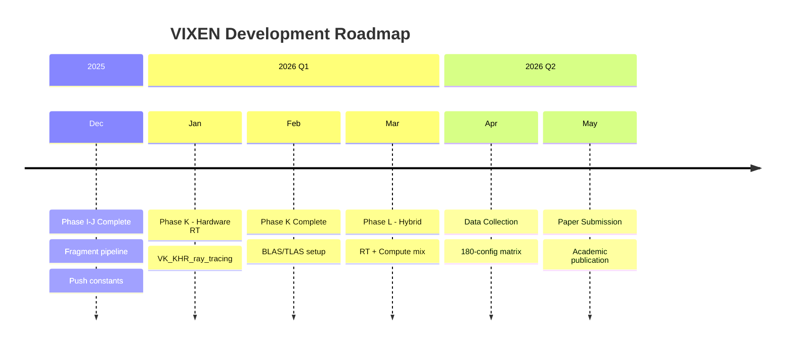
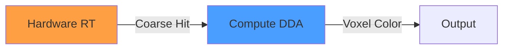
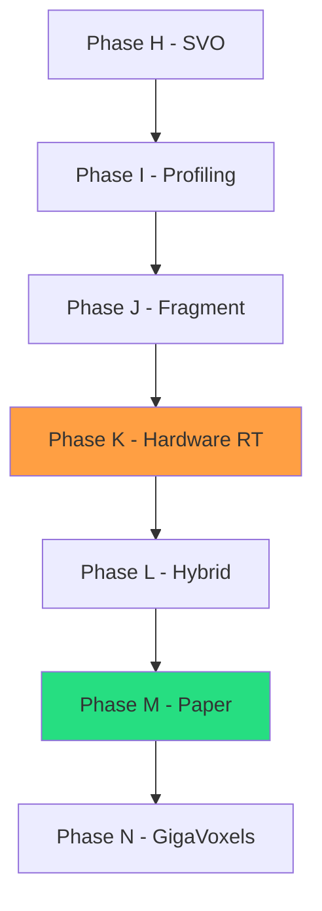

# Roadmap

Development timeline and future phase planning for VIXEN.

---

## 1. Timeline Overview

---

## 2. Phase Details

### Phase K: Hardware Ray Tracing (January-February 2026)

**Goal:** Implement VK_KHR_ray_tracing_pipeline for voxel octrees

**Tasks:**
| Task | Estimate | Dependencies |
|------|----------|--------------|
| Enable RT extensions | 2 days | None |
| Build BLAS from octree | 1 week | Extension working |
| Build TLAS | 3 days | BLAS complete |
| Ray generation shader | 3 days | TLAS complete |
| Closest hit shader | 3 days | Ray gen working |
| Performance comparison | 1 week | All shaders |

**Deliverables:**
- Hardware RT pipeline working
- BLAS/TLAS from octree
- Performance comparison vs compute shader

**Risk:** Hardware RT may be slower for fine voxels (hardware optimized for triangles)

---

### Phase L: Hybrid Pipeline (February-March 2026)

**Goal:** Combine hardware RT with compute for optimal performance

**Concept:**

**Tasks:**
| Task | Estimate | Dependencies |
|------|----------|--------------|
| Design hybrid architecture | 1 week | Phase K complete |
| Implement RT octree traversal | 1 week | Design approved |
| Hand-off to compute DDA | 3 days | RT traversal |
| Benchmark hybrid | 1 week | All components |

**Deliverables:**
- Hybrid RT+Compute pipeline
- Automatic level-of-detail switching
- Performance analysis

---

### Phase M: Research Publication (April-May 2026)

**Goal:** Academic paper on 4-way pipeline comparison

**Tasks:**
| Task | Estimate | Dependencies |
|------|----------|--------------|
| Data collection (180 configs) | 1 week | All pipelines |
| Statistical analysis | 1 week | Data complete |
| Paper draft | 2 weeks | Analysis done |
| Internal review | 1 week | Draft complete |
| Submission | - | Review passed |

**Target Venues:**
- ACM SIGGRAPH / SIGGRAPH Asia
- IEEE Visualization
- Eurographics Rendering

---

## 3. Extended Roadmap

### Phase N: GigaVoxels Streaming (June-July 2026)

**Goal:** Out-of-core voxel streaming for 10x larger scenes

**Features:**
- Brick caching system
- LOD management
- Predictive prefetching
- 128x memory reduction target

### Phase N+1: Advanced GI (August-September 2026)

**Goal:** Global illumination via voxel cone tracing

**Features:**
- Voxel cone tracing (Crassin et al. 2011)
- Multi-bounce diffuse
- Specular reflections
- Ambient occlusion

---

## 4. Success Criteria

### Research Goals

| Goal | Metric | Target |
|------|--------|--------|
| Pipeline comparison | Configurations tested | 180 |
| Reproducibility | Open source release | 100% |
| Publication | Peer-reviewed venue | 1 |

### Engineering Goals

| Goal | Metric | Target |
|------|--------|--------|
| Test coverage | Line coverage | 50% |
| Performance | Mrays/sec | >200 |
| Memory | Compression ratio | 5:1 |
| Stability | Validation errors | 0 |

---

## 5. Risk Assessment

| Risk | Probability | Impact | Mitigation |
|------|-------------|--------|------------|
| HW RT slower than compute | Medium | Medium | Document finding, still valuable |
| Extension unavailable | Low | High | Fallback to software BVH |
| Publication rejected | Medium | Medium | Revise for another venue |
| Timeline slip | Medium | Low | Prioritize core features |

---

## 6. Dependencies

---

## 7. Related Pages

- [[Overview]] - Progress overview
- [[Current-Status]] - Active work
- [[Phase-History]] - Completed phases
- [[../03-Research/Pipeline-Comparison|Pipeline Comparison]] - Research methodology
