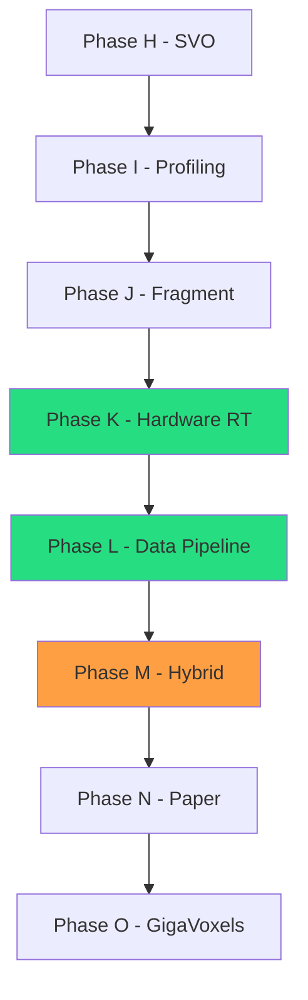

# Roadmap

Development timeline and future phase planning for VIXEN.

---

## 1. Timeline Overview


---

## 2. Phase Details

### Phase K: Hardware Ray Tracing ✅ COMPLETE (December 2025)

**Goal:** Implement VK_KHR_ray_tracing_pipeline for voxel octrees

**Status:** All tasks complete. HW RT pipeline rendering correctly with both uncompressed and compressed shaders.

**Completed Tasks:**
| Task | Status |
|------|--------|
| Enable RT extensions | ✅ Done |
| Build BLAS from octree (AABB) | ✅ Done |
| Build TLAS | ✅ Done |
| Ray generation shader | ✅ Done |
| Closest hit shader (uncompressed + compressed) | ✅ Done |
| Performance comparison infrastructure | ✅ Done |

**Key Files:**
- `shaders/VoxelRT.rgen`, `VoxelRT.rmiss`, `VoxelRT.rchit`
- `shaders/VoxelRT_Compressed.rchit`
- `libraries/RenderGraph/src/Nodes/AccelerationStructureNode.cpp`

### Phase L: Data Collection & Aggregation (December 2025)

**Goal:** Build data pipeline for benchmark collection and analysis

**Status:** Implementation COMPLETE. Data gathering in progress.

**Completed Tasks:**
| Task | Status |
|------|--------|
| JSON export per benchmark test | ✅ Done |
| Excel aggregation script | ✅ Done |
| Chart generation pipeline | ✅ Done |
| Multi-tester folder organization | ✅ Done |
| ZIP pack/unpack for transport | ✅ Done |
| Obsidian chart embedding | ✅ Done |

**Data Pipeline:**
```
benchmark_results/*.json → aggregate_results.py → data/benchmarks.xlsx
                                                         ↓
Vixen-Docs/Assets/charts/*.png ← generate_charts.py ←────┘
```

**Next:** Run full 180-config test matrix across multiple machines

---

### Phase M: Hybrid Pipeline (February-March 2026)

**Goal:** Combine hardware RT with compute for optimal performance

**Concept:**


**Tasks:**
| Task | Estimate | Dependencies |
|------|----------|--------------|
| Design hybrid architecture | 1 week | Phase K complete |
| Implement RT octree traversal | 1 week | Design approved |
| Hand-off to compute DDA | 3 days | RT traversal |
| Benchmark hybrid | 1 week | All components |

**Deliverables:**
- Hybrid RT+Compute pipeline
- Automatic level-of-detail switching
- Performance analysis

---

### Phase N: Research Publication (April-May 2026)

**Goal:** Academic paper on 4-way pipeline comparison

**Tasks:**
| Task | Estimate | Dependencies |
|------|----------|--------------|
| Data collection (180 configs) | 1 week | All pipelines |
| Statistical analysis | 1 week | Data complete |
| Paper draft | 2 weeks | Analysis done |
| Internal review | 1 week | Draft complete |
| Submission | - | Review passed |

**Target Venues:**
- ACM SIGGRAPH / SIGGRAPH Asia
- IEEE Visualization
- Eurographics Rendering

---

## 3. Extended Roadmap

### Phase O: GigaVoxels Streaming (June-July 2026)

**Goal:** Out-of-core voxel streaming for 10x larger scenes

**Features:**
- Brick caching system
- LOD management
- Predictive prefetching
- 128x memory reduction target

### Phase P: Advanced GI (August-September 2026)

**Goal:** Global illumination via voxel cone tracing

**Features:**
- Voxel cone tracing (Crassin et al. 2011)
- Multi-bounce diffuse
- Specular reflections
- Ambient occlusion

---

## 4. Success Criteria

### Research Goals

| Goal | Metric | Target |
|------|--------|--------|
| Pipeline comparison | Configurations tested | 180 |
| Reproducibility | Open source release | 100% |
| Publication | Peer-reviewed venue | 1 |

### Engineering Goals

| Goal | Metric | Target |
|------|--------|--------|
| Test coverage | Line coverage | 50% |
| Performance | Mrays/sec | >200 |
| Memory | Compression ratio | 5:1 |
| Stability | Validation errors | 0 |

---

## 5. Risk Assessment

| Risk | Probability | Impact | Mitigation |
|------|-------------|--------|------------|
| HW RT slower than compute | Medium | Medium | Document finding, still valuable |
| Extension unavailable | Low | High | Fallback to software BVH |
| Publication rejected | Medium | Medium | Revise for another venue |
| Timeline slip | Medium | Low | Prioritize core features |

---

## 6. Dependencies



---

## 7. Related Pages

- [[Overview]] - Progress overview
- [[Current-Status]] - Active work
- [[Phase-History]] - Completed phases
- [[../03-Research/Pipeline-Comparison|Pipeline Comparison]] - Research methodology
