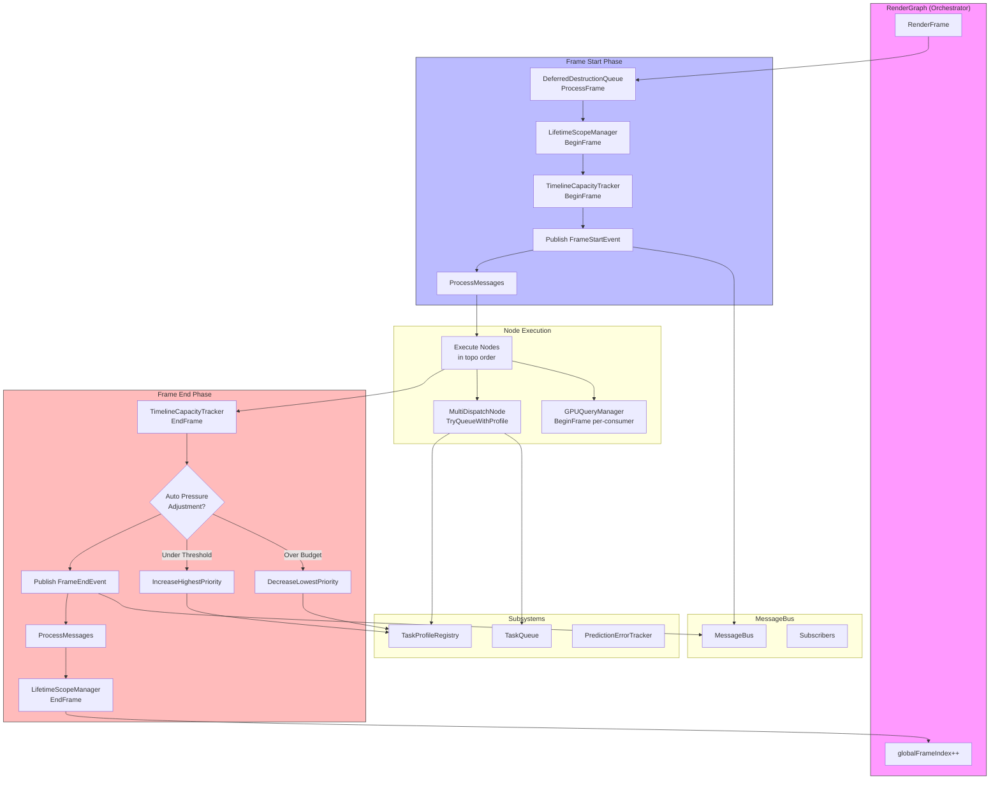
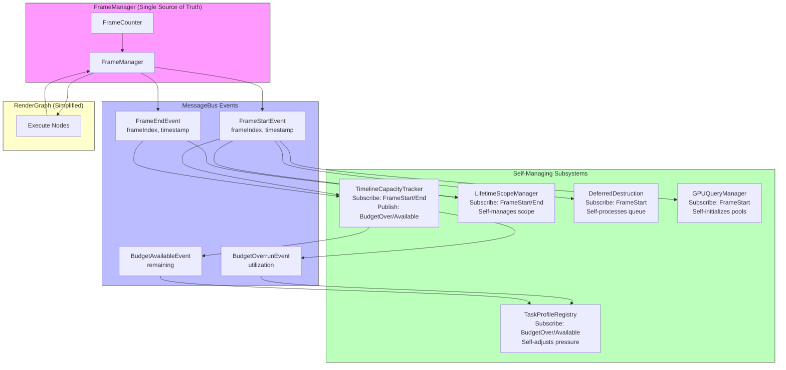

# RenderGraph System Architecture Analysis

**Date**: 2026-01-08
**Sprint**: 6.3 - Timeline Capacity System
**Purpose**: Identify coupling issues and propose decoupled event-driven architecture

---

## 1. Current System Overview

### 1.1 Host-Side Systems (CPU)

| System | Location | Responsibility |
|--------|----------|----------------|
| **RenderGraph** | `src/Core/RenderGraph.cpp` | Main orchestrator - graph construction, compilation, execution |
| **TimelineCapacityTracker** | `include/Core/TimelineCapacityTracker.h` | Budget tracking, utilization measurement, adaptive scheduling |
| **TaskProfileRegistry** | `include/Core/TaskProfileRegistry.h` | Cost estimation, pressure valve adjustment, calibration |
| **TaskQueue** | `include/Core/TaskQueue.h` | Budget-aware task scheduling |
| **LifetimeScopeManager** | `ResourceManagement/Lifetime/LifetimeScope.h` | Per-frame resource cleanup |
| **DeferredDestructionQueue** | `ResourceManagement/Lifetime/DeferredDestruction.h` | N-frame delayed destruction |
| **CleanupStack** | `include/CleanupStack.h` | Dependency-ordered cleanup |
| **PredictionErrorTracker** | `include/Core/PredictionErrorTracker.h` | Estimate vs actual learning |

### 1.2 GPU-Side Systems

| System | Location | Responsibility |
|--------|----------|----------------|
| **GPUQueryManager** | `include/Core/GPUQueryManager.h` | Shared timestamp query pools |
| **GPUPerformanceLogger** | `include/Core/GPUPerformanceLogger.h` | GPU timing aggregation |

---

## 2. Current Frame Lifecycle (RenderGraph.cpp)

```
RenderFrame() {
    // PRE-FRAME (Lines 595-608)
    ├── deferredDestruction.ProcessFrame(globalFrameIndex)    [Direct call]
    ├── scopeManager_->BeginFrame()                           [Direct call]
    ├── capacityTracker_.BeginFrame()                         [Direct call]
    ├── messageBus->Publish(FrameStartEvent)                  [Event]
    └── messageBus->ProcessMessages()                         [Immediate sync]

    // EXECUTION (Lines 634-658)
    ├── for each node in executionOrder:
    │   ├── node->Execute()
    │   └── Check deferred recompile

    // POST-FRAME (Lines 663-696)
    ├── capacityTracker_.EndFrame()                           [Direct call]
    ├── if (autoPressureAdjustment_) {                        [Direct coupling]
    │   ├── taskProfileRegistry_.DecreaseLowestPriority()
    │   └── taskProfileRegistry_.IncreaseHighestPriority()
    │   }
    ├── messageBus->Publish(FrameEndEvent)                    [Event]
    ├── messageBus->ProcessMessages()                         [Immediate sync]
    ├── scopeManager_->EndFrame()                             [Direct call]
    └── globalFrameIndex++
}
```

---

## 3. Current Flow Diagram



---

## 4. Identified Problems

### 4.1 Multiple BeginFrame/EndFrame Callers

**Location**: `RenderGraph.cpp` lines 595-603, 667-692

**Current State**:
```cpp
// RenderGraph manually orchestrates 4 frame lifecycles
deferredDestruction.ProcessFrame(globalFrameIndex);  // Line 595
scopeManager_->BeginFrame();                          // Line 599
capacityTracker_.BeginFrame();                        // Line 603
// ... later ...
capacityTracker_.EndFrame();                          // Line 667
scopeManager_->EndFrame();                            // Line 692
```

**Problem**:
- RenderGraph is responsible for calling BeginFrame/EndFrame on every subsystem
- Adding a new system requires modifying RenderGraph
- Subsystems can't initialize themselves at frame start

**Severity**: HIGH - Tight coupling, violates Open/Closed principle

---

### 4.2 Direct Coupling: Pressure Adjustment

**Location**: `RenderGraph.cpp` lines 670-678

**Current State**:
```cpp
if (autoPressureAdjustment_) {
    if (capacityTracker_.IsOverBudget()) {
        taskProfileRegistry_.DecreaseLowestPriority();  // Direct call
    } else if (capacityTracker_.CanScheduleMoreWork()) {
        taskProfileRegistry_.IncreaseHighestPriority(); // Direct call
    }
}
```

**Problem**:
- RenderGraph couples two unrelated systems (TimelineCapacityTracker ↔ TaskProfileRegistry)
- TaskProfileRegistry shouldn't need RenderGraph to mediate
- Logic belongs in a dedicated controller or event-driven

**Severity**: MEDIUM - Coupling, but isolated

---

### 4.3 Synchronous Events Pretending to be Async

**Location**: `RenderGraph.cpp` lines 607-608, 686-687

**Current State**:
```cpp
messageBus->Publish(std::make_unique<FrameStartEvent>(...));
messageBus->ProcessMessages();  // Immediate processing!
```

**Problem**:
- Events are published then immediately processed synchronously
- This is direct calling with extra steps
- If events are meant to be async, don't process immediately
- If sync is needed, just call methods directly

**Severity**: LOW - Inconsistent pattern, but works

---

### 4.4 GPUQueryManager.BeginFrame Per-Consumer

**Location**: Multiple nodes call `queryManager_->BeginFrame()`

**Current State**:
- `MultiDispatchNode.cpp` line 368
- `GeometryRenderNode.cpp` line 286
- `TraceRaysNode.cpp` line 276

**Problem**:
- Multiple nodes call BeginFrame on same GPUQueryManager
- GPUQueryManager tracks internally, but pattern is confusing
- Should initialize once per frame, not per consumer

**Severity**: LOW - Works due to internal guards

---

### 4.5 Scattered Frame Index Tracking

**Locations**:
- `RenderGraph.globalFrameIndex`
- `TimelineCapacityTracker.currentFrame_.frameNumber`
- `DeviceTimeline.frameNumber`
- `GPUQueryManager` per-frame pool indexing

**Problem**:
- Each system maintains its own frame counter
- Potential for drift if one system misses a frame
- No single source of truth

**Severity**: MEDIUM - Drift risk in edge cases

---

## 5. Proposed Architecture

### 5.1 Core Principle

**Single Source of Truth**: One `FrameManager` owns frame lifecycle.
**Event-Driven**: Subsystems subscribe to frame events and manage themselves.
**No Mediation**: Systems communicate via events, not through RenderGraph.

### 5.2 Proposed Flow Diagram



### 5.3 New Frame Lifecycle

```
FrameManager.BeginFrame() {
    frameIndex_++;
    messageBus->Publish(FrameStartEvent{frameIndex_, timestamp});
    // All subscribers react internally:
    // - DeferredDestruction processes queue
    // - LifetimeScopeManager begins scope
    // - TimelineCapacityTracker resets measurements
    // - GPUQueryManager initializes pools
}

RenderGraph.Execute() {
    // Just execute nodes - no lifecycle management
    for (node : executionOrder) {
        node->Execute();
    }
}

FrameManager.EndFrame() {
    messageBus->Publish(FrameEndEvent{frameIndex_, timestamp});
    // All subscribers react internally:
    // - TimelineCapacityTracker computes utilization
    //   → Publishes BudgetOverrunEvent or BudgetAvailableEvent
    // - TaskProfileRegistry receives budget event
    //   → Self-adjusts pressure (no RenderGraph involvement)
    // - LifetimeScopeManager ends scope, cleans up
}
```

---

## 6. Required Changes

### 6.1 New Components

| Component | Purpose |
|-----------|---------|
| `FrameManager` | Single source of frame lifecycle, publishes events |
| `BudgetOverrunEvent` | Published by TCT when over budget |
| `BudgetAvailableEvent` | Published by TCT when under threshold |

### 6.2 System Modifications

| System | Change |
|--------|--------|
| **RenderGraph** | Remove BeginFrame/EndFrame calls, remove pressure adjustment logic |
| **TimelineCapacityTracker** | Subscribe to FrameStart/End, publish Budget events |
| **TaskProfileRegistry** | Subscribe to Budget events, self-adjust pressure |
| **LifetimeScopeManager** | Subscribe to FrameStart/End |
| **DeferredDestructionQueue** | Subscribe to FrameStart |
| **GPUQueryManager** | Subscribe to FrameStart |

### 6.3 Migration Steps

1. **Create FrameManager** - new class, publishes FrameStart/End
2. **Add Budget events** - new event types in EventTypes
3. **Update TimelineCapacityTracker** - subscribe + publish
4. **Update TaskProfileRegistry** - subscribe to budget events
5. **Update other subsystems** - subscribe to frame events
6. **Simplify RenderGraph** - remove direct calls, use FrameManager
7. **Test** - verify behavior unchanged

---

## 7. Benefits

| Benefit | Description |
|---------|-------------|
| **Loose Coupling** | Systems don't know about each other, only events |
| **Open/Closed** | Add new systems without modifying RenderGraph |
| **Single Responsibility** | RenderGraph only orchestrates nodes, not lifecycle |
| **Testability** | Systems testable in isolation with mock events |
| **Extensibility** | Easy to add new frame-aware systems |

---

## 8. Risks

| Risk | Mitigation |
|------|------------|
| Event ordering | Document required order, use priority if needed |
| Performance | Events are synchronous, no async overhead |
| Debugging | Add event logging, tracing |
| Migration | Incremental approach, one system at a time |

---

## 9. Decision Required

**Option A**: Full event-driven architecture (proposed above)
- Pros: Clean, extensible, testable
- Cons: More upfront work, new concepts

**Option B**: Minimal cleanup (keep direct calls, fix coupling)
- Pros: Less change, faster
- Cons: Still coupled, harder to extend

**Option C**: Hybrid (FrameManager for lifecycle, keep some direct calls)
- Pros: Balance of clean + pragmatic
- Cons: Inconsistent patterns

---

## 10. Next Steps

1. Review this document
2. Decide on approach (A/B/C)
3. If A: Create FrameManager implementation plan
4. If B: Fix pressure adjustment coupling only
5. If C: Define which systems use events vs direct calls
