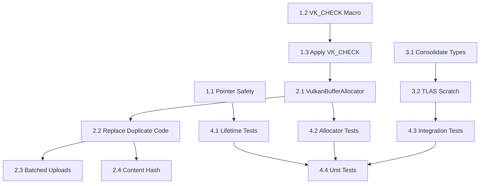

# Sprint 5: CashSystem Robustness

**Branch:** `production/sprint-5-cashsystem-robustness`
**Goal:** Memory safety, error handling, and code consolidation for CashSystem.

---

## Executive Summary

Sprint 5 focuses on hardening the CashSystem library:
- Fix memory safety issues (shared_ptr patterns)
- Add comprehensive Vulkan error checking
- Extract reusable buffer allocation
- Consolidate duplicate code patterns

**Total Effort:** 104 hours (16 tasks in HacknPlan)

---

## Phase 1: Critical Safety (P0) - 20h

### 1.1 VoxelAABBConverterNode Pointer Safety (4h)

**HacknPlan:** #185

**Current State (from analysis):**
- `AccelerationStructureCacher.h:75` uses `const VoxelAABBData* aabbDataRef = nullptr;`
- Raw pointer pattern with documented non-ownership
- Currently safe but fragile - no lifetime validation

**Tasks:**
- [ ] Replace raw pointer with `std::shared_ptr<const VoxelAABBData>` or `std::weak_ptr`
- [ ] Add lifetime assertion in debug builds
- [ ] Update `CachedAccelerationStructure` cleanup logic
- [ ] Add null-check before dereference in all usage sites

**Files:**
- `libraries/CashSystem/include/AccelerationStructureCacher.h:75`
- `libraries/CashSystem/src/AccelerationStructureCacher.cpp:126-161`

### 1.2 VK_CHECK Macro Definition (4h)

**HacknPlan:** #214, #247

**Current State:**
- Some files check `!= VK_SUCCESS` manually
- No centralized macro

**Tasks:**
- [ ] Create `VK_CHECK(result)` macro in `VulkanResources/include/VK_CHECK.h`
- [ ] Support file/line info for debugging
- [ ] Log error via Logger (not std::cerr)
- [ ] Optional: throw exception or return error

**Proposed Implementation:**
```cpp
#define VK_CHECK(result) \
    do { \
        VkResult _r = (result); \
        if (_r != VK_SUCCESS) { \
            LOG_ERROR("Vulkan error: " + VkResultToString(_r) + \
                      " at " + __FILE__ + ":" + std::to_string(__LINE__)); \
        } \
    } while(0)
```

### 1.3 Apply VK_CHECK to All Cachers (12h)

**HacknPlan:** #184

**Unchecked Vulkan Calls (from analysis):**

| File | Line | Call |
|------|------|------|
| AccelerationStructureCacher.cpp | 320 | `vkGetBufferDeviceAddressKHR()` |
| AccelerationStructureCacher.cpp | 370 | `vkCreateBuffer()` (BLAS) |
| AccelerationStructureCacher.cpp | 385 | `vkAllocateMemory()` (BLAS) |
| AccelerationStructureCacher.cpp | 397 | `vkCreateBuffer()` (scratch) |
| AccelerationStructureCacher.cpp | 412 | `vkAllocateMemory()` (scratch) |
| AccelerationStructureCacher.cpp | 423 | `vkCreateAccelerationStructureKHR()` |
| AccelerationStructureCacher.cpp | 450 | `vkCreateCommandPool()` |
| AccelerationStructureCacher.cpp | 461 | `vkAllocateCommandBuffers()` |
| AccelerationStructureCacher.cpp | 539 | `vkCreateBuffer()` (instance) |
| AccelerationStructureCacher.cpp | 557 | `vkAllocateMemory()` (instance) |
| AccelerationStructureCacher.cpp | 615 | `vkCreateBuffer()` (TLAS) |
| AccelerationStructureCacher.cpp | 630 | `vkAllocateMemory()` (TLAS) |
| VoxelAABBCacher.cpp | 249 | `vkCreateBuffer()` (AABB) |
| VoxelAABBCacher.cpp | 264 | `vkAllocateMemory()` (AABB) |
| VoxelAABBCacher.cpp | 280 | `vkCreateBuffer()` (material ID) |
| VoxelAABBCacher.cpp | 290 | `vkAllocateMemory()` (material ID) |
| VoxelAABBCacher.cpp | 306 | `vkCreateBuffer()` (brick mapping) |
| VoxelAABBCacher.cpp | 316 | `vkAllocateMemory()` (brick mapping) |
| VoxelAABBCacher.cpp | 352 | `vkCreateCommandPool()` |
| VoxelAABBCacher.cpp | 363 | `vkCreateBuffer()` (staging) |
| VoxelAABBCacher.cpp | 377 | `vkAllocateMemory()` (staging) |

**Files to Update:**
- `libraries/CashSystem/src/AccelerationStructureCacher.cpp` (~12 calls)
- `libraries/CashSystem/src/VoxelAABBCacher.cpp` (~9 calls)
- `libraries/CashSystem/src/MeshCacher.cpp` (verify existing checks)
- `libraries/CashSystem/src/CacherAllocationHelpers.cpp` (verify)
- `libraries/CashSystem/src/DescriptorSetLayoutCacher.cpp` (verify)
- `libraries/CashSystem/src/pipeline_cacher.cpp` (verify)

---

## Phase 2: Code Consolidation (P1) - 24h

### 2.1 Extract VulkanBufferAllocator Class (8h)

**HacknPlan:** #188, #251

**Current Pattern (duplicated everywhere):**
```cpp
VkBufferCreateInfo bufferInfo{};
bufferInfo.sType = VK_STRUCTURE_TYPE_BUFFER_CREATE_INFO;
bufferInfo.size = size;
bufferInfo.usage = usage;
vkCreateBuffer(...);
vkGetBufferMemoryRequirements(...);
// Find memory type...
VkMemoryAllocateInfo allocInfo{};
vkAllocateMemory(...);
vkBindBufferMemory(...);
```

**Tasks:**
- [ ] Create `VulkanBufferAllocator` class in `libraries/CashSystem/include/`
- [ ] Support: DeviceLocal, HostVisible, HostCached memory types
- [ ] Support: DeviceAddress flag for RT buffers
- [ ] Integrate with `DeviceBudgetManager` from Sprint 4
- [ ] Return `BufferAllocation` struct (buffer, memory, size, mapped ptr)

**Proposed API:**
```cpp
class VulkanBufferAllocator {
public:
    struct Allocation {
        VkBuffer buffer;
        VkDeviceMemory memory;
        VkDeviceSize size;
        void* mappedPtr = nullptr;  // If host-visible
        VkDeviceAddress deviceAddress = 0;  // If device-address enabled
    };

    std::expected<Allocation, AllocationError> AllocateDeviceLocal(
        VkDeviceSize size, VkBufferUsageFlags usage, bool deviceAddress = false);

    std::expected<Allocation, AllocationError> AllocateHostVisible(
        VkDeviceSize size, VkBufferUsageFlags usage);

    void Free(Allocation& alloc);
};
```

### 2.2 Replace Duplicate Code with VulkanBufferAllocator (4h)

**HacknPlan:** #187

**Files with buffer allocation to refactor:**
- `AccelerationStructureCacher.cpp` - BLAS, TLAS, scratch, instance buffers
- `VoxelAABBCacher.cpp` - AABB, material, brick mapping, staging buffers
- `MeshCacher.cpp` - vertex, index buffers
- `CacherAllocationHelpers.cpp` - already partially extracted

### 2.3 Implement Batched Buffer Uploads (8h)

**HacknPlan:** #183

**Current Pattern:**
- Each buffer creates its own staging buffer
- Each upload submits its own command buffer
- No batching of transfers

**Tasks:**
- [ ] Create `StagingBufferPool` for reusable staging memory
- [ ] Create `BatchedUploader` that queues multiple uploads
- [ ] Submit single command buffer for batch
- [ ] Use timeline semaphores for completion tracking

### 2.4 Fix Cache Key to Use Content Hash (4h)

**HacknPlan:** #213, #249

**Current State:**
- Cache keys may use object identity instead of content
- Risk of false cache misses or stale data

**Tasks:**
- [ ] Audit all `GetCacheKey()` implementations
- [ ] Replace identity-based keys with content hashes
- [ ] Use `XXH3` or `MurmurHash3` for fast hashing
- [ ] Add hash collision detection in debug builds

---

## Phase 3: TLAS Lifecycle (P2) - 8h

### 3.1 Consolidate AccelerationStructureData Types (4h)

**HacknPlan:** #215

**Current Types:**
- `AccelerationStructureData` (header:28-61) - BLAS + TLAS + scratch + instance
- `CachedAccelerationStructure` (header:73-85) - wrapper with aabbDataRef
- `VoxelAABBData` (VoxelAABBCacher.h:58-84) - AABB buffers

**Tasks:**
- [ ] Evaluate if types can be merged or simplified
- [ ] Consider: separate BLAS and TLAS data structs
- [ ] Document ownership model clearly

### 3.2 Fix Scratch Buffer TLAS Lifecycle (4h)

**HacknPlan:** #186

**Current State (from analysis):**
- Scratch buffer created during BLAS build (line 397)
- Reused for TLAS build (line 637)
- Properly cleaned up (lines 107-113)
- **Issue:** Size may be incorrect if TLAS needs larger scratch than BLAS

**Tasks:**
- [ ] Compare BLAS vs TLAS scratch size requirements
- [ ] Allocate max(BLAS, TLAS) scratch size
- [ ] Add validation in debug builds

---

## Phase 4: Testing (P0) - 28h

### 4.1 Lifetime/Safety Tests for shared_ptr Fix (4h)

**HacknPlan:** #190

**Tests:**
- [ ] Test: AccelerationStructure outlives VoxelAABBData
- [ ] Test: VoxelAABBData cleanup doesn't crash with live AS
- [ ] Test: Weak pointer correctly invalidates

### 4.2 Unit Tests for VulkanBufferAllocator (8h)

**HacknPlan:** #192

**Tests:**
- [ ] Allocate/Free DeviceLocal buffer
- [ ] Allocate/Free HostVisible buffer
- [ ] Device address retrieval
- [ ] Error handling for OOM
- [ ] Integration with DeviceBudgetManager

### 4.3 Integration Tests for Cacher Chain (8h)

**HacknPlan:** #191

**Tests:**
- [ ] Full pipeline: VoxelAABB → AccelerationStructure → Render
- [ ] Hot-reload: shader change doesn't corrupt AS
- [ ] Resource cleanup on scene change

### 4.4 General Unit Tests (8h)

**HacknPlan:** #244

**Tests:**
- [ ] VK_CHECK macro behavior
- [ ] Content hash cache keys
- [ ] Batched upload correctness

---

## Implementation Order



**Recommended Execution:**
1. Phase 1.2 → 1.3 (VK_CHECK first - catches errors early)
2. Phase 1.1 (Pointer safety)
3. Phase 2.1 → 2.2 (VulkanBufferAllocator extraction)
4. Phase 3.1 → 3.2 (TLAS lifecycle in parallel)
5. Phase 2.3, 2.4 (Batching and hashing)
6. Phase 4 (Testing throughout and at end)

---

## Success Metrics

- [ ] Zero shared_ptr aliasing with no-op deleters
- [ ] VK_CHECK on 100% of Vulkan calls in CashSystem
- [ ] VulkanBufferAllocator with 90%+ test coverage
- [ ] Batched uploads reduce command buffer submissions by 50%+
- [ ] Content hash eliminates false cache misses

---

## Risk Assessment

| Risk | Probability | Impact | Mitigation |
|------|-------------|--------|------------|
| VK_CHECK changes break silent failures | Medium | Medium | Add logging before throwing |
| VulkanBufferAllocator doesn't cover all cases | Low | High | Audit all allocation sites first |
| Batched uploads increase latency | Low | Medium | Keep batch size bounded |

---

## Related Documentation

- [[ResourceManagement]] - DeviceBudgetManager integration
- [[Sprint4-ResourceManager-Integration]] - Budget tracking APIs
- [[Production-Roadmap-2026]] - Sprint overview

---

## Change Log

| Date | Change |
|------|--------|
| 2026-01-02 | Initial plan created from roadmap + codebase analysis |
