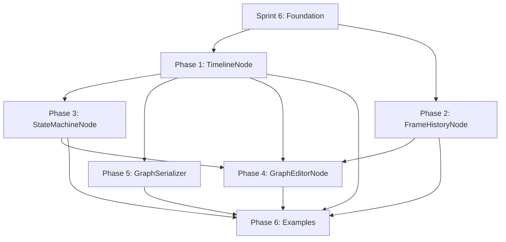

# Sprint 8: Timeline System - Composable Application Flow

**Sprint:** 8
**Board:** 651784
**Design Element:** #39 (Timeline System - Composable Application Flow)
**Status:** PLANNING — **re-scoped against the public mod-API 2026-06-13 (Decision #1 / AR#76)**
**Created:** 2026-01-10
**Branch:** `production/sprint-8-timeline-system`

> **Re-scope (2026-06-13, P1 — the cheapest, highest-leverage item in [[Architecture-Review-Game-Renderer-2026-06-12]]).**
> Sprint 8's mutation machinery (GraphEditorNode / ValidationNode / SnapshotNode / GraphSerializer) is
> ~80 % of the public mod-API's runtime-mutation machinery. It is now **specified against public-API
> requirements** so it ships *as* the mod API rather than being rebuilt into one later (the review's most
> expensive failure mode). Two changes, both cost-neutral to implement: the anti-plugin **Framework
> Positioning is reversed** (VIXEN is an embeddable mod host; UNDERTOW is consumer zero), and the new
> **Public Mod-API Requirements** section (R1–R5) constrains every Phase 4–5 surface — string addressing,
> Result-not-throw (the error-model prerequisite is **done**, AR#1 merged), generational handles, persisted
> connection records, and the thin handles/strings/POD boundary.

---

## Executive Summary

Sprint 8 transforms VIXEN from a static render graph into a **composable application flow system** with:
- **Graph-in-graph composition** (TimelineNode)
- **N-frame temporal access** (FrameHistoryNode)
- **Runtime state machine** (StateMachineNode)
- **Hot reload of graph elements** (GraphEditorNode + existing infra)

This enables node-driven application lifecycle, real-time editing, and controlled state transitions.

---

## North Star: Self-Editing Graph Editor

**The ultimate goal:** A graph editor application built with VIXEN nodes that can edit its own graph in real-time.

```
┌─────────────────────────────────────────────────────────────────────┐
│                    VIXEN Graph Editor Application                    │
│                    (Built entirely from nodes)                       │
├─────────────────────────────────────────────────────────────────────┤
│                                                                      │
│  ┌────────────────┐    ┌────────────────┐    ┌────────────────┐    │
│  │ UIRenderNode   │    │ GraphEditorNode│    │ ValidationNode │    │
│  │ (draws editor) │◄───│ (queues edits) │───▶│ (checks safety)│    │
│  └────────────────┘    └───────┬────────┘    └───────┬────────┘    │
│                                │                      │             │
│                                ▼                      ▼             │
│                    ┌─────────────────────────────────────┐          │
│                    │        Edit Pipeline                │          │
│                    │  1. User modifies graph in editor   │          │
│                    │  2. ValidationNode checks safety    │          │
│                    │  3. If valid → queue for hot reload │          │
│                    │  4. If invalid → show error, block  │          │
│                    │  5. SnapshotNode saves rollback pt  │          │
│                    │  6. Apply at frame boundary         │          │
│                    │  7. Editor sees its own changes!    │          │
│                    └─────────────────────────────────────┘          │
│                                                                      │
│  The editor IS the graph. The graph edits itself.                   │
│  Bad edits are caught. Rollback is always possible.                 │
└─────────────────────────────────────────────────────────────────────┘
```

**Why this matters:**
- **Ultimate dogfooding** - If it can edit itself safely, it can edit anything
- **Proves robustness** - Self-modification is the hardest test
- **Everything is a node** - Even the editor is just nodes
- **Graph decides everything** - No external systems, pure composition

**Required for self-editing (Sprint 8 deliverables):**
| Capability | Node | Status |
|------------|------|--------|
| Graph-in-graph composition | TimelineNode | Phase 1 |
| N-frame history | FrameHistoryNode | Phase 2 |
| State machine | StateMachineNode | Phase 3 |
| Edit queue + apply | GraphEditorNode | Phase 4 |
| **Validation before apply** | ValidationNode | Phase 4 (NEW) |
| **Snapshot/rollback** | SnapshotNode | Phase 4 (NEW) |
| **User feedback** | Via output slots | Phase 4 |
| Serialization | GraphSerializer | Phase 5 |

---

## Architecture Refinements (Session 2026-01-10)

### TimelineNode as Submission Coordinator

**Key insight:** TimelineNode doesn't just contain sub-graphs - it **orchestrates GPU execution flow** by compiling a dependency DAG into Vulkan submission batches.

```
User defines execution DAG:           TimelineNode generates:

    ┌───┐                             Submit 1: [cmdA]
    │ A │                               signal: sem_a
    └─┬─┘
      │                               Submit 2: [cmdB, cmdC]  ← batched (parallel)
    ┌─┴─┐                               wait: sem_a
  ┌─┴─┐ ┌─┴─┐                           signal: sem_bc
  │ B │ │ C │
  └─┬─┘ └─┬─┘                         Submit 3: [cmdD]
    └─┬───┘                             wait: sem_bc
    ┌─┴─┐                               signal: fence_frame
    │ D │
    └───┘
```

**Separation of concerns:**
- Work nodes (ComputeDispatchNode, etc.) = **record** command buffers only
- TimelineNode = **coordinate** submission with sync primitives
- MultiDispatchNode = **execute** the submission plan

### Sub-Graph Input/Output Slots

Inspired by Unity ShaderGraph sub-graphs: TimelineNode has input/output slots like any node, with internal proxy nodes at boundaries.

```
┌─────────────────────────────────────────────────────┐
│  TimelineNode (from parent graph's perspective)     │
│                                                     │
│  Inputs:              Outputs:                      │
│  ├─ device            ├─ finalImage                 │
│  ├─ swapchain         ├─ metrics                    │
│  └─ scene             └─ submissionPlan             │
└─────────────────────────────────────────────────────┘
                         │
                         ▼
┌─────────────────────────────────────────────────────┐
│  Internal Sub-Graph                                 │
│                                                     │
│  [SubGraphInput] ──► [Work Nodes] ──► [SubGraphOutput]
│       ▲                                       │     │
│       │                                       │     │
│  (reads from                           (writes to   │
│   TimelineNode                         TimelineNode │
│   input slots)                         output slots)│
└─────────────────────────────────────────────────────┘
```

### Delta Propagation Model

Changes flow downstream as deltas, feedback flows upstream:

```
StateMachineNode
       │
       │ state delta: "MainMenu → Loading"
       ▼
TimelineNode
       │
       │ timeline delta: swap active stages
       ▼
Hot reload infrastructure
       │
       │ applies deltas via MarkNodeNeedsRecompile()
       ▼
Work nodes execute new configuration
```

### Dry-Run Preview System

Before committing changes, preview downstream effects:

```cpp
struct DeltaPreview {
    std::vector<NodeId> addedNodes;
    std::vector<NodeId> removedNodes;
    std::vector<ConnectionDelta> connectionChanges;
    std::vector<SyncPointDelta> syncChanges;
    ResourceCostDelta resourceImpact;
    std::vector<std::string> warnings;
};

// Dry run - computes delta without applying
DeltaPreview PreviewStateTransition(StateId from, StateId to);

// User sees: "This transition would add 2 nodes, remove 1, add 3ms frame time"
// Then confirms or modifies before actual execution
```

### Framework Positioning

> **Re-scoped 2026-06-13 — Decision #1 / AR#76 ([[Architecture-Review-Game-Renderer-2026-06-12]]).**
> The original line — *"Self-contained applications (not plugin hosts)"*, with *"Large ecosystem of
> compatible tools"* listed as a deliberate sacrifice — is **withdrawn**. VIXEN's chosen direction is an
> **embeddable game-renderer that hosts data- and script-authored mods** (consumer zero: the **UNDERTOW**
> C# host, already integrated on `main`). Sprint 8's mutation machinery (GraphEditorNode / ValidationNode
> / SnapshotNode / GraphSerializer) IS ~80 % of the public mod-API's runtime-mutation machinery — so it
> is **specified against public-API requirements** (next section), not internal-tool requirements. The
> implementation cost is the same now; an internal-first build forces a far costlier moddability retrofit
> later (the most expensive failure mode in the review).

**What VIXEN optimizes for:**
- **Hosts that own the loop and drive VIXEN as a library** — `PumpEvents()/Update(dt)/RenderFrame()`;
  UNDERTOW is the named consumer zero.
- Performance-critical, explicit pipelines (no hidden callbacks) — **the graph IS the application**.
- **Data- and script-authored content** — graphs, parameters, and shader packages addressed *by string*,
  loaded from data (GraphSerializer is the public format).
- Custom engines/tools built on VIXEN — full graph-level control is always available underneath.

**What VIXEN deliberately is NOT:**
- A "drop any asset in, it works" turnkey editor (Unity-style convenience).
- A beginner-first generalist tool.

VIXEN **is** a plugin/mod host. The moddability pillar rides Sprint 8's mutation machinery plus the §6
layered engine-ops API (Layer 0 embedding contract → Layer 1 command/event surface → Layer 2 data-driven
definitions → Layer 3 script bindings) in the Architecture Review.

| Aspect | Unity-style | VIXEN-style |
|--------|-------------|-------------|
| Application flow | Predefined contract | Host- or data-defined graph |
| Mods author | Assets into a fixed pipeline | Graphs / params / shader packages by string (Layer 2) |
| External tools | Hook into lifecycle | Drive the engine-ops API; or compose graph topology |
| Target user | Generalist | Host integrator + modder, with full control underneath |

**Niche:** an embeddable, moddable renderer where a host (or a mod) composes the flow from data — and can
drop to full graph-level control when needed.

---

## Public Mod-API Requirements (Decision #1 — specify before building)

> These constraints apply to **every public surface Sprint 8 builds** (EditCommand, GraphEditorNode,
> ValidationNode, SnapshotNode, GraphSerializer). They cost nothing extra now and are the difference
> between "Sprint 8 *is* the mod API" and "Sprint 8 must be rebuilt into the mod API." Grounded in the
> Architecture Review §6 (the layered engine-ops API) and §7 (API surface).

**R1 — String addressing is the public vocabulary (AR Layer 2).** Mods and hosts reference nodes, slots,
parameters, and node-types **by stable string name**, never by raw `NodeHandle`/vector index (an index
cannot survive serialization, a recompile, or a DLL boundary). `EditCommand` and the GraphSerializer JSON
express `{ typeName, instanceName, slotName, paramName }`. `AddNode(typeName, instanceName)` +
`GetInstanceByName` + `SetParameter(name, value)` already exist as the backend; Sprint 8 adds the
name→handle resolution facade (`Connect(srcName, srcSlot, dstName, dstSlot)`) and auto-generates runtime
slot schemas from the `CONSTEXPR_NODE_CONFIG`/`INPUT_SLOT` macros (the SDI trick applied to nodes). Raw
handles remain the *internal* fast path only.

**R2 — Recoverable status, never throw, at every entry point (AR Layer 0 — ✅ prerequisite DONE).** Every
edit / validate / apply / snapshot / (de)serialize operation returns a result type
(`std::expected`-based `VulkanResult`/`VulkanStatus`/`ConnectionResult`), not `void`+throw and not a bare
`std::unique_ptr` that is null-on-failure. A mod's malformed graph is a *diagnostic the host renders*, not
a crash. **This is unblocked now:** the process-fatal error model is replaced (AR#1 error-model phases
1–3 merged 2026-06-13 — `exit()` de-fatalised, host-facing status channel, device-loss recovery; see
[[Error-Model-Refactor-2026-06]]). `ValidationNode` already outputs `isValid`+`errorMessage` — keep that
shape and extend `GraphEditorNode::Apply` and `GraphSerializer::Deserialize` to return it too. Fatal-class
events (device-lost, OOM) are *additionally* published on the bus.

**R3 — Generational opaque handles (AR Layer 0).** Node / connection / resource / cache handles are
`{index, generation}`, not raw indices or `typeid` keys (neither crosses a DLL boundary; a raw index is
silently wrong after a `RemoveNode`). `RemoveNode` must bump the generation and reject stale handles —
the review flags today's `RemoveNode` as erasing by index with **no generation check**. SnapshotNode
rollback and GraphEditorNode deltas depend on this to detect references invalidated by an intervening edit.

**R4 — Persist connection records (AR Layer 2 — prerequisite for serialization).** Persist
`(src, dst, srcSlot, dstSlot, rule, modifiers, debugTag)` at `ConnectionPipeline::Resolve` time. Today all
of it lives in `ConnectionContext` and is **discarded** after wiring — so the graph cannot describe its
own connections. This record is the shared prerequisite for GraphSerializer (Phase 5), disconnect, and
introspection; build it once, in Phase 4, ahead of the serializer.

**R5 — The thin boundary (AR Layer 3 — honor from Phase 4, don't redesign later).** Public payloads
(`EditCommand`, `ValidationResult`, `GraphSnapshot`, serializer DTOs) carry **only handles, strings, and
the POD-ish `ParamTypeValue` variant** — no `glm`, `Vk*`, `gaia.h`, or template entry points on the
mod-facing signature. This keeps a C shim (hence Lua/wasm bindings) mechanically feasible on top later;
Layer 3 itself is not scheduled now, but its constraint must hold from Layer 1 onward so nothing is
redesigned. (Internal graph wiring between the Sprint-8 nodes may still use rich types; the constraint is
on the *mod-facing* command/serializer surface.)

**Acceptance for "specified against public-API requirements":** the Phase 4–5 specs below name, for each
of EditCommand / GraphEditorNode / ValidationNode / SnapshotNode / GraphSerializer, its string-addressed
form (R1), its Result return type (R2), its handle model (R3), and its POD-able payload (R5); and Phase 4
includes the connection-record task (R4) ahead of Phase 5.

---

## Vision

**Core Principle: Everything Is A Node**

The graph IS the application. There are no external controllers - state machines, history managers, and editors are all nodes that participate in the graph like any other node.

```
Current State:
┌─────────────────────────────────────────────────────┐
│ RenderGraph                                          │
│  ┌──────┐   ┌──────┐   ┌──────┐   ┌──────┐        │
│  │ Node │──▶│ Node │──▶│ Node │──▶│ Node │        │
│  └──────┘   └──────┘   └──────┘   └──────┘        │
│                                                      │
│  Static topology, compile once, execute forever     │
└─────────────────────────────────────────────────────┘

Target State (Nodes All The Way Down):
┌─────────────────────────────────────────────────────┐
│ RenderGraph                                          │
│                                                      │
│  ┌─────────────────────────────────────────────┐    │
│  │ StateMachineNode ← IS A NODE                │    │
│  │  ┌───────────────┐  ┌───────────────┐      │    │
│  │  │TimelineNode:  │  │TimelineNode:  │      │    │
│  │  │ "MainLoop"    │  │ "PauseMenu"   │      │    │
│  │  │ ┌────┐┌────┐ │  │ ┌────┐┌────┐ │      │    │
│  │  │ │Node││Node│ │  │ │Node││Node│ │      │    │
│  │  │ └────┘└────┘ │  │ └────┘└────┘ │      │    │
│  │  └───────────────┘  └───────────────┘      │    │
│  │  [Transitions are slot connections]        │    │
│  └─────────────────────────────────────────────┘    │
│         │                                           │
│         ▼ connects to                               │
│  ┌─────────────────────────────────────────────┐    │
│  │ FrameHistoryNode ← IS A NODE                │    │
│  │  [Other nodes connect to get N-frame data]  │    │
│  └─────────────────────────────────────────────┘    │
│                                                      │
│  Hot reload = Node parameters + recompile events    │
│  No external systems - graph controls itself        │
└─────────────────────────────────────────────────────┘
```

**Design Principles:**
1. **No external controllers** - StateMachineNode IS a node, not a controller
2. **Composition via nesting** - TimelineNode contains sub-graphs as children
3. **Connections are the API** - State transitions are slot connections
4. **Hot reload via existing patterns** - Node parameters + MarkNodeNeedsRecompile()
5. **History as a service node** - FrameHistoryNode provides temporal data to connected nodes

---

## Architecture Discovery Summary

### Existing Infrastructure (Sprint 6 Foundation)

| Component | Status | Location | Enables |
|-----------|--------|----------|---------|
| GraphLifecycleHooks | ✅ Ready | `Core/GraphLifecycleHooks.h` | Cross-node coordination |
| VariadicTypedNode | ✅ Ready | `Core/VariadicTypedNode.h` | Dynamic slot creation |
| LoopManager | ✅ Ready | `Core/LoopManager.h` | Fixed-timestep accumulator |
| PerFrameResources | ✅ Ready | `Core/PerFrameResources.h` | Ring buffer per-frame |
| FrameManager | ✅ Ready | `Core/FrameManager.h` | Global frame counter + events |
| TaskProfileRegistry | ✅ Ready | `Core/TaskProfileRegistry.h` | Runtime calibration |
| DeferredDestruction | ✅ Ready | `Memory/DeferredDestruction.h` | Zero-stutter resource swap |
| ShaderHotReload | ✅ Ready | `ShaderManagement/` | Full shader hot reload |
| EventBus | ✅ Ready | `EventBus/` | Decoupled state changes |
| WaveScheduler | ✅ Ready | `Core/WaveScheduler.h` | Parallel wave execution |

### Critical Gaps Identified

| Gap | Impact | Required Work |
|-----|--------|---------------|
| **No GPU submission coordination** | Each node submits independently, no parallel execution | TimelineNode (submission coordinator) |
| **No graph-in-graph nesting** | Can't compose sub-graphs | TimelineNode (sub-graph composition) |
| **No N-frame history access** | Can't do TAA/motion blur | FrameHistoryNode |
| **Graph topology immutable** | Can't hot reload nodes | GraphEditorNode + delta propagation |
| **No state machine** | Can't control app flow | StateMachineNode |
| **No graph serialization** | Can't save/load graphs | GraphSerializer |
| **No dry-run preview** | Can't see effects before commit | DeltaPreview system |

---

## Phase Breakdown

### Phase 1: TimelineNode Foundation (32h)

**Goal:** GPU execution coordinator with stage DAG and sync derivation

**Core Responsibility:** User defines logical dependencies (A→B,C→D), TimelineNode derives physical synchronization (semaphores, fences, batching).

```cpp
// Target API
class TimelineNode : public NodeInstance {
public:
    // =========================================================================
    // STAGE DAG DEFINITION
    // =========================================================================

    struct TimelineStage {
        std::string name;
        std::vector<TimelineStage*> dependencies;  // What must complete first
        std::function<VkCommandBuffer()> recordCommands;
        QueueType queue = QueueType::Graphics;
    };

    // Build execution DAG
    TimelineStage* AddStage(const std::string& name,
                            std::span<TimelineStage*> dependencies = {});

    void SetStageRecorder(TimelineStage* stage,
                          std::function<VkCommandBuffer()> recorder);

    // =========================================================================
    // SUBMISSION PLAN OUTPUT
    // =========================================================================

    struct SubmissionPlan {
        std::vector<VkSubmitInfo2> submits;
        std::vector<VkSemaphoreSubmitInfo> semaphores;  // Owned by plan
        VkFence frameFence;
    };

    // Compile DAG to submission batches (called during Compile phase)
    SubmissionPlan CompileSubmissionPlan();

    // Output slot: ready-to-execute plan
    TYPED_OUTPUT_SLOT(SubmissionPlan, submissionPlan);

    // =========================================================================
    // SUB-GRAPH COMPOSITION (Unity ShaderGraph-style)
    // =========================================================================

    // Sub-graph management
    template<typename TNode, typename... Args>
    NodeHandle AddSubNode(const std::string& name, Args&&... args);

    void ConnectSubNodes(NodeHandle src, const std::string& srcSlot,
                         NodeHandle dst, const std::string& dstSlot);

    // Slot exposure (promote internal slots to timeline boundary)
    void ExposeInput(const std::string& internalSlot, const std::string& externalName);
    void ExposeOutput(const std::string& internalSlot, const std::string& externalName);

    // =========================================================================
    // DELTA PROPAGATION
    // =========================================================================

    // Preview changes without applying (dry run)
    DeltaPreview PreviewStageChange(const std::vector<TimelineStage*>& newStages);

    // Emit delta to connected downstream nodes
    void EmitDelta(const TimelineDelta& delta);

protected:
    RenderGraph subGraph_;  // Internal graph instance
    std::vector<std::unique_ptr<TimelineStage>> stages_;
    std::unordered_map<std::string, std::string> exposedInputs_;
    std::unordered_map<std::string, std::string> exposedOutputs_;

    // Sync primitive pools (reused across frames)
    std::vector<VkSemaphore> semaphorePool_;
    VkFence frameFence_ = VK_NULL_HANDLE;

    // Derived during compilation
    std::vector<std::vector<TimelineStage*>> parallelGroups_;  // Stages that can run together
};
```

**Sync Derivation Algorithm:**
1. Topological sort of stage DAG
2. Group stages with no dependency path between them (parallel execution)
3. Create semaphores between groups
4. Batch same-queue stages into single VkSubmitInfo2
5. Output: ready-to-submit plan

| Task | Hours | Dependencies | Files |
|------|-------|--------------|-------|
| TimelineStage + DAG builder | 6h | None | `Core/TimelineNode.h/.cpp` |
| Sync derivation algorithm | 8h | DAG builder | `Core/TimelineNode.cpp` |
| SubmissionPlan generation | 6h | Sync derivation | `Core/TimelineNode.cpp` |
| Sub-graph lifecycle integration | 6h | SubmissionPlan | `Core/TimelineNode.cpp` |
| Slot exposure + proxy nodes | 6h | Sub-graph lifecycle | `Core/TimelineNode.cpp` |

**Success Metrics:**
- [ ] Can define A→B,C→D execution DAG
- [ ] Correctly derives parallel groups (B,C together)
- [ ] Generates valid VkSubmitInfo2 with semaphores
- [ ] Sub-graph input/output slots work
- [ ] PreviewStageChange returns accurate delta
- [ ] 25+ unit tests passing

---

### Phase 2: FrameHistoryNode (24h)

**Goal:** N-frame temporal resource access AS A NODE

**Design Principle:** Frame history is a SERVICE NODE that other nodes connect to. It exposes historical data via output slots.

```cpp
// Target API - FrameHistoryNode IS A NODE
class FrameHistoryNode : public NodeInstance {
public:
    // Configuration (set during setup)
    static constexpr uint32_t DEFAULT_HISTORY_DEPTH = 4;

    // Input slot - what resource to track history for
    VARIADIC_INPUT_SLOT(Resource, trackedResources);

    // Output slots - historical versions of tracked resources
    // For each tracked resource "foo", exposes:
    //   foo_current, foo_prev1, foo_prev2, foo_prev3
    VARIADIC_OUTPUT_SLOT(Resource, historyOutputs);

    // Jitter output for TAA
    TYPED_OUTPUT_SLOT(glm::vec2, jitterOffset);
    TYPED_OUTPUT_SLOT(uint32_t, frameIndexMod);

protected:
    void SetupImpl(SetupContext& ctx) override {
        // Create output slots for each tracked input
        for (const auto& input : GetVariadicInputs(trackedResources)) {
            CreateHistoryOutputSlots(input.name);
        }
    }

    void ExecuteImpl(ExecuteContext& ctx) override {
        // Rotate ring buffer
        AdvanceHistory();

        // Copy current inputs to history[0]
        for (const auto& input : GetVariadicInputs(trackedResources)) {
            StoreCurrentFrame(input);
        }

        // Publish outputs
        ctx.SetOutput(jitterOffset, ComputeJitter(currentFrameIndex_));
        ctx.SetOutput(frameIndexMod, currentFrameIndex_ % historyDepth_);
    }

private:
    uint32_t historyDepth_ = DEFAULT_HISTORY_DEPTH;
    uint32_t currentFrameIndex_ = 0;
    std::vector<std::vector<ResourceHandle>> historyRingBuffer_;
};

// Example usage - TAA node CONNECTS to FrameHistoryNode:
// RenderNode.colorOutput ──▶ FrameHistoryNode.trackedResources
// FrameHistoryNode.colorOutput_prev1 ──▶ TAANode.previousFrame
// FrameHistoryNode.jitterOffset ──▶ RenderNode.jitterOffset
```

| Task | Hours | Dependencies | Files |
|------|-------|--------------|-------|
| FrameHistoryNode base class | 8h | None | `Nodes/FrameHistoryNode.h/.cpp` |
| Ring buffer storage with variadic slots | 8h | Base class | `Nodes/FrameHistoryNode.cpp` |
| Dynamic output slot generation | 4h | Ring buffer | `Nodes/FrameHistoryNode.cpp` |
| TAA jitter pattern computation | 4h | Output slots | `Nodes/FrameHistoryNode.cpp` |

**Key Insight:** Other nodes don't call a "manager" API - they CONNECT to FrameHistoryNode's output slots to get historical data.

**Success Metrics:**
- [ ] FrameHistoryNode works as a regular node
- [ ] Can track arbitrary number of resources via variadic input
- [ ] Historical outputs automatically generated per tracked input
- [ ] Ring buffer correctly rotates without data loss
- [ ] 15+ unit tests passing

---

### Phase 3: StateMachineNode (24h)

**Goal:** State machine AS A NODE - not an external controller

**Design Principle:** The state machine is a node that contains TimelineNode children. Transitions are driven by input slots, not external API calls.

```cpp
// Target API - StateMachineNode IS A NODE
class StateMachineNode : public TimelineNode {
public:
    // Input slots for state control (connected from other nodes)
    TYPED_INPUT_SLOT(TransitionRequest, transitionRequest);  // From InputNode, etc.
    TYPED_INPUT_SLOT(bool, pauseRequested);
    TYPED_INPUT_SLOT(bool, resumeRequested);

    // Output slots for state information (other nodes can react)
    TYPED_OUTPUT_SLOT(uint32_t, currentStateId);
    TYPED_OUTPUT_SLOT(std::string_view, currentStateName);
    TYPED_OUTPUT_SLOT(bool, isTransitioning);

    // Child timeline registration (during Setup)
    void RegisterState(const std::string& name, TimelineNode* timeline);

    // Transition rules (conditions checked each frame)
    void AddTransition(const std::string& from, const std::string& to,
                       std::function<bool()> condition);

protected:
    void ExecuteImpl(ExecuteContext& ctx) override {
        // Check input slots for transition requests
        if (auto* req = ctx.GetInput<TransitionRequest>(transitionRequest)) {
            RequestTransition(req->targetState);
        }

        // Evaluate transition conditions
        EvaluateTransitions();

        // Execute current timeline's sub-graph
        if (currentTimeline_) {
            currentTimeline_->Execute(ctx);
        }

        // Publish current state to output slots
        ctx.SetOutput(currentStateId, currentStateId_);
        ctx.SetOutput(currentStateName, currentStateName_);
    }

private:
    std::unordered_map<std::string, TimelineNode*> states_;
    TimelineNode* currentTimeline_ = nullptr;
    uint32_t currentStateId_ = 0;
    std::string currentStateName_;
};

// Example usage - ALL IN THE GRAPH:
// InputNode.pausePressed ──▶ StateMachineNode.pauseRequested
// StateMachineNode.currentStateName ──▶ UINode.stateLabel
```

| Task | Hours | Dependencies | Files |
|------|-------|--------------|-------|
| StateMachineNode base (extends TimelineNode) | 8h | TimelineNode | `Nodes/StateMachineNode.h/.cpp` |
| Transition evaluation system | 8h | Base node | `Nodes/StateMachineNode.cpp` |
| Input/output slot integration | 4h | Transition system | `Nodes/StateMachineNode.cpp` |
| Child timeline lifecycle | 4h | Slot integration | `Nodes/StateMachineNode.cpp` |

**Success Metrics:**
- [ ] StateMachineNode works as a regular node in the graph
- [ ] Transitions triggered via input slot connections
- [ ] Current state exposed via output slots
- [ ] Child timelines execute correctly based on state
- [ ] 15+ unit tests passing

---

### Phase 4: Safe Hot Reload Pipeline (32h)

**Goal:** Enable self-editing with validation, rollback, and graceful error handling

**Design Principle:** Hot reload is a PIPELINE of nodes that validate, snapshot, and apply:
```
EditCommand → ValidationNode → SnapshotNode → GraphEditorNode → Apply
                   ↓                              ↓
             FeedbackNode ←──────────────── Success/Failure
```

**Core Nodes:**

```cpp
// 1. ValidationNode - Checks if edit would create valid graph
class ValidationNode : public NodeInstance {
public:
    // Input: proposed edit
    TYPED_INPUT_SLOT(EditCommand, proposedEdit);

    // Output: validation result
    TYPED_OUTPUT_SLOT(ValidationResult, result);
    TYPED_OUTPUT_SLOT(bool, isValid);
    TYPED_OUTPUT_SLOT(std::string, errorMessage);

protected:
    void ExecuteImpl(ExecuteContext& ctx) override {
        auto* edit = ctx.GetInput<EditCommand>(proposedEdit);
        if (!edit) return;

        // Simulate the edit without applying
        ValidationResult result = ValidateEdit(*edit);

        ctx.SetOutput(this->result, result);
        ctx.SetOutput(isValid, result.isValid);
        ctx.SetOutput(errorMessage, result.errorMessage);
    }

private:
    ValidationResult ValidateEdit(const EditCommand& cmd) {
        // Check: Would this create cycles?
        // Check: Are all required slots connected?
        // Check: Are types compatible?
        // Check: Would this orphan any nodes?
        // Returns detailed error if invalid
    }
};

// 2. SnapshotNode - Maintains rollback points
class SnapshotNode : public NodeInstance {
public:
    // Input: trigger snapshot creation
    TYPED_INPUT_SLOT(bool, createSnapshot);
    TYPED_INPUT_SLOT(uint32_t, rollbackToIndex);

    // Output: current state
    TYPED_OUTPUT_SLOT(std::vector<GraphSnapshot>, snapshotHistory);
    TYPED_OUTPUT_SLOT(uint32_t, currentSnapshotIndex);
    TYPED_OUTPUT_SLOT(bool, canUndo);
    TYPED_OUTPUT_SLOT(bool, canRedo);

protected:
    void ExecuteImpl(ExecuteContext& ctx) override {
        if (ctx.GetInput<bool>(createSnapshot)) {
            CreateSnapshot();
        }

        if (auto* idx = ctx.GetInput<uint32_t>(rollbackToIndex)) {
            RollbackTo(*idx);  // Restores graph state from snapshot
        }

        // Always expose current state
        ctx.SetOutput(canUndo, currentIndex_ > 0);
        ctx.SetOutput(canRedo, currentIndex_ < snapshots_.size() - 1);
    }

private:
    std::vector<GraphSnapshot> snapshots_;
    uint32_t currentIndex_ = 0;
    static constexpr uint32_t MAX_SNAPSHOTS = 50;

    void CreateSnapshot();
    void RollbackTo(uint32_t index);
};

// 3. GraphEditorNode - Applies validated edits
class GraphEditorNode : public NodeInstance {
public:
    // Input: validated edit (from ValidationNode)
    TYPED_INPUT_SLOT(EditCommand, validatedEdit);
    TYPED_INPUT_SLOT(bool, applyEdit);  // Gate: only apply when true

    // Output: application result
    TYPED_OUTPUT_SLOT(bool, editApplied);
    TYPED_OUTPUT_SLOT(bool, editFailed);
    TYPED_OUTPUT_SLOT(std::string, failureReason);

protected:
    void ExecuteImpl(ExecuteContext& ctx) override {
        auto* edit = ctx.GetInput<EditCommand>(validatedEdit);
        bool shouldApply = ctx.GetInputOr<bool>(applyEdit, false);

        if (edit && shouldApply) {
            // Queue for frame-boundary application
            pendingEdits_.push(*edit);
        }

        // Apply at frame start (safe point)
        if (ctx.IsFrameStart() && !pendingEdits_.empty()) {
            ApplyQueuedEdits(ctx);
        }
    }
};

// 4. FeedbackNode - Displays validation/error state to user
class FeedbackNode : public NodeInstance {
public:
    TYPED_INPUT_SLOT(ValidationResult, validationResult);
    TYPED_INPUT_SLOT(bool, editFailed);
    TYPED_INPUT_SLOT(std::string, errorMessage);

    // Output: UI-ready feedback
    TYPED_OUTPUT_SLOT(FeedbackState, uiFeedback);  // Color, message, icon
};
```

**Edit Pipeline Flow:**
```
User Input → EditCommand
                ↓
         ValidationNode ──── Invalid? ───▶ FeedbackNode (show error)
                ↓ Valid                          ↓
         SnapshotNode (save rollback point)     (edit blocked)
                ↓
         GraphEditorNode (queue edit)
                ↓
         Frame Boundary (apply edit)
                ↓
         Success? ───▶ Editor sees changes
                ↓ Failure
         SnapshotNode.Rollback() + FeedbackNode (show recovery)
```

| Task | Hours | Dependencies | Files |
|------|-------|--------------|-------|
| **Persist connection records** at `ConnectionPipeline::Resolve` — `(src,dst,srcSlot,dstSlot,rule,modifiers,debugTag)` (R4; prereq for serialize/disconnect/introspect) | 6h | None | `Connection/ConnectionRecord.h`, `ConnectionPipeline.cpp` |
| `EditCommand` (R1 string-addressed: `{op, typeName, instanceName, srcSlot, dstName, dstSlot, params}`) + `ValidationResult`, both POD-able strings + `ParamTypeValue` (R5) | 4h | None | `Data/EditTypes.h` |
| ValidationNode — graph simulation, **returns `ValidationResult`, no throw** (R2) | 10h | TimelineNode | `Nodes/ValidationNode.h/.cpp` |
| GraphEditorNode — resolves **name→handle** (R1), `Apply` returns a `VulkanResult` (R2), generational handles (R3) | 8h | ValidationNode | `Nodes/GraphEditorNode.h/.cpp` |
| SnapshotNode — history over the serialized form (R1/R5); generational handles (R3) | 8h | GraphSerializer, conn. records | `Nodes/SnapshotNode.h/.cpp` |
| FeedbackNode for user communication | 2h | All above | `Nodes/FeedbackNode.h/.cpp` |

*Hours: +6h vs the original 32h (the connection-record task, R4) → Phase 4 = 38h, Sprint 8 = 150h. This
buys the serializer its source data and the disconnect/introspection primitives — it is mod-API
infrastructure, not editor polish.*

**Key Insight:** The validation/snapshot/apply pipeline is ITSELF a graph of nodes. Self-editing is safe because edits pass through validation before touching the running graph — and because each edit is a *string-addressed, Result-returning* command, the same pipeline is the host/mod command surface (AR Layer 1).

**Success Metrics:**
- [ ] Invalid edits are caught and blocked with clear feedback (a `ValidationResult`, not a throw — R2)
- [ ] An edit is expressible **by string name** with no raw handle (R1) and round-trips through the serializer
- [ ] Valid edits apply at frame boundary without stutter
- [ ] Rollback restores previous working state; stale handles after an intervening edit are rejected (R3)
- [ ] Self-editing demo: editor modifies its own UI node, sees change
- [ ] 25+ unit tests passing

---

### Phase 5: Graph Serialization (16h)

**Goal:** Save/load graph configurations

```cpp
// Target API — the PUBLIC graph format. Mod-API requirements R1 (string-addressed), R2 (Result-returning),
// R4 (driven by persisted connection records). The SAME JSON is the engine's own scene/view-definition
// format AND the mod-authored graph format — build it once, for both consumers.
class GraphSerializer {
public:
    // Serialize to JSON, addressing everything by string name (R1):
    //   { "nodes":       [ { "type": "...", "name": "...", "params": { "<name>": <ParamTypeValue> } } ],
    //     "connections": [ { "srcName","srcSlot","dstName","dstSlot","rule","modifiers","debugTag" } ] }
    // The connections array is emitted from the persisted connection records (R4) — not reconstructable
    // without them.
    nlohmann::json SerializeGraph(const RenderGraph& graph);
    nlohmann::json SerializeTimeline(const TimelineNode& timeline);

    // Deserialize: returns a Result, never throws, never a null-on-failure unique_ptr (R2). A malformed
    // mod graph yields a host-renderable diagnostic (unknown type name, unknown slot, type-mismatched or
    // cyclic connection) — not a crash. Payloads are POD-able strings + ParamTypeValue (R5).
    VulkanResult<std::unique_ptr<RenderGraph>>  DeserializeGraph(const nlohmann::json& j);
    VulkanResult<std::unique_ptr<TimelineNode>> DeserializeTimeline(const nlohmann::json& j);

    // Node factory registration: string type-name → factory (R1).
    template<typename TNode>
    void RegisterNodeFactory(const std::string& typeName);

private:
    std::unordered_map<std::string, NodeFactory> factories_;
};
```

| Task | Hours | Dependencies | Files |
|------|-------|--------------|-------|
| Graph serialization to JSON | 8h | None | `Core/GraphSerializer.h/.cpp` |
| Node factory registry | 4h | Serialization | `Core/GraphSerializer.cpp` |
| Graph deserialization | 4h | Factory registry | `Core/GraphSerializer.cpp` |

**Success Metrics (mod-API-conformant — Decision #1):**
- [ ] Round-trips a full graph **by string name** (type / instance / slot / param) — raw handle indices
  never appear in the JSON (R1)
- [ ] `DeserializeGraph` returns a `VulkanResult`; a malformed graph (unknown type, unknown slot,
  type-mismatched or cyclic connection) yields a host-renderable diagnostic, not a throw/crash (R2)
- [ ] Connections round-trip from the persisted connection records (R4), preserving rule + modifiers +
  debugTag
- [ ] All node types registered in the string-keyed factory
- [ ] Public JSON/DTO surface carries only strings + `ParamTypeValue` — no `glm`/`Vk*`/STL containers (R5)
- [ ] 10+ unit tests passing, including malformed-input diagnostics

---

### Phase 6: Node Composition Examples (16h)

**Goal:** Demonstrate the "everything is a node" principle

| Example | Purpose | Nodes Used |
|---------|---------|------------|
| TAA Pipeline | Temporal anti-aliasing | FrameHistoryNode → TAANode |
| Motion Blur | Motion vector blending | FrameHistoryNode → MotionBlurNode |
| App State Machine | Menu → Game → Pause | StateMachineNode with TimelineNode children |

```cpp
// Example: TAA setup - ALL NODES, ALL CONNECTIONS
graph.AddNode<FrameHistoryNode>("history");
graph.AddNode<RenderNode>("render");
graph.AddNode<TAANode>("taa");
graph.AddNode<PresentNode>("present");

// FrameHistoryNode tracks render output and provides historical access
graph.Connect("render", "colorOutput", "history", "trackedResources");

// TAANode connects to history for previous frames
graph.Connect("history", "colorOutput_current", "taa", "currentFrame");
graph.Connect("history", "colorOutput_prev1", "taa", "previousFrame");
graph.Connect("history", "jitterOffset", "render", "jitterOffset");

// Final output
graph.Connect("taa", "output", "present", "image");
```

```cpp
// Example: App State Machine - NESTED TIMELINES
graph.AddNode<StateMachineNode>("appFlow");

// Register child timelines (each is a TimelineNode)
auto mainLoop = graph.AddNode<TimelineNode>("mainLoop");
mainLoop->AddSubNode<RenderNode>("render");
mainLoop->AddSubNode<PhysicsNode>("physics");

auto pauseMenu = graph.AddNode<TimelineNode>("pauseMenu");
pauseMenu->AddSubNode<MenuRenderNode>("menuRender");

// StateMachineNode manages which timeline executes
graph.GetNode<StateMachineNode>("appFlow")->RegisterState("playing", mainLoop);
graph.GetNode<StateMachineNode>("appFlow")->RegisterState("paused", pauseMenu);

// Transitions driven by INPUT SLOTS (from InputNode)
graph.Connect("input", "pausePressed", "appFlow", "pauseRequested");
graph.Connect("input", "resumePressed", "appFlow", "resumeRequested");
```

| Task | Hours | Dependencies | Files |
|------|-------|--------------|-------|
| TAA pipeline example | 6h | FrameHistoryNode | `Examples/TAAPipeline.cpp` |
| Motion Blur example | 4h | FrameHistoryNode | `Examples/MotionBlurPipeline.cpp` |
| App State Machine example | 6h | StateMachineNode | `Examples/AppStateMachine.cpp` |

---

## Total Effort

| Phase | Hours | Dependencies | Principle |
|-------|-------|--------------|-----------|
| Phase 1: TimelineNode | 32h | Sprint 6 foundation | Graph-in-graph composition |
| Phase 2: FrameHistoryNode | 24h | None | History as service node |
| Phase 3: StateMachineNode | 24h | Phase 1 | State machine IS a node |
| Phase 4: Safe Hot Reload Pipeline | 32h | Phases 1-3, 5 | Validation + Snapshot + Edit nodes |
| Phase 5: GraphSerializer | 16h | Phase 1 | Serialization for snapshots |
| Phase 6: Examples | 16h | All phases | Self-editing demo |
| **Total** | **144h** | | **Everything is a node** |

**New in Phase 4:** ValidationNode, SnapshotNode, FeedbackNode - enables safe self-editing with rollback.

---

## Risk Assessment

| Risk | Probability | Impact | Mitigation |
|------|-------------|--------|------------|
| Graph topology changes during execution cause race conditions | High | High | Frame-boundary-only modifications, pending update queue |
| Recursive compilation complexity | Medium | Medium | Clear parent/child lifecycle contract |
| State machine transitions mid-frame | Medium | High | Deferred transitions applied at frame start |
| Memory overhead from history storage | Low | Medium | Configurable history depth, lazy allocation |
| Serialization schema versioning | Low | Low | Version field, migration path |

---

## Dependency Graph



**All outputs are NODES:**
- TimelineNode (graph container)
- FrameHistoryNode (temporal service)
- StateMachineNode (state machine)
- GraphEditorNode (live editing)

---

## Related Documentation

- [[Sprint6-Timeline-Foundation]] - Foundation infrastructure
- [[Sprint6.5-Consolidation-Audit]] - Integration fixes
- [[Production-Roadmap-2026]] - Master roadmap
- [[timeline-execution-system]] - Original proposal
- [[GraphLifecycleHooks]] - Hook system reference
- [[Architecture-Review-Game-Renderer-2026-06-12]] - Game-renderer readiness review; its decision #1 asks that Sprint 8 deliverables (GraphSerializer, GraphEditorNode, ValidationNode, SnapshotNode) be specified against public mod-API requirements, not internal-tool requirements

---

## Change Log

| Date | Change |
|------|--------|
| 2026-01-10 | Initial feature document created |
| 2026-01-10 | Architecture discovery completed (3 agent exploration) |
| 2026-01-10 | Phase breakdown defined (144h total) |
| 2026-01-10 | **Architecture revision: "Everything is a Node"** |
| 2026-01-10 | Renamed ApplicationFlowController → StateMachineNode |
| 2026-01-10 | Renamed FrameHistoryManager → FrameHistoryNode |
| 2026-01-10 | Renamed LiveEditSystem → GraphEditorNode + existing infra |
| 2026-01-10 | Reduced total from 144h to 136h by leveraging existing infrastructure |
| 2026-01-10 | **North Star added: Self-Editing Graph Editor** |
| 2026-01-10 | Phase 4 expanded: +ValidationNode, +SnapshotNode, +FeedbackNode |
| 2026-01-10 | Total back to 144h with validation/rollback pipeline |
| 2026-01-10 | **HacknPlan tasks created**: Design Element #39, Tasks #351-#373 |
| 2026-01-10 | **Architecture Refinements session:** |
|            | - TimelineNode redefined as GPU submission coordinator |
|            | - Stage DAG → sync derivation → VkSubmitInfo2 batches |
|            | - Sub-graph I/O slots (Unity ShaderGraph pattern) |
|            | - Delta propagation model (changes flow downstream) |
|            | - Dry-run preview system (see effects before commit) |
|            | - Framework positioning clarified (architect-controlled, not ecosystem host) |
|            | - Phase 1 API updated with TimelineStage, SubmissionPlan, sync derivation |

---

*Sprint 8 Feature Plan - VIXEN Timeline System*
*Core Principle: Everything Is A Node*
*North Star: Self-editing graph editor that can modify itself*
*Design Element: #39 | Board: 651784 | Tasks: #351-#373*
