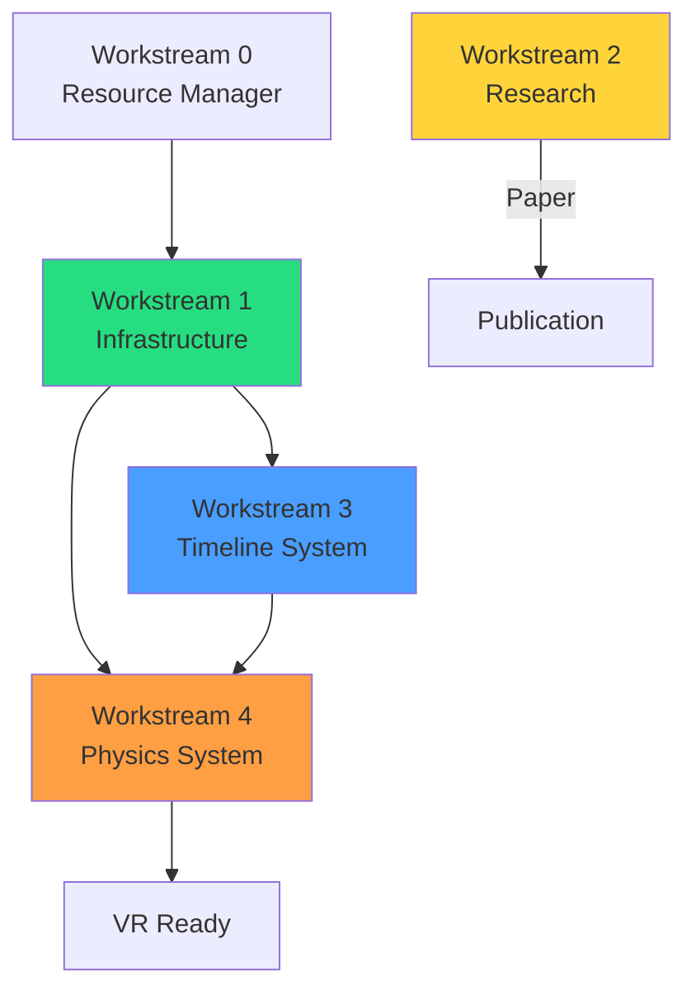

# VIXEN Workstreams

Central navigation for all active development workstreams. Each workstream links to its HacknPlan board and related documentation.

---

## Active Workstreams

| # | Workstream | Status | Sprint | HacknPlan | Docs |
|---|------------|--------|--------|-----------|------|
| 0 | [[resource-manager-integration\|Resource Manager]] | 🟡 Pending | Sprint 4 | [Board](hacknplan://board/sprint4) | [[../features/robust-cacher-system]] |
| 1 | [[infrastructure-hardening\|Infrastructure]] | 🟢 1.1-1.2 Done | Sprint 5 | [Board](hacknplan://board/sprint5) | [[../features/Include-Optimization]] |
| 2 | [[research-publication\|Research]] | 📝 Awaiting Feedback | Sprint 3 | [Board](hacknplan://board/650291) | [[../Roadmap]] |
| 3 | [[timeline-execution-system\|Timeline System]] | 🟡 Planning | Sprint 6-10 | [Board](hacknplan://board/sprint6) | [[../feature-proposal-plans/timeline-execution-system]] |
| 4 | [[gaiavoxelworld-physics\|Physics System]] | 🟡 Planning | Sprint 7,11-14 | [Board](hacknplan://board/sprint7) | [[../feature-proposal-plans/COMPREHENSIVE_SUMMARY]] |

---

## Workstream Dependencies

---

## Sprint Timeline

| Sprint | Workstream | Focus | Weeks |
|--------|------------|-------|-------|
| Sprint 3 | Research | Paper awaiting feedback | - |
| Sprint 4 | W0 | Resource Manager Integration | 3 |
| Sprint 5 | W1 | CashSystem Robustness | 3 |
| Sprint 6 | W3 | Timeline Foundation | 6 |
| Sprint 7 | W4 | Core Physics Systems | 12 |
| Sprint 8 | W3 | Timeline System | 8 |
| Sprint 9 | W3 | Auto Synchronization | 5 |
| Sprint 10 | W3 | Multi-GPU | 8 |
| Sprint 11 | W4 | Soft Body Physics | 8 |
| Sprint 12 | W4 | GPU Procedural Generation | 8 |
| Sprint 13 | W4 | Skin Width SVO | 4 |
| Sprint 14 | W4 | VR Integration | 8 |

---

## Quick Links

### Documentation
- [[../Production-Roadmap-2026|Master Roadmap]]
- [[../Current-Status|Current Status]]
- [[../Phase-History|Completed Phases]]

### HacknPlan
- [Active Board](hacknplan://board/active)
- [Backlog](hacknplan://backlog)
- [Design Elements](hacknplan://designelements)

### Feature Proposals
- [[../feature-proposal-plans/timeline-execution-system|Timeline Execution System]]
- [[../feature-proposal-plans/COMPREHENSIVE_SUMMARY|GaiaVoxelWorld Summary]]
- [[../feature-proposal-plans/timeline-example-got-grass-system|GoT Grass Example]]

---

## Status Legend

| Icon | Meaning |
|------|---------|
| 🟢 | Complete |
| 🟡 | In Progress / Planning |
| 📝 | Awaiting Feedback |
| ⏸️ | Deferred |
| 🔴 | Blocked |
