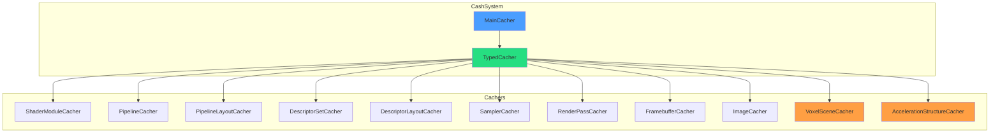
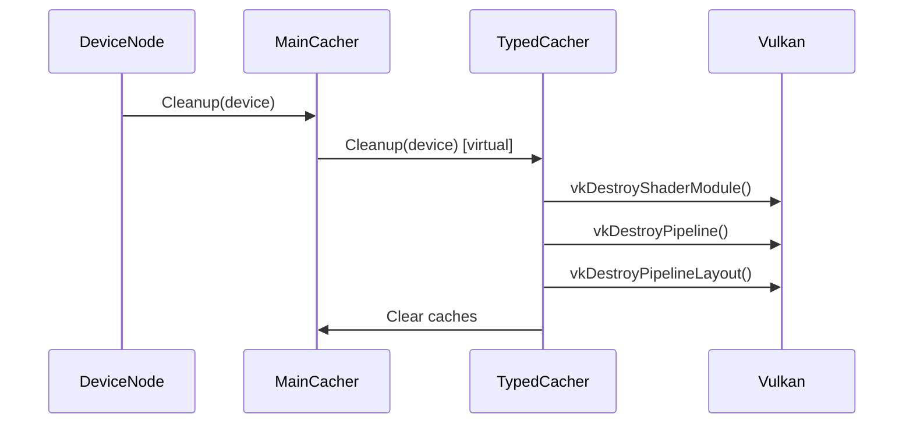
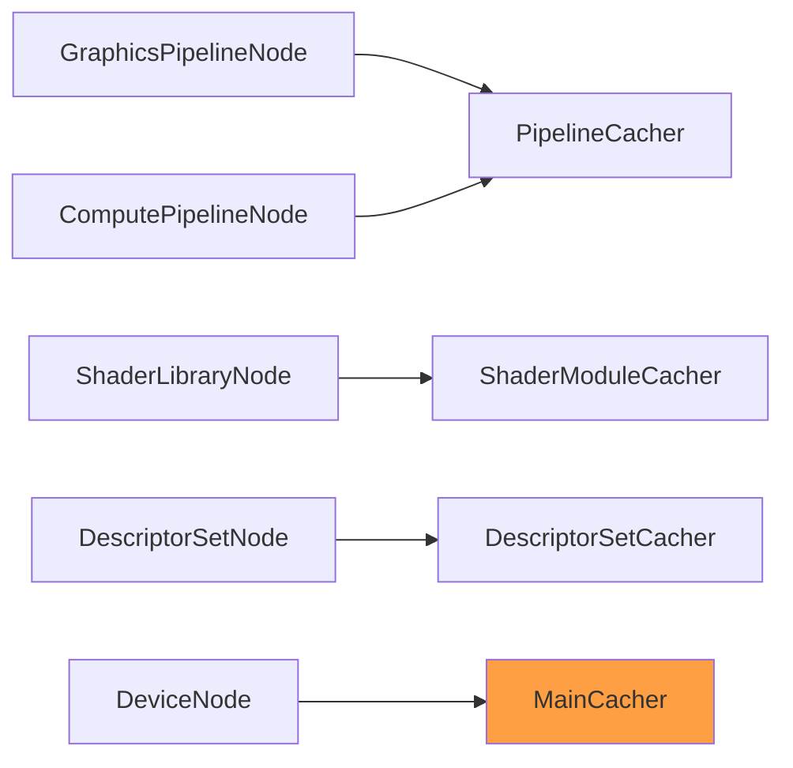

# CashSystem Library

Type-safe resource caching system with virtual cleanup architecture. Eliminates redundant Vulkan resource creation via hash-based deduplication.

---

## 1. Architecture



---

## 2. Core Components

### 2.1 MainCacher

Global registry orchestrating all cachers with virtual cleanup.

```cpp
MainCacher& cacher = MainCacher::GetInstance();

// Access typed cachers
auto& shaderCacher = cacher.GetShaderModuleCacher();
auto& pipelineCacher = cacher.GetPipelineCacher();

// Cleanup all cachers (on device destruction)
cacher.Cleanup(device);
```

### 2.2 TypedCacher < T >

Template base class with hash-based key deduplication.

```cpp
template<typename Key, typename Value>
class TypedCacher {
public:
    // Get or create resource
    Value GetOrCreate(const Key& key, std::function<Value()> createFn);

    // Check cache
    bool Contains(const Key& key) const;
    std::optional<Value> Get(const Key& key) const;

    // Cache management
    void Clear();
    size_t Size() const;

    // Virtual cleanup for polymorphic destruction
    virtual void Cleanup(VkDevice device) = 0;
};
```

---

## 3. Active Cachers

### 3.1 ShaderModuleCacher

Caches `VkShaderModule` with CACHE HIT/MISS logging.

```cpp
auto& shaderCacher = cacher.GetShaderModuleCacher();
VkShaderModule module = shaderCacher.GetOrCreate(
    ShaderModuleKey{spirvPath, stage},
    [&]() { return createShaderModule(device, spirvPath); }
);
```

**Key:** `{SPIRV path, shader stage}`
**Log:** `[CACHE HIT] ShaderModule: VoxelRayMarch.comp` or `[CACHE MISS]`

### 3.2 PipelineCacher

Caches `VkPipeline` with activity tracking.

```cpp
auto& pipelineCacher = cacher.GetPipelineCacher();
VkPipeline pipeline = pipelineCacher.GetOrCreate(
    PipelineKey{layout, renderPass, shaderStages, ...},
    [&]() { return createGraphicsPipeline(...); }
);
```

### 3.3 PipelineLayoutCacher

Transparent two-mode API for `VkPipelineLayout`.

```cpp
// Mode 1: Explicit descriptor set layouts
VkPipelineLayout layout = layoutCacher.GetOrCreate(
    PipelineLayoutKey{descriptorLayouts, pushConstantRanges}
);

// Mode 2: Inferred from shaders
VkPipelineLayout layout = layoutCacher.GetOrCreateFromShaders(shaderModules);
```

### 3.4 VoxelSceneCacher (NEW)

Caches complete voxel scene data including octree, compressed colors/normals, and GPU buffers.

```cpp
auto& sceneCacher = MainCacher::GetInstance().GetVoxelSceneCacher();
VoxelSceneCreateInfo ci{
    .sceneType = SceneType::Cornell,
    .resolution = 256,
    .density = 0.5f
};
auto sceneData = sceneCacher.GetOrCreate(ci);
// Returns shared_ptr<VoxelSceneData> with all CPU + GPU buffers
```

**Key:** `hash(sceneType, resolution, density)`
**Cached:** Octree nodes, brick data, materials, compressed colors/normals, OctreeConfig UBO, brick grid lookup

### 3.5 AccelerationStructureCacher (NEW)

Caches hardware RT acceleration structures built from voxel scene data.

```cpp
auto& asCacher = MainCacher::GetInstance().GetAccelerationStructureCacher();
AccelStructCreateInfo ci{
    .sceneData = sceneDataPtr,  // From VoxelSceneCacher
    .device = device,
    .physicalDevice = physicalDevice
};
auto accelStruct = asCacher.GetOrCreate(ci);
// Returns shared_ptr<CachedAccelerationStructure> with BLAS/TLAS
```

**Key:** `hash(sceneData pointer, buildFlags)`
**Cached:** AABBs, BLAS, TLAS, instance buffer, device addresses

---

## 4. Cache Persistence

VoxelSceneCacher supports binary serialization for cross-session cache reuse.

### 4.1 Serialization Format

```
+------------------+
| Magic (4 bytes)  |  0x56534341 "VSCA"
+------------------+
| Version (4 bytes)|  Currently: 1
+------------------+
| Key (8 bytes)    |  Cache lookup key
+------------------+
| CreateInfo       |  SceneType, resolution, density
+------------------+
| Octree Nodes     |  size + data
+------------------+
| Brick Data       |  size + data
+------------------+
| Brick Lookup     |  size + data
+------------------+
| Colors (DXT1)    |  size + data
+------------------+
| Normals (DXT)    |  size + data
+------------------+
| Materials        |  size + data
+------------------+
| OctreeConfig     |  UBO data
+------------------+
```

### 4.2 File Location

```
cache/devices/Device_<hash>/VoxelSceneCacher.cache
```

Typical size: ~4.6 MB for 256^3 resolution scenes.

### 4.3 Serialization Trigger

```cpp
// RenderGraph::Clear() - Order is critical
void RenderGraph::Clear() {
    // 1. Save BEFORE cleanup destroys resources
    if (mainCacher_) {
        mainCacher_->SaveAllAsync();
    }

    // 2. Now safe to destroy GPU resources
    ExecuteCleanup();
}
```

### 4.4 Deserialization Flow

```cpp
// On load, GPU buffers are re-created
bool DeserializeFromFile(path) {
    // Read CPU data from file
    ReadVectors(octreeNodes, bricks, colors, ...);

    // Re-upload to GPU
    UploadToGPU();  // Creates new VkBuffers

    return true;
}
```

---

## 5. Cleanup Flow



---

## 6. Key Patterns

### 6.1 Hash-Based Deduplication

```cpp
// Multiple nodes requesting same shader get same VkShaderModule
auto module1 = shaderCacher.GetOrCreate(key, createFn);  // Creates
auto module2 = shaderCacher.GetOrCreate(key, createFn);  // Returns cached
assert(module1 == module2);  // Same handle
```

### 6.2 Virtual Cleanup

```cpp
class TypedCacher {
public:
    // Polymorphic destruction via MainCacher
    virtual void Cleanup(VkDevice device) = 0;
};

// Each cacher knows how to destroy its resource type
void ShaderModuleCacher::Cleanup(VkDevice device) {
    for (auto& [key, module] : cache_) {
        vkDestroyShaderModule(device, module, nullptr);
    }
    cache_.clear();
}
```

---

## 7. Integration



---

## 8. Code References

| File | Purpose |
|------|---------|
| `libraries/CashSystem/include/MainCacher.h` | Global registry |
| `libraries/CashSystem/include/TypedCacher.h` | Template base |
| `libraries/CashSystem/include/ShaderModuleCacher.h` | Shader caching |
| `libraries/CashSystem/include/PipelineCacher.h` | Pipeline caching |
| `libraries/CashSystem/include/VoxelSceneCacher.h` | Voxel scene data caching |
| `libraries/CashSystem/src/VoxelSceneCacher.cpp` | Scene generation + compression |
| `libraries/CashSystem/include/AccelerationStructureCacher.h` | RT accel struct caching |
| `libraries/CashSystem/src/AccelerationStructureCacher.cpp` | BLAS/TLAS building |

---

## 9. Related Pages

- [[Overview]] - Library index
- [[VulkanResources]] - Vulkan resource management
- [[RenderGraph]] - Node cacher integration
- [[../04-Development/SceneDataCacher-Design|SceneDataCacher Design]] - VoxelSceneCacher + AccelerationStructureCacher design doc
