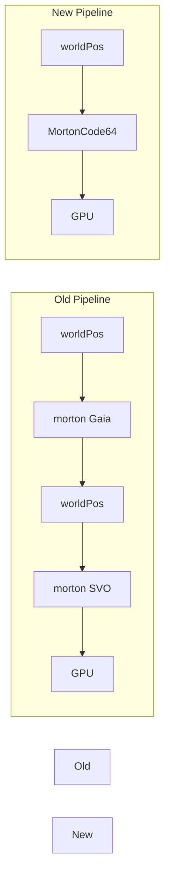
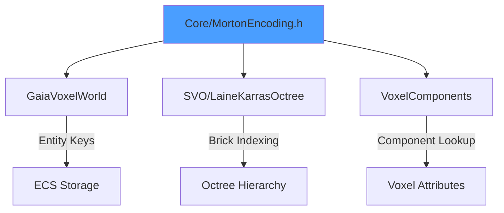

# Core Library

Foundation utilities providing Morton encoding (Z-order curves) for spatial indexing. Single source of truth for coordinate encoding across the voxel pipeline.

---

## 1. Purpose

The Core library eliminates redundant coordinate conversions in the voxel pipeline:



**Impact:** 4 conversions reduced to 1.

---

## 2. MortonCode64

### 2.1 Overview

64-bit Morton code (Z-order curve encoding) supporting:
- 21 bits per axis
- Coordinate range: [-1,048,576, +1,048,575]
- Negative coordinate support via offset

### 2.2 API

```cpp
#include <Core/MortonEncoding.h>
using namespace Vixen::Core;

// Encode from world position
MortonCode64 morton = MortonCode64::fromWorldPos(glm::ivec3{5, 10, 3});

// Decode back to position
glm::ivec3 pos = morton.toWorldPos();

// Brick operations
MortonCode64 brickBase = morton.getBrickBase(8);  // Round to 8x8x8 boundary
MortonCode64 voxelMorton = brickBase.addLocalOffset(x, y, z);

// Comparison (for sorting/maps)
if (morton1 < morton2) { /* spatially ordered */ }

// STL hash support
std::unordered_set<MortonCode64> mortonSet;
mortonSet.insert(morton);
```

### 2.3 Constants

| Constant | Value | Description |
|----------|-------|-------------|
| `COORDINATE_OFFSET` | 1,048,576 | Offset for negative coords (2^20) |
| `MAX_COORDINATE` | 1,048,575 | Maximum supported value |
| `BITS_PER_AXIS` | 21 | Bits per coordinate axis |

---

## 3. BrickEntities

Bulk loading result for brick-based operations.

```cpp
template<size_t BrickVolume = 512>
struct BrickEntities {
    std::array<MortonCode64, BrickVolume> mortonCodes;
    uint32_t count = 0;

    bool isEmpty() const;
    bool isFull() const;
};
```

**Usage:** Batch retrieve all voxels in an 8x8x8 brick (512 voxels) with a single query.

---

## 4. Spatial Locality

Morton codes preserve spatial locality - adjacent 3D positions have similar codes:

```
Position (0,0,0) -> Morton 0
Position (1,0,0) -> Morton 1
Position (0,1,0) -> Morton 2
Position (1,1,0) -> Morton 3
Position (0,0,1) -> Morton 4
...
```

**Benefits:**
- Cache-friendly iteration (sequential access patterns)
- Efficient range queries (contiguous Morton ranges)
- Brick-based bulk loading (8x8x8 = 512 sequential codes)

---

## 5. Integration Points



| Consumer | Usage |
|----------|-------|
| GaiaVoxelWorld | Entity storage keys |
| SVO | Brick indexing, hierarchy traversal |
| VoxelComponents | Component lookup by Morton key |

---

## 6. Code References

| File | Purpose |
|------|---------|
| `libraries/Core/include/MortonEncoding.h` | MortonCode64 definition |
| `libraries/Core/src/MortonEncoding.cpp` | Implementation |

---

## 7. Related Pages

- [[Overview]] - Library index
- [[SVO]] - Morton code consumer
- [[GaiaVoxelWorld]] - Entity storage using Morton keys
