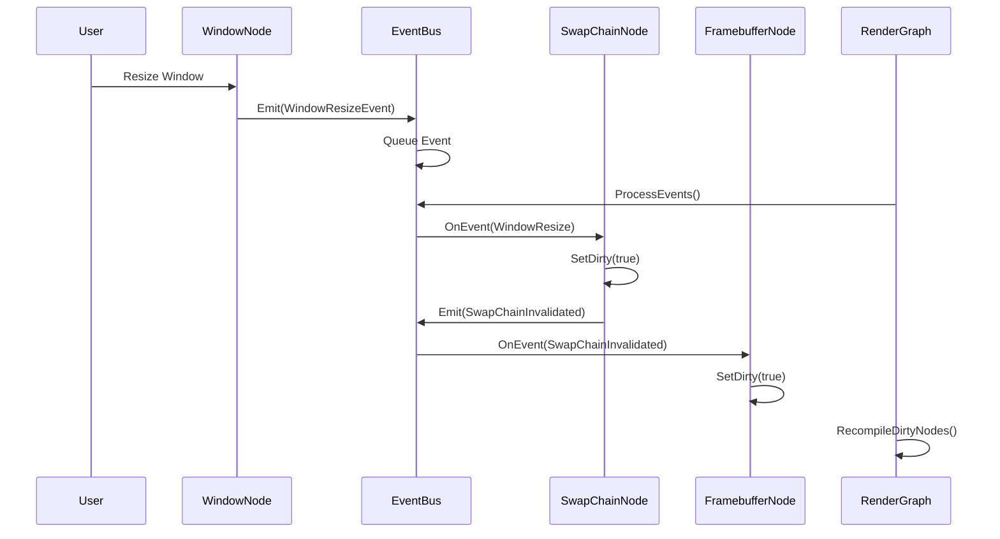
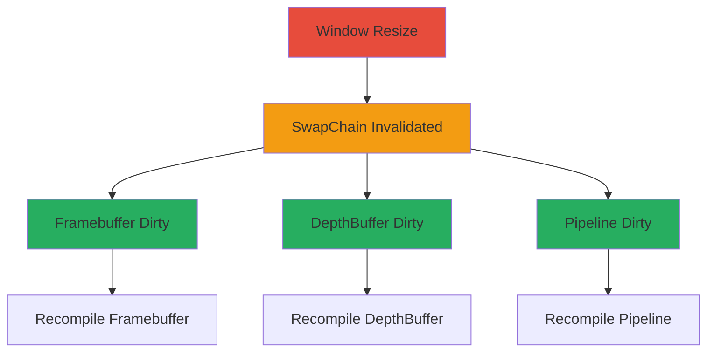

# EventBus System

The EventBus provides decoupled communication between nodes through a queue-based event system. It enables cascade invalidation without direct node dependencies.

---

## 1. Event Flow



---

## 2. Event Categories

| Category | Range | Examples | Purpose |
|----------|-------|----------|---------|
| **Resource Invalidation** | 0-99 | WindowResize, SwapChainInvalidated, ShaderReloaded | Trigger recompilation |
| **Application State** | 100-199 | SceneChanged, CameraUpdated | Update scene state |
| **Execution** | 200-299 | FrameComplete | Rarely used |

---

## 3. Auto Message Types

### 3.1 The Problem

Manual message type assignment leads to collisions:

```cpp
// Before: Manual assignment
struct DeviceMetadataEvent { static constexpr int TYPE = 106; };
struct CleanupRequestedMessage { static constexpr int TYPE = 106; };  // COLLISION!
```

### 3.2 The Solution

```cpp
// Auto-incrementing via __COUNTER__ macro
#define AUTO_MESSAGE_TYPE() \
    static constexpr int TYPE = 1000 + __COUNTER__

struct DeviceMetadataEvent {
    AUTO_MESSAGE_TYPE();  // Unique ID
};

struct CleanupRequestedMessage {
    AUTO_MESSAGE_TYPE();  // Different unique ID
};
```

---

## 4. Event Subscription

### 4.1 Subscribe in Setup

```cpp
class SwapChainNode : public TypedNode<SwapChainNodeConfig> {
    void Setup() override {
        if (eventBus) {
            eventBus->Subscribe(EventType::WindowResize, this);
            eventBus->Subscribe(EventType::DeviceLost, this);
        }
    }

    void Cleanup() override {
        if (eventBus) {
            eventBus->Unsubscribe(this);
        }
    }
};
```

### 4.2 Handle Events

```cpp
void SwapChainNode::OnEvent(const Event& event) {
    if (event.type == EventType::WindowResize) {
        const auto& resizeEvent = static_cast<const WindowResizeEvent&>(event);

        // Mark dirty for recompilation
        SetDirty(true);

        // Cascade to dependent nodes
        eventBus->Emit(std::make_unique<SwapChainInvalidatedEvent>(
            GetInstanceId(),
            resizeEvent.newWidth,
            resizeEvent.newHeight
        ));
    }
}
```

---

## 5. Cascade Invalidation Pattern



### 5.1 Cascade Rules

| Source Event | Cascades To |
|--------------|-------------|
| WindowResize | SwapChainInvalidated |
| SwapChainInvalidated | FramebufferDirty, DepthBufferDirty |
| ShaderReloaded | PipelineInvalidated |
| PipelineInvalidated | DescriptorSetDirty |

---

## 6. Event Processing

### 6.1 Safe Processing Points

Events are processed at graph-level safe points, **not during Compile or Execute**.

```cpp
void RenderGraph::Frame() {
    // 1. Process queued events
    eventBus.ProcessEvents();

    // 2. Recompile dirty nodes
    while (HasDirtyNodes()) {
        RecompileDirtyNodes();  // May generate more events
        eventBus.ProcessEvents();
    }

    // 3. Execute frame
    Execute(commandBuffer);
}
```

### 6.2 While-Loop Recompilation

Multiple recompilation passes ensure all cascades are resolved:

```cpp
void RenderGraph::RecompileDirtyNodes() {
    for (auto* node : topologicalOrder) {
        if (node->IsDirty()) {
            node->Cleanup();
            node->Setup();
            node->Compile();
            node->RegisterCleanup();
            node->SetDirty(false);
        }
    }
}
```

---

## 7. Custom Events

### 7.1 Define Event

```cpp
struct VoxelGridUpdatedEvent : public Event {
    AUTO_MESSAGE_TYPE();

    glm::ivec3 updatedRegion;
    size_t newVoxelCount;

    VoxelGridUpdatedEvent(const glm::ivec3& region, size_t count)
        : Event(TYPE)
        , updatedRegion(region)
        , newVoxelCount(count) {}
};
```

### 7.2 Emit Event

```cpp
void VoxelGridNode::UpdateGrid() {
    // ... update voxels ...

    eventBus->Emit(std::make_unique<VoxelGridUpdatedEvent>(
        region, voxelCount
    ));
}
```

### 7.3 Handle Event

```cpp
void OctreeNode::OnEvent(const Event& event) {
    if (event.type == VoxelGridUpdatedEvent::TYPE) {
        const auto& voxelEvent = static_cast<const VoxelGridUpdatedEvent&>(event);
        RebuildOctreeRegion(voxelEvent.updatedRegion);
    }
}
```

---

## 8. Thread Safety

> [!warning] Current Limitation
> The EventBus is **not thread-safe**. All event operations must occur on the main thread.

### 8.1 Future Improvement

```cpp
// Planned: Thread-safe event queue
class ThreadSafeEventBus {
    std::mutex queueMutex_;
    std::queue<std::unique_ptr<Event>> eventQueue_;

public:
    void EmitAsync(std::unique_ptr<Event> event) {
        std::lock_guard lock(queueMutex_);
        eventQueue_.push(std::move(event));
    }
};
```

---

## 9. Code References

| Component | Location |
|-----------|----------|
| EventBus | `libraries/EventBus/include/EventBus.h` |
| Event Base | `libraries/EventBus/include/Event.h` |
| RenderGraphEvents | `libraries/RenderGraph/include/Core/RenderGraphEvents.h` |
| Message | `libraries/EventBus/include/Message.h` |

---

## 10. Related Pages

- [[Overview]] - Library index
- [[RenderGraph]] - Node system integration
- [[../04-Development/Testing|Testing]] - Event testing patterns
