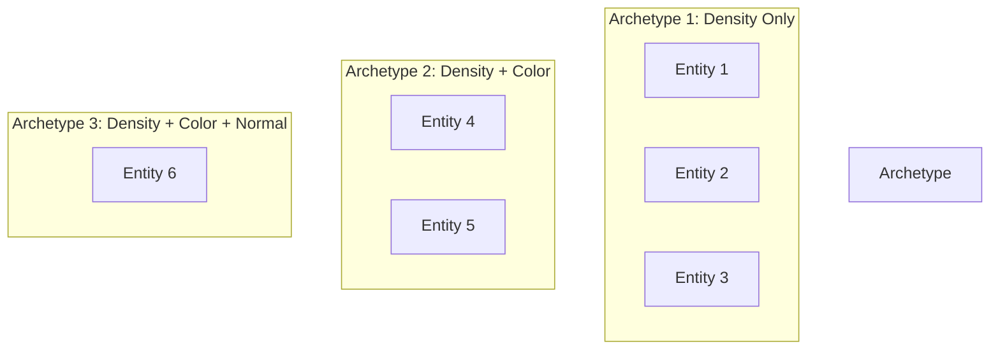
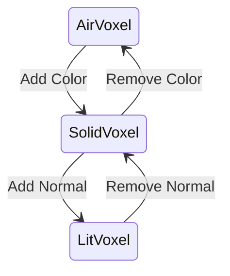

# GaiaArchetypes Library

ECS archetype definitions for Gaia-ECS integration. Provides type-safe component groupings for voxel entity storage.

---

## 1. What are Archetypes?

Archetypes group entities by their component composition. Entities with identical components share an archetype, enabling:
- Contiguous memory storage
- Cache-efficient iteration
- Faster queries



---

## 2. Archetype Definitions

### 2.1 Common Archetypes

| Archetype | Components | Use Case |
|-----------|------------|----------|
| `AirVoxel` | Density | Empty space markers |
| `SolidVoxel` | Density, Color | Colored solid voxels |
| `LitVoxel` | Density, Color, Normal | Surface voxels for lighting |
| `PBRVoxel` | Density, Color, Normal, Roughness, Metallic | Full PBR materials |

### 2.2 Definition Syntax

```cpp
// Using Gaia-ECS archetype definition
using AirArchetype = gaia::ecs::archetype<Density>;
using SolidArchetype = gaia::ecs::archetype<Density, Color>;
using LitArchetype = gaia::ecs::archetype<Density, Color, Normal>;
```

---

## 3. Archetype Migration

Entities can migrate between archetypes when components are added/removed.



### 3.1 Migration Cost

| Operation | Cost |
|-----------|------|
| Add component | O(1) amortized |
| Remove component | O(1) amortized |
| Archetype change | Memory copy |

> [!tip] Optimization
> Pre-define archetypes to minimize runtime migrations.

---

## 4. Memory Layout

### 4.1 Struct of Arrays (SoA)

Gaia-ECS uses SoA layout within archetypes:

```
Archetype: Density + Color
|--- Density Array ---|--- Color Array ---|
[D0][D1][D2][D3]...   [C0][C1][C2][C3]...
```

### 4.2 Cache Benefits

```cpp
// Cache-efficient iteration (single component)
world.query<Color>([](gaia::entity e, Color& c) {
    c.rgb *= 0.9f;  // Sequential memory access
});

// Less efficient (multiple components)
world.query<Color, Normal, Roughness>([](auto e, auto& c, auto& n, auto& r) {
    // Three separate memory regions
});
```

---

## 5. Integration with GaiaVoxelWorld

```cpp
GaiaVoxelWorld world;

// Create with specific archetype
world.createVoxel(VoxelCreationRequest{
    position,
    {Density{1.0f}, Color{red}}  // -> SolidArchetype
});

// Add component (triggers migration)
world.setComponent(entity, Normal{up});  // -> LitArchetype

// Query by archetype
world.query<Density, Color>([](auto e, auto& d, auto& c) {
    // Only SolidArchetype and LitArchetype entities
});
```

---

## 6. Code References

| File | Purpose |
|------|---------|
| `libraries/GaiaArchetypes/include/GaiaArchetypes.h` | Archetype definitions |
| `libraries/GaiaVoxelWorld/include/GaiaVoxelWorld.h` | Archetype usage |
| `libraries/VoxelComponents/include/VoxelComponents.h` | Component types |

---

## 7. Related Pages

- [[Overview]] - Library index
- [[GaiaVoxelWorld]] - World using archetypes
- [[VoxelComponents]] - Component definitions
