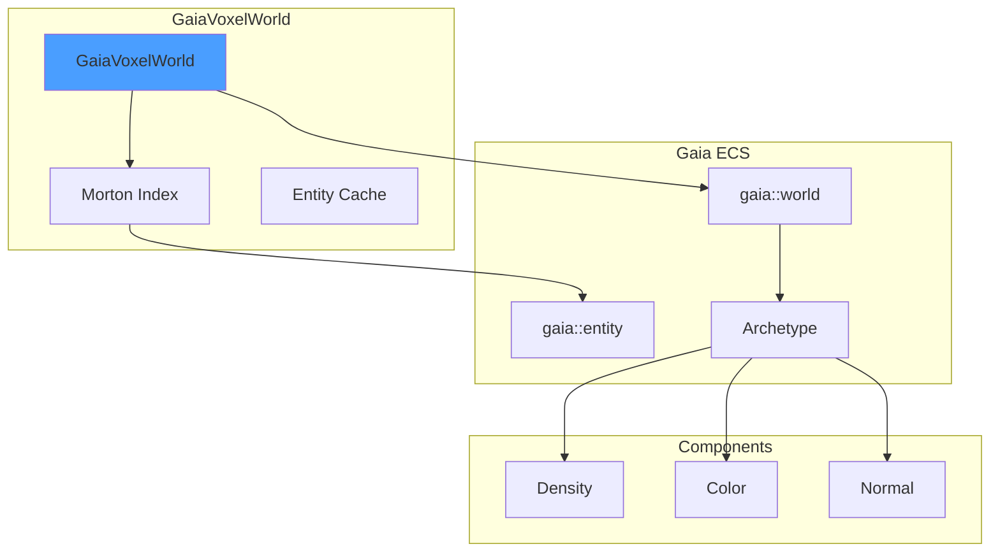

# GaiaVoxelWorld Library

ECS-backed sparse voxel storage using Gaia-ECS with Morton code indexing. Provides 11x memory reduction vs dense storage.

---

## 1. Architecture



---

## 2. Core API

### 2.1 Voxel Creation

```cpp
GaiaVoxelWorld world;

// Single voxel
world.createVoxel(VoxelCreationRequest{
    glm::vec3(2, 2, 2),
    {Density{1.0f}, Color{glm::vec3(1, 0, 0)}}
});

// Batch creation
std::vector<VoxelCreationRequest> requests;
for (int x = 0; x < 10; ++x) {
    requests.push_back({
        glm::vec3(x, 0, 0),
        {Density{1.0f}}
    });
}
world.createVoxels(requests);
```

### 2.2 Query by Position

```cpp
// Morton key lookup
MortonKey key = MortonKey::fromPosition(glm::ivec3(2, 2, 2));
auto entity = world.getEntity(key);

if (entity.has_value()) {
    // Entity exists
    auto color = world.getComponentValue<Color>(*entity);
}
```

### 2.3 Check Existence

```cpp
if (world.hasEntity(key)) {
    // Voxel exists at position
}

// Count voxels
size_t count = world.getVoxelCount();
```

---

## 3. Morton Code Integration


### 3.1 Key Generation

```cpp
// Position to Morton key
glm::ivec3 pos(5, 10, 3);
MortonKey key = MortonKey::fromPosition(pos);

// Morton key to position
glm::ivec3 decoded = key.toPosition();
```

### 3.2 Benefits

| Aspect | Dense Array | Morton-ECS |
|--------|-------------|------------|
| Memory | O(n^3) | O(occupied) |
| Lookup | O(1) | O(1) hash |
| Iteration | Sparse inefficient | Cache-friendly |
| Components | Fixed struct | Dynamic archetypes |

---

## 4. Component Access

### 4.1 Get Component

```cpp
// Typed getter (throws if not found)
Color color = world.getComponentValue<Color>(entity);

// Optional getter
std::optional<Color> maybeColor = world.tryGetComponentValue<Color>(entity);
```

### 4.2 Set Component

```cpp
// Add or update component
world.setComponent(entity, Color{glm::vec3(0, 1, 0)});

// Remove component
world.removeComponent<Color>(entity);
```

### 4.3 Has Component

```cpp
if (world.hasComponent<Color>(entity)) {
    // Entity has Color component
}
```

---

## 5. Iteration Patterns

### 5.1 Query by Components

```cpp
// Iterate all voxels with Color and Normal
world.query<Color, Normal>([](gaia::entity e, Color& c, Normal& n) {
    // Process each voxel
    c.rgb = glm::normalize(n.direction);
});
```

### 5.2 Spatial Queries

```cpp
// Get all voxels in brick (8x8x8)
MortonKey brickBase = key.getBrickBase(8);
BrickEntities<512> brick = world.getBrickEntities(brickBase, 8);

for (uint32_t i = 0; i < brick.count; ++i) {
    MortonKey voxelKey = brick.mortonCodes[i];
    // Process voxel
}
```

---

## 6. Memory Efficiency

### 6.1 Sparse Storage

```
Scene: 100x100x100 potential voxels (1M)
Occupied: 90,000 voxels (9%)

Dense storage: 1,000,000 * sizeof(Voxel) = ~100 MB
ECS storage:   90,000 * sizeof(Entity) = ~9 MB

Reduction: 11x
```

### 6.2 Archetype Optimization


Components are stored contiguously per archetype for cache efficiency.

---

## 7. Code References

| File | Purpose |
|------|---------|
| `libraries/GaiaVoxelWorld/include/GaiaVoxelWorld.h` | Main interface |
| `libraries/GaiaVoxelWorld/src/GaiaVoxelWorld.cpp` | Implementation |
| `libraries/GaiaArchetypes/include/GaiaArchetypes.h` | Archetype definitions |
| `libraries/Core/include/MortonEncoding.h` | Morton key |

---

## 8. Related Pages

- [[Overview]] - Library index
- [[SVO]] - Uses GaiaVoxelWorld for storage
- [[VoxelComponents]] - Component definitions
- [[Core]] - Morton encoding
