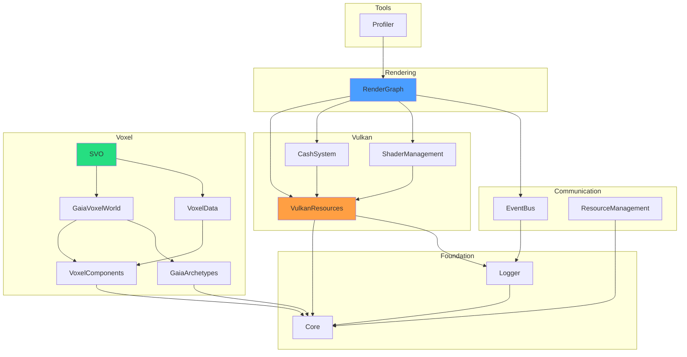

# Libraries Overview

VIXEN is organized into 14 static libraries with modern CMake target-based dependencies. Libraries are built in dependency order.

---

## 1. Library Dependency Graph



---

## 2. Library Catalog

### 2.1 Foundation Layer

| Library | Purpose | Key Files |
|---------|---------|-----------|
| [[Core]] | Morton encoding, math utilities | `MortonEncoding.h` |
| [[Logger]] | Logging infrastructure, ILoggable | `Logger.h`, `ILoggable.h` |

### 2.2 Communication Layer

| Library | Purpose | Key Files |
|---------|---------|-----------|
| [[EventBus]] | Event-driven communication | `EventBus.h`, `Message.h` |
| [[ResourceManagement]] | RM<T> wrapper with state tracking | `RM.h`, `ResourceState.h` |

### 2.3 Vulkan Layer

| Library | Purpose | Key Files |
|---------|---------|-----------|
| [[VulkanResources]] | Vulkan resource management | `VulkanDevice.h`, `GPUTimestampQuery.h` |
| [[CashSystem]] | Pipeline/shader caching | `TypedCacher.h`, `MainCacher.h` |
| [[ShaderManagement]] | SPIRV compilation, reflection | `ShaderCompiler.h`, `SPIRVReflection.h` |

### 2.4 Rendering Layer

| Library | Purpose | Key Files |
|---------|---------|-----------|
| [[RenderGraph]] | Graph-based render pipeline | `RenderGraph.h`, `TypedNodeInstance.h` |

### 2.5 Voxel Layer

| Library | Purpose | Key Files |
|---------|---------|-----------|
| [[VoxelComponents]] | Voxel component definitions | `VoxelComponents.h` |
| [[GaiaArchetypes]] | ECS archetype system | `GaiaArchetypes.h` |
| [[GaiaVoxelWorld]] | ECS voxel storage | `GaiaVoxelWorld.h` |
| [[VoxelData]] | DXT compression, grid data | `DXT1Compressor.h` |
| [[SVO]] | Sparse Voxel Octree (ESVO) | `LaineKarrasOctree.h` |

### 2.6 Tools Layer

| Library | Purpose | Key Files |
|---------|---------|-----------|
| [[Profiler]] | Benchmark runner, metrics export | `BenchmarkRunner.h` |

---

## 3. Library Statistics

| Library | Files | Tests | Status |
|---------|-------|-------|--------|
| Core | 2 | - | Production |
| Logger | 4 | 12 | Production |
| EventBus | 4 | 24 | Production |
| ResourceManagement | 3 | - | Production |
| VulkanResources | 15+ | - | Production |
| CashSystem | 10+ | - | Production |
| ShaderManagement | 8+ | - | Production |
| RenderGraph | 40+ | 116 | Production |
| VoxelComponents | 3 | 8 | Production |
| GaiaArchetypes | 2 | - | Production |
| GaiaVoxelWorld | 4 | 36 | Production |
| VoxelData | 6 | 12 | Production |
| SVO | 12 | 217 | Production |
| Profiler | 8 | 131 | Production |

---

## 4. Build Order

Libraries are built in dependency order by CMake:

```
1. Core
2. Logger (depends: Core)
3. EventBus (depends: Logger)
4. ResourceManagement (depends: Core)
5. VulkanResources (depends: Core, Logger)
6. CashSystem (depends: VulkanResources)
7. ShaderManagement (depends: VulkanResources)
8. RenderGraph (depends: VulkanResources, CashSystem, ShaderManagement, EventBus)
9. VoxelComponents (depends: Core)
10. GaiaArchetypes (depends: Core)
11. GaiaVoxelWorld (depends: VoxelComponents, GaiaArchetypes)
12. VoxelData (depends: VoxelComponents)
13. SVO (depends: GaiaVoxelWorld, VoxelData)
14. Profiler (depends: RenderGraph)
```

---

## 5. Source Paths

| Library | Path |
|---------|------|
| Core | `libraries/Core/` |
| Logger | `libraries/logger/` |
| EventBus | `libraries/EventBus/` |
| ResourceManagement | `libraries/ResourceManagement/` |
| VulkanResources | `libraries/VulkanResources/` |
| CashSystem | `libraries/CashSystem/` |
| ShaderManagement | `libraries/ShaderManagement/` |
| RenderGraph | `libraries/RenderGraph/` |
| VoxelComponents | `libraries/VoxelComponents/` |
| GaiaArchetypes | `libraries/GaiaArchetypes/` |
| GaiaVoxelWorld | `libraries/GaiaVoxelWorld/` |
| VoxelData | `libraries/VoxelData/` |
| SVO | `libraries/SVO/` |
| Profiler | `libraries/Profiler/` |

---

## 6. Quick Navigation

### By Category

**Infrastructure**
- [[Core]] - Morton encoding foundation
- [[Logger]] - Hierarchical logging
- [[EventBus]] - Decoupled communication
- [[ResourceManagement]] - RM<T> wrapper

**Vulkan Stack**
- [[VulkanResources]] - Device/swapchain/timing
- [[CashSystem]] - Resource caching
- [[ShaderManagement]] - SPIRV compilation
- [[RenderGraph]] - DAG-based rendering

**Voxel Stack**
- [[VoxelComponents]] - Component definitions
- [[GaiaArchetypes]] - ECS archetypes
- [[GaiaVoxelWorld]] - Sparse storage
- [[VoxelData]] - DXT compression
- [[SVO]] - ESVO octree

**Tooling**
- [[Profiler]] - Benchmarks and metrics

---

## 7. Related Pages

- [[../01-Architecture/Overview|Architecture Overview]] - System architecture
- [[../02-Implementation/Overview|Implementation Overview]] - Implementation details
- [[../04-Development/Build-System|Build System]] - CMake configuration
