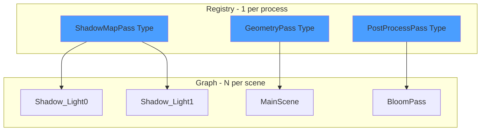

# RenderGraph System

The RenderGraph is a directed acyclic graph (DAG) of rendering operations. Each node represents a discrete operation (resource creation, command recording, presentation).

> **Note:** For detailed architecture documentation, see [[../01-Architecture/RenderGraph-System|RenderGraph Architecture]].

---

## 1. Node Type vs Node Instance



| Concept | Role | Count | Example |
|---------|------|-------|---------|
| **Node Type** | Template/Definition | 1 per process | `ShadowMapPass` |
| **Node Instance** | Concrete usage | N per scene | `ShadowMap_Light0` |

---

## 2. Graph Compilation Phases


| Phase | Description |
|-------|-------------|
| **Validate** | Check all inputs connected, verify no cycles (DAG property) |
| **AnalyzeDependencies** | Build directed graph, topological sort for execution order |
| **AllocateResources** | Analyze resource lifetimes, allocate Vulkan resources |
| **GeneratePipelines** | Group instances by type, create shared pipelines |
| **BuildExecutionOrder** | Finalize execution order list |

---

## 3. Node Lifecycle Methods

```cpp
class NodeInstance {
    virtual void Setup();    // Subscribe to events
    virtual void Compile();  // Create Vulkan resources
    virtual void Execute();  // Record commands
    virtual void Cleanup();  // Destroy resources
};
```

---

## 4. Node Catalog

### 4.1 Infrastructure Nodes

| Node | Purpose |
|------|---------|
| `WindowNode` | Win32 window creation |
| `DeviceNode` | VkDevice management |
| `SwapChainNode` | Swapchain with image views |
| `FrameSyncNode` | Fences and semaphores |

### 4.2 Pipeline Nodes

| Node | Purpose |
|------|---------|
| `RenderPassNode` | VkRenderPass creation |
| `FramebufferNode` | VkFramebuffer per swapchain image |
| `GraphicsPipelineNode` | Graphics pipeline from shaders |
| `ComputePipelineNode` | Compute pipeline creation |
| `DescriptorSetNode` | Descriptor set allocation |

### 4.3 Rendering Nodes

| Node | Purpose |
|------|---------|
| `GeometryRenderNode` | Draw call recording |
| `ComputeDispatchNode` | Compute shader dispatch |
| `PresentNode` | vkQueuePresentKHR |

---

## 5. Slot System

### 5.1 Slot Definition

```cpp
struct FramebufferNodeConfig {
    INPUT_SLOT(COLOR_ATTACHMENTS, VkImageView, SlotMode::ARRAY);
    INPUT_SLOT(DEPTH_ATTACHMENT, VkImageView, SlotMode::SINGLE);
    INPUT_SLOT(RENDER_PASS, VkRenderPass, SlotMode::SINGLE);

    OUTPUT_SLOT(FRAMEBUFFER, VkFramebuffer, SlotMode::SINGLE);

    static constexpr uint32_t INPUT_COUNT = 3;
    static constexpr uint32_t OUTPUT_COUNT = 1;
};
```

### 5.2 SlotRole Flags

```cpp
enum class SlotRole : uint8_t {
    None         = 0u,
    Dependency   = 1u << 0,  // Accessed during Compile
    Execute      = 1u << 1,  // Accessed during Execute
    CleanupOnly  = 1u << 2,  // Only during Cleanup
    Output       = 1u << 3   // Output slot
};
```

---

## 6. Connection API

```cpp
RenderGraph graph(device, &registry);
auto windowNode = graph.AddNode(WindowNodeType, "MainWindow");
auto deviceNode = graph.AddNode(DeviceNodeType, "Device");
auto swapNode = graph.AddNode(SwapChainNodeType, "SwapChain");

// Connect nodes
graph.ConnectNodes(windowNode, WindowNodeConfig::WINDOW_HANDLE,
                   swapNode, SwapChainNodeConfig::WINDOW);
graph.ConnectNodes(deviceNode, DeviceNodeConfig::DEVICE,
                   swapNode, SwapChainNodeConfig::DEVICE);
```

---

## 7. Code References

| Component | Location |
|-----------|----------|
| RenderGraph | `libraries/RenderGraph/src/Core/RenderGraph.cpp` |
| NodeInstance | `libraries/RenderGraph/include/Core/NodeInstance.h` |
| TypedNode | `libraries/RenderGraph/include/Core/TypedNodeInstance.h` |
| SlotRole | `libraries/RenderGraph/include/Data/Core/ResourceConfig.h` |
| Node Configs | `libraries/RenderGraph/include/Data/Nodes/` |

---

## 8. Related Pages

- [[Overview]] - Library index
- [[../01-Architecture/RenderGraph-System|RenderGraph Architecture]] - Detailed architecture
- [[../01-Architecture/Vulkan-Pipeline|Vulkan Pipeline]] - Vulkan resource management
- [[../01-Architecture/Type-System|Type System]] - Compile-time type safety
