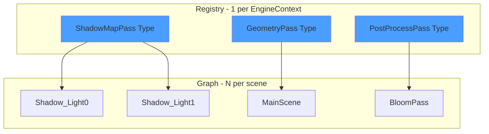

# RenderGraph System

The RenderGraph is a directed acyclic graph (DAG) of rendering operations. Each node represents a discrete operation (resource creation, command recording, presentation).

> **Note:** For detailed architecture documentation, see [[../01-Architecture/RenderGraph-System|RenderGraph Architecture]].

---

## 0. EngineContext — the instantiable engine aggregate (AR#7/#8)

`Vixen::RenderGraph::EngineContext` (`Core/EngineContext.h`) is the top-level, **instantiable** owner
of the engine's core subsystems — there is **no process-wide singleton**. A host constructs one from
an `EngineConfig`; it stands up, in the one valid order, the `NodeTypeRegistry`, `MessageBus`,
`RenderGraph`, and (optionally) the autonomous `CalibrationStore`, and owns the
`CashSystem::MainCacher` (creating one when the host injects none via `EngineConfig::mainCacher`).

Because every one of these is per-`EngineContext` — registry, bus, graph, calibration, **and** the
cacher and per-device `CapabilityGraph`s (AR#8 removed the last global statics) — **multiple
EngineContexts can coexist in one process** (e.g. a game view + an editor preview) without sharing
state. Node-type registration is caller-supplied via `EngineConfig::registerNodeTypes`. The graph
creates its own Vulkan instance/device via in-graph nodes (`InstanceNode → DeviceNode`), so
EngineContext needs no device injected.

Teardown is deterministic by member-declaration order (calibration → graph → bus → registry → owned
cacher); publish an `ApplicationShuttingDownEvent` on `Bus()` before destroying the context so the
CalibrationStore persists. To embed a host on top of this, see [[Hosting-VIXEN]].

| Accessor | Returns |
|---|---|
| `Registry()` | the `NodeTypeRegistry` |
| `Bus()` | the `MessageBus` |
| `Graph()` | the `RenderGraph` (drive `RenderFrame()` from your loop) |
| `Calibration()` | the `CalibrationStore` (null if `enableCalibration` was false) |

---

## 1. Node Type vs Node Instance


```mermaid
flowchart TB
    subgraph Node Types [Registry - 1 per EngineContext]
        NT1[ShadowMapPass Type]
        NT2[GeometryPass Type]
        NT3[PostProcessPass Type]
    end

    subgraph Node Instances [Graph - N per scene]
        NI1[Shadow_Light0]
        NI2[Shadow_Light1]
        NI3[MainScene]
        NI4[BloomPass]
    end

    NT1 --> NI1
    NT1 --> NI2
    NT2 --> NI3
    NT3 --> NI4

    style NT1 fill:#4a9eff
    style NT2 fill:#4a9eff
    style NT3 fill:#4a9eff
```

| Concept | Role | Count | Example |
|---------|------|-------|---------|
| **Node Type** | Template/Definition | 1 per engine (registry) | `ShadowMapPass` |
| **Node Instance** | Concrete usage | N per scene | `ShadowMap_Light0` |

---

## 2. Graph Compilation Phases


```mermaid
flowchart LR
    V[Validate] --> A[AnalyzeDependencies]
    A --> R[AllocateResources]
    R --> G[GeneratePipelines]
    G --> B[BuildExecutionOrder]

    style V fill:#e74c3c
    style A fill:#f39c12
    style R fill:#27ae60
    style G fill:#3498db
    style B fill:#9b59b6
```

| Phase | Description |
|-------|-------------|
| **Validate** | Check all inputs connected, verify no cycles (DAG property) |
| **AnalyzeDependencies** | Build directed graph, topological sort for execution order |
| **AllocateResources** | Analyze resource lifetimes, allocate Vulkan resources |
| **GeneratePipelines** | Group instances by type, create shared pipelines |
| **BuildExecutionOrder** | Finalize execution order list |

---

## 3. Node Lifecycle Methods

```cpp
class NodeInstance {
    virtual void Setup();    // Subscribe to events
    virtual void Compile();  // Create Vulkan resources
    virtual void Execute();  // Record commands
    virtual void Cleanup();  // Destroy resources
};
```

### 3.1 Cleanup: recompile vs final teardown (FR-7)

`Cleanup()` runs on **both** a transient recompile (e.g. swapchain resize) and final teardown — the
reason is carried in `ctx.reason` (`CleanupReason::Recompile` / `DeviceLost` / `FinalTeardown`, see
`Core/NodeContext.h`). The mechanism already exists; the contract for a stateful node's
`CleanupImpl(ctx)`:

- **Recompile must be lightweight — no `vkDeviceWaitIdle` / fence waits.** The graph deliberately
  skips device-idle during recompile; a wait here **deadlocks resize** (a submit blocked on an
  un-signalled acquire semaphore never completes).
- **Keep persistent-across-recompile state** (OS window/surface, long-lived GPU sync objects); release
  only per-recompile resources. Tear everything down **only** when `ctx.reason == FinalTeardown`.
- Most nodes own nothing persistent and can ignore `ctx.reason`. Correct reference implementations:
  `WindowNode`, `SwapChainNode`, `UIRenderNode`, `ConstantNode`.

```cpp
void MyNode::CleanupImpl(TypedCleanupContext& ctx) {
    if (ctx.reason != CleanupReason::FinalTeardown) {
        return;  // recompile / device-loss: keep persistent resources, NO device wait
    }
    // FinalTeardown only: release everything
}
```

### 3.2 Render-to-swapchain recipe (FR-8)

Don't build the render pass / framebuffers **inside** a render node — consume them as inputs so the
swapchain-recompile cascade owns their resize lifecycle:

```
SwapChainNode → RenderPassNode → FramebufferNode → <YourRenderNode> → PresentNode
```

Take `RENDER_PASS` (from `RenderPassNode`) and `FRAMEBUFFERS` (from `FramebufferNode`) as typed inputs
and record into them. Minimal color-only template: the UI graph
(`swapchain → RenderPassNode → FramebufferNode → UIRenderNode → PresentNode`); fuller reference:
`GeometryRenderNode`. Building these inside the node reproduces the FR-5 (extent desync) / FR-7
(resize) footguns.

---

## 4. Node Catalog

### 4.1 Infrastructure Nodes

| Node | Purpose |
|------|---------|
| `WindowNode` | Win32 window creation |
| `DeviceNode` | VkDevice management |
| `SwapChainNode` | Swapchain with image views |
| `FrameSyncNode` | Fences and semaphores |

### 4.2 Pipeline Nodes

| Node | Purpose |
|------|---------|
| `RenderPassNode` | VkRenderPass creation |
| `FramebufferNode` | VkFramebuffer per swapchain image |
| `GraphicsPipelineNode` | Graphics pipeline from shaders |
| `ComputePipelineNode` | Compute pipeline creation |
| `DescriptorSetNode` | Descriptor set allocation |

### 4.3 Rendering Nodes

| Node | Purpose | Documentation |
|------|---------|---------------|
| `GeometryRenderNode` | Draw call recording | - |
| `ComputeDispatchNode` | Single compute dispatch | - |
| **`MultiDispatchNode`** | **Multi-dispatch with group-based partitioning** | **[[MultiDispatchNode\|Sprint 6.1]]** |
| `PresentNode` | vkQueuePresentKHR | - |

---

## 5. Slot System

### 5.1 Slot Definition

```cpp
struct FramebufferNodeConfig {
    INPUT_SLOT(COLOR_ATTACHMENTS, VkImageView, SlotMode::ARRAY);
    INPUT_SLOT(DEPTH_ATTACHMENT, VkImageView, SlotMode::SINGLE);
    INPUT_SLOT(RENDER_PASS, VkRenderPass, SlotMode::SINGLE);

    OUTPUT_SLOT(FRAMEBUFFER, VkFramebuffer, SlotMode::SINGLE);

    static constexpr uint32_t INPUT_COUNT = 3;
    static constexpr uint32_t OUTPUT_COUNT = 1;
};
```

### 5.2 SlotRole Flags

```cpp
enum class SlotRole : uint8_t {
    None         = 0u,
    Dependency   = 1u << 0,  // Accessed during Compile
    Execute      = 1u << 1,  // Accessed during Execute
    CleanupOnly  = 1u << 2,  // Only during Cleanup
    Output       = 1u << 3   // Output slot
};
```

---

## 6. Connection API

> **Note:** As of Sprint 6.0.1, RenderGraph uses a unified connection system. All connection types (Direct, Variadic, Accumulation) use the same `Connect()` API.

```cpp
RenderGraph graph(device, &registry);
auto windowNode = graph.AddNode(WindowNodeType, "MainWindow");
auto deviceNode = graph.AddNode(DeviceNodeType, "Device");
auto swapNode = graph.AddNode(SwapChainNodeType, "SwapChain");

// Connect nodes using unified API
batch.Connect(windowNode, WindowNodeConfig::WINDOW_HANDLE,
              swapNode, SwapChainNodeConfig::WINDOW);
batch.Connect(deviceNode, DeviceNodeConfig::DEVICE,
              swapNode, SwapChainNodeConfig::DEVICE);

// Advanced: Multi-connect with modifiers
batch.Connect(source, SourceConfig::OUTPUT,
              target, TargetConfig::ARRAY_INPUT,
              ConnectionMeta{}.With<AccumulationSortConfig>(0));
```

For detailed connection system architecture, see [[../01-Architecture/RenderGraph-System#6. Connection API|Connection API]] and [[../05-Progress/features/Sprint6.0.1-Unified-Connection-System|Sprint 6.0.1]].

---

## 7. Code References

| Component | Location |
|-----------|----------|
| EngineContext / EngineConfig | `libraries/RenderGraph/include/Core/EngineContext.h`, `EngineConfig.h` |
| RenderGraph | `libraries/RenderGraph/src/Core/RenderGraph.cpp` |
| NodeInstance | `libraries/RenderGraph/include/Core/NodeInstance.h` |
| TypedNode | `libraries/RenderGraph/include/Core/TypedNodeInstance.h` |
| SlotRole | `libraries/RenderGraph/include/Data/Core/ResourceConfig.h` |
| Node Configs | `libraries/RenderGraph/include/Data/Nodes/` |

---

## 8. Related Pages

- [[Overview]] - Library index
- [[../06-Embedding/Hosting-VIXEN|Hosting VIXEN]] - Embedding via EngineContext (find_package → own-the-loop)
- [[../01-Architecture/RenderGraph-System|RenderGraph Architecture]] - Detailed architecture
- [[../01-Architecture/Vulkan-Pipeline|Vulkan Pipeline]] - Vulkan resource management
- [[../01-Architecture/Type-System|Type System]] - Compile-time type safety
- [[CashSystem]] - MainCacher (owned by EngineContext; AR#8)
