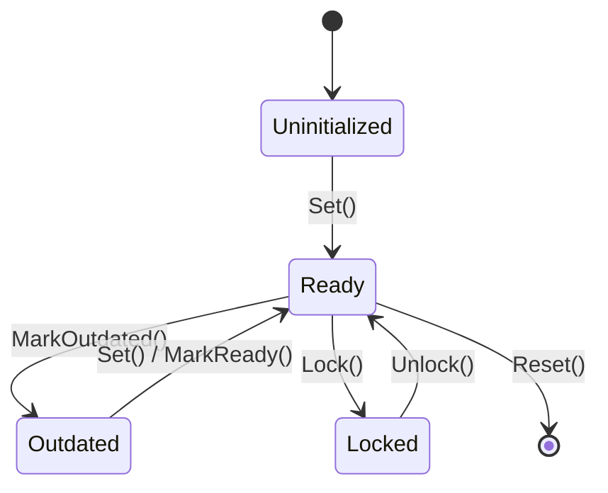

# ResourceManagement Library

GPU memory management and resource lifecycle library for VIXEN. Provides state-tracked resources, budget-aware allocation, and lifetime scoping.

---

## Library Structure

```
ResourceManagement/
├── State/                   # Resource state tracking
│   ├── RM.h                 # RM<T> wrapper with state flags
│   ├── ResourceState.h      # State enum (Ready, Outdated, etc.)
│   └── StatefulContainer.h  # Stateful container base
├── Memory/                  # GPU memory allocation
│   ├── DeviceBudgetManager.h # Main API for GPU memory
│   ├── IMemoryAllocator.h   # Allocator interface
│   ├── VMAAllocator.h       # VMA-backed allocator
│   ├── DirectAllocator.h    # Simple vkAllocateMemory wrapper
│   ├── ResourceBudgetManager.h # Budget tracking
│   └── BudgetBridge.h       # RenderGraph integration
└── Lifetime/                # Resource lifetime management
    ├── LifetimeScope.h      # Bulk resource lifecycle
    ├── SharedResource.h     # Reference-counted resources
    └── DeferredDestruction.h # Zero-stutter hot-reload
```

---

## 1. State Subsystem (RM< T >)

Resource wrapper providing std::optional-like interface with state tracking.

### 1.1 Quick Start

```cpp
#include <State/RM.h>
using namespace ResourceManagement;

RM<VkPipeline> pipeline;

// Optional-like access
if (pipeline.Ready()) {
    vkCmdBindPipeline(cmd, VK_PIPELINE_BIND_POINT_GRAPHICS, pipeline.Value());
}

// State-based cleanup
if (pipeline.Has(ResourceState::Outdated)) {
    vkDestroyPipeline(device, pipeline.Value(), nullptr);
    pipeline.Reset();
}
```

### 1.2 Resource States

| State | Value | Description |
|-------|-------|-------------|
| `Uninitialized` | 0 | No value set |
| `Ready` | 1 | Ready for use |
| `Outdated` | 2 | Needs update |
| `Locked` | 4 | Modification blocked |
| `Stale` | 8 | Cache invalidated |
| `Pending` | 16 | Async operation in progress |
| `Failed` | 32 | Operation failed |

### 1.3 State Diagram



### 1.4 Generation Tracking

```cpp
// Track when dependencies change
uint64_t cachedGeneration = 0;

void PipelineNode::Compile() {
    if (shaderResource.GetGeneration() != cachedGeneration) {
        RebuildPipeline();
        cachedGeneration = shaderResource.GetGeneration();
    }
}
```

---

## 2. Memory Subsystem (DeviceBudgetManager)

Budget-tracked GPU memory allocation with VMA backend.

### 2.1 DeviceBudgetManager (Main API)

Primary interface for GPU memory allocation:

```cpp
#include <Memory/DeviceBudgetManager.h>
using namespace ResourceManagement;

// Create with VMA allocator
auto allocator = std::make_shared<VMAAllocator>(device, instance, physicalDevice);
DeviceBudgetManager budgetManager(allocator, physicalDevice, {
    .deviceMemoryBudget = 0,          // Auto-detect from GPU
    .stagingQuota = 256 * 1024 * 1024 // 256 MB staging limit
});

// Allocate buffer
BufferAllocationRequest request{
    .size = 1024 * 1024,
    .usage = VK_BUFFER_USAGE_STORAGE_BUFFER_BIT,
    .location = MemoryLocation::DeviceLocal,
    .debugName = "MyBuffer"
};
auto result = budgetManager.AllocateBuffer(request);
if (result) {
    BufferAllocation buffer = *result;
    // Use buffer.buffer, buffer.mappedData, etc.
}

// Check budget
if (budgetManager.IsOverBudget()) {
    // Handle memory pressure
}
```

### 2.2 Memory Aliasing (Phase B+)

Resources can share memory when lifetimes don't overlap:

```cpp
// Create source allocation with aliasing enabled
BufferAllocationRequest sourceRequest{
    .size = 64 * 1024 * 1024,  // 64 MB
    .usage = VK_BUFFER_USAGE_STORAGE_BUFFER_BIT,
    .location = MemoryLocation::DeviceLocal,
    .allowAliasing = true  // Required for aliasing
};
auto sourceBuffer = budgetManager.AllocateBuffer(sourceRequest);

// Create aliased buffer (shares memory, zero additional budget cost)
AliasedBufferRequest aliasRequest{
    .sourceAllocation = sourceBuffer->allocation,
    .size = 16 * 1024 * 1024,
    .usage = VK_BUFFER_USAGE_TRANSFER_DST_BIT,
    .offset = 0
};
auto aliasedBuffer = budgetManager.CreateAliasedBuffer(aliasRequest);
```

### 2.3 Statistics & Monitoring

```cpp
// Get comprehensive stats
DeviceMemoryStats stats = budgetManager.GetStats();
// stats.totalDeviceMemory    - Total GPU VRAM
// stats.usedDeviceMemory     - Currently used
// stats.stagingQuotaUsed     - Staging buffer usage
// stats.fragmentationRatio   - Memory fragmentation

// Get allocator stats
AllocationStats allocStats = budgetManager.GetAllocatorStats();
// allocStats.allocationCount - Active allocations
// allocStats.totalAllocatedBytes - Total allocated

// Aliasing info
uint32_t aliasedCount = budgetManager.GetAliasedAllocationCount();

// Budget status
bool nearLimit = budgetManager.IsNearBudgetLimit();
bool overBudget = budgetManager.IsOverBudget();
```

### 2.4 Staging Buffer Quota

Throttles upload operations to prevent memory spikes:

```cpp
uint64_t uploadSize = 32 * 1024 * 1024;  // 32 MB

// Reserve quota before upload
if (budgetManager.TryReserveStagingQuota(uploadSize)) {
    // Perform upload...

    // Release when complete
    budgetManager.ReleaseStagingQuota(uploadSize);
}
```

### 2.5 IMemoryAllocator Interface

Abstraction for pluggable allocators:

| Allocator | Purpose |
|-----------|---------|
| `VMAAllocator` | Production allocator (VMA backend) |
| `DirectAllocator` | Simple vkAllocateMemory wrapper |
| MockAllocator | Unit testing without Vulkan |

```cpp
// IMemoryAllocator methods
auto buffer = allocator->AllocateBuffer(request);
allocator->FreeBuffer(allocation);
auto stats = allocator->GetStats();
```

---

## 3. Lifetime Subsystem

### 3.1 LifetimeScope

Groups resources for bulk cleanup:

```cpp
#include <Lifetime/LifetimeScope.h>

// Create scope with factory
LifetimeScope passScope("ShadowPass", &factory);

// Resources tracked automatically
auto buffer = passScope.CreateBuffer(request);
auto image = passScope.CreateImage(imageRequest);

// All resources released together
passScope.EndScope();
```

### 3.2 DeferredDestructionQueue

Zero-stutter hot-reload by deferring resource destruction:

```cpp
#include <Lifetime/DeferredDestruction.h>

DeferredDestructionQueue deferredQueue;

// In hot-reload handler (don't block!)
deferredQueue.Add(device, oldPipeline, currentFrame, vkDestroyPipeline);
deferredQueue.Add(device, oldImage, currentFrame, vkDestroyImage);

// In main loop (before rendering)
deferredQueue.ProcessFrame(currentFrame);  // Destroys after N frames
```

### 3.3 SharedResource

Reference-counted Vulkan resources:

```cpp
#include <Lifetime/SharedResource.h>

SharedResourceFactory factory(budgetManager);

// Create shared buffer
auto sharedBuffer = factory.CreateBuffer(request);
sharedBuffer->AddRef();  // Increment reference

// When done
sharedBuffer->Release();  // Decrement, destroy when zero
```

---

## 4. RenderGraph Integration

### 4.1 BudgetBridge

Connects DeviceBudgetManager to RenderGraph:

```cpp
#include <Memory/BudgetBridge.h>

// In RenderGraph setup
auto bridge = std::make_shared<BudgetBridge>(budgetManager);
renderGraph.SetBudgetBridge(bridge);

// RenderGraph now uses budget-tracked allocation
```

### 4.2 Cacher Integration

TypedCacher and MainCacher use AllocateBufferTracked:

```cpp
// In cacher implementation
BufferAllocation allocation = AllocateBufferTracked(request);
// Budget automatically tracked
```

---

## 5. Profiler Integration (D.2)

MetricsCollector exports resource metrics:

```cpp
// Connect budget manager to profiler
metricsCollector.SetBudgetManager(&budgetManager);

// FrameMetrics now includes:
// - allocationCount
// - aliasedAllocationCount
// - trackedAllocatedBytes
// - stagingQuotaUsed
// - budgetUtilization (0.0-1.0)
// - isOverBudget
```

CSV export columns:
- `allocation_count`, `aliased_count`, `tracked_bytes`, `budget_utilization`

---

## 6. API Quick Reference

### DeviceBudgetManager

| Method | Description |
|--------|-------------|
| `AllocateBuffer(request)` | Allocate GPU buffer |
| `FreeBuffer(allocation)` | Free buffer |
| `AllocateImage(request)` | Allocate GPU image |
| `FreeImage(allocation)` | Free image |
| `CreateAliasedBuffer(request)` | Create memory-sharing buffer |
| `GetStats()` | Get memory statistics |
| `GetAllocatorStats()` | Get allocation statistics |
| `GetAliasedAllocationCount()` | Count aliased allocations |
| `IsOverBudget()` | Check if over budget |
| `IsNearBudgetLimit()` | Check if approaching limit |
| `TryReserveStagingQuota(bytes)` | Reserve staging quota |
| `ReleaseStagingQuota(bytes)` | Release staging quota |

### RM< T >

| Method | Description |
|--------|-------------|
| `Ready()` | Check if ready for use |
| `Value()` | Get value (throws if not ready) |
| `ValueOr(default)` | Get value or default |
| `Set(value)` | Set value, mark ready |
| `Reset()` | Clear value and state |
| `Has(state)` | Check for state flag |
| `MarkOutdated()` | Mark needs update |
| `GetGeneration()` | Get change counter |

---

## 7. Code References

| File | Purpose |
|------|---------|
| `include/Memory/DeviceBudgetManager.h` | Main GPU memory API |
| `include/Memory/IMemoryAllocator.h` | Allocator interface |
| `include/Memory/VMAAllocator.h` | VMA implementation |
| `include/State/RM.h` | Resource wrapper |
| `include/Lifetime/LifetimeScope.h` | Bulk lifecycle management |
| `include/Lifetime/DeferredDestruction.h` | Deferred destruction queue |

---

## Related Pages

- [[Overview]] - Library index
- [[RenderGraph]] - Uses DeviceBudgetManager via BudgetBridge
- [[Profiler]] - Exports resource metrics
