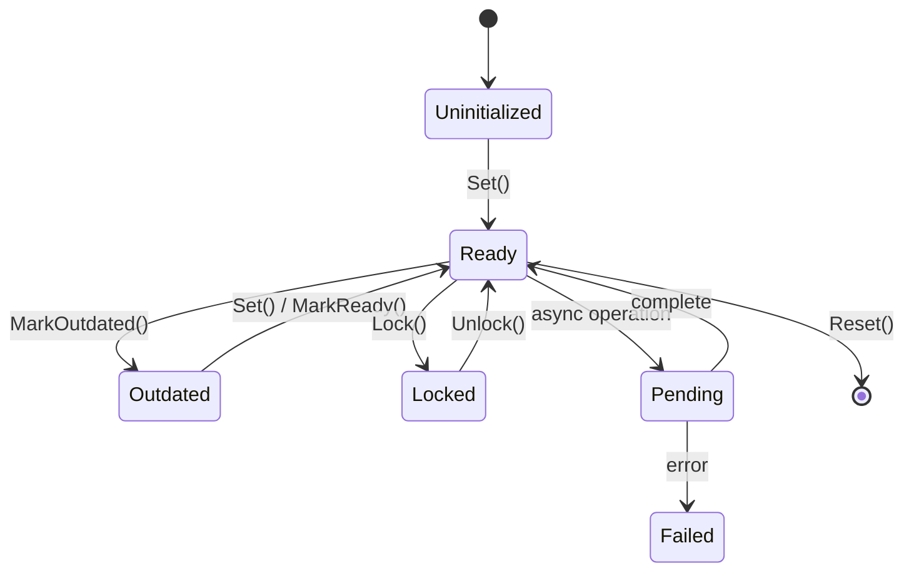

# ResourceManagement Library

Resource wrapper `RM<T>` providing std::optional-like interface with state tracking, generation tracking, and metadata storage.

---

## 1. RM< T > Overview

```cpp
#include <ResourceManagement/RM.h>
using namespace ResourceManagement;

RM<VkPipeline> pipeline;

// Optional-like access
if (pipeline.Ready()) {
    vkCmdBindPipeline(cmd, VK_PIPELINE_BIND_POINT_GRAPHICS, pipeline.Value());
}

// State-based cleanup
if (pipeline.Has(ResourceState::Outdated)) {
    vkDestroyPipeline(device, pipeline.Value(), nullptr);
    pipeline.Reset();
}
```

---

## 2. Resource States



### 2.1 State Flags

| State | Value | Description |
|-------|-------|-------------|
| `Uninitialized` | 0 | No value set |
| `Ready` | 1 | Ready for use |
| `Outdated` | 2 | Needs update |
| `Locked` | 4 | Modification blocked |
| `Stale` | 8 | Cache invalidated |
| `Pending` | 16 | Async operation in progress |
| `Failed` | 32 | Operation failed |

---

## 3. Usage Patterns

### 3.1 Optional-Like Access

```cpp
RM<VkPipeline> pipeline;

// Check before access
if (pipeline.Ready()) {
    VkPipeline p = pipeline.Value();
}

// Value or default
VkPipeline p = pipeline.ValueOr(VK_NULL_HANDLE);

// Operator bool
if (pipeline) {
    // Safe to use
}
```

### 3.2 State-Based Cleanup

```cpp
void SwapChainNode::OnWindowResize() {
    swapchainResource.MarkOutdated();
}

void SwapChainNode::Compile() {
    if (swapchainResource.Has(ResourceState::Outdated)) {
        vkDestroySwapchainKHR(device, swapchainResource.Value(), nullptr);
        swapchainResource.Set(createNewSwapchain());
    }
}
```

### 3.3 Generation Tracking

```cpp
// Track when dependencies change
uint64_t cachedGeneration = 0;

void PipelineNode::Compile() {
    if (shaderResource.GetGeneration() != cachedGeneration) {
        RebuildPipeline();
        cachedGeneration = shaderResource.GetGeneration();
    }
}
```

### 3.4 Metadata Storage

```cpp
RM<VkImage> textureResource;
textureResource.SetMetadata("file_path", std::string("/textures/diffuse.png"));
textureResource.SetMetadata("mip_levels", uint32_t(8));

// Retrieve
std::string path = textureResource.GetMetadata<std::string>("file_path");
uint32_t mips = textureResource.GetMetadataOr<uint32_t>("mip_levels", 1);
```

---

## 4. API Reference

### 4.1 Value Access

| Method | Description |
|--------|-------------|
| `Ready()` | Check if ready for use |
| `Value()` | Get value (throws if not ready) |
| `ValueOr(default)` | Get value or default |
| `operator*()` | Unsafe value access |
| `operator->()` | Pointer access |
| `operator bool()` | Ready check |

### 4.2 Mutation

| Method | Description |
|--------|-------------|
| `Set(value)` | Set value, mark ready |
| `Reset()` | Clear value and state |

### 4.3 State Management

| Method | Description |
|--------|-------------|
| `Has(state)` | Check for state flag |
| `GetState()` | Get current state |
| `SetState(state)` | Replace state |
| `AddState(flags)` | Add state flags |
| `RemoveState(flags)` | Remove state flags |
| `MarkOutdated()` | Mark needs update |
| `MarkReady()` | Mark ready for use |
| `Lock()` / `Unlock()` | Modification control |

### 4.4 Generation

| Method | Description |
|--------|-------------|
| `GetGeneration()` | Get change counter |
| `IncrementGeneration()` | Manual increment |

### 4.5 Metadata

| Method | Description |
|--------|-------------|
| `SetMetadata<T>(key, value)` | Store metadata |
| `GetMetadata<T>(key)` | Get metadata (throws) |
| `GetMetadataOr<T>(key, default)` | Get or default |
| `HasMetadata(key)` | Check existence |
| `RemoveMetadata(key)` | Remove key |
| `ClearMetadata()` | Clear all metadata |

---

## 5. Code References

| File | Purpose |
|------|---------|
| `libraries/ResourceManagement/include/RM.h` | RM<T> template |
| `libraries/ResourceManagement/include/ResourceState.h` | State enum |

---

## 6. Related Pages

- [[Overview]] - Library index
- [[RenderGraph]] - Resource management in nodes
