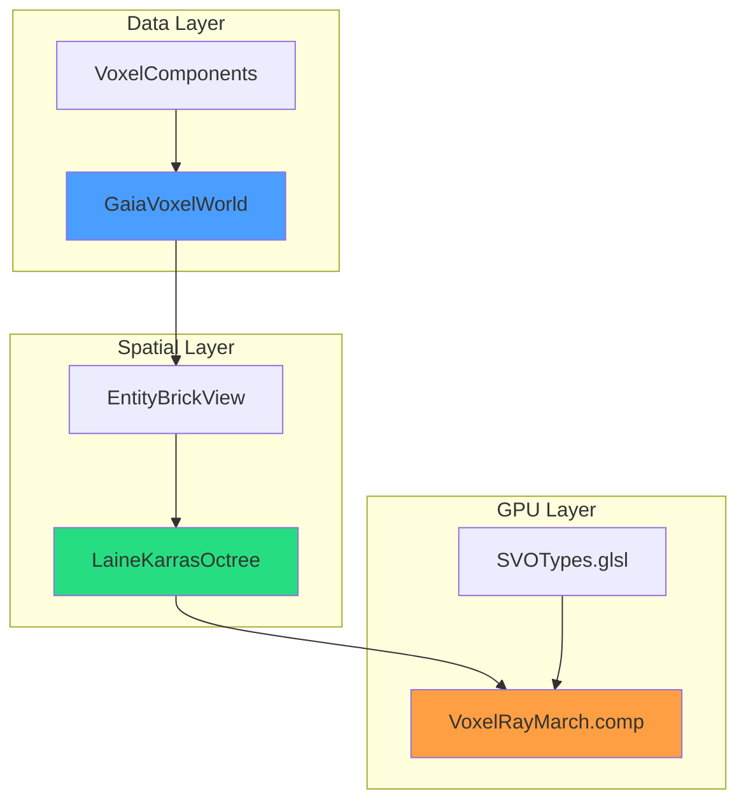
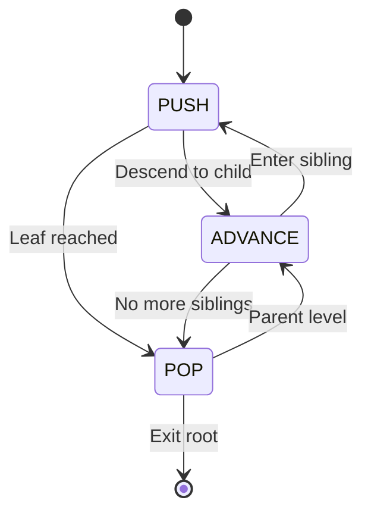
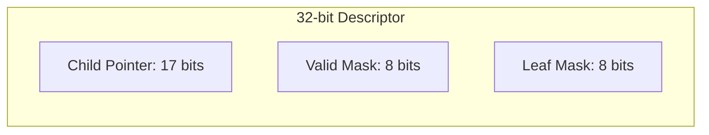

# SVO Library

Sparse Voxel Octree implementing the ESVO algorithm (Laine & Karras 2010) with entity-backed storage via Gaia ECS.

> **Note:** For detailed implementation, see [[../02-Implementation/SVO-System|SVO System Implementation]].

---

## 1. Architecture



---

## 2. Core Components

### 2.1 LaineKarrasOctree

ESVO-based octree with brick DDA traversal.

```cpp
LaineKarrasOctree octree(world, maxLevels, brickDepth);
octree.rebuild(world, worldMin, worldMax);

auto hit = octree.castRay(origin, direction, tMin, tMax);
if (hit.hit) {
    glm::vec3 point = hit.hitPoint;
    auto color = world.getComponentValue<Color>(hit.entity);
}
```

### 2.2 EntityBrickView

Zero-storage brick views (16 bytes vs 70 KB per brick).

```cpp
class EntityBrickView {
    GaiaVoxelWorld* world;      // 8 bytes
    uint64_t baseMortonKey;     // 8 bytes

public:
    bool hasVoxel(int x, int y, int z) const;
    
    template<typename T>
    std::optional<T> getComponent(int x, int y, int z) const;
};
```

---

## 3. ESVO Traversal

### 3.1 State Machine



### 3.2 Algorithm Phases

| Phase | Description |
|-------|-------------|
| **PUSH** | Descend into child octant, refine voxel bounds |
| **ADVANCE** | Move to next sibling (increment octant index) |
| **POP** | Return to parent level when no more siblings |

---

## 4. Child Descriptor Format



| Field | Bits | Description |
|-------|------|-------------|
| Child Pointer | 0-16 | Relative offset to first child |
| Valid Mask | 17-24 | 8 bits, one per octant |
| Leaf Mask | 25-31 | 8 bits, leaf status per octant |

---

## 5. GPU Integration

### 5.1 Buffer Layout

| Binding | Type | Content |
|---------|------|---------|
| 0 | Storage Image | Output image (RGBA8) |
| 1 | SSBO | esvoNodes (ChildDescriptors) |
| 2 | SSBO | brickData (colors/normals) |
| 3 | SSBO | materials |
| 5 | UBO | octreeConfig |

### 5.2 OctreeConfig UBO

```glsl
layout(binding = 5) uniform OctreeConfig {
    mat4 invViewMatrix;
    vec3 worldMin;
    float worldSize;
    ivec3 bricksPerAxis;
    int maxDepth;
    uint nodeCount;
    uint brickCount;
    float brickSize;
    int totalVoxels;
};
```

---

## 6. Test Coverage

| Test Suite | Tests | Status |
|------------|-------|--------|
| test_octree_queries | 98 | Pass |
| test_entity_brick_view | 36 | Pass |
| test_ray_casting | 11 | Pass |
| test_rebuild_hierarchy | 4 | Pass |
| test_cornell_box | 7/9 | 2 precision issues |
| test_lod | 16 | Pass |
| **Total** | **217** | **98%** |

---

## 7. Code References

| Component | Location |
|-----------|----------|
| LaineKarrasOctree | `libraries/SVO/src/LaineKarrasOctree.cpp` |
| EntityBrickView | `libraries/SVO/include/EntityBrickView.h` |
| SVOTypes.glsl | `shaders/SVOTypes.glsl` |
| VoxelRayMarch.comp | `shaders/VoxelRayMarch.comp` |

---

## 8. Related Pages

- [[Overview]] - Library index
- [[../02-Implementation/SVO-System|SVO System]] - Detailed implementation
- [[../02-Implementation/Ray-Marching|Ray Marching]] - GPU ray traversal
- [[../03-Research/ESVO-Algorithm|ESVO Algorithm]] - Algorithm details
- [[GaiaVoxelWorld]] - Entity storage backend
- [[VoxelData]] - DXT brick compression
