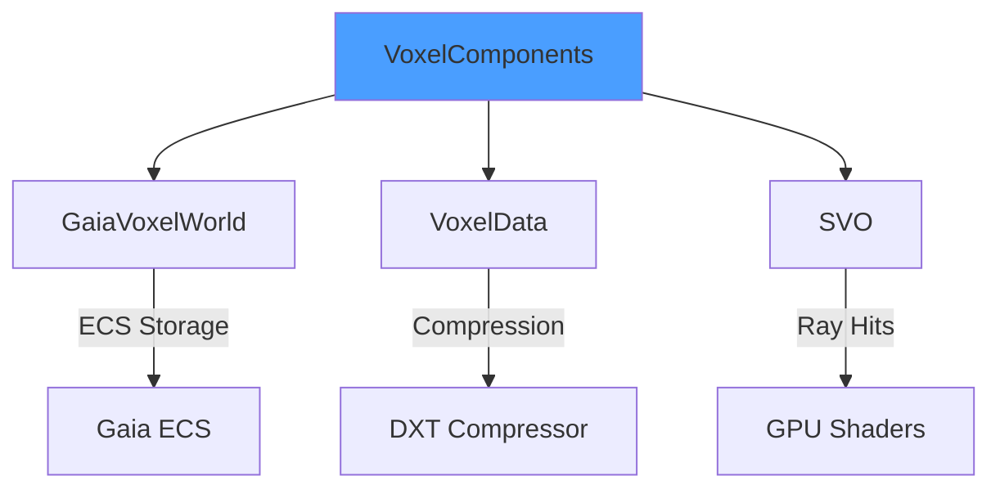

# VoxelComponents Library

Single source of truth for voxel attribute definitions. Uses macro-based generation for consistent component handling across the codebase.

---

## 1. Component Macro System

```cpp
// VoxelComponents.h
#define FOR_EACH_COMPONENT(MACRO) \
    MACRO(Density)                \
    MACRO(Color)                  \
    MACRO(Normal)                 \
    MACRO(Roughness)              \
    MACRO(Metallic)               \
    MACRO(Emissive)

// Auto-generates:
// - ComponentVariant (std::variant of all components)
// - AllComponents (tuple of all component types)
// - ComponentTraits<T> (type traits for each component)
```

---

## 2. Core Components

### 2.1 Geometry Components

| Component | Type | Description |
|-----------|------|-------------|
| `Density` | `float` | Voxel density [0,1], 0 = empty |
| `Normal` | `glm::vec3` | Surface normal |

### 2.2 Material Components

| Component | Type | Description |
|-----------|------|-------------|
| `Color` | `glm::vec3` | RGB color [0,1] |
| `Roughness` | `float` | Surface roughness [0,1] |
| `Metallic` | `float` | Metallic factor [0,1] |
| `Emissive` | `glm::vec3` | Emission color |

---

## 3. Component Definitions

```cpp
struct Density {
    float value = 1.0f;

    bool isEmpty() const { return value <= 0.0f; }
    static constexpr const char* name = "Density";
};

struct Color {
    glm::vec3 rgb{1.0f, 1.0f, 1.0f};

    static Color fromRGB(uint8_t r, uint8_t g, uint8_t b) {
        return Color{glm::vec3(r, g, b) / 255.0f};
    }

    static constexpr const char* name = "Color";
};

struct Normal {
    glm::vec3 direction{0.0f, 1.0f, 0.0f};

    void normalize() { direction = glm::normalize(direction); }
    static constexpr const char* name = "Normal";
};
```

---

## 4. ComponentVariant

Type-safe variant holding any component type.

```cpp
using ComponentVariant = std::variant<
    Density,
    Color,
    Normal,
    Roughness,
    Metallic,
    Emissive
>;

// Usage
ComponentVariant component = Color{glm::vec3(1, 0, 0)};

// Visit pattern
std::visit([](auto&& comp) {
    using T = std::decay_t<decltype(comp)>;
    std::cout << T::name << std::endl;
}, component);
```

---

## 5. VoxelCreationRequest

Batch create voxels with multiple components.

```cpp
struct VoxelCreationRequest {
    glm::vec3 position;
    std::vector<ComponentVariant> components;
};

// Usage
world.createVoxel(VoxelCreationRequest{
    glm::vec3(2, 2, 2),
    {
        Density{1.0f},
        Color{glm::vec3(1, 0, 0)},
        Normal{glm::vec3(0, 1, 0)}
    }
});
```

---

## 6. Integration Points



| Consumer | Usage |
|----------|-------|
| GaiaVoxelWorld | Component storage via ECS |
| VoxelData | DXT compression of Color/Normal |
| SVO | Ray hit attribute retrieval |
| Shaders | GPU material evaluation |

---

## 7. Code References

| File | Purpose |
|------|---------|
| `libraries/VoxelComponents/include/VoxelComponents.h` | Component definitions |
| `libraries/VoxelComponents/include/ComponentVariant.h` | Variant type |
| `libraries/VoxelComponents/src/VoxelComponents.cpp` | Implementation |

---

## 8. Related Pages

- [[Overview]] - Library index
- [[SVO]] - Octree using components
- [[GaiaVoxelWorld]] - ECS storage
- [[VoxelData]] - DXT compression of components
