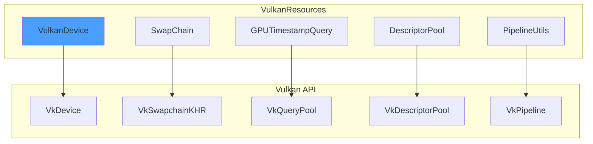
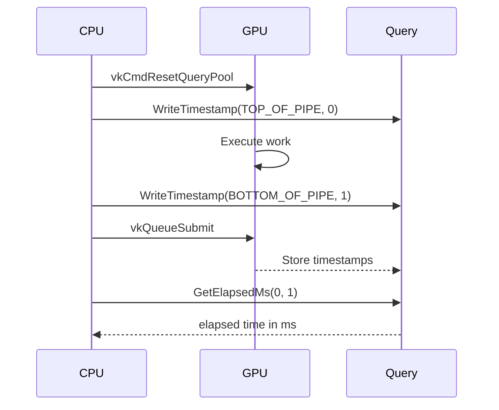

# VulkanResources Library

Vulkan resource management including device wrappers, swapchain handling, GPU timing queries, and pipeline utilities.

---

## 1. Core Components



---

## 2. VulkanDevice

Manages VkInstance, VkPhysicalDevice, and VkDevice creation.

```cpp
VulkanDevice device;
device.Initialize(windowHandle);

VkDevice vkDevice = device.GetDevice();
VkPhysicalDevice physicalDevice = device.GetPhysicalDevice();
VkQueue graphicsQueue = device.GetGraphicsQueue();
```

### 2.1 Queue Families

| Queue | Purpose |
|-------|---------|
| Graphics | Rendering, compute, transfer |
| Present | Swapchain presentation |
| Compute | Async compute (if separate) |
| Transfer | Async transfer (if separate) |

---

## 3. GPUTimestampQuery

GPU timing measurement for performance profiling.

```cpp
GPUTimestampQuery gpuQuery;
gpuQuery.Create(device, physicalDevice);

// In command buffer
gpuQuery.ResetQueries(cmd);
gpuQuery.WriteTimestamp(cmd, VK_PIPELINE_STAGE_TOP_OF_PIPE_BIT, 0);
// ... rendering work ...
gpuQuery.WriteTimestamp(cmd, VK_PIPELINE_STAGE_BOTTOM_OF_PIPE_BIT, 1);

// After frame
auto elapsedMs = gpuQuery.GetElapsedMs(device, 0, 1);
if (elapsedMs) {
    double mrays = gpuQuery.CalculateMraysPerSec(*elapsedMs, width, height);
}
```

### 3.1 Timing Points



---

## 4. SwapChain Management

```cpp
SwapChain swapchain;
swapchain.Create(device, surface, width, height);

uint32_t imageIndex;
swapchain.AcquireNextImage(device, semaphore, &imageIndex);

// ... render to swapchain image ...

swapchain.Present(presentQueue, semaphore, imageIndex);
```

### 4.1 Image Views

```cpp
std::vector<VkImageView> imageViews = swapchain.GetImageViews();
VkFormat format = swapchain.GetFormat();
VkExtent2D extent = swapchain.GetExtent();
```

---

## 5. Pipeline Utilities

### 5.1 Pipeline Creation Helpers

```cpp
// Graphics pipeline
VkPipeline pipeline = PipelineUtils::CreateGraphicsPipeline(
    device,
    pipelineLayout,
    renderPass,
    vertexInputInfo,
    shaderStages
);

// Compute pipeline
VkPipeline computePipeline = PipelineUtils::CreateComputePipeline(
    device,
    pipelineLayout,
    computeShaderModule
);
```

### 5.2 Descriptor Set Utilities

```cpp
VkDescriptorSetLayout layout = DescriptorUtils::CreateLayout(
    device,
    bindings  // std::vector<VkDescriptorSetLayoutBinding>
);

VkDescriptorSet descriptorSet = DescriptorUtils::Allocate(
    device,
    pool,
    layout
);

DescriptorUtils::WriteImage(device, descriptorSet, binding, imageView, sampler);
DescriptorUtils::WriteBuffer(device, descriptorSet, binding, buffer, size);
```

---

## 6. Memory Management

### 6.1 Buffer Creation

```cpp
BufferCreateInfo bufferInfo{
    .size = dataSize,
    .usage = VK_BUFFER_USAGE_STORAGE_BUFFER_BIT,
    .memoryProperties = VK_MEMORY_PROPERTY_DEVICE_LOCAL_BIT
};

VkBuffer buffer = BufferUtils::Create(device, physicalDevice, bufferInfo);
```

### 6.2 Image Creation

```cpp
ImageCreateInfo imageInfo{
    .width = 1024,
    .height = 1024,
    .format = VK_FORMAT_R8G8B8A8_UNORM,
    .usage = VK_IMAGE_USAGE_STORAGE_BIT | VK_IMAGE_USAGE_SAMPLED_BIT
};

VkImage image = ImageUtils::Create(device, physicalDevice, imageInfo);
```

---

## 7. Code References

| File | Purpose |
|------|---------|
| `libraries/VulkanResources/include/VulkanDevice.h` | Device management |
| `libraries/VulkanResources/include/GPUTimestampQuery.h` | GPU timing |
| `libraries/VulkanResources/include/SwapChain.h` | Swapchain handling |
| `libraries/VulkanResources/include/PipelineUtils.h` | Pipeline creation |
| `libraries/VulkanResources/include/DescriptorUtils.h` | Descriptor utilities |

---

## 8. Related Pages

- [[Overview]] - Library index
- [[../01-Architecture/Vulkan-Pipeline|Vulkan Pipeline]] - Vulkan architecture
- [[CashSystem]] - Resource caching
- [[Profiler]] - Performance measurement
